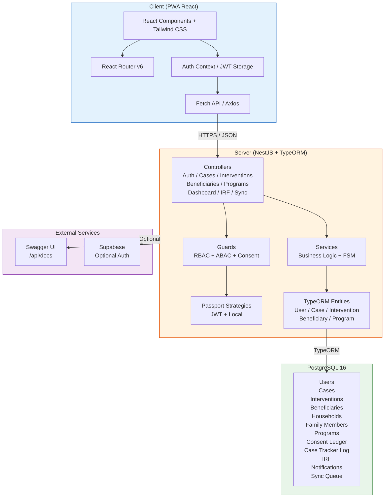
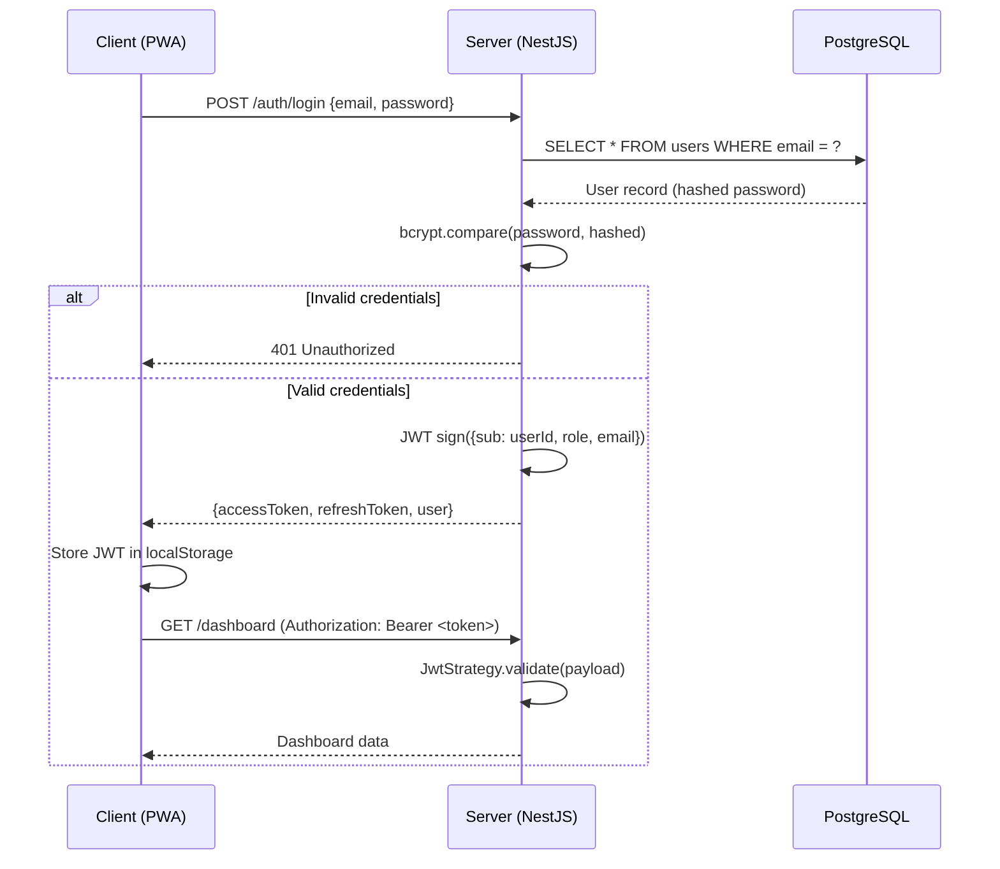
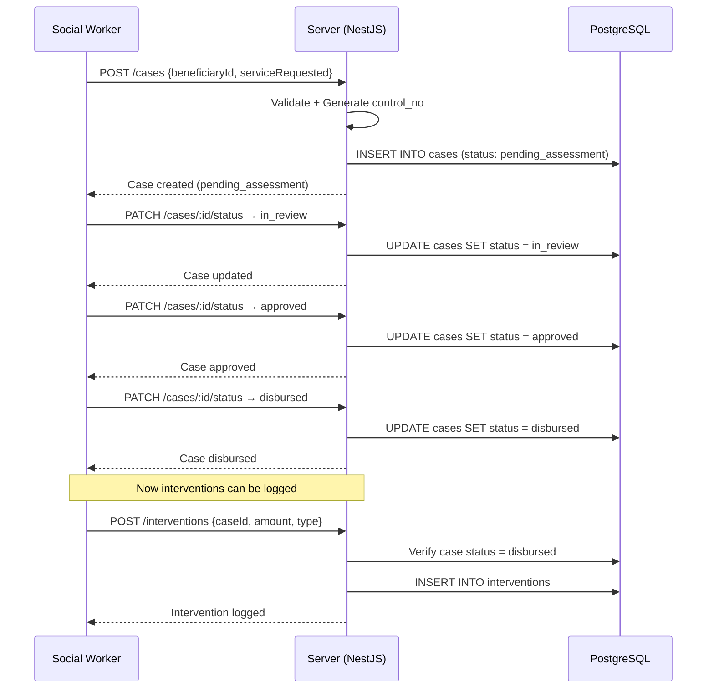

# KAPWA System Architecture Diagram



## Component Details

### Client Layer
- **React 18** with Vite bundler
- **Tailwind CSS** with Figma-matched design tokens
- **lucide-react** icons
- **React Router v6** for SPA routing
- **localStorage** for offline token storage (replaces SQLCipher)

### Server Layer
- **NestJS 10** with modular architecture
- **Passport** JWT + Local strategies for auth
- **Guards**: RBAC (role-based), ABAC (barangay scoping), Consent-gated access
- **Case FSM**: `pending_assessment → in_review → approved → disbursed → closed`
- **Interventions** only allowed after `disbursed` status
- **Swagger** OpenAPI at `/api/docs`

### Data Layer
- **PostgreSQL 16** with extensions: `pgcrypto`, `pg_trgm`, `pgaudit`
- **TypeORM** with entities matching KAPWA-PROJECT.md spec
- **Row-Level Security** (RLS) enabled on sensitive tables
- **Consent Ledger** for RA 10173 compliance

### Compliance & Security
- **RA 10173** (Data Privacy Act) compliance via consent_ledger
- **Hash-chain** integrity for audit trail
- **Audit logging** via pgAudit extension
- **Input validation** with class-validator DTOs
- **Helmet** security headers

### Sprint 1 Modules
| Module | Endpoint Prefix | Status |
|--------|-----------------|--------|
| Auth | `/auth` | ✅ JWT + bcrypt |
| Cases | `/cases` | ✅ FSM implemented |
| Interventions | `/interventions` | ✅ Gated by case status |
| Beneficiaries | `/beneficiaries` | ✅ With consent ledger |
| Programs | `/programs` | ✅ Dynamic JSON Schema |
| Dashboard | `/dashboard` | ✅ Metrics + SLA |
| IRF | `/irf` | ✅ Encryption stubs |
| Sync | `/sync` | ✅ Delta sync stubs |
| Notifications | `/notifications` | ✅ Real-time ready |

## Deployment Architecture

```
┌─────────────────┐      ┌──────────────────┐      ┌─────────────────┐
│   MSWDO Staff   │      │   Field Worker  │      │   Barangay      │
│   (Browser)     │      │   (Mobile PWA)  │      │   Coordinators  │
└────────┬────────┘      └────────┬─────────┘      └────────┬────────┘
         │ HTTPS                  │ HTTPS                  │ HTTPS
         └────────────────────────┼────────────────────────┘
                              │
                    ┌─────────▼─────────┐
                    │  Nginx / Reverse  │
                    │  Proxy (optional)  │
                    └─────────┬─────────┘
                              │
         ┌────────────────────▼────────────────────┐
          │     KAPWA Server (NestJS + Podman)      │
         │  - Auth Module (JWT)                    │
         │  - Case FSM Engine                      │
         │  - Consent & RBAC Guards                │
         │  - Swagger at /api/docs                 │
         └────────────────────┬────────────────────┘
                              │
         ┌────────────────────▼────────────────────┐
          │  PostgreSQL 16 + pgAudit (Podman)       │
         │  - RLS enabled                         │
         │  - Consent ledger                      │
         │  - Hash-chain audit                    │
         └─────────────────────────────────────────┘
```

## Sequence Diagram: Login Flow



## Sequence Diagram: Case FSM Flow


