# Operational Feasibility (Ishikawa Analysis)

This document captures the operational feasibility of running the KAPWA social welfare information system at the MSWDO Norzagaray office — the people, process, hardware, data, support, and security conditions that must hold for day-to-day operations.

## 1. Purpose

Documents the operational feasibility factors for running KAPWA at the MSWDO Norzagaray office, expressed as a functional specification (FR-01..FR-12) and a proper Ishikawa (fishbone) diagram — effect (head) at the right, spine, six major category bones, and minor bones listing the concrete causal factors, each mapped to the functional requirement that mitigates it and to its implementation location in the repository.

## 2. Functional Specification

| ID | Requirement |
|----|-------------|
| FR-01 | Offline-first intake and case updates are queued in `sync_queue` when connectivity is lost and flushed to the server once the device reconnects. |
| FR-02 | Role-based access control covers all seven MSWDO roles: `admin`, `social_worker`, `coordinator`, `claimant`, `mayor`, `auditor`, `agency_staff`. |
| FR-03 | Automated database backups via `infra/backup/backup.sh` (pg_dump → MinIO with rotation) so a day's intake work can be restored after failure. |
| FR-04 | Seeded reference data on first boot: `seed-accounts.ts` (per-role staff/claimant accounts) and `seed-programs.ts` (programs with categories and fund sources) so the office is usable without manual data entry. |
| FR-05 | Reproducible deployment through `deploy.sh` + `docker-compose.yml` (Postgres, MinIO, API, client) with env validation and a post-start health wait. |
| FR-06 | Connectivity resilience: the system degrades gracefully and keeps accepting data offline instead of failing on network loss. |
| FR-07 | Liveness/readiness health endpoints (`/health`, `/health/live`, `/health/ready`) used by the deployment script and reverse proxy. |
| FR-08 | Client typecheck gate (`tsc --noEmit`) in the client build so type errors cannot ship to production. |
| FR-09 | Graceful shutdown hooks (NestJS `enableShutdownHooks`) so `SIGTERM` drains in-flight sync and backup work on restarts. |
| FR-10 | Sync hardening: reject unknown underscore-prefixed meta fields in delta payloads (SYSTEMS_EVAL.MD finding S-06) instead of silently stripping them. |
| FR-11 | Financial-table conflict resolution follows a server-wins policy in `kapwa-server/src/sync/conflict-resolver.ts` so voucher/financial rows stay authoritative. |
| FR-12 | Shared case FSM (`case-fsm.ts`) defines valid status transitions and per-role transition permissions for the entire case lifecycle. |

## 3. Ishikawa Diagram (Mermaid)

The fishbone is drawn top-down: the **effect (head)** sits at the top; the **spine** is the main axis; the six **major bones** (categories) align on one row beneath it; each category carries **minor bones** (causal factors) written as concrete cause statements. The FR mapping for every cause is given in Section 4.

```mermaid
flowchart TD
    %% ===== HEAD (effect) at the top; bones and causes branch downward =====
    HEAD["Operational Feasibility<br/>of KAPWA at MSWDO Norzagaray"]

    %% ===== MAJOR BONES =====
    HEAD --- SE["Security"]
    HEAD --- SU["Support &<br/>Maintenance"]
    HEAD --- DT["Data"]
    HEAD --- HW["Hardware &<br/>Connectivity"]
    HEAD --- PR["Process"]
    HEAD --- PP["People"]

    %% ===== MINOR BONES (causes) =====
    SE --- SE1["Role boundaries not enforced exposes sensitive data"]
    SE --- SE2["Unauthenticated or forged sync deltas accepted"]
    SE --- SE3["Client-side tampering of financial records wins"]

    SU --- SU1["Type errors ship to production without a typecheck gate"]
    SU --- SU2["No health/readiness probes to detect outages"]
    SU --- SU3["Environment drift between dev and production stacks"]

    DT --- DT1["Empty database on first boot blocks day-one operation"]
    DT --- DT2["No backup and restore path for a day's intake work"]
    DT --- DT3["Conflicting offline updates corrupt financial records"]
    DT --- DT4["Malformed sync payloads poison the data store"]

    HW --- HW1["Unstable connectivity at field sites"]
    HW --- HW2["No offline capture queue for intake and case updates"]
    HW --- HW3["No observability to detect wedged instances"]

    PR --- PR1["Case lifecycle not standardized across statuses"]
    PR --- PR2["Manual redeploy steps cause long downtime for fixes"]
    PR --- PR3["No controlled shutdown procedure for updates"]

    PP --- PP1["Staff not trained on role-scoped screens and workflows"]
    PP --- PP2["No onboarding for coordinators, agency staff, and claimants"]
    PP --- PP3["Staff unfamiliar with offline-first field intake"]
```

## 4. Diagram Narrative

**Fishbone anatomy.** Following the Ishikawa (fishbone) definition, the diagram analyzes the **effect** — operational feasibility of running KAPWA at MSWDO Norzagaray — by tracing it back to its **causes**, grouped under six **major categories** (bones): People, Process, Hardware & Connectivity, Data, Support & Maintenance, and Security. The head sits at the top of the spine and every major bone aligns beneath it on the same axis, with the minor bones (causes) fanning out from each bone. Each cause is a concrete operational factor; the functional requirements (FR-01..FR-12) are the mitigations the system implements for those causes. The cause-to-FR mapping follows.

| Category (bone) | Cause (minor bone) | Mitigation (FR) | Implementation |
|---|---|---|---|
| People | Staff not trained on role-scoped screens and workflows | FR-02 (role-based access) | `@Roles` guards + `role-access.ts` |
| People | No onboarding for coordinators, agency staff, claimants | FR-04 (seeded accounts) | `seed-accounts.ts` |
| People | Staff unfamiliar with offline-first field intake | FR-12 (FSM role gates) | `case-fsm.ts` |
| Process | Case lifecycle not standardized | FR-12 (shared case FSM) | `case-fsm.ts` |
| Process | Manual redeploy steps cause long downtime | FR-05 (reproducible deploy) | `deploy.sh` + `docker-compose.yml` |
| Process | No controlled shutdown procedure for updates | FR-09 (graceful shutdown) | `enableShutdownHooks` in `main.ts` |
| Hardware & Connectivity | Unstable connectivity at field sites | FR-06 (connectivity resilience) | `useConnectivity.ts`, offline queue |
| Hardware & Connectivity | No offline capture queue for intake/case updates | FR-01 (offline sync queue) | `sync_queue` + `sync.service.ts` |
| Hardware & Connectivity | No observability to detect wedged instances | FR-07 (health endpoints) | `/health`, `/health/live`, `/health/ready` |
| Data | Empty database on first boot | FR-04 (seeded reference data) | `seed-accounts.ts`, `seed-programs.ts` |
| Data | No backup and restore path | FR-03 (automated backups) | `infra/backup/backup.sh` |
| Data | Conflicting offline updates corrupt financial records | FR-11 (financial server-wins) | `conflict-resolver.ts` |
| Data | Malformed sync payloads poison the store | FR-10 (meta-field rejection) | `sync.service.ts` (S-06) |
| Support & Maintenance | Type errors ship without a typecheck gate | FR-08 (client tsc gate) | `tsc --noEmit` in client build |
| Support & Maintenance | No health/readiness probes to detect outages | FR-07 (health endpoints) | `/health/live`, `/health/ready` |
| Support & Maintenance | Environment drift between dev and production | FR-05 (reproducible deploy) | `deploy.sh` env validation |
| Security | Role boundaries not enforced exposes data | FR-02 (role-based access) | `@Roles`, `AbacGuard` |
| Security | Unauthenticated or forged sync deltas accepted | FR-10 (meta-field rejection) | Ed25519 signature + `assertNoUnknownMetaFields` |
| Security | Client-side tampering of financial records wins | FR-11 (financial server-wins) | `conflict-resolver.ts` |

**Reading the fishbone.** The effect is operationally feasible when each cause is neutralized by its mitigation: staff see only their role's screens (FR-02, FR-04) and follow a standardized case workflow (FR-12); deployments are reproducible and controlled (FR-05, FR-09); field connectivity loss degrades to offline capture rather than failure (FR-01, FR-06), with health probes making state observable (FR-07); data survives via backups and seeds (FR-03, FR-04) and stays consistent under conflict (FR-11) and malformed input (FR-10); quality gates and probes sustain the running system (FR-08, FR-07); and security controls keep access, sync, and financial records trustworthy (FR-02, FR-10, FR-11).

## 5. Cross-References

| Item | Location |
|------|----------|
| Deploy script | `deploy.sh` |
| Backup scripts | `infra/backup/` (`backup.sh`, `cron`) |
| Sync service (signature, idempotency, meta-field rejection) | `kapwa-server/src/sync/sync.service.ts` |
| Seed accounts | `kapwa-server/src/database/seed-accounts.ts` |
| Seed programs (categories, fund sources) | `kapwa-server/src/database/seed-programs.ts` |
| Shared case FSM | `kapwa-server/src/cases/case-fsm.ts` |
| Conflict resolution (server-wins) | `kapwa-server/src/sync/conflict-resolver.ts` |
| Health endpoints | `kapwa-server/src/app.controller.ts` |
| Graceful shutdown hooks | `kapwa-server/src/main.ts` |
| Client typecheck gate | `kapwa-client/package.json` (`tsc --noEmit`) |
| Compose services | `kapwa-server/docker-compose.yml` |
| Baseline evaluation | `EVALUATION.MD` |
| 22 findings (S-*, B-*, U-*) | `SYSTEMS_EVAL.MD` |
