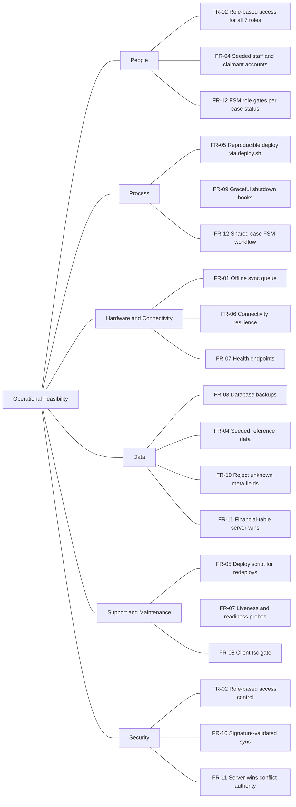

# Operational Feasibility (Ishikawa Analysis)

This document captures the operational feasibility of running the KAPWA social welfare information system at the MSWDO Norzagaray office — the people, process, hardware, data, support, and security conditions that must hold for day-to-day operations.

## 1. Purpose

Documents the operational feasibility factors for running KAPWA at the MSWDO Norzagaray office, expressed as a functional specification (FR-01..FR-12) and an Ishikawa (fishbone) diagram that traces each feasibility factor back to a concrete requirement and its implementation location in the repository.

## 2. Functional Specification

| ID | Requirement |
|----|-------------|
| FR-01 | Offline-first intake and case updates are queued in `sync_queue` when connectivity is lost and flushed to the server once the device reconnects. |
| FR-02 | Role-based access control covers all seven MSWDO roles: `admin`, `social_worker`, `coordinator`, `claimant`, `mayor`, `auditor`, `agency_staff`. |
| FR-03 | Scheduled database backups via `infra/backup` (`backup.sh` + cron) so a day's intake work can be restored after failure. |
| FR-04 | Seeded reference data on first boot: `seed-accounts.ts` (per-role staff/claimant accounts) and `seed-programs.ts` (programs, agencies, intervention types) so the office is usable without manual data entry. |
| FR-05 | Reproducible deployment through `deploy.sh` + `docker-compose.yml` (Postgres, MinIO, API, client) with env validation and a post-start health wait. |
| FR-06 | Connectivity resilience: the system degrades gracefully and keeps accepting data offline instead of failing on network loss. |
| FR-07 | Liveness/readiness health endpoints (`/health`, `/health/live`, `/health/ready`) used by the deployment script and reverse proxy. |
| FR-08 | Client typecheck gate (`tsc --noEmit`) in the client build so type errors cannot ship to production. |
| FR-09 | Graceful shutdown hooks (NestJS `enableShutdownHooks`) so `SIGTERM` drains in-flight sync and backup work on restarts. |
| FR-10 | Sync hardening: reject unknown underscore-prefixed meta fields in delta payloads (SYSTEMS_EVAL.MD finding S-06) instead of silently stripping them. |
| FR-11 | Financial-table conflict resolution follows a server-wins policy in `conflict-resolver.ts` (SYSTEMS_EVAL.MD B-* finding) so voucher/financial rows stay authoritative. |
| FR-12 | Shared case FSM (`case-fsm.ts`) defines valid status transitions and per-role transition permissions for the entire case lifecycle. |

## 3. Ishikawa Diagram (Mermaid)

## 4. Diagram Narrative

**People.** The office runs on staff who must each see only what their job requires. FR-02 delivers role-based access for all seven roles (`admin`, `social_worker`, `coordinator`, `claimant`, `mayor`, `auditor`, `agency_staff`); FR-04 seeds accounts for those roles so logins work on day one; and FR-12 restricts which roles may advance a case through the FSM.

**Process.** Operations depend on repeatable workflow and controlled restarts. FR-05 makes deployment reproducible from `deploy.sh` + `docker-compose.yml`; FR-09 ensures `SIGTERM` drains in-flight work via graceful shutdown hooks; FR-12 defines the canonical case workflow (ENROLLED → ASSESSED → IN_REVIEW → ACTIVE → TRANSITIONING → CLOSED) in the shared FSM.

**Hardware and Connectivity.** Field use at MSWDO Norzagaray means phones and laptops lose signal. FR-01 queues offline changes in `sync_queue` and flushes them on reconnect; FR-06 requires the system to degrade gracefully rather than fail on network loss; FR-07 exposes `/health`, `/health/live`, and `/health/ready` so connectivity and process state are observable.

**Data.** The office's intake records must survive and stay consistent. FR-03 backs up the database via `infra/backup` (`backup.sh` + cron); FR-04 seeds reference data (programs, agencies, intervention types) so forms and lookups work without manual entry; FR-10 rejects unknown meta fields in sync payloads so bad client data cannot poison the store; FR-11 applies server-wins resolution to financial tables so voucher and financial rows keep a single authoritative version.

**Support and Maintenance.** Sustained operation needs redeploys, monitoring, and quality gates. FR-05's deploy script makes redeploys a single reproducible command; FR-07's liveness/readiness probes let the proxy and ops staff detect a wedged instance; FR-08's client `tsc --noEmit` gate keeps type errors out of shipped builds.

**Security.** Operational trust rests on authentication and data-integrity controls. FR-02 enforces role boundaries at every endpoint; FR-10's rejection of unknown meta fields complements the Ed25519 signature check in `sync.service.ts` so only authenticated, well-formed deltas are applied; FR-11's server-wins policy prevents client-side tampering of financial records from winning over the server copy.

## 5. Cross-References

| Item | Location |
|------|----------|
| Deploy script | `deploy.sh` |
| Backup scripts | `infra/backup/` (`backup.sh`, `cron/`) |
| Sync service (signature, idempotency, meta-field rejection) | `kapwa-server/src/sync/sync.service.ts` |
| Seed accounts | `kapwa-server/src/database/seed-accounts.ts` |
| Seed programs / agencies / intervention types | `kapwa-server/src/database/seed-programs.ts` |
| Shared case FSM | `kapwa-server/src/cases/case-fsm.ts` |
| Conflict resolution (server-wins) | `kapwa-server/src/sync/conflict-resolver.ts` |
| Health endpoints | `kapwa-server/src/app.controller.ts` |
| Graceful shutdown hooks | `kapwa-server/src/main.ts` |
| Client typecheck gate | `kapwa-client/package.json` (`tsc --noEmit`) |
| Compose services | `kapwa-server/docker-compose.yml` |
| Baseline evaluation | `EVALUATION.MD` |
| 22 findings (S-*, B-*, U-*) | `SYSTEMS_EVAL.MD` |