# Use Case Diagram

This document maps every actor of the KAPWA social welfare information system (MSWDO Norzagaray) to the use cases they can perform, expressed as a functional specification (FR-01..FR-20), a Mermaid use case diagram, a per-actor narrative, and cross-references to the implementation.

## 1. Purpose

Maps every actor — guest, claimant, social_worker, coordinator, admin, mayor, auditor, agency_staff — to the use cases they can perform across all modules (auth, intake, cases, beneficiaries, referrals, inter-agency, programs, access cards, reports & audit, admin, messaging & notifications, sync), and ties each use case to its enforcing `@Roles` decorator and client route.

## 2. Functional Specification

| ID | Requirement |
|----|-------------|
| FR-01 | Guest/public user views the landing page and public announcements (routes `about`, `contact`, `announcements/:slug`). |
| FR-02 | Guest registers, verifies email (`POST /auth/verify-email`), logs in, and completes MFA challenge when MFA is enabled on the account. |
| FR-03 | Claimant views their own access card and service history via `GET /beneficiaries/me/access-card`, `GET /beneficiaries/me/services`, `GET /beneficiaries/me/consent` (all `@Roles('claimant')`). |
| FR-04 | Social worker creates intakes, assesses cases, logs interventions, manages beneficiary records, generates certificates/CSR/IRF, chats, and views notifications. |
| FR-05 | Coordinator files referrals (`POST /referrals`, `@Roles('coordinator')`), reviews intake requests (`GET /intake` list includes coordinator), and manages access cards for their barangay (`POST /access-cards/assign/:beneficiaryId` includes coordinator). |
| FR-06 | Admin manages users (`users.controller`), programs (`/programs` routes admin-only), agencies (`agencies.controller`), announcements (`announcements.controller`), and wipe/reset (`admin/wipe` controller). |
| FR-07 | Mayor views reports/dashboard (`/reports`, dashboard `@Roles('mayor')` endpoint) and exports fund utilization (`GET /export/monthly-funds`, `@Roles('admin','mayor','auditor')`). |
| FR-08 | Auditor views audit logs (`audit.controller` `@Roles('admin','auditor')`) and exports data (`GET /export/audit-logs`, `@Roles('admin','auditor')`). |
| FR-09 | Agency staff views the agency dashboard, agency referrals, and access-card activities (all `@Roles('agency_staff')` routes under `/agency/*`). |
| FR-10 | Role-appropriate notifications for admin, social_worker, coordinator, claimant, auditor, agency_staff (`NOTIFICATION_ROLES`); chat restricted to admin, social_worker, coordinator, claimant (`CHAT_ROLES`). |
| FR-11 | Offline sync for field workers: `sync.controller` `@Roles('admin','coordinator','social_worker')` endpoints queue and flush deltas when connectivity is lost. |
| FR-12 | Claimant dashboard (`/my-dashboard`, `@Roles('claimant')`) shows the claimant's card, service history, and notifications. |
| FR-13 | Announcements management for admin, social_worker, and coordinator (`announcements.controller` + `/announcements/manage` routes). |
| FR-14 | Referral review and approval: MSWDO staff accept/decline referrals (`PATCH /referrals/:id/accept|decline`, `@Roles('admin','social_worker')`); coordinators file and track them (`GET /referrals/mine`). |
| FR-15 | Physical files management for admin, social_worker, and coordinator (`physical-files.controller`). |
| FR-16 | Program management for admin only (`/programs/new`, `/programs/:id`, `/programs` routes; `programs` module). |
| FR-17 | IRF/CSR/certificate generation and management (`irf.controller`, `csr.controller`, `POST /export/certificate`; admin + social_worker). |
| FR-18 | Settings and MFA setup/enable/disable/verify (`/settings`, `POST /auth/mfa/*`); available to every authenticated role. |
| FR-19 | Notification preferences: read and update per-role preferences (`GET|PUT /notifications/preferences`, `PUT /notifications/preferences/bulk`). |
| FR-20 | Admin wipe/reset: remote wipe a device or user session and list registered devices (`admin/wipe` controller, `@Roles('admin')`). |

## 3. Use Case Diagram (Mermaid)

```mermaid
flowchart LR
    A1["guest"]
    A2["claimant"]
    A3["social_worker"]
    A4["coordinator"]
    A5["admin"]
    A6["mayor"]
    A7["auditor"]
    A8["agency_staff"]

    subgraph Auth[AUTH]
        direction TB
        UC-A1["View landing page and public announcements"]
        UC-A2["Register and verify email"]
        UC-A3["Login with MFA when enabled"]
        UC-A4["MFA setup and account settings"]
    end

    subgraph Intake[INTAKE]
        direction TB
        UC-I1["Create intake"]
        UC-I2["Review intake requests"]
        UC-I3["File referral from intake"]
    end

    subgraph Cases[CASES]
        direction TB
        UC-C1["Assess cases and log interventions"]
        UC-C2["Track case status"]
        UC-C3["View own service history"]
        UC-C4["Manage physical files"]
    end

    subgraph Beneficiaries[BENEFICIARIES]
        direction TB
        UC-B1["Claimant dashboard and self-service (card, services, consent)"]
        UC-B2["Manage beneficiary records"]
    end

    subgraph Referrals[REFERRALS]
        direction TB
        UC-R1["File referrals (barangay)"]
        UC-R2["Review, accept or decline referrals"]
        UC-R3["Track referral status"]
    end

    subgraph InterAgency[INTER-AGENCY]
        direction TB
        UC-IA1["View agency dashboard and referrals"]
        UC-IA2["View access-card activities"]
    end

    subgraph Programs[PROGRAMS]
        direction TB
        UC-P1["Manage programs"]
    end

    subgraph AccessCards[ACCESS CARDS]
        direction TB
        UC-AC1["Assign and manage access cards"]
        UC-AC2["Log access-card activity"]
        UC-AC3["View own access card"]
    end

    subgraph ReportsAudit[REPORTS AND AUDIT]
        direction TB
        UC-RA1["View reports and dashboard"]
        UC-RA2["Export fund utilization"]
        UC-RA3["View audit logs and export data"]
        UC-RA4["Generate certificates, CSR, IRF"]
    end

    subgraph Admin[ADMIN]
        direction TB
        UC-AD1["Manage users, programs, agencies, announcements"]
        UC-AD2["Wipe or reset device sessions"]
    end

    subgraph Messaging[ MESSAGING AND NOTIFICATIONS]
        direction TB
        UC-M1["Chat"]
        UC-M2["View and manage notifications"]
        UC-M3["Notification preferences"]
    end

    subgraph Sync[SYNC]
        direction TB
        UC-S1["Offline sync for field workers"]
    end

    A1 --> UC-A1
    A1 --> UC-A2
    A1 --> UC-A3
    A2 --> UC-A4
    A3 --> UC-A4
    A4 --> UC-A4
    A5 --> UC-A4
    A8 --> UC-A4

    A3 --> UC-I1
    A5 --> UC-I1
    A3 --> UC-I2
    A4 --> UC-I2
    A5 --> UC-I2
    A4 --> UC-I3

    A3 --> UC-C1
    A5 --> UC-C1
    A3 --> UC-C2
    A4 --> UC-C2
    A5 --> UC-C2
    A6 --> UC-C2
    A7 --> UC-C2
    A2 --> UC-C3
    A3 --> UC-C4
    A4 --> UC-C4
    A5 --> UC-C4

    A2 --> UC-B1
    A3 --> UC-B2
    A5 --> UC-B2

    A4 --> UC-R1
    A3 --> UC-R2
    A5 --> UC-R2
    A4 --> UC-R3

    A8 --> UC-IA1
    A8 --> UC-IA2

    A5 --> UC-P1

    A3 --> UC-AC1
    A4 --> UC-AC1
    A5 --> UC-AC1
    A3 --> UC-AC2
    A4 --> UC-AC2
    A5 --> UC-AC2
    A8 --> UC-AC2
    A2 --> UC-AC3

    A6 --> UC-RA1
    A6 --> UC-RA2
    A5 --> UC-RA3
    A7 --> UC-RA3
    A3 --> UC-RA4
    A5 --> UC-RA4

    A5 --> UC-AD1
    A5 --> UC-AD2

    A2 --> UC-M1
    A3 --> UC-M1
    A4 --> UC-M1
    A5 --> UC-M1
    A2 --> UC-M2
    A3 --> UC-M2
    A4 --> UC-M2
    A5 --> UC-M2
    A7 --> UC-M2
    A8 --> UC-M2
    A2 --> UC-M3
    A3 --> UC-M3
    A4 --> UC-M3
    A5 --> UC-M3
    A7 --> UC-M3
    A8 --> UC-M3

    A3 --> UC-S1
    A4 --> UC-S1
    A5 --> UC-S1
```

## 4. Diagram Narrative

**guest (A1).** Unauthenticated users reach the public shell: landing page, about/contact, and public announcements (FR-01). They register, verify email, log in, and complete an MFA challenge when enabled (FR-02). `auth.controller.ts` exposes `register`, `login`, `verify-email`, and the `mfa/verify` challenge without role restrictions.

**claimant (A2).** Claimants are redirected to `/my-dashboard` (`ROLE_REDIRECT_MAP['claimant']` in `kapwa-client/src/lib/role-access.ts`). They view their own access card, service history, and consent records via the claimant-only self endpoints `GET /beneficiaries/me/access-card`, `/me/services`, `/me/consent` (`@Roles('claimant')`), and their card at `/my-access-card` (FR-03, FR-12). Claimants chat (`CHAT_ROLES` includes claimant), receive notifications, and set notification preferences (FR-10, FR-19).

**social_worker (A3).** The primary caseworker role: creates intakes, reviews intakes, assesses cases, logs interventions, manages beneficiary records and physical files, and generates certificates/CSR/IRF (FR-04, FR-15, FR-17). They review and accept/decline coordinator referrals (FR-14), assign access cards and log card activity (FR-05), use offline sync in the field (FR-11), and participate in chat/notifications (FR-10).

**coordinator (A4).** Barangay coordinators are redirected to `/coordinator/dashboard`. They file referrals (`POST /referrals` is `@Roles('coordinator')` only), track their referral status via `/referrals/mine`, review intake requests (the intake list endpoint includes coordinator), and manage access cards for their barangay (FR-05, FR-14). They manage physical files and sync offline data (FR-11, FR-15). Referral *approval* (accept/decline) is deliberately role-restricted to `admin` and `social_worker` — coordinators see status but cannot approve their own referrals.

**admin (A5).** Redirected to `/admin`. Admin is the only role on the user, agency (write), program, and wipe controllers: manages users, programs, agencies, announcements (FR-06), and remote wipes/resets (FR-20). Admin also has broad read/write access across intake, cases, referrals, access cards, and exports, plus audit-log access (`@Roles('admin','auditor')`), certificates/CSR/IRF, and notifications broadcast (`POST /notifications` is `@Roles('admin','social_worker')`).

**mayor (A6).** Redirected to `/reports`. Mayor-only dashboard/report endpoint (`dashboard.controller` `@Roles('mayor')`) and fund-utilization export (`GET /export/monthly-funds`) (FR-07). Also read-only case tracking (`/tracker` includes mayor).

**auditor (A7).** Redirected to `/audit-logs`. Reads audit logs and exports them as PDF/CSV (`export.controller` `GET /export/audit-logs`) (FR-08); also read-only access to CSR compliance, IRF details, and case tracker. Receives notifications and manages preferences (FR-10, FR-19).

**agency_staff (A8).** Redirected to `/agency/dashboard`. Views the agency dashboard, agency referrals, and access-card activities (`/agency/*` routes are `@Roles('agency_staff')`); logs access-card activity and reads card summaries (`access-cards.controller` includes agency_staff); participates in inter-agency referrals (`inter-agency-referrals.controller` is `@Roles('admin','social_worker','agency_staff')`) (FR-09).

**Role restriction enforcement.** The client redirect map `ROLE_REDIRECT_MAP` (social_worker→`/dashboard`, admin→`/admin`, coordinator→`/coordinator`, claimant→`/my-dashboard`, mayor→`/reports`, auditor→`/audit-logs`, agency_staff→`/agency/dashboard`) mirrors the server-side `@Roles` decorators, which are the authoritative gate: every controller endpoint above is protected by `JwtAuthGuard` + `RolesGuard` (plus `AbacGuard` on referrals). `NOTIFICATION_ROLES` and `CHAT_ROLES` in `role-access.ts` are documented to mirror the `notifications.controller` and `chat.controller` decorators. Settings/MFA (FR-18) is the only use case open to every authenticated role (no role restriction on `/settings`).

## 5. Cross-References

| Item | Location |
|------|----------|
| Route table (52 routes) | `kapwa-client/src/routes.tsx` |
| Role redirect map, notification roles, chat roles | `kapwa-client/src/lib/role-access.ts` (`ROLE_REDIRECT_MAP`, `NOTIFICATION_ROLES`, `CHAT_ROLES`) |
| Auth (register, login, MFA, verify-email) | `kapwa-server/src/auth/auth.controller.ts` |
| Intake (create, review) | `kapwa-server/src/intake/intake.controller.ts` |
| Cases + interventions | `kapwa-server/src/cases/cases.controller.ts`, `kapwa-server/src/case-interventions/case-interventions.controller.ts` |
| Beneficiaries (claimant self endpoints) | `kapwa-server/src/beneficiaries/beneficiaries.controller.ts` |
| Referrals (coordinator file, MSWDO review) | `kapwa-server/src/referrals/referrals.controller.ts` |
| Inter-agency referrals | `kapwa-server/src/inter-agency-referrals/inter-agency-referrals.controller.ts` |
| Access cards (assign, log, claimant view) | `kapwa-server/src/access-cards/access-cards.controller.ts` |
| Export (audit logs, fund utilization, certificate) | `kapwa-server/src/export/export.controller.ts` |
| Audit logs | `kapwa-server/src/audit/audit.controller.ts` |
| Announcements | `kapwa-server/src/announcements/announcements.controller.ts` |
| Agencies | `kapwa-server/src/agencies/agencies.controller.ts` |
| Users (admin only) | `kapwa-server/src/users/users.controller.ts` |
| Physical files | `kapwa-server/src/physical-files/physical-files.controller.ts` |
| Offline sync | `kapwa-server/src/sync/sync.controller.ts` |
| Notifications + preferences | `kapwa-server/src/notifications/notifications.controller.ts` |
| Chat | `kapwa-server/src/chat/chat.controller.ts` |
| IRF / CSR / admin wipe | `kapwa-server/src/irf/irf.controller.ts`, `kapwa-server/src/csr/csr.controller.ts`, `kapwa-server/src/admin/admin-wipe.controller.ts` |
| End-to-end system walkthrough | `docs/e2e-full-system.md` |