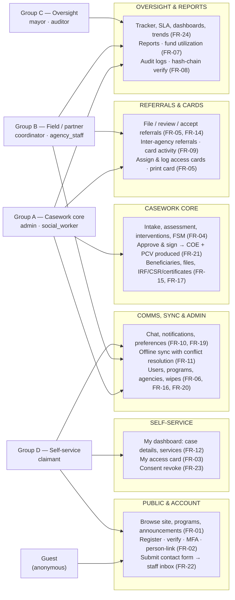

# Use Case Diagram

This document maps the actors of the KAPWA social welfare information system (MSWDO Norzagaray) to the use cases they can perform, expressed as a functional specification (FR-01..FR-24), a **grouped-actor** Mermaid use case diagram — actors are the four functional-overlap groups from `docs/ROLE-MATRIX.md` plus the anonymous guest — a per-actor narrative, and cross-references to the implementation.

## 1. Purpose

Presents the use case model in which the eight account roles are **segregated into the four functional-overlap groups** (authentication is a non-functional requirement, so it contributes no grouping):

| Group | Roles | Character |
|---|---|---|
| **Guest** | *(anonymous)* | Public website only |
| **A — Casework core** | `admin`, `social_worker` | Create and progress cases; the operational core |
| **B — Field / partner** | `coordinator`, `agency_staff` | Referrals and access-card activity within their scope |
| **C — Oversight** | `mayor`, `auditor` | Read-only tracking, reports, audit/compliance |
| **D — Self-service** | `claimant` | Own case, card, consent |

Each use case is tagged with the functional requirements it satisfies; enforcement (`@Roles`) and client routes are covered in Sections 4–5, and the role-by-role capability matrix lives in `docs/ROLE-MATRIX.md`.

## 2. Functional Specification

| ID | Requirement | Group(s) |
|----|-------------|----------|
| FR-01 | Guest/public user views the landing page, programs, and public announcements. | Guest |
| FR-02 | Guest registers, verifies email, logs in, completes MFA when enabled, and links to an existing beneficiary record via OTP (person-link). | Guest, D |
| FR-03 | Claimant views their own access card, service history, case details, and consent records (`GET /beneficiaries/me/access-card`, `/me/services`, `/me/consent`). | D |
| FR-04 | Social worker/admin creates intakes (beneficiary + claimant + family + household, auto access card), assesses cases, logs interventions, and drives the case FSM. | A |
| FR-05 | Coordinator files barangay referrals and manages access cards for their barangay; agency staff logs card activity and reads agency card summaries; admin/social worker assign cards. | A, B |
| FR-06 | Admin manages users, agencies, announcements, and remote device wipes. | A |
| FR-07 | Mayor views reports and fund utilization (`GET /export/monthly-funds`). | C |
| FR-08 | Auditor views audit logs and verifies the hash chain (`GET /audit/verify-all`); exports audit data as PDF/CSV. | C |
| FR-09 | Agency staff views the agency dashboard/profile, inter-agency referrals, and card activities. | B |
| FR-10 | Chat restricted to admin, social_worker, coordinator, claimant; role-appropriate notifications for all roles except mayor. | A, B, D |
| FR-11 | Offline sync for field roles (admin, social_worker, coordinator): queue, delta sync, conflict resolution, transient-failure auto-retry. | A, B |
| FR-12 | Claimant dashboard (`/my-dashboard`) shows case status, case details, service history, and notification preferences. | D |
| FR-13 | Announcements management for admin, social_worker, coordinator. | A, B |
| FR-14 | Referral review: MSWDO staff accept/decline referrals; coordinators file and track them (`GET /referrals/mine`). | A, B |
| FR-15 | Physical files management for admin, social_worker, coordinator. | A, B |
| FR-16 | Program management for admin (create/edit, fund sources, required documents, approval workflow); public read-only listing. | A, Guest |
| FR-17 | IRF/CSR/certificate generation and management (admin + social_worker; coordinator on certificates/CSR; auditor on IRF reads); IRF narration encrypted, decrypt requires a legal-basis code and is audit-logged. | A, C |
| FR-18 | Account settings and MFA setup/enable/disable/verify — every authenticated role (non-functional account management). | All |
| FR-19 | Notification preferences per role and category (`GET|PUT /notifications/preferences`). | All except Guest |
| FR-20 | Admin wipe/reset: remote wipe a device or user session and list registered devices. | A |
| FR-21 | Case approval: admin approves `in_review → active` with a signature; the **Certificate of Eligibility and Petty Cash Voucher are produced automatically**, filed, and viewable by admin/social_worker (case stepper, Implement HIP step, approvals pipeline). | A |
| FR-22 | Public contact form submissions are stored in the in-app **contact inbox** and notify admins/social workers (no mailbox required). | Guest → A |
| FR-23 | Consent revocation (RA 10173): revoking flags the ledger, blocks staff reads of the beneficiary record, and rejects new interventions; historical records are retained for audit. | D → A |
| FR-24 | Case tracking and trends: `/tracker` (Monday-anchored week stat, per-status segregation, closed excluded) and dashboard trends with 1w/1m/3m/6m ranges. | A, B, C |

## 3. Use Case Diagram

**Printing:** the diagram below is rendered to a US-Letter-size PDF by `docs/diagrams/print-diagrams.mjs` (output in `docs/diagrams/print/`) — run `PUPPETEER_EXECUTABLE_PATH=/usr/bin/google-chrome-stable node docs/diagrams/print-diagrams.mjs` after editing.

The actors are the functional-overlap groups (not individual roles): each group box names its member roles. Client screens, controllers, and guards are not shown — enforcement follows in Section 4.

### 3.1 Actor Detail

The diagram shows the four functional-overlap groups; this subsection narrates each group (and its member roles) against the functional requirements.

**guest.** Unauthenticated users reach the public shell — landing page, about/contact, programs, and public announcements (FR-01) — and submit the contact form, which lands in the staff contact inbox (FR-22). They register, verify email, log in with MFA when enabled, and can link to an existing beneficiary record via OTP person-link (FR-02).

**Group A — Casework core (`admin` + `social_worker`).** The only roles that create and progress cases: intake (beneficiary + claimant + family + household, with the access card auto-generated at enrollment), assessment, interventions, and the FSM lifecycle (FR-04). Admin performs the **approval** (`in_review → active`) with a signature, which **produces the Certificate of Eligibility and Petty Cash Voucher**; both are viewable by admin and social workers in the case stepper, the Implement HIP step, and the approvals pipeline (FR-21). The group manages beneficiaries, physical files, IRFs, CSR/certificates (FR-15, FR-17), assigns access cards (FR-05), reviews/accepts coordinator referrals (FR-14), manages announcements (FR-13), uses offline sync (FR-11), and — admin only — owns the admin panel (users, sync queue, audit log, contact inbox) and remote wipes (FR-06, FR-20). Admin additionally holds audit-log and unmasked-export rights (FR-08).

**Group B — Field / partner (`coordinator` + `agency_staff`).** The external-facing pair, sharing referrals and access-card activity:
- **coordinator** files barangay referrals (`POST /referrals`, coordinator-only), tracks them via `/referrals/mine`, and manages access cards for their barangay (FR-05, FR-14). They manage announcements (FR-13), chat, and sync offline data (FR-10, FR-11).
- **agency_staff** views the agency dashboard/profile, responds to inter-agency referrals, and logs/reads card activity with agency summaries (FR-05, FR-09).
- Neither can touch intake, case lifecycle, approvals, or IRFs.

**Group C — Oversight (`mayor` + `auditor`).** Strictly read-only across the system:
- **mayor** views reports and fund-utilization exports (FR-07) and the case tracker (FR-24).
- **auditor** reads audit logs, **verifies the hash chain** (`GET /audit/verify-all`), and exports audit/compliance data (FR-08, FR-24).
- Both appear in the tracker/SLA read set and receive notifications (FR-10, FR-19).

**Group D — Self-service (`claimant`).** Redirected to `/my-dashboard`: case status and case details (control no, assigned worker, amount, services requested), service history, and notification preferences (FR-12); their own access card with the household ledger (FR-03); consent records with **revocation** — which blocks staff reads of the record and rejects new interventions while retaining history for audit (FR-23); chat and notifications (FR-10, FR-19).

## 4. Role Restriction Enforcement

The client redirect map `ROLE_REDIRECT_MAP` (social_worker→`/dashboard`, admin→`/admin`, coordinator→`/coordinator`, claimant→`/my-dashboard`, mayor→`/reports`, auditor→`/audit-logs`, agency_staff→`/agency/dashboard`) mirrors the server-side `@Roles` decorators, which are the authoritative gate: role-scoped endpoints are protected by `JwtAuthGuard` + `RolesGuard` (plus `AbacGuard` for barangay/agency scoping and consent gating), some endpoints are `JwtAuthGuard`-only (profile and MFA routes), and public routes (landing, public announcements, public programs, contact form) are completely unguarded. `NOTIFICATION_ROLES` and `CHAT_ROLES` in `role-access.ts` mirror the `notifications.controller` and `chat.controller` decorators. Settings/MFA (FR-18) is the only use case open to every authenticated role.

**Cross-cutting non-functional requirements** (not role-differentiating): JWT authentication with refresh rotation and optional TOTP MFA; consent-gated ABAC for RA 10173; audit hash-chain integrity; offline-capable PWA packaging.

## 5. Cross-References

| Item | Location |
|------|----------|
| Role × functional-area matrix and overlap groups | `docs/ROLE-MATRIX.md` |
| Full functionality reference | `docs/FUNCTIONALITY.md` |
| Route table | `kapwa-client/src/routes.tsx` |
| Role redirect map, notification roles, chat roles | `kapwa-client/src/lib/role-access.ts` |
| Auth (register, login, MFA, verify-email, person-link) | `kapwa-server/src/auth/auth.controller.ts` |
| Intake (create, review, match-check) | `kapwa-server/src/intake/intake.controller.ts` |
| Cases + interventions + approvals | `kapwa-server/src/cases/cases.controller.ts`, `kapwa-server/src/case-interventions/case-interventions.controller.ts` |
| Approval documents (COE + PCV) | `kapwa-server/src/cases/cases-export.service.ts` (`generateApprovalDocuments`) |
| Beneficiaries (claimant self endpoints, consent revoke) | `kapwa-server/src/beneficiaries/beneficiaries.controller.ts` |
| Referrals (coordinator file, MSWDO review) | `kapwa-server/src/referrals/referrals.controller.ts` |
| Inter-agency referrals | `kapwa-server/src/inter-agency-referrals/inter-agency-referrals.controller.ts` |
| Access cards (assign, log, summaries, printable PDF) | `kapwa-server/src/access-cards/access-cards.controller.ts` |
| Export (audit logs, funds, compliance, certificates) | `kapwa-server/src/export/export.controller.ts` |
| Audit logs + hash-chain verify | `kapwa-server/src/audit/audit.controller.ts` |
| Contact inbox | `kapwa-server/src/contact-messages/contact-messages.controller.ts` |
| Announcements | `kapwa-server/src/announcements/announcements.controller.ts` |
| Users (admin only) | `kapwa-server/src/users/users.controller.ts` |
| Physical files | `kapwa-server/src/physical-files/physical-files.controller.ts` |
| Offline sync (queue, deltas, conflicts) | `kapwa-server/src/sync/sync.controller.ts` |
| Notifications + preferences | `kapwa-server/src/notifications/notifications.controller.ts` |
| Chat | `kapwa-server/src/chat/chat.controller.ts` |
| IRF / CSR / admin wipe | `kapwa-server/src/irf/irf.controller.ts`, `kapwa-server/src/csr/csr.controller.ts`, `kapwa-server/src/admin/admin-wipe.controller.ts` |
| User-story verification suite | `user-stories-tests.md` |
| End-to-end system walkthrough | `docs/e2e-full-system.md` |
