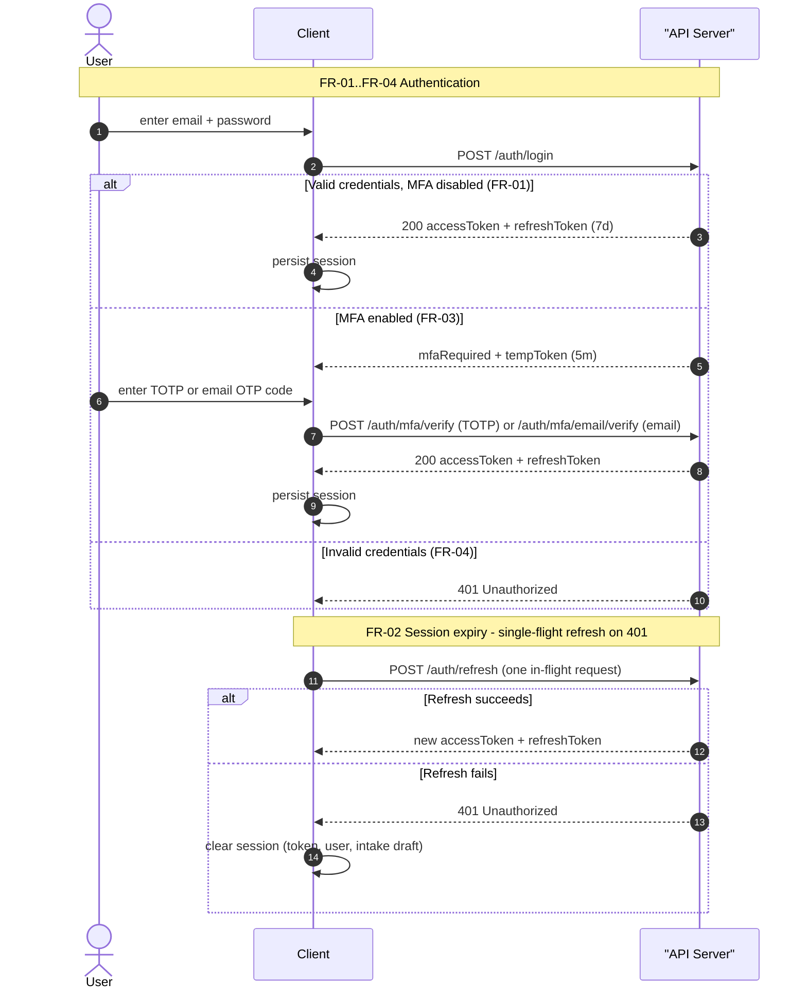
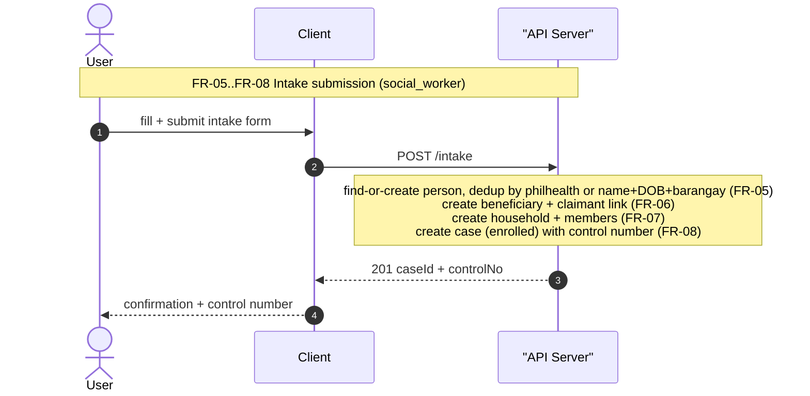
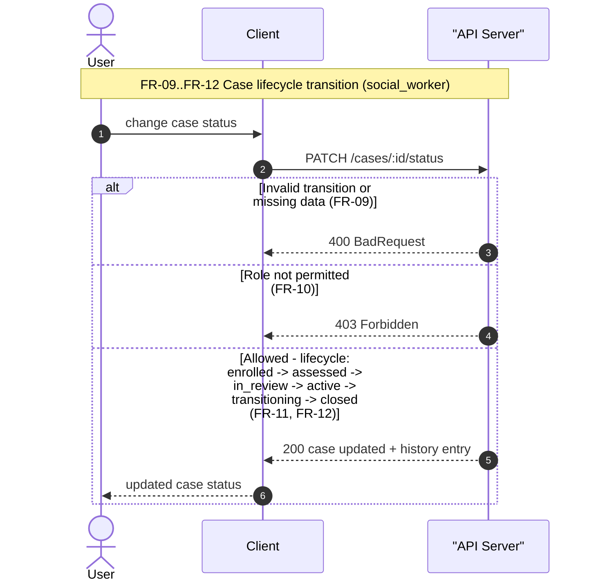
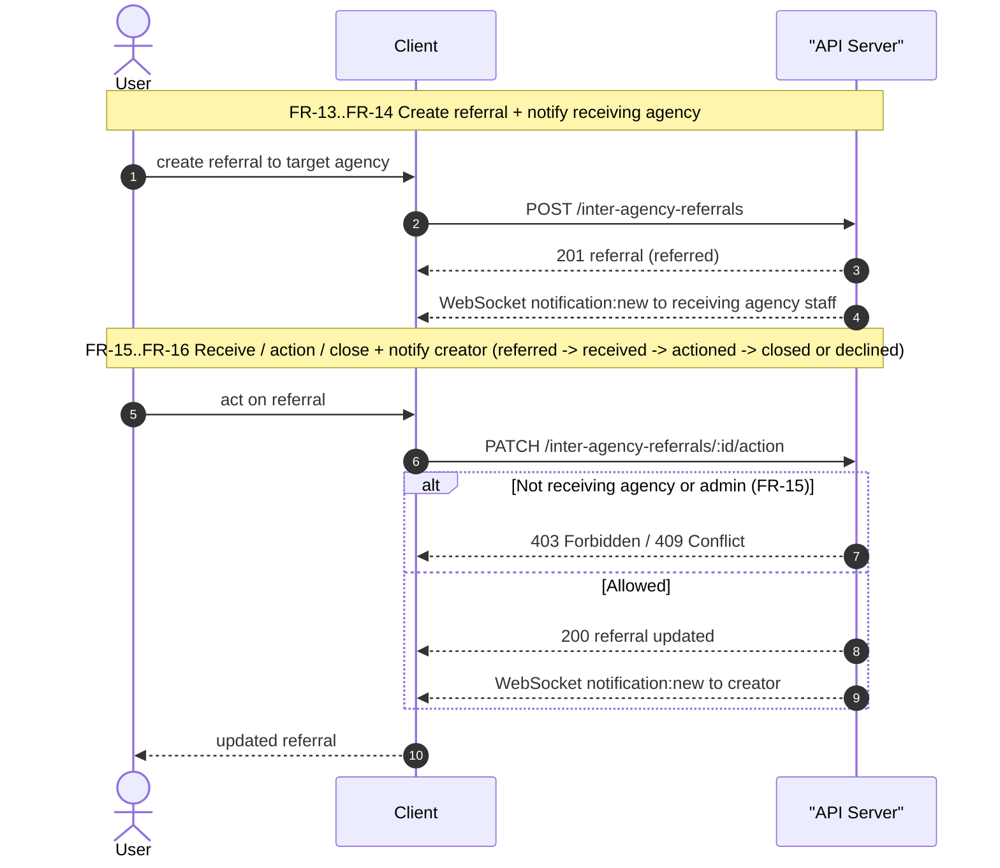

# Sequence Diagrams

This document expresses four core end-to-end flows of the KAPWA social welfare information system — authentication, intake, case lifecycle, and inter-agency referral — as high-level Mermaid sequence diagrams tied to functional requirements FR-01..FR-16; the implementation files that enforce them are listed in Section 5.

## 1. Purpose

Documents the 4 core end-to-end flows (auth, intake, case FSM lifecycle, inter-agency referral) in sequence form, keeping each diagram at the functional-requirement level; the controller/service/repository behind each step is named in the narrative (Section 4) and cross-references (Section 5). The diagrams reflect the actual implementation, not an idealized design: every transition, notification, and error path shown below was verified against the source files listed in Section 5.

## 2. Functional Specification

| ID | Requirement |
|----|-------------|
| FR-01 | User logs in with email/password; on valid credentials (MFA disabled) the server issues an access token and a 7-day refresh token (`POST /auth/login`, `AuthService.issueTokens`). |
| FR-02 | On a 401 response, the client api layer performs a single-flight `/auth/refresh`; when refresh fails it dispatches the `kapwa:auth:logout` window event and the AuthProvider clears token, user, and the user's intake draft (`kapwa-client/src/lib/auth-context.tsx`). |
| FR-03 | When the account has MFA enabled, login returns `{ mfaRequired: true, mfaMethod, tempToken (5m) }`; the client shows the challenge and verifies it via `POST /auth/mfa/verify` (TOTP) or `POST /auth/mfa/email/verify` (email OTP, resendable via `/auth/mfa/email/resend`) before tokens are issued. |
| FR-04 | Invalid credentials return `401 Unauthorized (Invalid credentials)`; unverified email blocks login with `401` (verify-email first), enforced in `AuthService.login`. |
| FR-05 | A social_worker submits an intake; the beneficiary Person is found (dedup by philhealth number or surname+first name+DOB scoped to barangay) or created (`IntakeService.submitIntake` step 1, `findOrCreatePerson`). |
| FR-06 | A Beneficiary record (consentStatus `active`) is created for the person and the claimant Person + `BeneficiaryClaimant` primary link are created; the claimant represents the beneficiary in all system transactions. |
| FR-07 | A Household is created with the beneficiary as primary; the beneficiary is linked to it (`householdId`) and each family member is created and linked via `HouseholdMembership`. |
| FR-08 | A Case is created with status `enrolled`, a generated control number, service requested and assigned worker; a `ConsentLedger` row (purpose `registration`) is written; everything commits in a SERIALIZABLE transaction. |
| FR-09 | Every case status change is validated by the shared FSM: `isValidTransition(from, to)` must return true and field preconditions must pass, else `400 BadRequest` (`case-fsm.ts` + `CasesService.validateTransition`). |
| FR-10 | The acting role is checked with `canTransition(from, role)` against `CASE_FSM_ROLES` (admin overrides all); a disallowed role gets `403 Forbidden`. |
| FR-11 | On a valid transition the case status is saved, a `case_history` row is logged (`logHistory`), and the assigned worker is notified of the new status. |
| FR-12 | The supported lifecycle is `enrolled -> assessed -> in_review -> active -> transitioning -> closed`, with `closed` reachable from every non-terminal status via `CASE_FSM`. |
| FR-13 | An agency_staff (or MSWDO staff) creates a referral: source agency resolved (MSWDO fallback), target agency validated, person resolved from beneficiary/case/personId, saved with status `referred`. |
| FR-14 | After saving, `notifyAgency` creates an in-app notification for every `agency_staff` of the receiving agency, which triggers a WebSocket push to their room via `NotificationsGateway.emitToUser` (wrapped in try/catch so notification failure never fails the referral). |
| FR-15 | Only the receiving agency (or admin) can act on a referral: `assertReceiver` guards it and `assertTransition` enforces `referred -> received -> actioned -> closed` (or `referred -> declined`), else `403/409`. |
| FR-16 | On receive/action/close/decline, `notifyCreator` creates an in-app notification for the original creator (try/catch guarded), which triggers the same gateway push to the creator's WebSocket room. |

## 3. Sequence Diagrams (Mermaid)

All diagrams use the same three high-level lifelines — `User` (actor), `Client`, and `API Server`. They stay at the functional-requirement level: internal controllers, services, repositories, FSM rules, and the notification gateway are deliberately omitted. Implementation detail for each flow lives in the narrative (§4) and cross-references (§5).

**Printing:** every diagram below is rendered to its own US-Letter-size PDF by `docs/diagrams/print-diagrams.mjs` (output in `docs/diagrams/print/`, one file per diagram) — run `PUPPETEER_EXECUTABLE_PATH=/usr/bin/google-chrome-stable node docs/diagrams/print-diagrams.mjs` after editing.

### S1 — Auth: login, MFA challenge, single-flight refresh

### S2 — Intake: person find-or-create, household link, case creation

### S3 — Case FSM: validated transition with history logging

### S4 — Inter-agency referral: create, notify, receive, close

## 4. Diagram Narrative

**S1 — Auth (FR-01..FR-04).** The `Client` posts credentials to `AuthController.login`, which delegates to `AuthService.validateUser` — a lookup against `UserRepository` with a bcrypt comparison; failure returns `401 Invalid credentials` (FR-04). On success, `AuthService.login` branches: if `mfaEnabled` it returns a 5-minute `tempToken` flagged `mfaChallenge` (FR-03), which the client stores via `setMfaChallenge` and redeems through `POST /auth/mfa/verify` (TOTP) or `POST /auth/mfa/email/verify` (email OTP) before tokens are issued; otherwise `issueTokens` returns the access token and 7-day refresh token, and the client persists them with `setToken`/`setUser` (FR-01). The second half of the lifeline models the client 401 interceptor: on a 401, one in-flight refresh request is made to `/auth/refresh` (single-flight); `AuthService.refresh` re-verifies the token and bumps `tokenVersion`. If it fails, the api client dispatches the `kapwa:auth:logout` window event, and the `AuthProvider` listener calls `logout()`, clearing the token, user state, and the user's intake draft (FR-02).

**S2 — Intake (FR-05..FR-08).** The `SocialWorker` fills and submits the intake form; `IntakePage` posts to `IntakeController`, which calls `IntakeService.submitIntake` inside a SERIALIZABLE transaction. The service first find-or-creates the beneficiary `Person` with dedup enabled (philhealth number, or surname+first name+DOB scoped to the barangay) (FR-05), creates the `Beneficiary` record, the claimant `Person` and the primary `BeneficiaryClaimant` link (FR-06), creates the `Household` with the beneficiary as primary and links the beneficiary to it, then creates each family member `Person` plus a `HouseholdMembership` (FR-07). Finally it generates a control number, creates the `Case` with status `enrolled`, and writes the `ConsentLedger` row before committing; the response carries `beneficiaryId`, `caseId`, `controlNo`, and status `enrolled` (FR-08).

**S3 — Case FSM (FR-09..FR-12).** The `SocialWorker` requests a status change through `CasesController` into `CasesService.transition`. Every transition first passes through the shared FSM in `case-fsm.ts`: `isValidTransition(from, to)` checks the `CASE_FSM` adjacency table (enrolled→assessed/closed, assessed→in_review/closed, in_review→active/closed, active→transitioning/closed, transitioning→closed) and field preconditions are validated, so an illegal or incomplete transition yields `400 BadRequest` (FR-09, FR-12). Then `canTransition(from, role)` is checked against `CASE_FSM_ROLES` — admin always passes (override) — and a disallowed role receives `403 Forbidden` (FR-10). On success the case status is saved, a `case_history` row is written via `logHistory`, and the assigned worker is notified (FR-11).

**S4 — Inter-agency referral (FR-13..FR-16).** The `AgencyStaff` (or MSWDO staff) creates a referral through `InterAgencyReferralsService.create`: the source agency is resolved (MSWDO fallback for unlinked staff), the target agency must exist and differ from the source, the person is resolved from beneficiary/case/personId, and the referral is saved with status `referred` (FR-13). `notifyAgency` then creates an in-app notification for every `agency_staff` of the receiving agency; each `NotificationsService.create` persists the notification and calls `NotificationsGateway.emitToUser`, pushing `notification:new` into the staff member's `user:{id}` WebSocket room (FR-14). Later, the receiving agency acts on the referral — `assertReceiver` restricts updates to the receiving agency or admin, `assertTransition` enforces `referred → received → actioned → closed` (or `declined`), and `notifyCreator` creates a notification for the original creator, again pushed through the gateway (FR-15, FR-16). Both notification calls are wrapped in try/catch so a notification failure never rolls back or fails the referral operation.

## 5. Cross-References

| Item | Location |
|------|----------|
| Case FSM table, roles, `isValidTransition`, `canTransition` (admin override) | `kapwa-server/src/cases/case-fsm.ts` |
| `transition`/`updateStatus`, validation, history logging, worker notification | `kapwa-server/src/cases/cases.service.ts` |
| WebSocket gateway: JWT auth, `user:{userId}` rooms, `emitToUser` | `kapwa-server/src/notifications/notifications.gateway.ts` |
| `submitIntake`: find-or-create person, beneficiary, household, case `enrolled` | `kapwa-server/src/intake/intake.service.ts` |
| Client auth: login, MFA challenge, `kapwa:auth:logout` listener, logout draft purge | `kapwa-client/src/lib/auth-context.tsx` |
| Referral create → `notifyAgency`; receive/action/close/decline → `notifyCreator` (try/catch) | `kapwa-server/src/inter-agency-referrals/inter-agency-referrals.service.ts` |
| Token issuance, MFA challenge temp token, refresh with `tokenVersion` | `kapwa-server/src/auth/auth.service.ts` |
| Login/MFA/refresh endpoints | `kapwa-server/src/auth/auth.controller.ts` |
| In-app notification persistence + `emitToUser('notification:new')` | `kapwa-server/src/notifications/notifications.service.ts` |