# Activity Diagrams (User–System Swimlanes)

This document expresses the decision-heavy business workflows of the KAPWA social welfare information system — intake, case FSM transitions, offline sync, inter-agency referrals, authentication & MFA, registration & verification, password recovery, access cards, exports, announcements, OTP, and notifications — as Mermaid activity diagrams tied to functional requirements FR-01..FR-32 and to the implementation files that enforce them.

## 1. Purpose

Documents the 12 decision-heavy business workflows (intake, case lifecycle transitions, sync delta processing, inter-agency referral lifecycle, authentication & MFA, registration & email verification, password recovery, access card assignment & service logging, export/certificate generation, announcement publishing, OTP verification, and notification delivery) as swimlane activity diagrams: the **user (role)** lane is on the **left** and the **system** lane is on the **right**, showing every decision point, branch, and terminal state as implemented in the source files listed in Section 5.

## 2. Functional Specification

| ID | Requirement |
|----|-------------|
| FR-01 | Intake starts with the worker filling the beneficiary/claimant/family form; a match-check endpoint scores the applicant against existing households (0.6 * beneficiary name similarity + 0.4 * family name similarity, threshold >= 0.6) and returns up to 10 candidate households (`IntakeService.matchCheck`). |
| FR-02 | When the match-check finds a duplicate, the worker confirms the match and the data is merged into the existing household (dedup by philhealth number or surname+first name+DOB scoped to barangay) via `confirmMatch`; when no duplicate is found the new-record path is taken. |
| FR-03 | Submitting the intake creates a Case with status `enrolled`, a generated control number, an `active` consent ledger row, and beneficiary/claimant/household links, all in one SERIALIZABLE transaction (`IntakeService.submitIntake`). |
| FR-04 | While the form is being filled, the draft is autosaved after a 2s debounce to a user-scoped localStorage key (`kapwa:intake:draft:<userId>`) and can be recovered later via `loadDraft` (`useIntakeAutosave.ts`). |
| FR-05 | Case transitions are guarded per status: an assessment must be completed before `assessed`; FRVA/SWDI scores before `in_review`; at least one intervention before `active`; self-reliance level and sustainability plan before `transitioning`; client signature and closure outcome before `closed` (`CasesService.validateTransition`). |
| FR-06 | Review transitions are role-gated: `CASE_FSM_ROLES` restricts transitions out of `in_review` to `admin`/`coordinator`, and review approvals flow through `in_review` before a case can become `active`. |
| FR-07 | Disburse — `ACTIVE` → `TRANSITIONING` — is admin-only: `CASE_FSM_ROLES[ACTIVE] = ['admin']`, enforced by `canTransition` in `case-fsm.ts`. |
| FR-08 | Closing from `TRANSITIONING` is allowed for `social_worker`/`coordinator` (`CASE_FSM_ROLES[TRANSITIONING]`); admin overrides all role checks (`canTransition` returns true for admin) and can close from any state. |
| FR-09 | A sync delta is validated server-side before any processing: unknown `_`-prefixed meta fields are rejected with `400 BadRequest` (`assertNoUnknownMetaFields`, S-06); only `_fsmTransition` and `_clientUpdatedAt` are permitted control fields. |
| FR-10 | The delta batch must carry a valid Ed25519 signature over `{deviceId, changes}` (device id hex-decoded as the public key), else `403 Forbidden` (`verifySignature`). |
| FR-11 | The batch `idempotencyKey` is checked against an in-memory cache + `idempotency_keys` DB table (24h TTL); an idempotent replay returns the cached result without re-applying the change. |
| FR-12 | On conflict, the resolver applies policy: financial tables (`interventions`, `disbursements`, `financial_assistance`, `case_interventions`, `access_card_services`) are server-wins; note tables append client notes; consent ledger is server-wins (`ConflictResolver.FINANCIAL_TABLES`). |
| FR-13 | A referral is created with status `referred` after source-agency resolution (MSWDO fallback for unlinked staff), target-agency validation (must exist, must differ), and person resolution from beneficiary/case/personId; `notifyAgency` then notifies every `agency_staff` of the receiving agency. |
| FR-14 | The receiving agency (or admin) acknowledges the referral: status `received`, `receivedAt` set, and `notifyCreator` notifies the original creator. |
| FR-15 | The receiving agency actions the referral: status `actioned`, `actionedAt` set; `assertReceiver` (receiving agency or admin only) and `assertTransition` (`referred → received → actioned → closed`, or `referred → declined`) guard every step with 403/409 otherwise. |
| FR-16 | The referral is closed (outcome recorded, `closedAt`) or declined (reason recorded); `notifyCreator` fires at each receive/action/close/decline step, all notification calls wrapped in try/catch so a notification failure never fails the referral operation. |
| FR-17 | Login SHALL validate credentials; when the account has MFA enabled the API SHALL return an `mfaRequired` challenge with a short-lived temp token instead of a full session, and the user SHALL verify with a TOTP code before receiving access + refresh tokens (`AuthService.login`, 5-minute temp token, 7-day refresh). |
| FR-18 | The client SHALL attach the access token to API calls; on 401 the api layer SHALL single-flight a refresh, and if the refresh token is invalid/revoked (token version mismatch) it SHALL dispatch `kapwa:auth:logout` to clear the session (`api.ts` interceptor, `auth-context.tsx`). |
| FR-19 | Registration SHALL create an account (schema default role `social_worker`; service fallback intends `claimant`); the account SHALL be unusable until the email is verified via a verification link, and a resend-verification path SHALL be available (`AuthService.register`, `verifyEmail`, `resendVerification`). |
| FR-20 | Password recovery SHALL flow through a time-limited reset token: `forgot-password` emails a reset link, `reset-password` validates it and sets the new password, and the account's `token_version` is bumped so all previously issued tokens are invalidated (`AuthService.forgotPassword`, `resetPassword`). |
| FR-21 | Access cards SHALL be assigned to a beneficiary by generating a unique yearly code `NORZ-AC-{year}-{seq}` from the `access_card_seq` counter and storing it on the beneficiary (`AccessCardsService.generateAndAssign`). |
| FR-22 | Service logs SHALL be recorded against a card code with date, rendered service, cost, agency, category, worker signature, and optional intervention linkage (`AccessCardsService.logService`); card summaries SHALL aggregate totals and per-category counts. |
| FR-23 | Certificate exports SHALL generate a PDF for `indigency`/`eligibility`/`referral` types via `POST /export/certificate` (admin, social_worker, coordinator) and SHALL return the file with `Content-Disposition` so the client downloads it (`ExportService.generateCertificate`, pdfkit). |
| FR-24 | The monthly fund utilization export SHALL validate the `month` parameter (`YYYY-MM`, months 01-12 only), aggregate `case_interventions` on `cases.status = 'transitioning'` by program × fund source, and produce an XLSX workbook (`ExportService.monthlyFundUtilization`, exceljs). |
| FR-25 | Announcements SHALL be authored as `draft` or `published`; body HTML SHALL be sanitized server-side (allow-listed tags/attributes), a slug SHALL be generated from the title, and publishing SHALL stamp `published_at` (`AnnouncementsService.create`). |
| FR-26 | Announcement visibility SHALL be status-gated: public list/detail endpoints SHALL return only `published` items, with `pinned` items ordered first; the manage endpoints SHALL allow draft editing, pinning, and deletion (`AnnouncementsService.findAll/findPublic`). |
| FR-27 | OTP codes SHALL be generated with an expiry (`OTP_EXPIRY_MINUTES`), delivered via SMS/email, and SHALL verify once — the code is marked verified on first successful check and expired codes are purged (`OtpService.generateAndSend`, `verifyOtp`). |
| FR-28 | Notifications SHALL be delivered in-app via the WebSocket gateway (`notification:new` on the recipient's `user:{id}` room) and SHALL support mark-read, read-all, and delete with realtime `unread:count` updates (`NotificationsService`, `NotificationsGateway`). |

## 3. Activity Diagrams (Mermaid)

**Printing:** every diagram below is rendered to its own US-Letter-size PDF by `docs/diagrams/print-diagrams.mjs` (output in `docs/diagrams/print/`, one file per diagram) — the print script scales each diagram to fit a letter page — run `PUPPETEER_EXECUTABLE_PATH=/usr/bin/google-chrome-stable node docs/diagrams/print-diagrams.mjs` after editing.

Each diagram is a swimlane: the **user (role)** lane is on the **left**, the **system** lane is on the **right**, separated by a **vertical divider line** (the dashed bar between the lanes). Every arrow that crosses the divider is **data changing context** — a request leaving the user lane into the system lane (e.g. `POST /intake`, `PATCH /cases/:id/status`, `POST /sync/v1`) or a response/validation returning to the user lane (e.g. `candidates`, `challenge`, `link`).

### A1 — Intake: user fills form, system match-checks and creates case

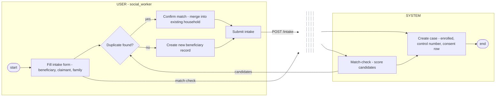

### A2 — Case FSM: user attempts transition, system guards it

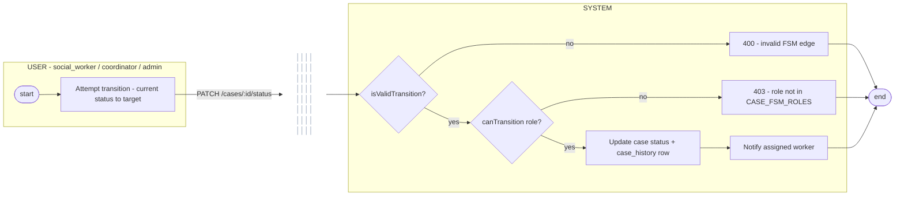

### A3 — Sync: client sends deltas, system validates and resolves

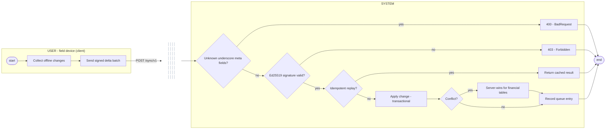

### A4 — Referral: agency staff acts, system guards lifecycle

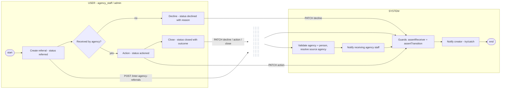

### A5 — Authentication & MFA

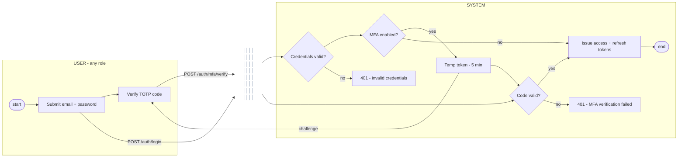

### A6 — Registration & email verification

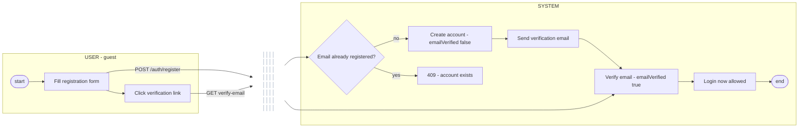

### A7 — Password recovery

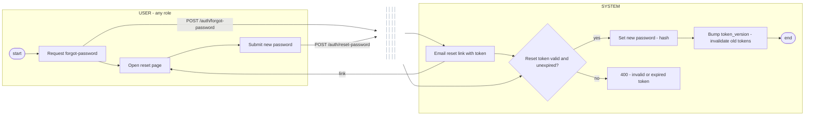

### A8 — Access card assignment & service logging

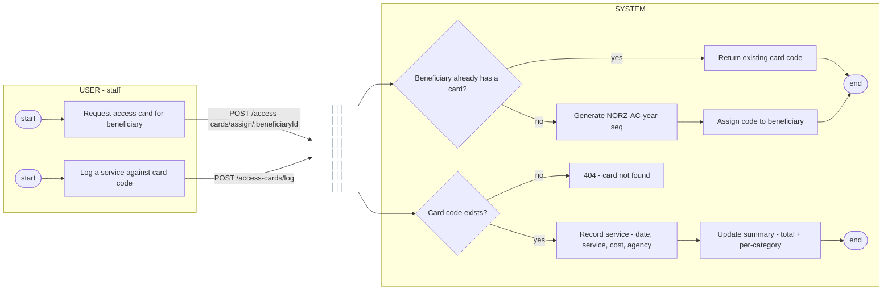

### A9 — Export & certificate generation

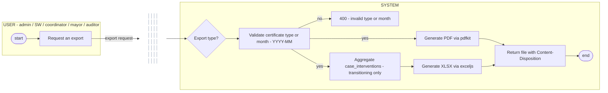

### A10 — Announcement publishing

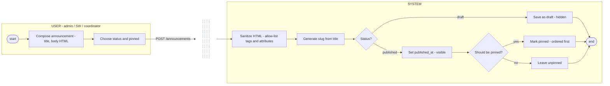

### A11 — OTP verification

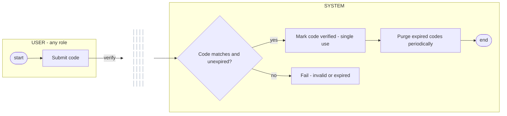

### A12 — Notification delivery

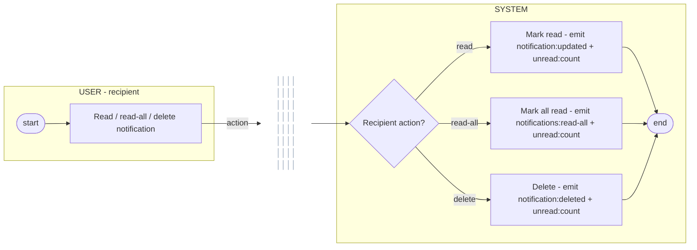

## 4. Diagram Narrative

**A1 — Intake (FR-01..FR-04).** The workflow starts when the worker begins filling the intake form (FR-01). While the form is being filled, the draft is autosaved in parallel after a 2s debounce to a user-scoped localStorage key (`kapwa:intake:draft:<userId>`), so an interrupted session can be recovered with `loadDraft` (FR-04). On submission, a match-check scores the applicant against existing households (60% beneficiary name similarity + 40% family name similarity, threshold 0.6, barangay-scoped). The decision `{Duplicate found?}` (FR-02) branches: on `yes`, the worker confirms the match and `confirmMatch` merges the applicant into the existing household (dedup by philhealth number or surname+first name+DOB), reusing the household's recent case if one exists within 30 days; on `no`, a new beneficiary record is created. Both branches converge on submission (FR-03), which creates the case with status `enrolled`, a generated control number, and the consent ledger row inside a SERIALIZABLE transaction, terminating at `([end])`.

**A2 — Case FSM (FR-05..FR-08).** Every status change enters the shared FSM from `case-fsm.ts`. The first decision, `{isValidTransition?}`, checks the `CASE_FSM` adjacency table (enrolled → assessed/closed, assessed → in_review/closed, in_review → active/closed, active → transitioning/closed, transitioning → closed, closed → none) plus per-status field preconditions — assessment required before `assessed`, FRVA/SWDI scores before `in_review`, interventions before `active`, self-reliance plan before `transitioning`, signature + outcome before `closed` (FR-05) — and a violation terminates at `400 BadRequest` (FR-09 in the sync numbering maps to FSM rejection in `handleFsmTransition`). The second decision, `{canTransition role?}`, checks `CASE_FSM_ROLES` (FR-06): `in_review` is admin/coordinator-only, `ACTIVE` is admin-only — making the disburse edge `ACTIVE → TRANSITIONING` exclusively admin (FR-07) — and `TRANSITIONING` allows social_worker/coordinator to close (FR-08). The annotated note records that admin overrides every role check because `canTransition` short-circuits to true for the admin role, so admin can also close from any state. On success the case status is saved, a `case_history` row is logged with the transition type, and the assigned worker is notified before `([end])`.

**A3 — Sync (FR-09..FR-12).** A client delta batch enters `processDelta`. The first decision, `{Unknown underscore meta fields?}`, rejects any `_`-prefixed key other than the two FSM control fields with `400 BadRequest` (FR-09, `assertNoUnknownMetaFields`) before any caching or processing. The second decision, `{Ed25519 signature valid?}`, rejects an invalid signature over `{deviceId, changes}` with `403 Forbidden` (FR-10, `verifySignature`). The third decision, `{Idempotent replay?}`, returns the cached result for a known batch `idempotencyKey` (in-memory map + `idempotency_keys` DB, 24h TTL) instead of re-applying (FR-11). Otherwise the change is applied (`applyChange`, transactional INSERT/UPDATE/DELETE; intake-table changes delegate to `submitIntake`; case `_fsmTransition` changes pre-check the FSM). The final decision, `{Conflict?}`, detects a newer server record; on conflict the resolver enforces policy — `server-wins` for financial tables (`FINANCIAL_TABLES`), note append for note tables, server-wins for consent — and the outcome is recorded as a queue entry with status `applied` or `conflict` (FR-12), terminating at `([end])`.

**A4 — Referral (FR-13..FR-16).** A referral is created with status `referred` after source-agency resolution (MSWDO fallback for unlinked staff), target-agency validation, and person resolution (FR-13). `notifyAgency` then pushes an in-app notification to every `agency_staff` of the receiving agency. The decision `{Received by agency?}` (FR-14) branches: on `no`, the referral is declined (status `declined` with a reason, allowed only from `referred` per the `TRANSITIONS` table); on `yes`, the referral is actioned (status `actioned`, FR-15) and then closed (status `closed` with an outcome, allowed only from `actioned`). Both branches converge on `notifyCreator`, which notifies the original creator at each lifecycle step (FR-16), before terminating at `([end])`. All notification calls are try/catch guarded so a notification failure never fails the referral operation.

**A5 — Authentication & MFA (FR-17..FR-18).** The workflow starts when the user submits email + password. `{Credentials valid?}` branches: failure terminates at `401`; success proceeds to `{MFA enabled?}` (FR-17). With MFA off, access + refresh tokens are issued immediately (refresh token 7 days). With MFA on, the API returns `mfaRequired` plus a short-lived temp token (5 minutes), and the user must verify a TOTP code — failure terminates at `401`, success issues the full session. The note records the client-side session mechanics (FR-18): the api layer single-flights a refresh on `401`, checks `token_version` on refresh, and dispatches `kapwa:auth:logout` when the refresh token is invalid or revoked, clearing the session and purging the intake draft.

**A6 — Registration & email verification (FR-19).** Registration branches on `{Email already registered?}` — an existing account terminates at `409`; otherwise the account is created with `emailVerified=false` and a verification email is sent. `{User clicks verification link?}` loops back to resend-verification while unverified; clicking the link sets `emailVerified=true`, after which login is allowed.

**A7 — Password recovery (FR-20).** `forgot-password` emails a reset link; `{User opens reset page?}` branches to early termination if never opened. On the reset page the user submits a new password, and `{Reset token valid and unexpired?}` branches: failure terminates at `400`; success hashes the new password, bumps `token_version`, and thereby invalidates every previously issued token.

**A8 — Access card assignment & service logging (FR-21..FR-22).** The assignment flow branches on `{Beneficiary already has a card?}` — existing cards are returned as-is, otherwise a unique code `NORZ-AC-{year}-{seq}` is generated from `access_card_seq` and stored. The logging flow (second start) branches on `{Card code exists?}` — unknown codes terminate at `404`, otherwise the service row (date, rendered service, cost, agency, category, worker signature, optional intervention) is recorded and the card summary's total + per-category counts update.

**A9 — Export & certificate generation (FR-23..FR-24).** The workflow branches on export type. The certificate path validates the type (`indigency`/`eligibility`/`referral`) — invalid types terminate at `400` — then generates a PDF via pdfkit. The monthly-funds path validates the month parameter (`YYYY-MM`, months 01-12) — invalid months terminate at `400` — then aggregates `case_interventions` joined to `cases.status = 'transitioning'` by program × fund source and generates an XLSX via exceljs. Both paths return the file with `Content-Disposition` for client download.

**A10 — Announcement publishing (FR-25..FR-26).** The author composes title + body HTML; the HTML is sanitized server-side (allow-listed tags and attributes) and a slug is generated from the title. `{Status?}` branches: drafts are saved with no public visibility; published announcements stamp `published_at` and become publicly visible. `{Should be pinned?}` then orders pinned items first in the public list.

**A11 — OTP verification (FR-27).** The system generates a code with an expiry window and sends it via SMS/email. `{Code matches and unexpired?}` branches: failure terminates at the fail terminal; success marks the code verified (single use) and expired codes are purged periodically.

**A12 — Notification delivery (FR-28).** Any event — a referral, a case update, a notification — creates a notification record and emits `notification:new` on the recipient's `user:{id}` WebSocket room. `{Recipient reads or bulk-reads?}` branches into three handling paths: single read emits `notification:updated` + `unread:count`; read-all emits `notifications:read-all` + `unread:count`; delete emits `notification:deleted` + `unread:count`. All converge at the end terminal.

## 5. Cross-References

| Item | Location |
|------|----------|
| `CASE_FSM` transition table, `CASE_FSM_ROLES`, `isValidTransition`, `canTransition` (admin override) | `kapwa-server/src/cases/case-fsm.ts` |
| `transition`/`updateStatus`, per-status preconditions, disburse, close, override, `logHistory`, worker notification | `kapwa-server/src/cases/cases.service.ts` |
| Sync: `assertNoUnknownMetaFields`, `verifySignature` (Ed25519), idempotency cache, `applyChange`, FSM pre-check | `kapwa-server/src/sync/sync.service.ts` |
| Conflict policy: `FINANCIAL_TABLES` server-wins, note append, consent server-wins | `kapwa-server/src/sync/conflict-resolver.ts` |
| Intake: `matchCheck`, `submitIntake`, `confirmMatch`, dedup + barangay scoping | `kapwa-server/src/intake/intake.service.ts` |
| Referral lifecycle: `create`/`receive`/`action`/`close`/`decline`, `notifyAgency`/`notifyCreator` (try/catch) | `kapwa-server/src/inter-agency-referrals/inter-agency-referrals.service.ts` |
| Draft autosave: 2s debounce, user-scoped key, `loadDraft`/`clearDraft` | `kapwa-client/src/hooks/useIntakeAutosave.ts` |

| Authentication: login, MFA challenge (temp token 5 min), refresh (7 days, `token_version`) | `kapwa-server/src/auth/auth.service.ts` |
| Client session: 401 single-flight refresh, `kapwa:auth:logout` dispatch | `kapwa-client/src/lib/api.ts`, `kapwa-client/src/lib/auth-context.tsx` |
| Registration, email verification, resend verification | `kapwa-server/src/auth/auth.service.ts` |
| Password recovery: forgot/reset, token version bump | `kapwa-server/src/auth/auth.service.ts` |
| Access cards: `generateAndAssign` (`NORZ-AC-{year}-{seq}`), `logService`, summaries | `kapwa-server/src/access-cards/access-cards.service.ts` |
| Exports: `generateCertificate` (pdfkit), `monthlyFundUtilization` (exceljs, transitioning filter, month regex) | `kapwa-server/src/export/export.service.ts` |
| Announcements: sanitize-html, slugify, draft/published/pinned visibility | `kapwa-server/src/announcements/announcements.service.ts` |
| OTP: expiry window, verify-once, purge | `kapwa-server/src/otp/otp.service.ts` |
| Notifications: `notification:new` / `updated` / `read-all` / `deleted` + `unread:count` emits | `kapwa-server/src/notifications/notifications.service.ts`, `notifications.gateway.ts` |
