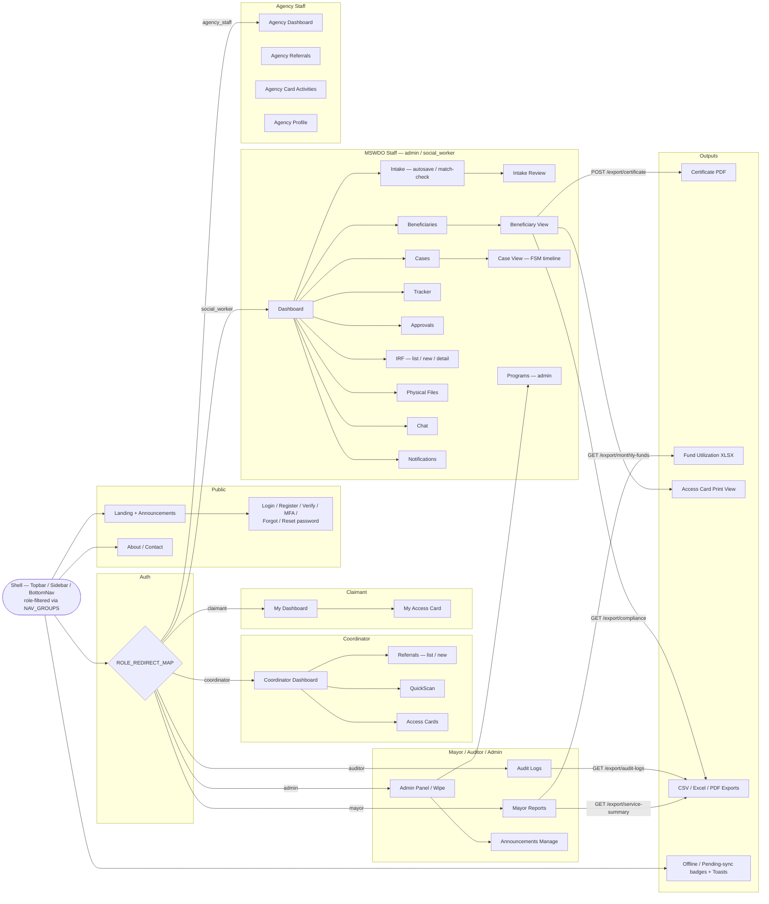
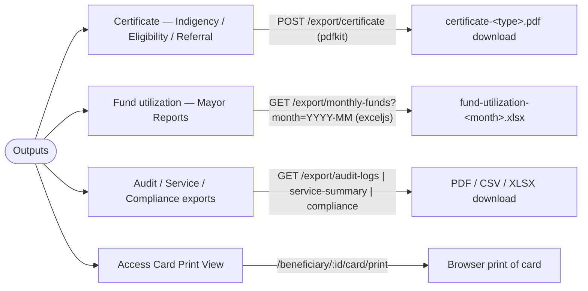

# Output and User Interface

This document inventories the KAPWA user interface — every routed page across all eight audiences, the role-filtered shell that surrounds them, and the machine-readable outputs (certificate PDFs, fund-utilization workbooks, CSV/Excel exports, print views) — as a functional specification (FR-21..FR-47, continuing the FR-01..FR-20 sequence of `02-use-case-diagram.md`) tied to the client pages and server export endpoints that implement them.

## 1. Purpose

Documents the complete output surface of the system: the landing/auth experience, the role-filtered application shell (Topbar, Sidebar, BottomNav), the 49 routed page components grouped by audience, and the downloadable/printable outputs produced by the export controller — so reviewers can trace every UI node and output artifact to its implementing route, component, and endpoint.

## 2. Functional Specification

| ID | Requirement |
|----|-------------|
| **Public** | |
| FR-21 | **Public —** The landing page (`/`, `LandingPage`) renders the public announcement feed (`components/announcements/LatestAnnouncements`) plus static About (`/about`) and Contact (`/contact`) pages; published announcements are also reachable at `/announcements/:slug` via `AnnouncementPage`. |
| FR-22 | **Public —** Guests authenticate through the standalone auth pages: `LoginPage` (`/login`), `RegisterPage` (`/register`), `VerifyEmailPage` (`/verify-email`), `ForgotPasswordPage` (`/forgot-password`), `ResetPasswordPage` (`/reset-password`), and `MfaSetupPage` (MFA challenge/setup, reachable from Settings). |
| **Auth** | |
| FR-23 | **Auth —** A signed-in visitor to `/` is redirected to their role home via `ROLE_REDIRECT_MAP` (`lib/role-access.ts`): social_worker→`/dashboard`, admin→`/admin`, coordinator→`/coordinator`, claimant→`/my-dashboard`, mayor→`/reports`, auditor→`/audit-logs`, agency_staff→`/agency/dashboard`; `ProtectedRoute` enforces per-route role arrays from `routes.tsx`. |
| **MSWDO Staff** | |
| FR-24 | **MSWDO Staff —** The shared staff dashboard (`DashboardPage`, `/dashboard`, admin/social_worker/mayor/auditor) aggregates case counts and work queues; the Topbar additionally offers GlobalSearch, New Intake, Approvals Queue, notifications, and chat to the roles allowed by `NOTIFICATION_ROLES`/`CHAT_ROLES`. |
| FR-25 | **MSWDO Staff —** Beneficiary management: `BeneficiariesPage` (`/beneficiaries`, list + search) and `BeneficiaryViewPage` (`/beneficiaries/:id`, detail with certificates, interventions, CSR, access card). |
| FR-26 | **MSWDO Staff —** Intake (`IntakePage`, `/intake`): the form autosaves drafts after a 2s debounce to `kapwa:intake:draft:<userId>` and recovers them on reload (`useIntakeAutosave`), runs the duplicate match-check against existing households, and lets the worker confirm a match or proceed to `IntakeReviewPage` (`/intake/review`). |
| FR-27 | **MSWDO Staff —** Cases: `CasesPage` (`/cases`, list + bulk actions) and `CaseViewPage` (`/cases/:id`) render the FSM transition timeline (`components/case-view/ChainViewer`); closing a case requires the `StepClosure` confirm dialog ("This will permanently close this case. This action cannot be undone."). |
| FR-28 | **MSWDO Staff —** Operational views: `CaseTrackerPage` (`/tracker`, daily tracker; also coordinator/mayor/auditor) and `ApprovalPipelinePage` (`/approvals`, accept/decline queue for admin/social_worker). |
| FR-29 | **MSWDO Staff —** Programs (admin only): `ProgramsPage` (`/programs`), `CreateProgramPage` (`/programs/new`), `ProgramDetailPage` (`/programs/:id`). |
| FR-30 | **MSWDO Staff —** Incident Report Forms: `IrfPage` (`/irf`, list), `CreateIrfPage` (`/irf/new`), `IrfDetailPage` (`/irf/:id`) for admin/social_worker. |
| FR-31 | **MSWDO Staff —** CSR: the Case Study Report is entered as an intervention type in `BeneficiaryViewPage` and downloadable as CSR PDF from case closure (`StepClosure` "Download Case Study Report (CSR)"), backed by the server `csr` module (csr.controller/csr.service). |
| FR-32 | **MSWDO Staff —** Physical files: `PhysicalFilesPage` exists in `pages/` for file-tracking, but is not yet imported by `routes.tsx` (implemented, unrouted — flagged for routing). |
| FR-33 | **MSWDO Staff —** Chat: `MessagesPage` (`/messages`, `/messages/:userId`) for admin/social_worker/coordinator/claimant via `CHAT_ROLES`; opened from the Topbar `MessagesPopover`. |
| FR-34 | **MSWDO Staff —** Notifications: `NotificationsPage` (`/notifications`) and Topbar `NotificationsDropdown` for all roles in `NOTIFICATION_ROLES` (admin, social_worker, coordinator, claimant, auditor, agency_staff). |
| **Coordinator** | |
| FR-35 | **Coordinator —** `CoordinatorDashboardPage` (`/coordinator/dashboard`) is the barangay coordinator home and embeds the `QuickScanCard`, which resolves an access-card code to person, services, referral history, and consent status. |
| FR-36 | **Coordinator —** Referrals: `CoordinatorReferralListPage` (`/coordinator/referrals`, tracking) and `CoordinatorReferralFormPage` (`/coordinator/referrals/new`); declining an incoming referral on `ReferralsPage`/`ReferralReviewPage` requires the `ReferralCard` confirm dialog ("This will decline the referral... This action cannot be undone."). |
| FR-37 | **Coordinator —** Access cards: `CoordinatorAccessCardsPage` (`/coordinator/access-cards`) assigns and manages barangay access cards, including QR/code verification and print access for staff. |
| **Claimant** | |
| FR-38 | **Claimant —** `ClaimantDashboardPage` (`/my-dashboard`) shows the claimant's dashboard with their service history and notifications; `ClaimantAccessCardPage` (`/my-access-card`) shows their own access card; claimants may also view the card via `AccessCardViewPage` (`/beneficiary/:id/access-card`). |
| **Mayor-Auditor-Admin** | |
| FR-39 | **Mayor —** `MayorReportsPage` (`/reports`) shows reporting KPIs and drives the fund-utilization export through `ReportsExportButton` (`GET /export/monthly-funds`). |
| FR-40 | **Auditor —** `AuditorPage` (`/audit-logs`) lists audit events and offers PDF/CSV export (`GET /export/audit-logs`, roles admin/auditor); `AuditPage` implements the COA fund-utilization export view (`GET /audit/coa-export`) but is not yet imported by `routes.tsx` (implemented, unrouted — flagged for routing). |
| FR-41 | **Admin —** `AdminPage` (`/admin`) manages users, agencies, programs, and announcements (`AnnouncementsPage`/`AnnouncementEditPage` at `/announcements/manage*`, roles admin/social_worker/coordinator); `AdminWipePage` implements remote device/session wipe and demands the confirm phrase "Type WIPE to confirm" in its AlertDialog (page implemented, currently unrouted). |
| **Agency Staff** | |
| FR-42 | **Agency —** `AgencyDashboardPage` (`/agency/dashboard`), `AgencyReferralsPage` (`/agency/referrals`, inter-agency referral inbox), `AgencyCardActivitiesPage` (`/agency/card-activities`, services rendered against access cards), and `AgencyProfilePage` (`/agency/profile`). |
| **Outputs** | |
| FR-43 | **Outputs —** Certificate PDFs: `POST /export/certificate` (roles admin/social_worker/coordinator) generates Certificate of Indigency / Eligibility / Referral via pdfkit (`ExportService.generateCertificate`); triggered from `BeneficiaryViewPage` buttons and case closure. |
| FR-44 | **Outputs —** Fund utilization workbook: `GET /export/monthly-funds?month=YYYY-MM` (roles admin/mayor/auditor, month format validated) produces `fund-utilization-<month>.xlsx` via ExcelJS from case interventions on transitioning cases (`ExportService.monthlyFundUtilization`). |
| FR-45 | **Outputs —** Access-card print view: `AccessCardPrintView` (`/beneficiary/:id/card/print`, roles admin/social_worker) renders the card for browser printing. |
| FR-46 | **Outputs —** CSV/Excel/PDF exports: `GET /export/audit-logs` (pdf/csv), `GET /export/service-summary` (pdf/csv/xlsx), `GET /export/compliance` (pdf/csv) with role guards per endpoint, driven client-side by `ReportsExportButton`. |
| FR-47 | **Outputs —** Connectivity feedback: `useConnectivity` (navigator online/offline events) drives the Topbar "Offline" badge and, when combined with pending changes from `useSyncStatus` (polled every 5s), a full-width offline banner "You are offline — N change(s) pending sync"; a blue "N pending" badge shows while online, and the Sonner `Toaster` (routes.tsx) surfaces success/error toasts across the app. |

## 3. UI Map (Mermaid)

**Printing:** every diagram below is rendered to its own US-Letter-size PDF by `docs/diagrams/print-diagrams.mjs` (output in `docs/diagrams/print/`, one file per diagram) — run `PUPPETEER_EXECUTABLE_PATH=/usr/bin/google-chrome-stable node docs/diagrams/print-diagrams.mjs` after editing.

## 4. Outputs Detail (Mermaid)

The three primary output artifacts — certificate PDF, fund-utilization workbook, and card print view — and their trigger points:

## 5. Diagram Narrative

**Shell.** Every authenticated page renders inside `Layout`, whose `Topbar` (brand, breadcrumbs, GlobalSearch for admin/social_worker, New Intake and Approvals shortcuts, notifications/chat, offline + pending-sync badges, theme/language menu, logout dialog), `Sidebar` (items filtered from `NAV_GROUPS` by `item.roles.includes(role)`), and mobile-only `BottomNav` (first 4 role-visible items plus a per-role quick action: `/intake` for admin/social_worker, `/coordinator/referrals/new` for coordinator, `/agency/referrals` for agency_staff) are all role-filtered (FR-24, FR-47).

**Public & auth.** The landing page and public announcements (FR-21) lead into the standalone auth pages (FR-22). Once signed in, `LandingPageRedirect` consults `ROLE_REDIRECT_MAP` (FR-23) and fans out to the role home of each audience: social_worker/admin → staff dashboard/admin panel, coordinator → coordinator dashboard, claimant → my dashboard, mayor → reports, auditor → audit logs, agency_staff → agency dashboard.

**MSWDO Staff tree** (FR-24..FR-34): Dashboard branches to Intake → Intake Review (autosave, match-check, duplicate confirm, FR-26), Beneficiaries → Beneficiary View (certificates, CSR, FR-25/31), Cases → Case View (FSM timeline, StepClosure confirm, FR-27), plus Tracker, Approvals, IRF, Physical Files (unrouted, FR-32), Chat, Notifications. Admin additionally reaches Programs and Announcements manage (FR-29, FR-41).

**Coordinator tree** (FR-35..FR-37): Dashboard embeds QuickScan; Referrals list/new (decline confirm in `ReferralCard`, FR-36); Access Cards.

**Claimant tree** (FR-38): My Dashboard → My Access Card.

**Mayor / Auditor / Admin** (FR-39..FR-41): Mayor Reports (fund export), Audit Logs (PDF/CSV export), Admin Panel (+ remote wipe with "Type WIPE" confirm phrase).

**Agency Staff tree** (FR-42): Dashboard, Referrals, Card Activities, Profile.

**Outputs** (FR-43..FR-47): Beneficiary View and Case View feed `POST /export/certificate` → certificate PDF; Mayor Reports feeds `GET /export/monthly-funds` → XLSX workbook and `GET /export/service-summary` → CSV/PDF/XLSX; Audit Logs feeds `GET /export/audit-logs`; the card print view is a client-side browser print; the shell itself surfaces connectivity feedback badges and the app-wide Toaster.

## 6. Cross-References

| Item | Location |
|------|----------|
| Route table (public, auth, protected with per-route role arrays) | `kapwa-client/src/routes.tsx` |
| Role-aware root redirect (`ROLE_REDIRECT_MAP`, `NOTIFICATION_ROLES`, `CHAT_ROLES`) | `kapwa-client/src/lib/role-access.ts` |
| Shell layout wrappers | `kapwa-client/src/components/Layout.tsx`, `PublicLayout.tsx`, `PageShell.tsx` |
| Topbar (search, shortcuts, badges, theme/lang, logout dialog) | `kapwa-client/src/components/Topbar.tsx` |
| Sidebar (desktop nav, role-filtered) | `kapwa-client/src/components/Sidebar.tsx` |
| BottomNav (mobile nav + per-role quick action) | `kapwa-client/src/components/BottomNav.tsx` |
| Nav groups + per-item role arrays | `kapwa-client/src/lib/nav-config.tsx` |
| Pages (49 page components) | `kapwa-client/src/pages/*.tsx` (AboutPage, AccessCardPrintView, AccessCardViewPage, AdminPage, AdminWipePage, AgencyCardActivitiesPage, AgencyDashboardPage, AgencyProfilePage, AgencyReferralsPage, AnnouncementPage, ApprovalPipelinePage, AuditorPage, AuditPage, BeneficiariesPage, BeneficiaryViewPage, CasesPage, CaseTrackerPage, CaseViewPage, ClaimantAccessCardPage, ClaimantDashboardPage, ContactPage, CoordinatorAccessCardsPage, CoordinatorDashboardPage, CoordinatorReferralFormPage, CoordinatorReferralListPage, CreateIrfPage, CreateProgramPage, DashboardPage, ForgotPasswordPage, IntakePage, IntakeReviewPage, IrfDetailPage, IrfPage, LandingPage, LoginPage, MayorReportsPage, MessagesPage, MfaSetupPage, NotificationsPage, PhysicalFilesPage, ProgramDetailPage, ProgramsPage, ReferralReviewPage, ReferralsPage, RegisterPage, ResetPasswordPage, SearchResultsPage, SettingsPage, VerifyEmailPage) |
| Auth pages (login, register, verify-email, forgot/reset password, MFA) | `kapwa-client/src/pages/LoginPage.tsx`, `RegisterPage.tsx`, `VerifyEmailPage.tsx`, `ForgotPasswordPage.tsx`, `ResetPasswordPage.tsx`, `MfaSetupPage.tsx` |
| Announcements (public feed + manage) | `kapwa-client/src/components/announcements/LatestAnnouncements.tsx`, `AnnouncementsPage.tsx`, `AnnouncementEditPage.tsx`, `kapwa-client/src/pages/AnnouncementPage.tsx` |
| Intake autosave + match-check | `kapwa-client/src/hooks/useIntakeAutosave.ts`, `useIntakeValidation.ts`, `kapwa-client/src/pages/IntakePage.tsx`, `IntakeReviewPage.tsx` |
| Case FSM timeline + closure confirm dialog | `kapwa-client/src/pages/CaseViewPage.tsx`, `components/case-view/ChainViewer.tsx`, `components/case-view/StepClosure.tsx` |
| Referral decline confirm dialog | `kapwa-client/src/components/referrals/ReferralCard.tsx`, `pages/ReferralsPage.tsx`, `ReferralReviewPage.tsx` |
| Access cards + QuickScan | `kapwa-client/src/pages/CoordinatorAccessCardsPage.tsx`, `AccessCardViewPage.tsx`, `ClaimantAccessCardPage.tsx`, `AccessCardPrintView.tsx`, `components/QuickScanCard.tsx` |
| Export endpoints (roles, formats, validation) | `kapwa-server/src/export/export.controller.ts` |
| Export implementation (pdfkit, ExcelJS, SQL) | `kapwa-server/src/export/export.service.ts` |
| CSR module (server) | `kapwa-server/src/csr/csr.controller.ts`, `csr.service.ts` |
| Offline / pending-sync badges + banner | `kapwa-client/src/hooks/useConnectivity.ts`, `useSyncStatus.ts`, `lib/sync.ts`, `lib/offline-queue.ts`, `components/Topbar.tsx`, `components/SyncStatusBanner.tsx`, `SyncQueuePanel.tsx` |
| App-wide toasts | `kapwa-client/src/components/ui/sonner.tsx` (Toaster mounted in `routes.tsx`) |
| Remote wipe confirm phrase ("Type WIPE to confirm") | `kapwa-client/src/pages/AdminWipePage.tsx`, i18n keys in `kapwa-client/src/i18n/locales/en/index.ts` |
| Screenshots (UI evidence) | `docs/demo-screenshots/*.png` (landing, dashboards, intake, cases, approvals, agency, claimant, auditor, mayor, settings), `docs/e2e-screenshots/*.png` (access-card three sections, agency dashboard, IAR inbox/declined, coordinator verify history) |