# Entity Relationship Diagram

The logical data model for Kapwa — the entities, their relationships, and cardinality, as implemented in the PostgreSQL schema (`DB-SCHEMA.md`) and the TypeORM entities under `kapwa-server/src`.

## 1. Purpose

Documents the logical data model of the Kapwa system — the entities, their relationships, and the cardinality between them — covering unified identity, social welfare cases, programs, referrals, access cards, offline sync, messaging, consent, and audit sequences.

## 2. Functional Specification

| ID | Requirement |
|---|---|
| FR-01 | Every person record SHALL be unique by `persons.id`; `persons` is the single identity table unifying beneficiaries, claimants, users, and coordinators. |
| FR-02 | A beneficiary SHALL belong to at most one household via `household_memberships`, enforced by the partial unique index `UQ_household_memberships_person_household` on `(person_id, household_id) WHERE household_id IS NOT NULL`. |
| FR-03 | A case SHALL reference one beneficiary (`cases.beneficiary_id`) and track FSM status via the `cases.status` CHECK constraint (`enrolled`, `assessed`, `in_review`, `active`, `transitioning`, `closed`). |
| FR-04 | Case status transitions SHALL be recorded in `case_history` with `from_status` / `to_status` matching the case status enums, plus `transition_type` (`standard` / `override`). |
| FR-05 | Interventions SHALL attach to cases via `case_interventions.case_id` and optionally to programs via `case_interventions.program_id`. |
| FR-06 | Referrals SHALL link a person, a case, and from/to agencies (`inter_agency_referrals.person_id`, `.case_id`, `.from_agency_id`, `.to_agency_id`); the status lifecycle is CHECK-constrained (`referred`, `received`, `actioned`, `closed`, `declined`). |
| FR-07 | Access card services SHALL reference a beneficiary's access card code (`access_card_services.access_card_code`); codes are unique on `beneficiaries.access_card_code`. |
| FR-08 | Notifications SHALL reference a recipient (`notifications.recipient_id`); per-user preferences are keyed by user/channel/category via the unique index `idx_notif_prefs_user_channel_category`. |
| FR-09 | Sync queue entries SHALL carry idempotency keys (`sync_queue.idempotency_key`; `idempotency_keys.key` unique); per-device versions are tracked in `version_vectors` (unique on `device_id, table_name`). |
| FR-10 | Consent events SHALL be append-only in `consent_ledger`, with `hash`/`prev_hash` forming an audit hash chain. |
| FR-11 | Document vault entries SHALL reference a case and/or beneficiary (`document_vault.case_id`, `.beneficiary_id`); physical files reference exactly one intervention (`physical_files.intervention_id`, UNIQUE, one-to-one). |
| FR-12 | Program form templates SHALL be versioned via `form_version_history` (FK `program_id` ON DELETE CASCADE, `version` NOT NULL). |
| FR-13 | Application users SHALL link to their person record via `users.person_id` (FK to `persons.id`). |
| FR-14 | `beneficiary_roles` SHALL record role/consent/access-card attributes per person (`beneficiary_roles.person_id` FK, `access_card_code` UNIQUE). |
| FR-15 | Incident report cases SHALL reference a social welfare case (`irf_cases.case_id`) and carry a unique `blotter_entry_number`. |
| FR-16 | `access_card_seq` and `irf_blotter_seq` SHALL provide SERIAL numbering per `year` for access card codes and blotter entry numbers respectively. |

## 3. Entity Relationship Diagram (Mermaid)

```mermaid
erDiagram
    %% Identity & Households
    "persons" {
        uuid id PK
        text surname
        text first_name
        text middle_name
        text gender
        date dob
        text philsys_number UK
        text phone
        text email
        text civil_status
        jsonb current_address
        decimal estimated_monthly_income
        tsvector search_vector
        timestamp created_at
        timestamp updated_at
    }
"users" {
        uuid id PK
        text email UK
        text password
        text role
        text full_name
        uuid person_id FK
        text pending_person_id
        text person_link_code
        text assigned_barangay
        text permitted_barangays
        boolean is_active
        timestamp created_at
        timestamp updated_at
    }
    beneficiaries {
        uuid id PK
        uuid person_id FK
        text access_card_code UK
        uuid user_id
        uuid household_id FK
        text consent_status
        text category
        text hash
        text prev_hash
        timestamp created_at
        timestamp updated_at
    }
    households {
        uuid id PK
        uuid primary_beneficiary_id
        text barangay
        decimal estimated_income
        text verified_by
        timestamp verified_at
    }
    household_memberships {
        uuid id PK
        uuid person_id FK
        uuid household_id FK
        text relationship
        boolean is_primary
        text status
        timestamp created_at
        timestamp updated_at
    }
    beneficiary_claimants {
        uuid id PK
        uuid beneficiary_id FK
        uuid claimant_id FK
        text relationship
        text authorization_url
        int calendar_year
        boolean is_primary
        timestamp created_at
    }
    beneficiary_roles {
        uuid id PK
        uuid person_id FK
        uuid household_id
        uuid user_id
        text consent_status
        text access_card_code UK
        text category
        timestamp created_at
        timestamp updated_at
    }

    %% Cases & Interventions
    "cases" {
        uuid id PK
        text control_no UK
        uuid beneficiary_id FK
        text service_requested
        jsonb requirements_checklist
        text status
        uuid assigned_worker_id FK
        text assigned_worker_name
        text problems_presented
        text social_worker_assessment
        text client_category
        text nature_of_service
        decimal amount_assistance
        jsonb referrals
        date follow_up_date
        decimal frva_score
        decimal swdi_score
        text hash
        text prev_hash
        timestamp created_at
        timestamp updated_at
    }
case_history {
        uuid id PK
        text case_id FK
        text from_status
        text to_status
        text changed_by_role
        text changed_by_id
        text remarks
        text transition_type
        text override_reason
        timestamp created_at
    }
    case_interventions {
        uuid id PK
        text case_id FK
        uuid program_id FK
        text service_name
        text category
        date delivery_date
        decimal amount
        text mode_of_delivery
        text fund_source
        text delivered_by
        timestamp created_at
        timestamp updated_at
    }
    csr_reports {
        uuid id PK
        uuid case_id FK
        text control_no UK
        text social_worker_name
        text referral_origin
        text reason_for_referral
        text problem_presented
        text assessment_analysis
        text recommendation
        text intervention_plan
        text client_signature_url
        text worker_signature_url
        boolean finalized
        timestamp created_at
        timestamp updated_at
    }
    irf_cases {
        uuid id PK
        text blotter_entry_number UK
        text case_category
        timestamp datetime_reported
        timestamp datetime_incident
        jsonb item_a_reporting_person
        jsonb item_b_person_reported
        bytea encrypted_narration
        text case_disposition
        text msdw_signature_url
        text reporting_signature_url
        timestamp created_at
        timestamp updated_at
    }
    document_vault {
        uuid id PK
        text file_name
        text original_name
        text mime_type
        int file_size
        uuid case_id FK
        uuid beneficiary_id FK
        text category
        text notes
        text requirement_key
        uuid uploaded_by
        timestamp created_at
    }
    physical_files {
        uuid id PK
        uuid intervention_id FK
        text cabinet
        text folder
        text shelf
        text qr_hash UK
        text qr_data_url
        text notes
        timestamp created_at
        timestamp updated_at
    }

    %% Programs
    programs {
        uuid id PK
        text name
        text category
        int waiting_period_days
        jsonb required_documents
        text fund_sources
        jsonb approval_workflow
        jsonb form_template
        text legal_basis
        int form_version
        boolean is_active
        timestamp created_at
        timestamp updated_at
    }
    form_version_history {
        uuid id PK
        uuid program_id FK
        jsonb form_template
        int version
        timestamp created_at
    }
%% Referrals & Agencies
    referrals {
        uuid id PK
        uuid coordinator_id FK
        text barangay
        text surname
        text first_name
        text gender
        date dob
        jsonb address
        text reason
        text status
        text decline_reason
        uuid case_id FK
        timestamp created_at
        timestamp updated_at
    }
    inter_agency_referrals {
        uuid id PK
        uuid case_id FK
        uuid person_id FK
        uuid from_agency_id FK
        uuid to_agency_id FK
        text status
        text reason
        text legal_basis_code
        uuid consent_ledger_id FK
        text outcome
        text declined_reason
        uuid created_by FK
        timestamp created_at
        timestamp updated_at
    }
    agencies {
        uuid id PK
        text name
        text code
        text address
        text contact
        boolean is_active
        timestamp created_at
        timestamp updated_at
    }

    %% Access Cards
    access_card_services {
        uuid id PK
        text access_card_code
        date service_date
        text service_rendered
        decimal cost
        text agency
        uuid agency_id FK
        text worker_name_sign
        text category
        uuid intervention_id FK
        uuid logged_by FK
        text source_barangay
    }

    %% Sync
    sync_queue {
        uuid id PK
        text device_id
        text table_name
        text record_id
        text operation
        jsonb payload
        timestamp client_updated_at
        text status
        text idempotency_key
        text conflict_reason
        timestamp resolved_at
        timestamp created_at
    }
    version_vectors {
        uuid id PK
        text device_id
        text table_name
        int local_version
        int server_version
        timestamp last_synced_at
        timestamp created_at
        timestamp updated_at
    }
    idempotency_keys {
        uuid id PK
        text key UK
        jsonb result
        timestamp created_at
    }
%% Messaging
    chat_messages {
        uuid id PK
        text sender_id
        text sender_name
        text recipient_id
        text content
        text conversation_id
        boolean is_read
        timestamp read_at
        timestamp created_at
    }
    notifications {
        uuid id PK
        text recipient_id
        text title
        text message
        text category
        text channel
        text phone
        text email
        text reference_id
        boolean is_read
        boolean sent
        timestamp sent_at
        timestamp created_at
    }
    notification_preferences {
        uuid id PK
        text user_id
        text channel
        text category
        boolean opted_in
        timestamp created_at
        timestamp updated_at
    }

    %% Audit & Sequences
    consent_ledger {
        uuid id PK
        uuid beneficiary_id FK
        text purpose
        text channel
        text status
        timestamp granted_at
        timestamp revoked_at
        text revoked_reason
        text hash
        text prev_hash
    }
    otp_codes {
        uuid id PK
        text phone
        text code
        boolean verified
        timestamp expires_at
        timestamp created_at
    }
    audit_log {
        uuid id PK
        text action
        text reference_id
        text user_id
        jsonb details
        timestamp created_at
    }
    intervention_types {
        uuid id PK
        varchar(10) code UK
        varchar(100) name
        text description
        boolean is_active
        timestamp created_at
        timestamp updated_at
    }
    access_card_seq {
        serial id PK
        int year
        timestamp created_at
    }
    irf_blotter_seq {
        serial id PK
        int year
        timestamp created_at
    }
%% Relationships
    "persons" ||--o{ "users" : "has account via person_id"
    "persons" ||--o{ beneficiaries : "registered as"
    "persons" ||--o{ household_memberships : "member of"
    "persons" ||--o{ beneficiary_claimants : "beneficiary of"
    "persons" ||--o{ beneficiary_claimants : "claims as"
    "persons" ||--o{ beneficiary_roles : "holds roles"
    "persons" ||--o{ inter_agency_referrals : "referred person"
    households o|--o{ beneficiaries : "groups"
    households o|--o{ household_memberships : "groups"
    beneficiaries o|--o{ "cases" : "opens case"
    beneficiaries o|--o{ document_vault : "owns documents"
    beneficiaries o|--o{ consent_ledger : "consent events"
    beneficiaries o|--o{ access_card_services : "card code services"
    "users" o|--o{ "cases" : "assigned worker"
    "users" ||--o{ referrals : "coordinator"
    "users" o|--o{ access_card_services : "logged by"
    "users" o|--o{ inter_agency_referrals : "created by"
    "cases" ||--o{ case_history : "status transitions"
    "cases" ||--o{ case_interventions : "delivers"
    "cases" ||--o{ csr_reports : "generates"
    "cases" o|--o{ referrals : "targets"
    "cases" o|--o{ irf_cases : "blotter"
    "cases" o|--o{ inter_agency_referrals : "originates"
    "cases" o|--o{ document_vault : "attaches documents"
    case_interventions o|--o{ access_card_services : "traces"
    case_interventions ||--o| physical_files : "stored in"
    programs o|--o{ case_interventions : "serves"
    programs ||--o{ form_version_history : "versions"
    agencies ||--o{ inter_agency_referrals : "from agency"
    agencies ||--o{ inter_agency_referrals : "to agency"
    agencies o|--o{ access_card_services : "service agency"
    irf_cases o|--o{ access_card_services : "documents"
```

> **Note on scope**: the diagram covers all 29 active tables documented in `DB-SCHEMA.md` and adds `inter_agency_referrals`, `physical_files`, and `agencies` — active tables defined only in their TypeORM entities (`inter-agency-referral.entity.ts`, `physical-file.entity.ts`, `agency.entity.ts`), required by FR-06 and FR-11 and by the FK columns `access_card_services.agency_id`, `inter_agency_referrals.from_agency_id` / `.to_agency_id`.

## 4. Diagram Narrative
**Identity & Households (FR-01, FR-02, FR-13, FR-14).** `persons` is the single identity root: every beneficiary, claimant, user, and coordinator is ultimately a `persons` row. `beneficiaries` narrows a person into a welfare beneficiary (`persons ||--o{ beneficiaries`); `users` links an account to a person via `users.person_id` (`persons ||--o{ users`); `beneficiary_claimants` pairs two persons — a beneficiary and a claimant, each via `persons ||--o{ beneficiary_claimants`; `beneficiary_roles` records role/consent/card attributes per person. `households` groups persons through `household_memberships` (`households o|--o{ household_memberships`, `persons ||--o{ household_memberships`); the partial unique index on `(person_id, household_id) WHERE household_id IS NOT NULL` enforces FR-02, so a person belongs to at most one household. `beneficiaries.household_id` also points directly at a household (`households o|--o{ beneficiaries`).

**Cases & Interventions (FR-03, FR-04, FR-05, FR-11, FR-15).** `cases` is the social-welfare workflow hub: it belongs to a beneficiary (`beneficiaries o|--o{ cases`), is staffed by a user via `assigned_worker_id` (`users o|--o{ cases`), and its `status` CHECK constraint drives the case FSM. Every transition is appended to `case_history` (`cases ||--o{ case_history`) with `from_status` / `to_status` / `transition_type`. Delivered services live in `case_interventions` (`cases ||--o{ case_interventions`), optionally tied to a `program` (`programs o|--o{ case_interventions`). `csr_reports` and `document_vault` hang off `cases`; `physical_files` maps a physical cabinet/folder/shelf location one-to-one to an intervention (`case_interventions ||--o| physical_files`, UNIQUE `intervention_id`); `irf_cases` links an incident/blotter to a case (`cases o|--o{ irf_cases`) with a unique `blotter_entry_number`.

**Programs (FR-12).** `programs` defines social service programs with a JSONB `form_template` and a current `form_version`; every template version is snapshotted into `form_version_history` (`programs ||--o{ form_version_history`, FK `program_id` ON DELETE CASCADE), supporting FR-12 versioning.
**Referrals & Agencies (FR-06).** Two referral flows exist: barangay coordinator intake in `referrals` (`users ||--o{ referrals` by `coordinator_id`, optionally targeting a `case`), and the inter-agency workflow in `inter_agency_referrals`, which links a `person`, a `case`, `from_agency_id` / `to_agency_id` agencies (`agencies ||--o{ inter_agency_referrals` on both sides), is created by a `user` (`created_by`), and rides the CHECK-constrained lifecycle `referred` → `received` → `actioned` → `closed` / `declined`.

**Access Cards (FR-07).** `access_card_services` logs services delivered per card code. The code itself is unique on `beneficiaries.access_card_code`, so `access_card_services` links logically to the beneficiary via `access_card_code` (`beneficiaries o|--o{ access_card_services`; there is no FK on the text code). It also traces to the originating `intervention` (`case_interventions o|--o{ access_card_services`), the responsible `user` (`logged_by`), and an optional `agency` (`agencies o|--o{ access_card_services`).

**Sync (FR-09).** `sync_queue` accumulates offline changes per device/table with an `operation`, a `status` (pending/applied/conflict/failed), and an `idempotency_key`; `version_vectors` keeps per-device `local_version` / `server_version` counters (UNIQUE `device_id, table_name`); `idempotency_keys` deduplicates replayed operations by unique `key`. These three tables stand alone — they reference logical targets (`table_name`, `record_id`) rather than FK columns.

**Messaging (FR-08).** `chat_messages` and `notifications` address recipients by ID (`recipient_id` TEXT, logical reference to `users` / `persons`). `notification_preferences` controls per-user opt-in per channel/category, unique on `(user_id, channel, category)` — the index behind FR-08.

**Audit & Sequences (FR-10, FR-15, FR-16).** `consent_ledger` is append-only: consent grants and revocations accumulate as rows, with `hash` / `prev_hash` forming an audit hash chain (FR-10); `otp_codes` and `audit_log` are supporting audit/verification tables. `intervention_types` is a code reference table (FA/C/CSR/R/H/HV/Other). `access_card_seq` and `irf_blotter_seq` are SERIAL-per-year counters (FR-16) used to mint unique `access_card_code` and `blotter_entry_number` values (FR-15).

## 5. Cross-References

| Item | Location |
|---|---|
| All 29 active tables, columns, CHECK constraints, indexes | `DB-SCHEMA.md` (repo root) |
| Partial unique index `UQ_household_memberships_person_household` | `kapwa-server/src/database/migrations/20260805000001-AddUniqueHouseholdMembership.ts` |
| `persons` | `kapwa-server/src/beneficiaries/person.entity.ts` |
| `users` | `kapwa-server/src/auth/user.entity.ts` |
| `beneficiaries` | `kapwa-server/src/beneficiaries/beneficiary.entity.ts` |
| `households`, `household_memberships` | `kapwa-server/src/beneficiaries/household.entity.ts`, `household-membership.entity.ts` |
| `beneficiary_claimants` | `kapwa-server/src/beneficiaries/beneficiary-claimant.entity.ts` |
| `beneficiary_roles` | `kapwa-server/src/beneficiaries/beneficiary-role.entity.ts` |
| `consent_ledger` | `kapwa-server/src/beneficiaries/consent-ledger.entity.ts` |
| `cases`, `case_history` | `kapwa-server/src/cases/case.entity.ts`, `case-history.entity.ts` |
| `case_interventions` | `kapwa-server/src/case-interventions/case-intervention.entity.ts` |
| `programs`, `form_version_history` | `kapwa-server/src/programs/program.entity.ts`, `form-version-history.entity.ts` |
| `referrals` | `kapwa-server/src/referrals/referral.entity.ts` |
| `inter_agency_referrals` (status CHECK values) | `kapwa-server/src/inter-agency-referrals/inter-agency-referral.entity.ts` |
| `agencies` | `kapwa-server/src/agencies/agency.entity.ts` |
| `irf_cases` | `kapwa-server/src/irf/irf-case.entity.ts` |
| `access_card_services` | `kapwa-server/src/access-cards/access-card-service.entity.ts` |
| `csr_reports` | `kapwa-server/src/csr/csr.entity.ts` |
| `document_vault` | `kapwa-server/src/filing/filing.entity.ts` |
| `physical_files` | `kapwa-server/src/physical-files/physical-file.entity.ts` |
| `chat_messages` | `kapwa-server/src/chat/chat.entity.ts` |
| `notifications`, `notification_preferences` | `kapwa-server/src/notifications/notification.entity.ts`, `notification-preference.entity.ts` |
| `otp_codes` | `kapwa-server/src/otp/otp.entity.ts` |
| `sync_queue`, `version_vectors` | `kapwa-server/src/sync/sync-queue.entity.ts`, `version-vector.entity.ts` |
| `idempotency_keys` | `kapwa-server/src/database/migrations/20260619000001-audit-hash-chain.ts` |
| `audit_log` | `kapwa-server/src/database/migrations/20260622000005-IRFDispositionEncryption.ts` |
| `intervention_types` | `kapwa-server/src/database/migrations/20260712000001-CreateInterventionTypesTable.ts` |
| `access_card_seq`, `irf_blotter_seq` | `kapwa-server/src/database/migrations/1740000000000-AaaInitialSchema.ts` |