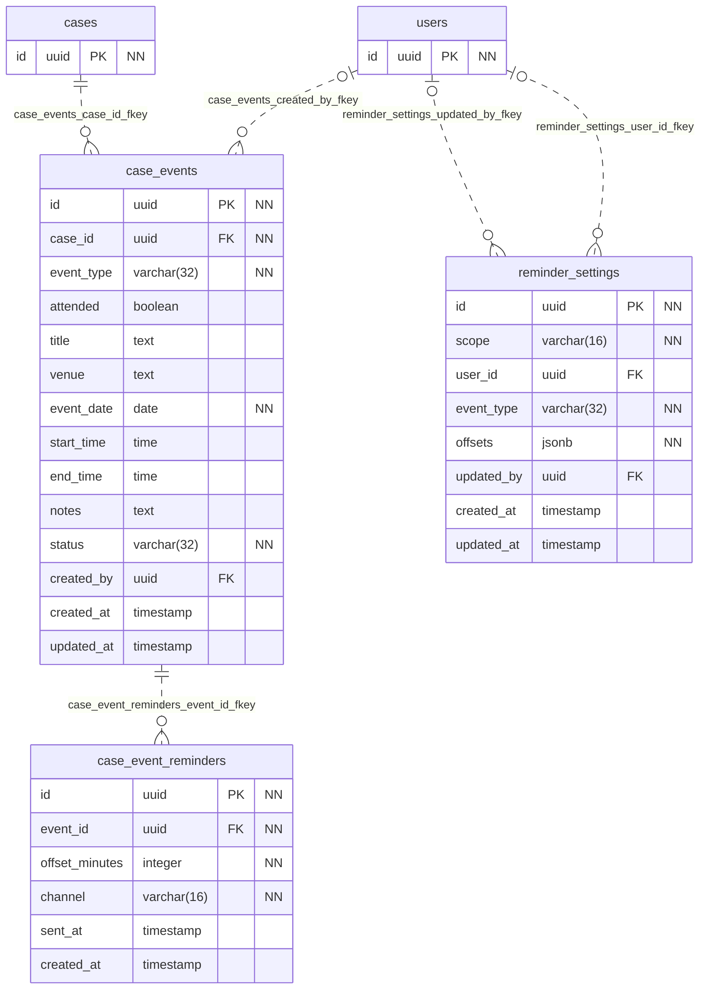
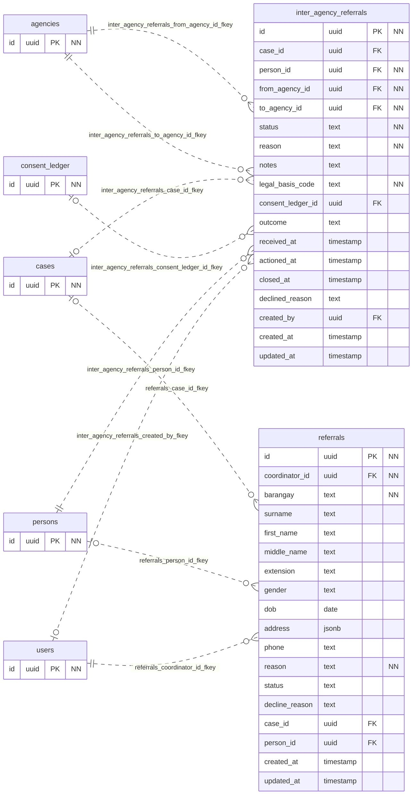
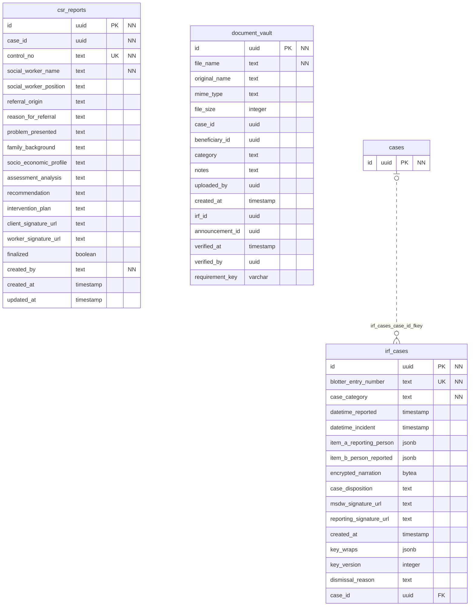
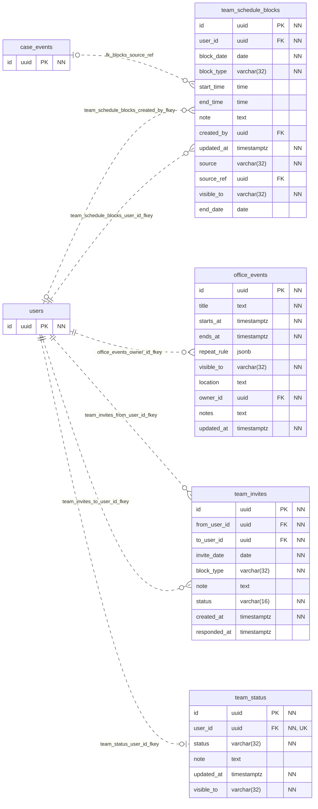
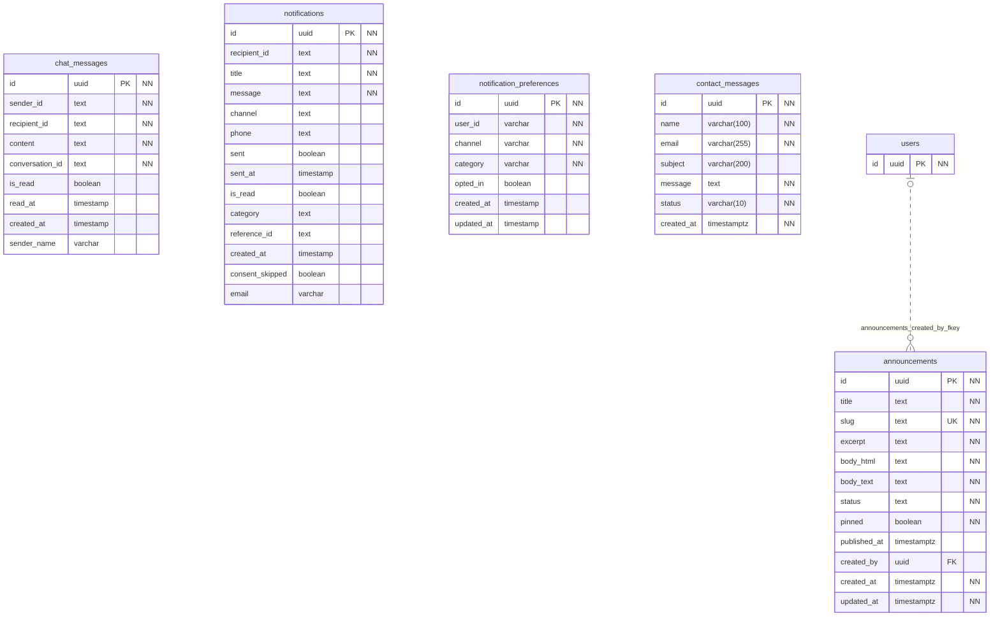

# Entity Relationship Diagram — Physical Model

The **physical** data model for Kapwa, drawn in Oracle Data Modeler
physical/relational notation — every table, every column with its PostgreSQL
datatype, nullability and key markers, and every foreign-key relationship as
created by the canonical fresh-boot bootstrap
(`kapwa-server/src/database/migrate.ts`) and the TypeORM migration chain.

Regenerate with `python3 docs/diagrams/erdgen2.py` against a fresh boot —
`DB_HOST`/`DB_PORT`/`DB_USER`/`DB_NAME` select the database and cluster
membership lives in `docs/diagrams/clusters.json`. Every number below comes
from the live catalog, not from hand-maintained prose. Re-render the printed
PDFs afterwards with `docs/diagrams/print-diagrams.mjs`.

## 1. Conventions (Oracle Data Modeler physical notation)

**Column rows** read left to right exactly as Data Modeler draws them —
column name first, datatype second:

| Element | Meaning |
|---|---|
| `name  datatype` | column name, then its PostgreSQL type |
| `PK` | primary-key column (`PRIMARY KEY (…)` on the table) |
| `UK` | column whose values are `UNIQUE` on their own (see the note below) |
| `FK` | foreign-key column (the child end of a relationship) |
| `NN` | `NOT NULL` column — Data Modeler's *Allow Nulls* set to off |

A column carries **one** key token in the key slot, in the order
PK > FK > UK. Anything a column also is goes into the trailing note, so
`user_id uuid FK "NN, UK"` on `team_status` is a `NOT NULL` unique foreign
key, drawn one-to-one. `UK` appears only when the uniqueness is a property of
that single column: a composite `UNIQUE` constrains a *combination* of
columns, so marking each participant alone would be false — those are listed
as table-level constraints in Section 5.

**Relationships** are crow's-foot lines carrying the FK constraint name:

| Line | Meaning |
|---|---|
| `\|\|..o{` | parent **mandatory**, one-to-many — the FK is `NOT NULL`, so every child has exactly one parent, and one parent may have many children |
| `o\|..o{` | parent **optional**, one-to-many — the FK is nullable, so a parent row may have no children |
| `\|\|..o\|` | one-to-one — the FK is also `UNIQUE`, so a parent row matches at most one child |
| **dashed** `..` | non-identifying: the child's primary key does *not* contain the FK |
| **solid** `--` | identifying: the FK columns are part of the child's primary key |

The token on the **left** of a line describes the parent as the child sees it
(`||` when the FK cannot be null, `o|` when it can); the token on the
**right** describes how many child rows one parent row may have.

> **Every relationship here is dashed.** All 61 tables have a
> *single-column* primary key — 60 of them named `id`, the other
> 1 (`case_control_counters`) named otherwise — so no foreign key is
> ever part of its child's primary key and 0 identifying relationships
> exist. That is a property of the schema, not a rendering omission.

> **Datatypes are shown in PostgreSQL alias form** so each is a single token:
> `character varying(255)` → `varchar(255)`, `timestamp without time zone`
> → `timestamp`, `timestamp with time zone` → `timestamptz`,
> `time without time zone` → `time`. These are the same types; only the
> spelling differs.

> **Cross-cluster parents appear as PK-only stubs.** A table that is
> referenced from another subject area is repeated in this diagram showing
> only its primary key — the way Data Modeler lets one table belong to
> several subviews at once. Each relationship is drawn exactly once, in the
> cluster that owns the *child* table.

**Printing:** every cluster diagram is rendered to its own PDF by
`docs/diagrams/print-diagrams.mjs` (output in `docs/diagrams/print/`) — run
`PUPPETEER_EXECUTABLE_PATH=/usr/bin/google-chrome-stable node docs/diagrams/print-diagrams.mjs`
after editing. The script picks the smallest page — US Letter, then A3 in
either orientation, then A2 — that keeps the text at 5pt or larger.

## 2. Scope

The model contains **61 base tables,
626 columns (230 of them `NOT NULL`),
365 constraints — 61 primary keys, 49 foreign keys, 14
unique, 11 check and 230 `NOT NULL` column constraints — and
167 indexes** from the `public` schema. Tables are grouped into
12 subject-area clusters so each diagram fits a printable page;
all 49 foreign keys are drawn on the diagram that owns their child table,
with full constraint definitions in Section 5.

## 3. Cluster Diagrams (physical)

### C1 — Identity, Users, Contacts & Agencies
*10 tables, 5 relationships, 106 columns — `TB`*

```mermaid
erDiagram
    direction TB
    "persons" {
        id uuid PK "NN"
        surname text "NN"
        first_name text "NN"
        middle_name text
        gender text
        dob date "NN"
        philsys_number text UK
        place_of_birth text
        civil_status text
        occupation text
        estimated_monthly_income numeric(12,2)
        search_vector tsvector
        created_at timestamp
        updated_at timestamp
        extension text
    }
    "person_addresses" {
        id uuid PK "NN"
        person_id uuid "NN"
        address_type varchar(50) "NN"
        barangay varchar(255)
        city varchar(255)
        province varchar(255)
        postal varchar(20)
        is_primary boolean
        raw text
        created_at timestamp
        updated_at timestamp
        street text
        region text
    }
    "person_contacts" {
        id uuid PK "NN"
        person_id uuid "NN"
        contact_type varchar(50) "NN"
        value text "NN"
        is_primary boolean
        created_at timestamp
        updated_at timestamp
    }
    "users" {
        id uuid PK "NN"
        email text UK "NN"
        password text "NN"
        role text
        first_name text
        middle_name text
        last_name text
        name_extension text
        phone text
        is_active boolean
        device_id text
        created_at timestamp
        updated_at timestamp
        person_id uuid FK
        pending_person_id uuid
        person_link_code varchar
        person_link_code_expires_at timestamp
        mfa_secret varchar
        mfa_enabled boolean
        mfa_method varchar
        email_otp_code varchar
        email_otp_expires_at timestamp
        token_version integer
        email_verified boolean
        must_change_password boolean "NN"
        agency_id uuid FK
    }
    "user_tokens" {
        id uuid PK "NN"
        user_id uuid "NN"
        purpose varchar(50) "NN"
        token text "NN"
        expires_at timestamp
        created_at timestamp
        updated_at timestamp
        meta jsonb
    }
    "user_barangay_assignments" {
        id uuid PK "NN"
        user_id uuid "NN"
        barangay varchar(255) "NN"
        is_primary boolean
        created_at timestamp
        updated_at timestamp
    }
    "beneficiary_claimants" {
        id uuid PK "NN"
        beneficiary_id uuid FK "NN"
        claimant_id uuid FK "NN"
        relationship text "NN"
        authorization_url text
        calendar_year integer
        is_primary boolean
        created_at timestamp
    }
    "beneficiary_roles" {
        id uuid PK "NN"
        person_id uuid FK "NN"
        household_id uuid
        user_id uuid
        consent_status text
        access_card_code text UK
        category text
        created_at timestamp
        updated_at timestamp
    }
    "agencies" {
        id uuid PK "NN"
        code varchar(10) UK "NN"
        name varchar(100) "NN"
        type varchar(50)
        is_active boolean
        created_at timestamp
        updated_at timestamp
    }
    "agency_contacts" {
        id uuid PK "NN"
        agency_id uuid "NN"
        contact_type varchar(50) "NN"
        value text "NN"
        is_primary boolean
        created_at timestamp
        updated_at timestamp
    }
    "agencies" o|..o{ "users" : "users_agency_id_fkey"
    "persons" o|..o{ "users" : "users_person_id_fkey"
    "persons" ||..o{ "beneficiary_claimants" : "beneficiary_claimants_beneficiary_id_fkey"
    "persons" ||..o{ "beneficiary_claimants" : "beneficiary_claimants_claimant_id_fkey"
    "persons" ||..o{ "beneficiary_roles" : "beneficiary_roles_person_id_fkey"
```

### C2 — Households & Beneficiaries
*3 tables + 1 cross-cluster stub, 3 relationships, 25 columns — `TB`*

```mermaid
erDiagram
    direction TB
    "households" {
        id uuid PK "NN"
        primary_beneficiary_id uuid FK
        barangay text
        estimated_income numeric(12,2)
        verified_by text
        access_card_code text
        verified_at timestamp
        nhts_pr_id text
    }
    "beneficiaries" {
        id uuid PK "NN"
        person_id uuid
        user_id uuid
        household_id uuid
        created_at timestamp
        updated_at timestamp
        hash text
        prev_hash text
    }
    "household_memberships" {
        id uuid PK "NN"
        person_id uuid FK "NN"
        household_id uuid FK
        relationship text "NN"
        is_primary boolean
        status text
        created_at timestamp
        updated_at timestamp
        status_reason text
    }
    "persons" {
        id uuid PK "NN"
    }
    "beneficiaries" o|..o{ "households" : "households_primary_beneficiary_id_fkey"
    "households" o|..o{ "household_memberships" : "household_memberships_household_id_fkey"
    "persons" ||..o{ "household_memberships" : "household_memberships_person_id_fkey"
```

### C3 — Cases, Compliance & Payouts
*3 tables + 3 cross-cluster stub, 6 relationships, 85 columns — `LR`*

```mermaid
erDiagram
    direction LR
    "cases" {
        id uuid PK "NN"
        control_no text UK "NN"
        beneficiary_id uuid FK
        renewal_of_case_id uuid
        service_requested text[]
        requirements_checklist jsonb
        status text
        certificate_url text
        petty_cash_voucher_url text
        assigned_worker_id uuid
        created_at timestamp
        updated_at timestamp
        problems_presented text
        social_worker_assessment text
        client_category text
        case_category text
        court_docket_number text
        crisis_mode boolean "NN"
        discernment_assessed_at date
        discernment_result text
        discernment_notes text
        protection_order_type text
        protection_order_issued_at date
        protection_order_issued_by text
        protection_order_notes text
        enrollments_not_needed boolean "NN"
        solo_parent_id_issued_date date
        solo_parent_id_number text
        solo_parent_notes text
        adoption_dvc_date date
        adoption_case_study_date date
        adoption_cdclaa_received boolean
        adoption_notes text
        nature_of_service text[]
        financial_subsidies jsonb
        amount_assistance numeric(12,2)
        mode_financial_assistance text
        source_of_fund text
        legislator_specify text
        other_assistance jsonb
        interviewed_by text
        assigned_worker_name varchar
        client_signature text
        approved_by_signature text
        approved_by_role varchar
        referral_not_needed boolean "NN"
        intervention_not_needed boolean "NN"
        self_reliance_plan text
        referrals jsonb
        follow_up_date date
        exit_notes text
        frva_score numeric(5,2)
        swdi_score numeric(5,2)
        family_dialogue_notes text
        self_reliance_level integer
        sustainability_plan text
        transition_date date
        closure_outcome varchar
        closure_date date
        follow_up_visits jsonb
        approved_by_name text
        hash text
        prev_hash text
    }
    "case_compliance_items" {
        id uuid PK "NN"
        case_id uuid FK "NN"
        household_member_id uuid FK
        compliance_type varchar
        due_date date "NN"
        month_label varchar
        met boolean
        met_at timestamp
        met_by uuid FK
        created_at timestamp
        updated_at timestamp
    }
    "case_payouts" {
        id uuid PK "NN"
        case_id uuid FK "NN"
        cycle_no varchar
        scheduled_at date "NN"
        amount numeric(12,2)
        status varchar(20)
        notified_at timestamp
        notified_by uuid FK
        remarks text
        created_at timestamp
        updated_at timestamp
    }
    "beneficiaries" {
        id uuid PK "NN"
    }
    "persons" {
        id uuid PK "NN"
    }
    "users" {
        id uuid PK "NN"
    }
    "beneficiaries" o|..o{ "cases" : "cases_beneficiary_id_fkey"
    "cases" ||..o{ "case_compliance_items" : "case_compliance_items_case_id_fkey"
    "cases" ||..o{ "case_payouts" : "case_payouts_case_id_fkey"
    "persons" o|..o{ "case_compliance_items" : "case_compliance_items_household_member_id_fkey"
    "users" o|..o{ "case_compliance_items" : "case_compliance_items_met_by_fkey"
    "users" o|..o{ "case_payouts" : "case_payouts_notified_by_fkey"
```

### C4 — Case Records, Referrals & Workflow
*7 tables + 1 cross-cluster stub, 1 relationships, 55 columns — `TB`*

```mermaid
erDiagram
    direction TB
    "case_history" {
        id uuid PK "NN"
        case_id varchar "NN"
        from_status text
        to_status text "NN"
        changed_by_role varchar
        changed_by_id varchar
        remarks varchar
        created_at timestamp "NN"
        transition_type varchar "NN"
        override_reason varchar
    }
    "case_requirements" {
        id uuid PK "NN"
        case_id uuid "NN"
        requirement_key varchar(100) "NN"
        met boolean
        created_at timestamp
        updated_at timestamp
    }
    "case_referrals" {
        id uuid PK "NN"
        case_id uuid "NN"
        agency varchar(255)
        status varchar(50)
        notes text
        created_at timestamp
        updated_at timestamp
        reason text "NN"
        contact_info text
        created_by uuid FK
    }
    "case_assistances" {
        id uuid PK "NN"
        case_id uuid "NN"
        assistance_type varchar(50) "NN"
        amount numeric(12,2)
        mode varchar(50)
        source_of_fund varchar(100)
        legislator_specify varchar(255)
        details jsonb
        approved_by_signature text
        approved_by_role varchar(50)
        created_at timestamp
        updated_at timestamp
    }
    "case_follow_up_visits" {
        id uuid PK "NN"
        case_id uuid "NN"
        visit_date date "NN"
        visit_type text "NN"
        notes text
        outcome text
        created_at timestamp
        updated_at timestamp
    }
    "case_step_locks" {
        id uuid PK "NN"
        case_id text "NN"
        step_key text "NN"
        locked_by uuid
        locked_by_name text
        locked_at timestamp
    }
    "case_control_counters" {
        year integer PK "NN"
        last_seq integer "NN"
        updated_at timestamp
    }
    "users" {
        id uuid PK "NN"
    }
    "users" o|..o{ "case_referrals" : "case_referrals_created_by_fkey"
```

### C5 — Case Events & Reminders
*3 tables + 2 cross-cluster stub, 5 relationships, 28 columns — `TB`*

```mermaid
erDiagram
    direction TB
    "case_events" {
        id uuid PK "NN"
        case_id uuid FK "NN"
        event_type varchar(32) "NN"
        attended boolean
        title text
        venue text
        event_date date "NN"
        start_time time
        end_time time
        notes text
        status varchar(32) "NN"
        created_by uuid FK
        created_at timestamp
        updated_at timestamp
    }
    "case_event_reminders" {
        id uuid PK "NN"
        event_id uuid FK "NN"
        offset_minutes integer "NN"
        channel varchar(16) "NN"
        sent_at timestamp
        created_at timestamp
    }
    "reminder_settings" {
        id uuid PK "NN"
        scope varchar(16) "NN"
        user_id uuid FK
        event_type varchar(32) "NN"
        offsets jsonb "NN"
        updated_by uuid FK
        created_at timestamp
        updated_at timestamp
    }
    "cases" {
        id uuid PK "NN"
    }
    "users" {
        id uuid PK "NN"
    }
    "case_events" ||..o{ "case_event_reminders" : "case_event_reminders_event_id_fkey"
    "cases" ||..o{ "case_events" : "case_events_case_id_fkey"
    "users" o|..o{ "case_events" : "case_events_created_by_fkey"
    "users" o|..o{ "reminder_settings" : "reminder_settings_updated_by_fkey"
    "users" o|..o{ "reminder_settings" : "reminder_settings_user_id_fkey"
```

### C6 — Programs, Enrollments & Interventions
*8 tables + 2 cross-cluster stub, 6 relationships, 62 columns — `LR`*

```mermaid
erDiagram
    direction LR
    "programs" {
        id uuid PK "NN"
        name text "NN"
        category text
        approval_workflow jsonb
        form_template jsonb
        is_active boolean
        created_at timestamp
        updated_at timestamp
        program_type text
        legal_basis text
        form_version integer
    }
    "program_fund_sources" {
        id uuid PK "NN"
        program_id uuid "NN"
        name varchar(100) "NN"
        created_at timestamp
        updated_at timestamp
    }
    "program_required_documents" {
        id uuid PK "NN"
        program_id uuid "NN"
        document_key varchar(100) "NN"
        mandatory boolean
        created_at timestamp
        updated_at timestamp
    }
    "form_version_history" {
        id uuid PK "NN"
        program_id uuid FK "NN"
        form_template jsonb "NN"
        version integer "NN"
        created_at timestamp
    }
    "program_enrollments" {
        id uuid PK "NN"
        case_id uuid FK "NN"
        program_id uuid FK "NN"
        enrolled_at date "NN"
        status text "NN"
        created_by uuid FK
        created_at timestamp
        updated_at timestamp
    }
    "program_services" {
        id uuid PK "NN"
        program_id uuid FK "NN"
        intervention_type text "NN"
        created_at timestamp
        updated_at timestamp
    }
    "case_interventions" {
        id uuid PK "NN"
        case_id text "NN"
        program_id uuid
        service_name text "NN"
        category text
        delivery_date date
        amount numeric(12,2)
        mode_of_delivery text
        fund_source text
        notes text
        delivered_by text
        created_at timestamp
        updated_at timestamp
        created_by uuid FK
        intervention_type text
        program_enrollment_id uuid
    }
    "intervention_required_documents" {
        id uuid PK "NN"
        intervention_type varchar(32) "NN"
        document_key varchar(64) "NN"
        mandatory boolean "NN"
        created_at timestamp
        updated_at timestamp
    }
    "cases" {
        id uuid PK "NN"
    }
    "users" {
        id uuid PK "NN"
    }
    "cases" ||..o{ "program_enrollments" : "program_enrollments_case_id_fkey"
    "programs" ||..o{ "form_version_history" : "form_version_history_program_id_fkey"
    "programs" ||..o{ "program_enrollments" : "program_enrollments_program_id_fkey"
    "programs" ||..o{ "program_services" : "program_services_program_id_fkey"
    "users" o|..o{ "case_interventions" : "case_interventions_created_by_fkey"
    "users" o|..o{ "program_enrollments" : "program_enrollments_created_by_fkey"
```

### C7 — Referrals
*2 tables + 5 cross-cluster stub, 9 relationships, 36 columns — `LR`*

```mermaid
erDiagram
    direction LR
    "referrals" {
        id uuid PK "NN"
        coordinator_id uuid FK "NN"
        barangay text "NN"
        surname text
        first_name text
        middle_name text
        extension text
        gender text
        dob date
        address jsonb
        phone text
        reason text "NN"
        status text
        decline_reason text
        case_id uuid FK
        person_id uuid FK
        created_at timestamp
        updated_at timestamp
    }
    "inter_agency_referrals" {
        id uuid PK "NN"
        case_id uuid FK
        person_id uuid FK "NN"
        from_agency_id uuid FK "NN"
        to_agency_id uuid FK "NN"
        status text "NN"
        reason text "NN"
        notes text
        legal_basis_code text "NN"
        consent_ledger_id uuid FK
        outcome text
        received_at timestamp
        actioned_at timestamp
        closed_at timestamp
        declined_reason text
        created_by uuid FK
        created_at timestamp
        updated_at timestamp
    }
    "agencies" {
        id uuid PK "NN"
    }
    "cases" {
        id uuid PK "NN"
    }
    "consent_ledger" {
        id uuid PK "NN"
    }
    "persons" {
        id uuid PK "NN"
    }
    "users" {
        id uuid PK "NN"
    }
    "agencies" ||..o{ "inter_agency_referrals" : "inter_agency_referrals_from_agency_id_fkey"
    "agencies" ||..o{ "inter_agency_referrals" : "inter_agency_referrals_to_agency_id_fkey"
    "cases" o|..o{ "inter_agency_referrals" : "inter_agency_referrals_case_id_fkey"
    "cases" o|..o{ "referrals" : "referrals_case_id_fkey"
    "consent_ledger" o|..o{ "inter_agency_referrals" : "inter_agency_referrals_consent_ledger_id_fkey"
    "persons" o|..o{ "referrals" : "referrals_person_id_fkey"
    "persons" ||..o{ "inter_agency_referrals" : "inter_agency_referrals_person_id_fkey"
    "users" o|..o{ "inter_agency_referrals" : "inter_agency_referrals_created_by_fkey"
    "users" ||..o{ "referrals" : "referrals_coordinator_id_fkey"
```

### C8 — Documents, Reports & IRF
*3 tables + 1 cross-cluster stub, 1 relationships, 51 columns — `TB`*

```mermaid
erDiagram
    direction TB
    "csr_reports" {
        id uuid PK "NN"
        case_id uuid "NN"
        control_no text UK "NN"
        social_worker_name text "NN"
        social_worker_position text
        referral_origin text
        reason_for_referral text
        problem_presented text
        family_background text
        socio_economic_profile text
        assessment_analysis text
        recommendation text
        intervention_plan text
        client_signature_url text
        worker_signature_url text
        finalized boolean
        created_by text "NN"
        created_at timestamp
        updated_at timestamp
    }
    "document_vault" {
        id uuid PK "NN"
        file_name text "NN"
        original_name text
        mime_type text
        file_size integer
        case_id uuid
        beneficiary_id uuid
        category text
        notes text
        uploaded_by uuid
        created_at timestamp
        irf_id uuid
        announcement_id uuid
        verified_at timestamp
        verified_by uuid
        requirement_key varchar
    }
    "irf_cases" {
        id uuid PK "NN"
        blotter_entry_number text UK "NN"
        case_category text "NN"
        datetime_reported timestamp
        datetime_incident timestamp
        item_a_reporting_person jsonb
        item_b_person_reported jsonb
        encrypted_narration bytea
        case_disposition text
        msdw_signature_url text
        reporting_signature_url text
        created_at timestamp
        key_wraps jsonb
        key_version integer
        dismissal_reason text
        case_id uuid FK
    }
    "cases" {
        id uuid PK "NN"
    }
    "cases" o|..o{ "irf_cases" : "irf_cases_case_id_fkey"
```

### C9 — Access Cards & Number Sequences
*3 tables + 1 cross-cluster stub, 1 relationships, 18 columns — `TB`*

```mermaid
erDiagram
    direction TB
    "access_card_services" {
        id uuid PK "NN"
        access_card_code text
        service_date date "NN"
        service_rendered text "NN"
        cost numeric(12,2)
        agency text
        agency_id uuid
        worker_name_sign text
        intervention_id uuid
        category varchar
        logged_by uuid FK
        source_barangay text
    }
    "access_card_seq" {
        id integer PK "NN"
        year integer "NN"
        created_at timestamp
    }
    "irf_blotter_seq" {
        id integer PK "NN"
        year integer "NN"
        created_at timestamp
    }
    "users" {
        id uuid PK "NN"
    }
    "users" o|..o{ "access_card_services" : "access_card_services_logged_by_fkey"
```

### C10 — Team Workspace
*4 tables + 2 cross-cluster stub, 7 relationships, 38 columns — `LR`*

```mermaid
erDiagram
    direction LR
    "team_status" {
        id uuid PK "NN"
        user_id uuid FK "NN, UK"
        status varchar(32) "NN"
        note text
        updated_at timestamptz "NN"
        visible_to varchar(32) "NN"
    }
    "team_invites" {
        id uuid PK "NN"
        from_user_id uuid FK "NN"
        to_user_id uuid FK "NN"
        invite_date date "NN"
        block_type varchar(32) "NN"
        note text
        status varchar(16) "NN"
        created_at timestamptz "NN"
        responded_at timestamptz
    }
    "team_schedule_blocks" {
        id uuid PK "NN"
        user_id uuid FK "NN"
        block_date date "NN"
        block_type varchar(32) "NN"
        start_time time
        end_time time
        note text
        created_by uuid FK
        updated_at timestamptz "NN"
        source varchar(32) "NN"
        source_ref uuid FK
        visible_to varchar(32) "NN"
        end_date date
    }
    "office_events" {
        id uuid PK "NN"
        title text "NN"
        starts_at timestamptz "NN"
        ends_at timestamptz "NN"
        repeat_rule jsonb
        visible_to varchar(32) "NN"
        location text
        owner_id uuid FK "NN"
        notes text
        updated_at timestamptz "NN"
    }
    "case_events" {
        id uuid PK "NN"
    }
    "users" {
        id uuid PK "NN"
    }
    "case_events" o|..o{ "team_schedule_blocks" : "fk_blocks_source_ref"
    "users" o|..o{ "team_schedule_blocks" : "team_schedule_blocks_created_by_fkey"
    "users" ||..o{ "office_events" : "office_events_owner_id_fkey"
    "users" ||..o{ "team_invites" : "team_invites_from_user_id_fkey"
    "users" ||..o{ "team_invites" : "team_invites_to_user_id_fkey"
    "users" ||..o{ "team_schedule_blocks" : "team_schedule_blocks_user_id_fkey"
    "users" ||..o| "team_status" : "team_status_user_id_fkey"
```

### C11 — Messaging, Notifications & Content
*5 tables + 1 cross-cluster stub, 1 relationships, 49 columns — `TB`*

```mermaid
erDiagram
    direction TB
    "chat_messages" {
        id uuid PK "NN"
        sender_id text "NN"
        recipient_id text "NN"
        content text "NN"
        conversation_id text "NN"
        is_read boolean
        read_at timestamp
        created_at timestamp
        sender_name varchar
    }
    "notifications" {
        id uuid PK "NN"
        recipient_id text "NN"
        title text "NN"
        message text "NN"
        channel text
        phone text
        sent boolean
        sent_at timestamp
        is_read boolean
        category text
        reference_id text
        created_at timestamp
        consent_skipped boolean
        email varchar
    }
    "notification_preferences" {
        id uuid PK "NN"
        user_id varchar "NN"
        channel varchar "NN"
        category varchar "NN"
        opted_in boolean
        created_at timestamp
        updated_at timestamp
    }
    "contact_messages" {
        id uuid PK "NN"
        name varchar(100) "NN"
        email varchar(255) "NN"
        subject varchar(200)
        message text "NN"
        status varchar(10) "NN"
        created_at timestamptz "NN"
    }
    "announcements" {
        id uuid PK "NN"
        title text "NN"
        slug text UK "NN"
        excerpt text "NN"
        body_html text "NN"
        body_text text "NN"
        status text "NN"
        pinned boolean "NN"
        published_at timestamptz
        created_by uuid FK
        created_at timestamptz "NN"
        updated_at timestamptz "NN"
    }
    "users" {
        id uuid PK "NN"
    }
    "users" o|..o{ "announcements" : "announcements_created_by_fkey"
```

### C12 — Sync, Analytics, Consent & Platform
*10 tables + 2 cross-cluster stub, 4 relationships, 73 columns — `LR`*

```mermaid
erDiagram
    direction LR
    "sync_queue" {
        id uuid PK "NN"
        device_id text "NN"
        table_name text "NN"
        record_id text "NN"
        operation text "NN"
        payload jsonb
        client_updated_at timestamp
        status text
        idempotency_key text
        conflict_reason text
        resolved_at timestamp
        created_at timestamp
    }
    "version_vectors" {
        id uuid PK "NN"
        device_id text "NN"
        table_name text "NN"
        local_version integer
        server_version integer
        last_synced_at timestamp
        created_at timestamp
        updated_at timestamp
    }
    "idempotency_keys" {
        id uuid PK "NN"
        key text UK "NN"
        result jsonb "NN"
        created_at timestamp
    }
    "consent_ledger" {
        id uuid PK "NN"
        beneficiary_id uuid
        purpose text
        channel text
        status text
        granted_at timestamp
        revoked_at timestamp
        revoked_reason text
        hash text
        prev_hash text
    }
    "audit_log" {
        id uuid PK "NN"
        action text "NN"
        reference_id text
        user_id text
        details jsonb
        created_at timestamp
    }
    "otp_codes" {
        id uuid PK "NN"
        phone text "NN"
        code text "NN"
        verified boolean
        expires_at timestamp "NN"
        created_at timestamp
    }
    "analysis_runs" {
        id uuid PK "NN"
        model varchar "NN"
        status varchar(20) "NN"
        params jsonb
        metrics jsonb
        started_at timestamptz
        completed_at timestamptz
        created_by uuid FK
        error text
        created_at timestamp
        updated_at timestamp
    }
    "analysis_run_clusters" {
        id uuid PK "NN"
        run_id uuid FK "NN"
        cluster_index integer "NN"
        size integer "NN"
        centroid jsonb
        profile jsonb
        created_at timestamp
    }
    "analysis_run_members" {
        id uuid PK "NN"
        run_id uuid FK "NN"
        household_id uuid FK "NN"
        cluster_index integer "NN"
        distance numeric(12,6)
        created_at timestamp
    }
    "migrations" {
        id integer PK "NN"
        timestamp bigint "NN"
        name varchar(255) "NN"
    }
    "households" {
        id uuid PK "NN"
    }
    "users" {
        id uuid PK "NN"
    }
    "analysis_runs" ||..o{ "analysis_run_clusters" : "analysis_run_clusters_run_id_fkey"
    "analysis_runs" ||..o{ "analysis_run_members" : "analysis_run_members_run_id_fkey"
    "households" ||..o{ "analysis_run_members" : "analysis_run_members_household_id_fkey"
    "users" o|..o{ "analysis_runs" : "analysis_runs_created_by_fkey"
```

## 4. Full Relationship Inventory (all 49 foreign keys)
| FK Constraint | Child table (columns) | Parent table (columns) | Type | Nullable |
|---|---|---|---|---|
| `access_card_services_logged_by_fkey` | `access_card_services(logged_by)` | `users(id)` | non-identifying | yes |
| `analysis_run_clusters_run_id_fkey` | `analysis_run_clusters(run_id)` | `analysis_runs(id)` | non-identifying | no |
| `analysis_run_members_household_id_fkey` | `analysis_run_members(household_id)` | `households(id)` | non-identifying | no |
| `analysis_run_members_run_id_fkey` | `analysis_run_members(run_id)` | `analysis_runs(id)` | non-identifying | no |
| `analysis_runs_created_by_fkey` | `analysis_runs(created_by)` | `users(id)` | non-identifying | yes |
| `announcements_created_by_fkey` | `announcements(created_by)` | `users(id)` | non-identifying | yes |
| `beneficiary_claimants_beneficiary_id_fkey` | `beneficiary_claimants(beneficiary_id)` | `persons(id)` | non-identifying | no |
| `beneficiary_claimants_claimant_id_fkey` | `beneficiary_claimants(claimant_id)` | `persons(id)` | non-identifying | no |
| `beneficiary_roles_person_id_fkey` | `beneficiary_roles(person_id)` | `persons(id)` | non-identifying | no |
| `case_compliance_items_case_id_fkey` | `case_compliance_items(case_id)` | `cases(id)` | non-identifying | no |
| `case_compliance_items_household_member_id_fkey` | `case_compliance_items(household_member_id)` | `persons(id)` | non-identifying | yes |
| `case_compliance_items_met_by_fkey` | `case_compliance_items(met_by)` | `users(id)` | non-identifying | yes |
| `case_event_reminders_event_id_fkey` | `case_event_reminders(event_id)` | `case_events(id)` | non-identifying | no |
| `case_events_case_id_fkey` | `case_events(case_id)` | `cases(id)` | non-identifying | no |
| `case_events_created_by_fkey` | `case_events(created_by)` | `users(id)` | non-identifying | yes |
| `case_interventions_created_by_fkey` | `case_interventions(created_by)` | `users(id)` | non-identifying | yes |
| `case_payouts_case_id_fkey` | `case_payouts(case_id)` | `cases(id)` | non-identifying | no |
| `case_payouts_notified_by_fkey` | `case_payouts(notified_by)` | `users(id)` | non-identifying | yes |
| `case_referrals_created_by_fkey` | `case_referrals(created_by)` | `users(id)` | non-identifying | yes |
| `cases_beneficiary_id_fkey` | `cases(beneficiary_id)` | `beneficiaries(id)` | non-identifying | yes |
| `fk_blocks_source_ref` | `team_schedule_blocks(source_ref)` | `case_events(id)` | non-identifying | yes |
| `form_version_history_program_id_fkey` | `form_version_history(program_id)` | `programs(id)` | non-identifying | no |
| `household_memberships_household_id_fkey` | `household_memberships(household_id)` | `households(id)` | non-identifying | yes |
| `household_memberships_person_id_fkey` | `household_memberships(person_id)` | `persons(id)` | non-identifying | no |
| `households_primary_beneficiary_id_fkey` | `households(primary_beneficiary_id)` | `beneficiaries(id)` | non-identifying | yes |
| `inter_agency_referrals_case_id_fkey` | `inter_agency_referrals(case_id)` | `cases(id)` | non-identifying | yes |
| `inter_agency_referrals_consent_ledger_id_fkey` | `inter_agency_referrals(consent_ledger_id)` | `consent_ledger(id)` | non-identifying | yes |
| `inter_agency_referrals_created_by_fkey` | `inter_agency_referrals(created_by)` | `users(id)` | non-identifying | yes |
| `inter_agency_referrals_from_agency_id_fkey` | `inter_agency_referrals(from_agency_id)` | `agencies(id)` | non-identifying | no |
| `inter_agency_referrals_person_id_fkey` | `inter_agency_referrals(person_id)` | `persons(id)` | non-identifying | no |
| `inter_agency_referrals_to_agency_id_fkey` | `inter_agency_referrals(to_agency_id)` | `agencies(id)` | non-identifying | no |
| `irf_cases_case_id_fkey` | `irf_cases(case_id)` | `cases(id)` | non-identifying | yes |
| `office_events_owner_id_fkey` | `office_events(owner_id)` | `users(id)` | non-identifying | no |
| `program_enrollments_case_id_fkey` | `program_enrollments(case_id)` | `cases(id)` | non-identifying | no |
| `program_enrollments_created_by_fkey` | `program_enrollments(created_by)` | `users(id)` | non-identifying | yes |
| `program_enrollments_program_id_fkey` | `program_enrollments(program_id)` | `programs(id)` | non-identifying | no |
| `program_services_program_id_fkey` | `program_services(program_id)` | `programs(id)` | non-identifying | no |
| `referrals_case_id_fkey` | `referrals(case_id)` | `cases(id)` | non-identifying | yes |
| `referrals_coordinator_id_fkey` | `referrals(coordinator_id)` | `users(id)` | non-identifying | no |
| `referrals_person_id_fkey` | `referrals(person_id)` | `persons(id)` | non-identifying | yes |
| `reminder_settings_updated_by_fkey` | `reminder_settings(updated_by)` | `users(id)` | non-identifying | yes |
| `reminder_settings_user_id_fkey` | `reminder_settings(user_id)` | `users(id)` | non-identifying | yes |
| `team_invites_from_user_id_fkey` | `team_invites(from_user_id)` | `users(id)` | non-identifying | no |
| `team_invites_to_user_id_fkey` | `team_invites(to_user_id)` | `users(id)` | non-identifying | no |
| `team_schedule_blocks_created_by_fkey` | `team_schedule_blocks(created_by)` | `users(id)` | non-identifying | yes |
| `team_schedule_blocks_user_id_fkey` | `team_schedule_blocks(user_id)` | `users(id)` | non-identifying | no |
| `team_status_user_id_fkey` | `team_status(user_id)` | `users(id)` | non-identifying | no |
| `users_agency_id_fkey` | `users(agency_id)` | `agencies(id)` | non-identifying | yes |
| `users_person_id_fkey` | `users(person_id)` | `persons(id)` | non-identifying | yes |

## 5. Constraint Inventory (all 365 constraints)
| Table | Constraint | Type | Definition |
|---|---|---|---|
| `access_card_seq` | `access_card_seq_pkey` | PRIMARY KEY | `PRIMARY KEY (id)` |
| `access_card_services` | `access_card_services_pkey` | PRIMARY KEY | `PRIMARY KEY (id)` |
| `access_card_services` | `access_card_services_logged_by_fkey` | FOREIGN KEY | `FOREIGN KEY (logged_by) REFERENCES users(id)` |
| `agencies` | `agencies_pkey` | PRIMARY KEY | `PRIMARY KEY (id)` |
| `agencies` | `agencies_code_key` | UNIQUE | `UNIQUE (code)` |
| `agency_contacts` | `agency_contacts_pkey` | PRIMARY KEY | `PRIMARY KEY (id)` |
| `analysis_run_clusters` | `analysis_run_clusters_pkey` | PRIMARY KEY | `PRIMARY KEY (id)` |
| `analysis_run_clusters` | `analysis_run_clusters_run_id_fkey` | FOREIGN KEY | `FOREIGN KEY (run_id) REFERENCES analysis_runs(id) ON DELETE CASCADE` |
| `analysis_run_members` | `analysis_run_members_pkey` | PRIMARY KEY | `PRIMARY KEY (id)` |
| `analysis_run_members` | `analysis_run_members_run_id_fkey` | FOREIGN KEY | `FOREIGN KEY (run_id) REFERENCES analysis_runs(id) ON DELETE CASCADE` |
| `analysis_run_members` | `analysis_run_members_household_id_fkey` | FOREIGN KEY | `FOREIGN KEY (household_id) REFERENCES households(id)` |
| `analysis_runs` | `analysis_runs_status_check` | CHECK | `CHECK (((status)::text = ANY ((ARRAY['completed'::character varying, 'failed'::character varying])::text[])))` |
| `analysis_runs` | `analysis_runs_pkey` | PRIMARY KEY | `PRIMARY KEY (id)` |
| `analysis_runs` | `analysis_runs_created_by_fkey` | FOREIGN KEY | `FOREIGN KEY (created_by) REFERENCES users(id)` |
| `announcements` | `announcements_status_check` | CHECK | `CHECK ((status = ANY (ARRAY['draft'::text, 'published'::text])))` |
| `announcements` | `announcements_pkey` | PRIMARY KEY | `PRIMARY KEY (id)` |
| `announcements` | `announcements_slug_key` | UNIQUE | `UNIQUE (slug)` |
| `announcements` | `announcements_created_by_fkey` | FOREIGN KEY | `FOREIGN KEY (created_by) REFERENCES users(id)` |
| `audit_log` | `audit_log_pkey` | PRIMARY KEY | `PRIMARY KEY (id)` |
| `beneficiaries` | `beneficiaries_pkey` | PRIMARY KEY | `PRIMARY KEY (id)` |
| `beneficiary_claimants` | `beneficiary_claimants_pkey` | PRIMARY KEY | `PRIMARY KEY (id)` |
| `beneficiary_claimants` | `beneficiary_claimants_beneficiary_id_fkey` | FOREIGN KEY | `FOREIGN KEY (beneficiary_id) REFERENCES persons(id)` |
| `beneficiary_claimants` | `beneficiary_claimants_claimant_id_fkey` | FOREIGN KEY | `FOREIGN KEY (claimant_id) REFERENCES persons(id)` |
| `beneficiary_roles` | `beneficiary_roles_pkey` | PRIMARY KEY | `PRIMARY KEY (id)` |
| `beneficiary_roles` | `beneficiary_roles_access_card_code_key` | UNIQUE | `UNIQUE (access_card_code)` |
| `beneficiary_roles` | `beneficiary_roles_person_id_fkey` | FOREIGN KEY | `FOREIGN KEY (person_id) REFERENCES persons(id)` |
| `case_assistances` | `case_assistances_pkey` | PRIMARY KEY | `PRIMARY KEY (id)` |
| `case_compliance_items` | `case_compliance_items_met_by_fkey` | FOREIGN KEY | `FOREIGN KEY (met_by) REFERENCES users(id)` |
| `case_compliance_items` | `case_compliance_items_compliance_type_check` | CHECK | `CHECK (((compliance_type)::text = ANY ((ARRAY['school_attendance'::character varying, 'health_checkup'::character varying, 'fds'::character varying])::text[])))` |
| `case_compliance_items` | `case_compliance_items_pkey` | PRIMARY KEY | `PRIMARY KEY (id)` |
| `case_compliance_items` | `case_compliance_items_case_id_fkey` | FOREIGN KEY | `FOREIGN KEY (case_id) REFERENCES cases(id)` |
| `case_compliance_items` | `case_compliance_items_household_member_id_fkey` | FOREIGN KEY | `FOREIGN KEY (household_member_id) REFERENCES persons(id)` |
| `case_control_counters` | `case_control_counters_pkey` | PRIMARY KEY | `PRIMARY KEY (year)` |
| `case_event_reminders` | `case_event_reminders_pkey` | PRIMARY KEY | `PRIMARY KEY (id)` |
| `case_event_reminders` | `case_event_reminders_event_id_fkey` | FOREIGN KEY | `FOREIGN KEY (event_id) REFERENCES case_events(id) ON DELETE CASCADE` |
| `case_events` | `case_events_pkey` | PRIMARY KEY | `PRIMARY KEY (id)` |
| `case_events` | `case_events_case_id_fkey` | FOREIGN KEY | `FOREIGN KEY (case_id) REFERENCES cases(id) ON DELETE CASCADE` |
| `case_events` | `case_events_created_by_fkey` | FOREIGN KEY | `FOREIGN KEY (created_by) REFERENCES users(id)` |
| `case_follow_up_visits` | `case_follow_up_visits_pkey` | PRIMARY KEY | `PRIMARY KEY (id)` |
| `case_history` | `PK_case_history` | PRIMARY KEY | `PRIMARY KEY (id)` |
| `case_interventions` | `case_interventions_pkey` | PRIMARY KEY | `PRIMARY KEY (id)` |
| `case_interventions` | `case_interventions_created_by_fkey` | FOREIGN KEY | `FOREIGN KEY (created_by) REFERENCES users(id)` |
| `case_payouts` | `case_payouts_status_check` | CHECK | `CHECK (((status)::text = ANY ((ARRAY['scheduled'::character varying, 'completed'::character varying, 'missed'::character varying, 'cancelled'::character varying])::text[])))` |
| `case_payouts` | `case_payouts_pkey` | PRIMARY KEY | `PRIMARY KEY (id)` |
| `case_payouts` | `case_payouts_case_id_fkey` | FOREIGN KEY | `FOREIGN KEY (case_id) REFERENCES cases(id)` |
| `case_payouts` | `case_payouts_notified_by_fkey` | FOREIGN KEY | `FOREIGN KEY (notified_by) REFERENCES users(id)` |
| `case_referrals` | `case_referrals_pkey` | PRIMARY KEY | `PRIMARY KEY (id)` |
| `case_referrals` | `case_referrals_created_by_fkey` | FOREIGN KEY | `FOREIGN KEY (created_by) REFERENCES users(id)` |
| `case_requirements` | `case_requirements_pkey` | PRIMARY KEY | `PRIMARY KEY (id)` |
| `case_step_locks` | `case_step_locks_pkey` | PRIMARY KEY | `PRIMARY KEY (id)` |
| `case_step_locks` | `uq_case_step_locks_case_step_key` | UNIQUE | `UNIQUE (case_id, step_key)` |
| `cases` | `cases_pkey` | PRIMARY KEY | `PRIMARY KEY (id)` |
| `cases` | `cases_control_no_key` | UNIQUE | `UNIQUE (control_no)` |
| `cases` | `cases_beneficiary_id_fkey` | FOREIGN KEY | `FOREIGN KEY (beneficiary_id) REFERENCES beneficiaries(id)` |
| `cases` | `cases_status_check` | CHECK | `CHECK ((status = ANY (ARRAY['enrolled'::text, 'assessed'::text, 'in_review'::text, 'active'::text, 'transitioning'::text, 'closed'::text, 'aftercare'::text])))` |
| `chat_messages` | `chat_messages_pkey` | PRIMARY KEY | `PRIMARY KEY (id)` |
| `consent_ledger` | `consent_ledger_pkey` | PRIMARY KEY | `PRIMARY KEY (id)` |
| `contact_messages` | `contact_messages_pkey` | PRIMARY KEY | `PRIMARY KEY (id)` |
| `csr_reports` | `csr_reports_pkey` | PRIMARY KEY | `PRIMARY KEY (id)` |
| `csr_reports` | `csr_reports_control_no_key` | UNIQUE | `UNIQUE (control_no)` |
| `document_vault` | `document_vault_pkey` | PRIMARY KEY | `PRIMARY KEY (id)` |
| `form_version_history` | `form_version_history_pkey` | PRIMARY KEY | `PRIMARY KEY (id)` |
| `form_version_history` | `form_version_history_program_id_fkey` | FOREIGN KEY | `FOREIGN KEY (program_id) REFERENCES programs(id) ON DELETE CASCADE` |
| `household_memberships` | `household_memberships_pkey` | PRIMARY KEY | `PRIMARY KEY (id)` |
| `household_memberships` | `household_memberships_person_id_fkey` | FOREIGN KEY | `FOREIGN KEY (person_id) REFERENCES persons(id)` |
| `household_memberships` | `household_memberships_household_id_fkey` | FOREIGN KEY | `FOREIGN KEY (household_id) REFERENCES households(id)` |
| `households` | `households_pkey` | PRIMARY KEY | `PRIMARY KEY (id)` |
| `households` | `households_primary_beneficiary_id_fkey` | FOREIGN KEY | `FOREIGN KEY (primary_beneficiary_id) REFERENCES beneficiaries(id)` |
| `idempotency_keys` | `idempotency_keys_pkey` | PRIMARY KEY | `PRIMARY KEY (id)` |
| `idempotency_keys` | `idempotency_keys_key_key` | UNIQUE | `UNIQUE (key)` |
| `inter_agency_referrals` | `inter_agency_referrals_status_check` | CHECK | `CHECK ((status = ANY (ARRAY['referred'::text, 'received'::text, 'actioned'::text, 'closed'::text, 'declined'::text])))` |
| `inter_agency_referrals` | `inter_agency_referrals_pkey` | PRIMARY KEY | `PRIMARY KEY (id)` |
| `inter_agency_referrals` | `inter_agency_referrals_case_id_fkey` | FOREIGN KEY | `FOREIGN KEY (case_id) REFERENCES cases(id)` |
| `inter_agency_referrals` | `inter_agency_referrals_person_id_fkey` | FOREIGN KEY | `FOREIGN KEY (person_id) REFERENCES persons(id)` |
| `inter_agency_referrals` | `inter_agency_referrals_from_agency_id_fkey` | FOREIGN KEY | `FOREIGN KEY (from_agency_id) REFERENCES agencies(id)` |
| `inter_agency_referrals` | `inter_agency_referrals_to_agency_id_fkey` | FOREIGN KEY | `FOREIGN KEY (to_agency_id) REFERENCES agencies(id)` |
| `inter_agency_referrals` | `inter_agency_referrals_consent_ledger_id_fkey` | FOREIGN KEY | `FOREIGN KEY (consent_ledger_id) REFERENCES consent_ledger(id)` |
| `inter_agency_referrals` | `inter_agency_referrals_created_by_fkey` | FOREIGN KEY | `FOREIGN KEY (created_by) REFERENCES users(id)` |
| `intervention_required_documents` | `intervention_required_documents_pkey` | PRIMARY KEY | `PRIMARY KEY (id)` |
| `irf_blotter_seq` | `irf_blotter_seq_pkey` | PRIMARY KEY | `PRIMARY KEY (id)` |
| `irf_cases` | `irf_cases_pkey` | PRIMARY KEY | `PRIMARY KEY (id)` |
| `irf_cases` | `irf_cases_blotter_entry_number_key` | UNIQUE | `UNIQUE (blotter_entry_number)` |
| `irf_cases` | `irf_cases_case_id_fkey` | FOREIGN KEY | `FOREIGN KEY (case_id) REFERENCES cases(id)` |
| `migrations` | `migrations_pkey` | PRIMARY KEY | `PRIMARY KEY (id)` |
| `notification_preferences` | `notification_preferences_pkey` | PRIMARY KEY | `PRIMARY KEY (id)` |
| `notifications` | `notifications_pkey` | PRIMARY KEY | `PRIMARY KEY (id)` |
| `office_events` | `office_events_pkey` | PRIMARY KEY | `PRIMARY KEY (id)` |
| `office_events` | `office_events_owner_id_fkey` | FOREIGN KEY | `FOREIGN KEY (owner_id) REFERENCES users(id)` |
| `otp_codes` | `otp_codes_pkey` | PRIMARY KEY | `PRIMARY KEY (id)` |
| `person_addresses` | `person_addresses_pkey` | PRIMARY KEY | `PRIMARY KEY (id)` |
| `person_contacts` | `person_contacts_pkey` | PRIMARY KEY | `PRIMARY KEY (id)` |
| `persons` | `persons_gender_check` | CHECK | `CHECK ((gender = ANY (ARRAY['Male'::text, 'Female'::text])))` |
| `persons` | `persons_pkey` | PRIMARY KEY | `PRIMARY KEY (id)` |
| `persons` | `persons_philsys_number_key` | UNIQUE | `UNIQUE (philsys_number)` |
| `program_enrollments` | `program_enrollments_pkey` | PRIMARY KEY | `PRIMARY KEY (id)` |
| `program_enrollments` | `uq_program_enrollments_case_program` | UNIQUE | `UNIQUE (case_id, program_id)` |
| `program_enrollments` | `program_enrollments_case_id_fkey` | FOREIGN KEY | `FOREIGN KEY (case_id) REFERENCES cases(id)` |
| `program_enrollments` | `program_enrollments_program_id_fkey` | FOREIGN KEY | `FOREIGN KEY (program_id) REFERENCES programs(id)` |
| `program_enrollments` | `program_enrollments_created_by_fkey` | FOREIGN KEY | `FOREIGN KEY (created_by) REFERENCES users(id)` |
| `program_fund_sources` | `program_fund_sources_pkey` | PRIMARY KEY | `PRIMARY KEY (id)` |
| `program_required_documents` | `program_required_documents_pkey` | PRIMARY KEY | `PRIMARY KEY (id)` |
| `program_services` | `program_services_pkey` | PRIMARY KEY | `PRIMARY KEY (id)` |
| `program_services` | `uq_program_services_program_type` | UNIQUE | `UNIQUE (program_id, intervention_type)` |
| `program_services` | `program_services_program_id_fkey` | FOREIGN KEY | `FOREIGN KEY (program_id) REFERENCES programs(id)` |
| `programs` | `programs_pkey` | PRIMARY KEY | `PRIMARY KEY (id)` |
| `referrals` | `referrals_status_check` | CHECK | `CHECK ((status = ANY (ARRAY['pending'::text, 'accepted'::text, 'declined'::text])))` |
| `referrals` | `referrals_pkey` | PRIMARY KEY | `PRIMARY KEY (id)` |
| `referrals` | `referrals_coordinator_id_fkey` | FOREIGN KEY | `FOREIGN KEY (coordinator_id) REFERENCES users(id)` |
| `referrals` | `referrals_case_id_fkey` | FOREIGN KEY | `FOREIGN KEY (case_id) REFERENCES cases(id)` |
| `referrals` | `referrals_person_id_fkey` | FOREIGN KEY | `FOREIGN KEY (person_id) REFERENCES persons(id)` |
| `reminder_settings` | `reminder_settings_scope_check` | CHECK | `CHECK (((scope)::text = ANY ((ARRAY['system'::character varying, 'worker'::character varying])::text[])))` |
| `reminder_settings` | `reminder_settings_check` | CHECK | `CHECK (((((scope)::text = 'system'::text) AND (user_id IS NULL)) OR (((scope)::text = 'worker'::text) AND (user_id IS NOT NULL))))` |
| `reminder_settings` | `reminder_settings_pkey` | PRIMARY KEY | `PRIMARY KEY (id)` |
| `reminder_settings` | `reminder_settings_user_id_fkey` | FOREIGN KEY | `FOREIGN KEY (user_id) REFERENCES users(id)` |
| `reminder_settings` | `reminder_settings_updated_by_fkey` | FOREIGN KEY | `FOREIGN KEY (updated_by) REFERENCES users(id)` |
| `sync_queue` | `sync_queue_pkey` | PRIMARY KEY | `PRIMARY KEY (id)` |
| `team_invites` | `team_invites_pkey` | PRIMARY KEY | `PRIMARY KEY (id)` |
| `team_invites` | `team_invites_from_user_id_fkey` | FOREIGN KEY | `FOREIGN KEY (from_user_id) REFERENCES users(id)` |
| `team_invites` | `team_invites_to_user_id_fkey` | FOREIGN KEY | `FOREIGN KEY (to_user_id) REFERENCES users(id)` |
| `team_schedule_blocks` | `team_schedule_blocks_pkey` | PRIMARY KEY | `PRIMARY KEY (id)` |
| `team_schedule_blocks` | `team_schedule_blocks_user_id_fkey` | FOREIGN KEY | `FOREIGN KEY (user_id) REFERENCES users(id)` |
| `team_schedule_blocks` | `team_schedule_blocks_created_by_fkey` | FOREIGN KEY | `FOREIGN KEY (created_by) REFERENCES users(id)` |
| `team_schedule_blocks` | `fk_blocks_source_ref` | FOREIGN KEY | `FOREIGN KEY (source_ref) REFERENCES case_events(id) ON DELETE SET NULL` |
| `team_schedule_blocks` | `chk_team_schedule_blocks_end_date` | CHECK | `CHECK (((end_date IS NULL) OR (end_date >= block_date)))` |
| `team_status` | `team_status_pkey` | PRIMARY KEY | `PRIMARY KEY (id)` |
| `team_status` | `team_status_user_id_key` | UNIQUE | `UNIQUE (user_id)` |
| `team_status` | `team_status_user_id_fkey` | FOREIGN KEY | `FOREIGN KEY (user_id) REFERENCES users(id)` |
| `user_barangay_assignments` | `user_barangay_assignments_pkey` | PRIMARY KEY | `PRIMARY KEY (id)` |
| `user_tokens` | `user_tokens_pkey` | PRIMARY KEY | `PRIMARY KEY (id)` |
| `users` | `users_pkey` | PRIMARY KEY | `PRIMARY KEY (id)` |
| `users` | `users_email_key` | UNIQUE | `UNIQUE (email)` |
| `users` | `users_person_id_fkey` | FOREIGN KEY | `FOREIGN KEY (person_id) REFERENCES persons(id)` |
| `users` | `users_agency_id_fkey` | FOREIGN KEY | `FOREIGN KEY (agency_id) REFERENCES agencies(id)` |
| `version_vectors` | `version_vectors_pkey` | PRIMARY KEY | `PRIMARY KEY (id)` |
| `version_vectors` | `version_vectors_device_id_table_name_key` | UNIQUE | `UNIQUE (device_id, table_name)` |

*Plus the 230 column-level `NOT NULL` constraints, listed per column in Section 3 — 135 in the table above plus 230 column-level = 365 in all.*

## 6. Entity Cross-References

| Table(s) | Location |
|---|---|
| persons | `kapwa-server/src/beneficiaries/person.entity.ts` |
| person_addresses / person_contacts | `kapwa-server/src/beneficiaries/person-address.entity.ts / person-contact.entity.ts` |
| beneficiaries | `kapwa-server/src/beneficiaries/beneficiary.entity.ts` |
| households, household_memberships | `kapwa-server/src/beneficiaries/household.entity.ts, household-membership.entity.ts` |
| beneficiary_claimants | `kapwa-server/src/beneficiaries/beneficiary-claimant.entity.ts` |
| beneficiary_roles | `kapwa-server/src/beneficiaries/beneficiary-role.entity.ts` |
| consent_ledger | `kapwa-server/src/beneficiaries/consent-ledger.entity.ts` |
| users, user_tokens | `kapwa-server/src/auth/user.entity.ts` |
| cases | `kapwa-server/src/cases/case.entity.ts` |
| case_history | `kapwa-server/src/cases/case-history.entity.ts` |
| case_requirements | `kapwa-server/src/cases/case-requirement.entity.ts` |
| case_referrals | `kapwa-server/src/cases/case-referral.entity.ts` |
| case_assistances | `kapwa-server/src/cases/case-assistance.entity.ts` |
| case_follow_up_visits | `kapwa-server/src/cases/case-follow-up-visit.entity.ts` |
| case_step_locks | `kapwa-server/src/cases/case-step-lock.entity.ts` |
| case_events, case_event_reminders, reminder_settings | `kapwa-server/src/case-events/*.entity.ts` |
| case_interventions | `kapwa-server/src/case-interventions/case-intervention.entity.ts` |
| intervention_required_documents | `kapwa-server/src/cases/intervention-required-document.entity.ts` |
| program_enrollments | `kapwa-server/src/case-enrollments/program-enrollment.entity.ts` |
| programs, program_services | `kapwa-server/src/programs/program.entity.ts, program-service.entity.ts` |
| program_fund_sources | `kapwa-server/src/programs/program-fund-source.entity.ts` |
| program_required_documents | `kapwa-server/src/programs/program-required-document.entity.ts` |
| form_version_history | `kapwa-server/src/programs/form-version-history.entity.ts` |
| referrals, inter_agency_referrals | `kapwa-server/src/referrals/referral.entity.ts, kapwa-server/src/inter-agency-referrals/inter-agency-referral.entity.ts` |
| agencies, agency_contacts | `kapwa-server/src/agencies/agency.entity.ts` |
| csr_reports | `kapwa-server/src/csr/csr.entity.ts` |
| document_vault | `kapwa-server/src/filing/filing.entity.ts` |
| irf_cases | `kapwa-server/src/irf/irf-case.entity.ts` |
| access_card_services | `kapwa-server/src/access-cards/access-card-service.entity.ts` |
| chat_messages | `kapwa-server/src/chat/chat.entity.ts` |
| notifications, notification_preferences | `kapwa-server/src/notifications/notification.entity.ts` |
| contact_messages | `kapwa-server/src/contact-messages/contact-message.entity.ts` |
| team_status, team_invites, team_schedule_blocks, office_events | `kapwa-server/src/team/*.entity.ts` |
| sync_queue, version_vectors | `kapwa-server/src/sync/*.entity.ts` |
| otp_codes | `kapwa-server/src/otp/otp.entity.ts` |
| audit_log | `kapwa-server/src/audit/audit-log.entity.ts` |
| canonical DDL (fresh-boot bootstrap) | `kapwa-server/src/database/migrate.ts` |
