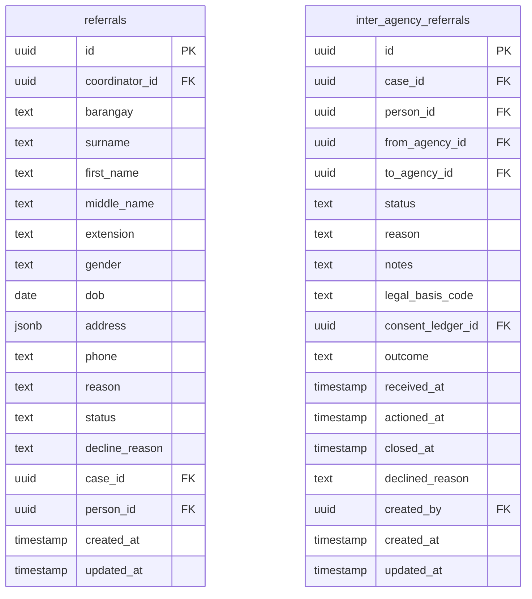
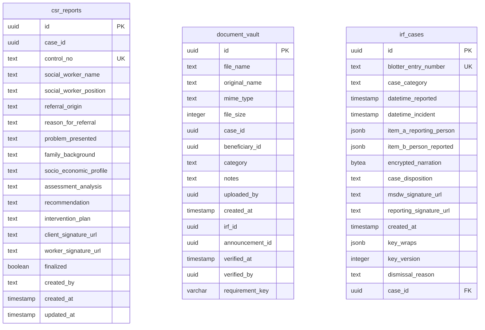
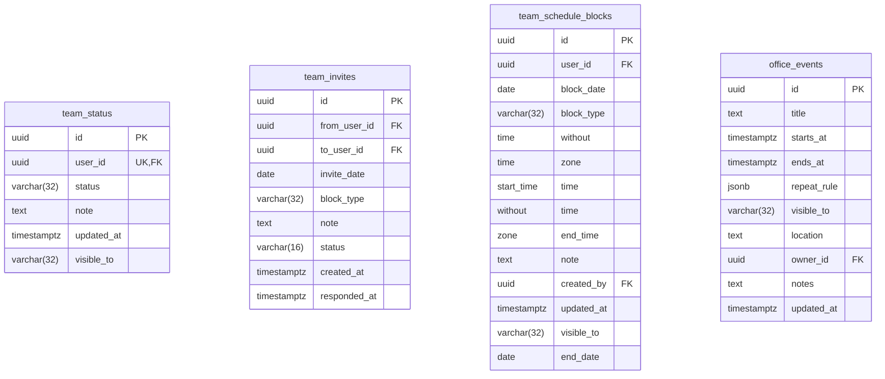
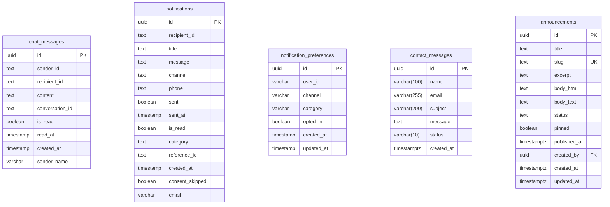

# Entity Relationship Diagram — Physical Model

The **physical** data model for Kapwa, in Oracle Data Modeler notation — every table, column (with its
PostgreSQL datatype, nullability, default and key markers), constraint, and foreign-key relationship as
created by the canonical fresh-boot bootstrap (`kapwa-server/src/database/migrate.ts`) and the TypeORM
migration chain. Introspected from a fresh boot of the current schema (Postgres 18).

## 1. Conventions (Oracle Data Modeler physical notation)

| Marker | Meaning |
|---|---|
| `PK` | Primary-key column(s) — `PRIMARY KEY (…)` per table |
| `UK` | Column covered by a `UNIQUE` constraint |
| `FK` | Foreign-key column — the arrow carries the column name |
| `NN` | `NOT NULL` column (the mermaid blocks omit this marker; see the constraint inventory) |
| `||--o{` | One-to-many (crow's foot): one parent row to zero-or-many children |
| `||--||` | One-to-one |
| `o|--o{` | Zero-or-one to zero-or-many |

Constraints are named in the Oracle style (`PK_`, `UQ_`, `FK_`, `CHK_` prefixes) with their exact `pg_get_constraintdef` text; not every `NOT NULL` column is re-stated per column, but every `CHECK` constraint is listed verbatim.

**Printing:** every cluster diagram below is rendered to its own US-Letter-size PDF by `docs/diagrams/print-diagrams.mjs` (output in `docs/diagrams/print/`) — run `PUPPETEER_EXECUTABLE_PATH=/usr/bin/google-chrome-stable node docs/diagrams/print-diagrams.mjs` after editing.

## 2. Scope

The model contains **57 base tables, 589 columns, 123 constraints (57 primary keys, 43 foreign keys, 14 unique, 9 check)** from the `public` schema. Tables are grouped into ten subject-area clusters so each diagram fits a letter-size page; cross-cluster foreign keys are drawn in the narrative (Section 4) with their full constraint definitions in Section 5.

## 3. Cluster Diagrams (physical)

### C1 — Identity, Users, Contacts & Agencies

```mermaid
erDiagram
    "persons" {
        uuid id PK
        text surname
        text first_name
        text middle_name
        text gender
        date dob
        text philsys_number UK
        text place_of_birth
        text civil_status
        text occupation
        decimal(12,2) estimated_monthly_income
        tsvector search_vector
        timestamp created_at
        timestamp updated_at
        text extension
    }

    "person_addresses" {
        uuid id PK
        uuid person_id
        varchar(50) address_type
        varchar(255) barangay
        varchar(255) city
        varchar(255) province
        varchar(20) postal
        boolean is_primary
        text raw
        timestamp created_at
        timestamp updated_at
        text street
        text region
    }

    "person_contacts" {
        uuid id PK
        uuid person_id
        varchar(50) contact_type
        text value
        boolean is_primary
        timestamp created_at
        timestamp updated_at
    }

    "users" {
        uuid id PK
        text email UK
        text password
        text role
        text first_name
        text middle_name
        text last_name
        text name_extension
        text phone
        boolean is_active
        text device_id
        timestamp created_at
        timestamp updated_at
        uuid person_id FK
        uuid pending_person_id
        varchar person_link_code
        timestamp person_link_code_expires_at
        varchar mfa_secret
        boolean mfa_enabled
        varchar mfa_method
        varchar email_otp_code
        timestamp email_otp_expires_at
        integer token_version
        boolean email_verified
        boolean must_change_password
        uuid agency_id FK
    }

    "user_tokens" {
        uuid id PK
        uuid user_id
        varchar(50) purpose
        text token
        timestamp expires_at
        timestamp created_at
        timestamp updated_at
        jsonb meta
    }

    "user_barangay_assignments" {
        uuid id PK
        uuid user_id
        varchar(255) barangay
        boolean is_primary
        timestamp created_at
        timestamp updated_at
    }

    "beneficiary_claimants" {
        uuid id PK
        uuid beneficiary_id FK
        uuid claimant_id FK
        text relationship
        text authorization_url
        integer calendar_year
        boolean is_primary
        timestamp created_at
    }

    "beneficiary_roles" {
        uuid id PK
        uuid person_id FK
        uuid household_id
        uuid user_id
        text consent_status
        text access_card_code UK
        text category
        timestamp created_at
        timestamp updated_at
    }

    "agencies" {
        uuid id PK
        varchar(10) code UK
        varchar(100) name
        varchar(50) type
        boolean is_active
        timestamp created_at
        timestamp updated_at
    }

    "agency_contacts" {
        uuid id PK
        uuid agency_id
        varchar(50) contact_type
        text value
        boolean is_primary
        timestamp created_at
        timestamp updated_at
    }

    "persons" ||--o{ "beneficiary_claimants" : "beneficiary_id -> persons.id"
    "persons" ||--o{ "beneficiary_claimants" : "claimant_id -> persons.id"
    "persons" ||--o{ "beneficiary_roles" : "person_id -> persons.id"
    "agencies" ||--o{ "users" : "agency_id -> agencies.id"
    "persons" ||--o{ "users" : "person_id -> persons.id"
```

**Foreign keys within this cluster:**
- `beneficiary_claimants_beneficiary_id_fkey`: `beneficiary_claimants(beneficiary_id)` → `persons(id)`
- `beneficiary_claimants_claimant_id_fkey`: `beneficiary_claimants(claimant_id)` → `persons(id)`
- `beneficiary_roles_person_id_fkey`: `beneficiary_roles(person_id)` → `persons(id)`
- `users_agency_id_fkey`: `users(agency_id)` → `agencies(id)`
- `users_person_id_fkey`: `users(person_id)` → `persons(id)`

**Physical columns:**

**`persons`** (column · datatype · null · key · default)

| Column | Datatype | Null | Key | Default |
|---|---|---|---|---|
| `id` | uuid | NO | PK | uuid_generate_v7() |
| `surname` | text | NO |  |  |
| `first_name` | text | NO |  |  |
| `middle_name` | text | YES |  |  |
| `gender` | text | YES |  |  |
| `dob` | date | NO |  |  |
| `philsys_number` | text | YES | UK |  |
| `place_of_birth` | text | YES |  |  |
| `civil_status` | text | YES |  |  |
| `occupation` | text | YES |  |  |
| `estimated_monthly_income` | decimal(12,2) | YES |  |  |
| `search_vector` | tsvector | YES |  |  |
| `created_at` | timestamp | YES |  | now() |
| `updated_at` | timestamp | YES |  | now() |
| `extension` | text | YES |  |  |

Constraints:

    - **CHK_persons_gender_check**: `CHECK ((gender = ANY (ARRAY['Male'::text, 'Female'::text])))`
    - **UQ_persons_philsys_number_key**: `UNIQUE (philsys_number)`
    - **PK_persons_pkey**: `PRIMARY KEY (id)`

**`person_addresses`** (column · datatype · null · key · default)

| Column | Datatype | Null | Key | Default |
|---|---|---|---|---|
| `id` | uuid | NO | PK | uuid_generate_v7() |
| `person_id` | uuid | NO |  |  |
| `address_type` | varchar(50) | NO |  |  |
| `barangay` | varchar(255) | YES |  |  |
| `city` | varchar(255) | YES |  |  |
| `province` | varchar(255) | YES |  |  |
| `postal` | varchar(20) | YES |  |  |
| `is_primary` | boolean | YES |  |  |
| `raw` | text | YES |  |  |
| `created_at` | timestamp | YES |  | now() |
| `updated_at` | timestamp | YES |  | now() |
| `street` | text | YES |  |  |
| `region` | text | YES |  |  |

Constraints:

    - **PK_person_addresses_pkey**: `PRIMARY KEY (id)`

**`person_contacts`** (column · datatype · null · key · default)

| Column | Datatype | Null | Key | Default |
|---|---|---|---|---|
| `id` | uuid | NO | PK | uuid_generate_v7() |
| `person_id` | uuid | NO |  |  |
| `contact_type` | varchar(50) | NO |  |  |
| `value` | text | NO |  |  |
| `is_primary` | boolean | YES |  |  |
| `created_at` | timestamp | YES |  | now() |
| `updated_at` | timestamp | YES |  | now() |

Constraints:

    - **PK_person_contacts_pkey**: `PRIMARY KEY (id)`

**`users`** (column · datatype · null · key · default)

| Column | Datatype | Null | Key | Default |
|---|---|---|---|---|
| `id` | uuid | NO | PK | uuid_generate_v7() |
| `email` | text | NO | UK |  |
| `password` | text | NO |  |  |
| `role` | text | YES |  | 'social_worker'::text |
| `first_name` | text | YES |  |  |
| `middle_name` | text | YES |  |  |
| `last_name` | text | YES |  |  |
| `name_extension` | text | YES |  |  |
| `phone` | text | YES |  |  |
| `is_active` | boolean | YES |  | true |
| `device_id` | text | YES |  |  |
| `created_at` | timestamp | YES |  | now() |
| `updated_at` | timestamp | YES |  | now() |
| `person_id` | uuid | YES | FK |  |
| `pending_person_id` | uuid | YES |  |  |
| `person_link_code` | varchar | YES |  |  |
| `person_link_code_expires_at` | timestamp | YES |  |  |
| `mfa_secret` | varchar | YES |  |  |
| `mfa_enabled` | boolean | YES |  | false |
| `mfa_method` | varchar | YES |  |  |
| `email_otp_code` | varchar | YES |  |  |
| `email_otp_expires_at` | timestamp | YES |  |  |
| `token_version` | integer | YES |  | 0 |
| `email_verified` | boolean | YES |  | true |
| `must_change_password` | boolean | NO |  | false |
| `agency_id` | uuid | YES | FK |  |

Constraints:

    - **FK_users_agency_id_fkey**: `FOREIGN KEY (agency_id) REFERENCES agencies(id)`
    - **UQ_users_email_key**: `UNIQUE (email)`
    - **FK_users_person_id_fkey**: `FOREIGN KEY (person_id) REFERENCES persons(id)`
    - **PK_users_pkey**: `PRIMARY KEY (id)`

**`user_tokens`** (column · datatype · null · key · default)

| Column | Datatype | Null | Key | Default |
|---|---|---|---|---|
| `id` | uuid | NO | PK | uuid_generate_v7() |
| `user_id` | uuid | NO |  |  |
| `purpose` | varchar(50) | NO |  |  |
| `token` | text | NO |  |  |
| `expires_at` | timestamp | YES |  |  |
| `created_at` | timestamp | YES |  | now() |
| `updated_at` | timestamp | YES |  | now() |
| `meta` | jsonb | YES |  |  |

Constraints:

    - **PK_user_tokens_pkey**: `PRIMARY KEY (id)`

**`user_barangay_assignments`** (column · datatype · null · key · default)

| Column | Datatype | Null | Key | Default |
|---|---|---|---|---|
| `id` | uuid | NO | PK | uuid_generate_v7() |
| `user_id` | uuid | NO |  |  |
| `barangay` | varchar(255) | NO |  |  |
| `is_primary` | boolean | YES |  |  |
| `created_at` | timestamp | YES |  | now() |
| `updated_at` | timestamp | YES |  | now() |

Constraints:

    - **PK_user_barangay_assignments_pkey**: `PRIMARY KEY (id)`

**`beneficiary_claimants`** (column · datatype · null · key · default)

| Column | Datatype | Null | Key | Default |
|---|---|---|---|---|
| `id` | uuid | NO | PK | uuid_generate_v7() |
| `beneficiary_id` | uuid | NO | FK |  |
| `claimant_id` | uuid | NO | FK |  |
| `relationship` | text | NO |  |  |
| `authorization_url` | text | YES |  |  |
| `calendar_year` | integer | YES |  |  |
| `is_primary` | boolean | YES |  | true |
| `created_at` | timestamp | YES |  | now() |

Constraints:

    - **FK_beneficiary_claimants_beneficiary_id_fkey**: `FOREIGN KEY (beneficiary_id) REFERENCES persons(id)`
    - **FK_beneficiary_claimants_claimant_id_fkey**: `FOREIGN KEY (claimant_id) REFERENCES persons(id)`
    - **PK_beneficiary_claimants_pkey**: `PRIMARY KEY (id)`

**`beneficiary_roles`** (column · datatype · null · key · default)

| Column | Datatype | Null | Key | Default |
|---|---|---|---|---|
| `id` | uuid | NO | PK | uuid_generate_v7() |
| `person_id` | uuid | NO | FK |  |
| `household_id` | uuid | YES |  |  |
| `user_id` | uuid | YES |  |  |
| `consent_status` | text | YES |  | 'active'::text |
| `access_card_code` | text | YES | UK |  |
| `category` | text | YES |  |  |
| `created_at` | timestamp | YES |  | now() |
| `updated_at` | timestamp | YES |  | now() |

Constraints:

    - **UQ_beneficiary_roles_access_card_code_key**: `UNIQUE (access_card_code)`
    - **FK_beneficiary_roles_person_id_fkey**: `FOREIGN KEY (person_id) REFERENCES persons(id)`
    - **PK_beneficiary_roles_pkey**: `PRIMARY KEY (id)`

**`agencies`** (column · datatype · null · key · default)

| Column | Datatype | Null | Key | Default |
|---|---|---|---|---|
| `id` | uuid | NO | PK | uuid_generate_v7() |
| `code` | varchar(10) | NO | UK |  |
| `name` | varchar(100) | NO |  |  |
| `type` | varchar(50) | YES |  |  |
| `is_active` | boolean | YES |  | true |
| `created_at` | timestamp | YES |  | now() |
| `updated_at` | timestamp | YES |  | now() |

Constraints:

    - **UQ_agencies_code_key**: `UNIQUE (code)`
    - **PK_agencies_pkey**: `PRIMARY KEY (id)`

**`agency_contacts`** (column · datatype · null · key · default)

| Column | Datatype | Null | Key | Default |
|---|---|---|---|---|
| `id` | uuid | NO | PK | uuid_generate_v7() |
| `agency_id` | uuid | NO |  |  |
| `contact_type` | varchar(50) | NO |  |  |
| `value` | text | NO |  |  |
| `is_primary` | boolean | YES |  |  |
| `created_at` | timestamp | YES |  | now() |
| `updated_at` | timestamp | YES |  | now() |

Constraints:

    - **PK_agency_contacts_pkey**: `PRIMARY KEY (id)`

**Outgoing/incoming cross-cluster foreign keys involving `Identity, Users, Contacts & Agencies`:**

- `access_card_services_logged_by_fkey`: `access_card_services(logged_by)` → `users(id)` (C1 → C7)
- `analysis_runs_created_by_fkey`: `analysis_runs(created_by)` → `users(id)` (C1 → C10)
- `announcements_created_by_fkey`: `announcements(created_by)` → `users(id)` (C1 → C9)
- `case_compliance_items_household_member_id_fkey`: `case_compliance_items(household_member_id)` → `persons(id)` (C1 → C3)
- `case_compliance_items_met_by_fkey`: `case_compliance_items(met_by)` → `users(id)` (C1 → C3)
- `case_interventions_created_by_fkey`: `case_interventions(created_by)` → `users(id)` (C1 → C4)
- `case_payouts_notified_by_fkey`: `case_payouts(notified_by)` → `users(id)` (C1 → C3)
- `case_referrals_created_by_fkey`: `case_referrals(created_by)` → `users(id)` (C1 → C3)
- `household_memberships_person_id_fkey`: `household_memberships(person_id)` → `persons(id)` (C1 → C2)
- `inter_agency_referrals_created_by_fkey`: `inter_agency_referrals(created_by)` → `users(id)` (C1 → C5)
- `inter_agency_referrals_from_agency_id_fkey`: `inter_agency_referrals(from_agency_id)` → `agencies(id)` (C1 → C5)
- `inter_agency_referrals_person_id_fkey`: `inter_agency_referrals(person_id)` → `persons(id)` (C1 → C5)
- `inter_agency_referrals_to_agency_id_fkey`: `inter_agency_referrals(to_agency_id)` → `agencies(id)` (C1 → C5)
- `office_events_owner_id_fkey`: `office_events(owner_id)` → `users(id)` (C1 → C8)
- `program_enrollments_created_by_fkey`: `program_enrollments(created_by)` → `users(id)` (C1 → C4)
- `referrals_coordinator_id_fkey`: `referrals(coordinator_id)` → `users(id)` (C1 → C5)
- `referrals_person_id_fkey`: `referrals(person_id)` → `persons(id)` (C1 → C5)
- `team_invites_from_user_id_fkey`: `team_invites(from_user_id)` → `users(id)` (C1 → C8)
- `team_invites_to_user_id_fkey`: `team_invites(to_user_id)` → `users(id)` (C1 → C8)
- `team_schedule_blocks_created_by_fkey`: `team_schedule_blocks(created_by)` → `users(id)` (C1 → C8)
- `team_schedule_blocks_user_id_fkey`: `team_schedule_blocks(user_id)` → `users(id)` (C1 → C8)
- `team_status_user_id_fkey`: `team_status(user_id)` → `users(id)` (C1 → C8)

### C2 — Households & Beneficiaries

```mermaid
erDiagram
    "households" {
        uuid id PK
        uuid primary_beneficiary_id FK
        text barangay
        decimal(12,2) estimated_income
        text verified_by
        text access_card_code
        timestamp verified_at
        text nhts_pr_id
    }

    "beneficiaries" {
        uuid id PK
        uuid person_id
        uuid user_id
        uuid household_id
        timestamp created_at
        timestamp updated_at
        text hash
        text prev_hash
    }

    "household_memberships" {
        uuid id PK
        uuid person_id FK
        uuid household_id FK
        text relationship
        boolean is_primary
        text status
        timestamp created_at
        timestamp updated_at
        text status_reason
    }

    "households" ||--o{ "household_memberships" : "household_id -> households.id"
    "beneficiaries" ||--o{ "households" : "primary_beneficiary_id -> beneficiaries.id"
```

**Foreign keys within this cluster:**
- `household_memberships_household_id_fkey`: `household_memberships(household_id)` → `households(id)`
- `households_primary_beneficiary_id_fkey`: `households(primary_beneficiary_id)` → `beneficiaries(id)`

**Physical columns:**

**`households`** (column · datatype · null · key · default)

| Column | Datatype | Null | Key | Default |
|---|---|---|---|---|
| `id` | uuid | NO | PK | uuid_generate_v7() |
| `primary_beneficiary_id` | uuid | YES | FK |  |
| `barangay` | text | YES |  |  |
| `estimated_income` | decimal(12,2) | YES |  |  |
| `verified_by` | text | YES |  |  |
| `access_card_code` | text | YES |  |  |
| `verified_at` | timestamp | YES |  | now() |
| `nhts_pr_id` | text | YES |  |  |

Constraints:

    - **PK_households_pkey**: `PRIMARY KEY (id)`
    - **FK_households_primary_beneficiary_id_fkey**: `FOREIGN KEY (primary_beneficiary_id) REFERENCES beneficiaries(id)`

**`beneficiaries`** (column · datatype · null · key · default)

| Column | Datatype | Null | Key | Default |
|---|---|---|---|---|
| `id` | uuid | NO | PK | uuid_generate_v7() |
| `person_id` | uuid | YES |  |  |
| `user_id` | uuid | YES |  |  |
| `household_id` | uuid | YES |  |  |
| `created_at` | timestamp | YES |  | now() |
| `updated_at` | timestamp | YES |  | now() |
| `hash` | text | YES |  |  |
| `prev_hash` | text | YES |  |  |

Constraints:

    - **PK_beneficiaries_pkey**: `PRIMARY KEY (id)`

**`household_memberships`** (column · datatype · null · key · default)

| Column | Datatype | Null | Key | Default |
|---|---|---|---|---|
| `id` | uuid | NO | PK | uuid_generate_v7() |
| `person_id` | uuid | NO | FK |  |
| `household_id` | uuid | YES | FK |  |
| `relationship` | text | NO |  |  |
| `is_primary` | boolean | YES |  | false |
| `status` | text | YES |  |  |
| `created_at` | timestamp | YES |  | now() |
| `updated_at` | timestamp | YES |  | now() |
| `status_reason` | text | YES |  |  |

Constraints:

    - **FK_household_memberships_household_id_fkey**: `FOREIGN KEY (household_id) REFERENCES households(id)`
    - **FK_household_memberships_person_id_fkey**: `FOREIGN KEY (person_id) REFERENCES persons(id)`
    - **PK_household_memberships_pkey**: `PRIMARY KEY (id)`

**Outgoing/incoming cross-cluster foreign keys involving `Households & Beneficiaries`:**

- `analysis_run_members_household_id_fkey`: `analysis_run_members(household_id)` → `households(id)` (C2 → C10)
- `cases_beneficiary_id_fkey`: `cases(beneficiary_id)` → `beneficiaries(id)` (C2 → C3)
- `household_memberships_person_id_fkey`: `household_memberships(person_id)` → `persons(id)` (C1 → C2)

### C3 — Cases, Case Files & Workflow

```mermaid
erDiagram
    "cases" {
        uuid id PK
        text control_no UK
        uuid beneficiary_id FK
        uuid renewal_of_case_id
        text[] service_requested
        jsonb requirements_checklist
        text status
        text certificate_url
        text petty_cash_voucher_url
        uuid assigned_worker_id
        timestamp created_at
        timestamp updated_at
        text problems_presented
        text social_worker_assessment
        text client_category
        text case_category
        text court_docket_number
        date discernment_assessed_at
        text discernment_result
        text discernment_notes
        text protection_order_type
        date protection_order_issued_at
        text protection_order_issued_by
        text protection_order_notes
        boolean enrollments_not_needed
        date solo_parent_id_issued_date
        text solo_parent_id_number
        text solo_parent_notes
        date adoption_dvc_date
        date adoption_case_study_date
        boolean adoption_cdclaa_received
        text adoption_notes
        text[] nature_of_service
        jsonb financial_subsidies
        decimal(12,2) amount_assistance
        text mode_financial_assistance
        text source_of_fund
        text legislator_specify
        jsonb other_assistance
        text interviewed_by
        varchar assigned_worker_name
        text client_signature
        text approved_by_signature
        varchar approved_by_role
        boolean referral_not_needed
        boolean intervention_not_needed
        text self_reliance_plan
        jsonb referrals
        date follow_up_date
        text exit_notes
        decimal(5,2) frva_score
        decimal(5,2) swdi_score
        text family_dialogue_notes
        integer self_reliance_level
        text sustainability_plan
        date transition_date
        varchar closure_outcome
        date closure_date
        jsonb follow_up_visits
        text approved_by_name
        text hash
        text prev_hash
    }

    "case_history" {
        uuid id PK
        varchar case_id
        text from_status
        text to_status
        varchar changed_by_role
        varchar changed_by_id
        varchar remarks
        timestamp created_at
        varchar transition_type
        varchar override_reason
    }

    "case_requirements" {
        uuid id PK
        uuid case_id
        varchar(100) requirement_key
        boolean met
        timestamp created_at
        timestamp updated_at
    }

    "case_referrals" {
        uuid id PK
        uuid case_id
        varchar(255) agency
        varchar(50) status
        text notes
        timestamp created_at
        timestamp updated_at
        text reason
        text contact_info
        uuid created_by FK
    }

    "case_assistances" {
        uuid id PK
        uuid case_id
        varchar(50) assistance_type
        decimal(12,2) amount
        varchar(50) mode
        varchar(100) source_of_fund
        varchar(255) legislator_specify
        jsonb details
        text approved_by_signature
        varchar(50) approved_by_role
        timestamp created_at
        timestamp updated_at
    }

    "case_follow_up_visits" {
        uuid id PK
        uuid case_id
        date visit_date
        text visit_type
        text notes
        text outcome
        timestamp created_at
        timestamp updated_at
    }

    "case_compliance_items" {
        uuid id PK
        uuid case_id FK
        uuid household_member_id FK
        varchar compliance_type
        date due_date
        varchar month_label
        boolean met
        timestamp met_at
        uuid met_by FK
        timestamp created_at
        timestamp updated_at
    }

    "case_payouts" {
        uuid id PK
        uuid case_id FK
        varchar cycle_no
        date scheduled_at
        decimal(12,2) amount
        varchar(20) status
        timestamp notified_at
        uuid notified_by FK
        text remarks
        timestamp created_at
        timestamp updated_at
    }

    "case_step_locks" {
        uuid id PK
        text case_id UK
        text step_key UK
        uuid locked_by
        text locked_by_name
        timestamp locked_at
    }

    "case_control_counters" {
        integer year PK
        integer last_seq
        timestamp updated_at
    }

    "cases" ||--o{ "case_compliance_items" : "case_id -> cases.id"
    "cases" ||--o{ "case_payouts" : "case_id -> cases.id"
```

**Foreign keys within this cluster:**
- `case_compliance_items_case_id_fkey`: `case_compliance_items(case_id)` → `cases(id)`
- `case_payouts_case_id_fkey`: `case_payouts(case_id)` → `cases(id)`

**Physical columns:**

**`cases`** (column · datatype · null · key · default)

| Column | Datatype | Null | Key | Default |
|---|---|---|---|---|
| `id` | uuid | NO | PK | uuid_generate_v7() |
| `control_no` | text | NO | UK |  |
| `beneficiary_id` | uuid | YES | FK |  |
| `renewal_of_case_id` | uuid | YES |  |  |
| `service_requested` | text[] | YES |  |  |
| `requirements_checklist` | jsonb | YES |  |  |
| `status` | text | YES |  | 'enrolled'::text |
| `certificate_url` | text | YES |  |  |
| `petty_cash_voucher_url` | text | YES |  |  |
| `assigned_worker_id` | uuid | YES |  |  |
| `created_at` | timestamp | YES |  | now() |
| `updated_at` | timestamp | YES |  | now() |
| `problems_presented` | text | YES |  |  |
| `social_worker_assessment` | text | YES |  |  |
| `client_category` | text | YES |  |  |
| `case_category` | text | YES |  |  |
| `court_docket_number` | text | YES |  |  |
| `discernment_assessed_at` | date | YES |  |  |
| `discernment_result` | text | YES |  |  |
| `discernment_notes` | text | YES |  |  |
| `protection_order_type` | text | YES |  |  |
| `protection_order_issued_at` | date | YES |  |  |
| `protection_order_issued_by` | text | YES |  |  |
| `protection_order_notes` | text | YES |  |  |
| `enrollments_not_needed` | boolean | NO |  | false |
| `solo_parent_id_issued_date` | date | YES |  |  |
| `solo_parent_id_number` | text | YES |  |  |
| `solo_parent_notes` | text | YES |  |  |
| `adoption_dvc_date` | date | YES |  |  |
| `adoption_case_study_date` | date | YES |  |  |
| `adoption_cdclaa_received` | boolean | YES |  |  |
| `adoption_notes` | text | YES |  |  |
| `nature_of_service` | text[] | YES |  |  |
| `financial_subsidies` | jsonb | YES |  |  |
| `amount_assistance` | decimal(12,2) | YES |  |  |
| `mode_financial_assistance` | text | YES |  |  |
| `source_of_fund` | text | YES |  |  |
| `legislator_specify` | text | YES |  |  |
| `other_assistance` | jsonb | YES |  |  |
| `interviewed_by` | text | YES |  |  |
| `assigned_worker_name` | varchar | YES |  |  |
| `client_signature` | text | YES |  |  |
| `approved_by_signature` | text | YES |  |  |
| `approved_by_role` | varchar | YES |  |  |
| `referral_not_needed` | boolean | NO |  | false |
| `intervention_not_needed` | boolean | NO |  | false |
| `self_reliance_plan` | text | YES |  |  |
| `referrals` | jsonb | YES |  |  |
| `follow_up_date` | date | YES |  |  |
| `exit_notes` | text | YES |  |  |
| `frva_score` | decimal(5,2) | YES |  |  |
| `swdi_score` | decimal(5,2) | YES |  |  |
| `family_dialogue_notes` | text | YES |  |  |
| `self_reliance_level` | integer | YES |  |  |
| `sustainability_plan` | text | YES |  |  |
| `transition_date` | date | YES |  |  |
| `closure_outcome` | varchar | YES |  |  |
| `closure_date` | date | YES |  |  |
| `follow_up_visits` | jsonb | YES |  |  |
| `approved_by_name` | text | YES |  |  |
| `hash` | text | YES |  |  |
| `prev_hash` | text | YES |  |  |

Constraints:

    - **FK_cases_beneficiary_id_fkey**: `FOREIGN KEY (beneficiary_id) REFERENCES beneficiaries(id)`
    - **UQ_cases_control_no_key**: `UNIQUE (control_no)`
    - **PK_cases_pkey**: `PRIMARY KEY (id)`
    - **CHK_cases_status_check**: `CHECK ((status = ANY (ARRAY['enrolled'::text, 'assessed'::text, 'in_review'::text, 'active'::text, 'transitioning'::text, 'closed'::text, 'aftercare'::text])))`

**`case_history`** (column · datatype · null · key · default)

| Column | Datatype | Null | Key | Default |
|---|---|---|---|---|
| `id` | uuid | NO | PK | uuid_generate_v7() |
| `case_id` | varchar | NO |  |  |
| `from_status` | text | YES |  |  |
| `to_status` | text | NO |  |  |
| `changed_by_role` | varchar | YES |  |  |
| `changed_by_id` | varchar | YES |  |  |
| `remarks` | varchar | YES |  |  |
| `created_at` | timestamp | NO |  | now() |
| `transition_type` | varchar | NO |  | 'standard'::character varying |
| `override_reason` | varchar | YES |  |  |

Constraints:

    - **PK_PK_case_history**: `PRIMARY KEY (id)`

**`case_requirements`** (column · datatype · null · key · default)

| Column | Datatype | Null | Key | Default |
|---|---|---|---|---|
| `id` | uuid | NO | PK | uuid_generate_v7() |
| `case_id` | uuid | NO |  |  |
| `requirement_key` | varchar(100) | NO |  |  |
| `met` | boolean | YES |  |  |
| `created_at` | timestamp | YES |  | now() |
| `updated_at` | timestamp | YES |  | now() |

Constraints:

    - **PK_case_requirements_pkey**: `PRIMARY KEY (id)`

**`case_referrals`** (column · datatype · null · key · default)

| Column | Datatype | Null | Key | Default |
|---|---|---|---|---|
| `id` | uuid | NO | PK | uuid_generate_v7() |
| `case_id` | uuid | NO |  |  |
| `agency` | varchar(255) | YES |  |  |
| `status` | varchar(50) | YES |  |  |
| `notes` | text | YES |  |  |
| `created_at` | timestamp | YES |  | now() |
| `updated_at` | timestamp | YES |  | now() |
| `reason` | text | NO |  |  |
| `contact_info` | text | YES |  |  |
| `created_by` | uuid | YES | FK |  |

Constraints:

    - **FK_case_referrals_created_by_fkey**: `FOREIGN KEY (created_by) REFERENCES users(id)`
    - **PK_case_referrals_pkey**: `PRIMARY KEY (id)`

**`case_assistances`** (column · datatype · null · key · default)

| Column | Datatype | Null | Key | Default |
|---|---|---|---|---|
| `id` | uuid | NO | PK | uuid_generate_v7() |
| `case_id` | uuid | NO |  |  |
| `assistance_type` | varchar(50) | NO |  |  |
| `amount` | decimal(12,2) | YES |  |  |
| `mode` | varchar(50) | YES |  |  |
| `source_of_fund` | varchar(100) | YES |  |  |
| `legislator_specify` | varchar(255) | YES |  |  |
| `details` | jsonb | YES |  |  |
| `approved_by_signature` | text | YES |  |  |
| `approved_by_role` | varchar(50) | YES |  |  |
| `created_at` | timestamp | YES |  | now() |
| `updated_at` | timestamp | YES |  | now() |

Constraints:

    - **PK_case_assistances_pkey**: `PRIMARY KEY (id)`

**`case_follow_up_visits`** (column · datatype · null · key · default)

| Column | Datatype | Null | Key | Default |
|---|---|---|---|---|
| `id` | uuid | NO | PK | uuid_generate_v7() |
| `case_id` | uuid | NO |  |  |
| `visit_date` | date | NO |  |  |
| `visit_type` | text | NO |  |  |
| `notes` | text | YES |  |  |
| `outcome` | text | YES |  |  |
| `created_at` | timestamp | YES |  | now() |
| `updated_at` | timestamp | YES |  | now() |

Constraints:

    - **PK_case_follow_up_visits_pkey**: `PRIMARY KEY (id)`

**`case_compliance_items`** (column · datatype · null · key · default)

| Column | Datatype | Null | Key | Default |
|---|---|---|---|---|
| `id` | uuid | NO | PK | uuid_generate_v7() |
| `case_id` | uuid | NO | FK |  |
| `household_member_id` | uuid | YES | FK |  |
| `compliance_type` | varchar | YES |  |  |
| `due_date` | date | NO |  |  |
| `month_label` | varchar | YES |  |  |
| `met` | boolean | YES |  | false |
| `met_at` | timestamp | YES |  |  |
| `met_by` | uuid | YES | FK |  |
| `created_at` | timestamp | YES |  | now() |
| `updated_at` | timestamp | YES |  | now() |

Constraints:

    - **FK_case_compliance_items_case_id_fkey**: `FOREIGN KEY (case_id) REFERENCES cases(id)`
    - **CHK_case_compliance_items_compliance_type_check**: `CHECK (((compliance_type)::text = ANY ((ARRAY['school_attendance'::character varying, 'health_checkup'::character varying, 'fds'::character varying])::text[])))`
    - **FK_case_compliance_items_household_member_id_fkey**: `FOREIGN KEY (household_member_id) REFERENCES persons(id)`
    - **FK_case_compliance_items_met_by_fkey**: `FOREIGN KEY (met_by) REFERENCES users(id)`
    - **PK_case_compliance_items_pkey**: `PRIMARY KEY (id)`

**`case_payouts`** (column · datatype · null · key · default)

| Column | Datatype | Null | Key | Default |
|---|---|---|---|---|
| `id` | uuid | NO | PK | uuid_generate_v7() |
| `case_id` | uuid | NO | FK |  |
| `cycle_no` | varchar | YES |  |  |
| `scheduled_at` | date | NO |  |  |
| `amount` | decimal(12,2) | YES |  |  |
| `status` | varchar(20) | YES |  | 'scheduled'::character varying |
| `notified_at` | timestamp | YES |  |  |
| `notified_by` | uuid | YES | FK |  |
| `remarks` | text | YES |  |  |
| `created_at` | timestamp | YES |  | now() |
| `updated_at` | timestamp | YES |  | now() |

Constraints:

    - **FK_case_payouts_case_id_fkey**: `FOREIGN KEY (case_id) REFERENCES cases(id)`
    - **FK_case_payouts_notified_by_fkey**: `FOREIGN KEY (notified_by) REFERENCES users(id)`
    - **PK_case_payouts_pkey**: `PRIMARY KEY (id)`
    - **CHK_case_payouts_status_check**: `CHECK (((status)::text = ANY ((ARRAY['scheduled'::character varying, 'completed'::character varying, 'missed'::character varying, 'cancelled'::character varying])::text[])))`

**`case_step_locks`** (column · datatype · null · key · default)

| Column | Datatype | Null | Key | Default |
|---|---|---|---|---|
| `id` | uuid | NO | PK | uuid_generate_v7() |
| `case_id` | text | NO | UK |  |
| `step_key` | text | NO | UK |  |
| `locked_by` | uuid | YES |  |  |
| `locked_by_name` | text | YES |  |  |
| `locked_at` | timestamp | YES |  | now() |

Constraints:

    - **PK_case_step_locks_pkey**: `PRIMARY KEY (id)`
    - **UQ_uq_case_step_locks_case_step_key**: `UNIQUE (case_id, step_key)`

**`case_control_counters`** (column · datatype · null · key · default)

| Column | Datatype | Null | Key | Default |
|---|---|---|---|---|
| `year` | integer | NO | PK |  |
| `last_seq` | integer | NO |  | 0 |
| `updated_at` | timestamp | YES |  | now() |

Constraints:

    - **PK_case_control_counters_pkey**: `PRIMARY KEY (year)`

**Outgoing/incoming cross-cluster foreign keys involving `Cases, Case Files & Workflow`:**

- `case_compliance_items_household_member_id_fkey`: `case_compliance_items(household_member_id)` → `persons(id)` (C1 → C3)
- `case_compliance_items_met_by_fkey`: `case_compliance_items(met_by)` → `users(id)` (C1 → C3)
- `case_payouts_notified_by_fkey`: `case_payouts(notified_by)` → `users(id)` (C1 → C3)
- `case_referrals_created_by_fkey`: `case_referrals(created_by)` → `users(id)` (C1 → C3)
- `cases_beneficiary_id_fkey`: `cases(beneficiary_id)` → `beneficiaries(id)` (C2 → C3)
- `inter_agency_referrals_case_id_fkey`: `inter_agency_referrals(case_id)` → `cases(id)` (C3 → C5)
- `irf_cases_case_id_fkey`: `irf_cases(case_id)` → `cases(id)` (C3 → C6)
- `program_enrollments_case_id_fkey`: `program_enrollments(case_id)` → `cases(id)` (C3 → C4)
- `referrals_case_id_fkey`: `referrals(case_id)` → `cases(id)` (C3 → C5)

### C4 — Programs, Enrollments & Interventions

```mermaid
erDiagram
    "programs" {
        uuid id PK
        text name
        text category
        jsonb approval_workflow
        jsonb form_template
        boolean is_active
        timestamp created_at
        timestamp updated_at
        text program_type
        text legal_basis
        integer form_version
    }

    "program_fund_sources" {
        uuid id PK
        uuid program_id
        varchar(100) name
        timestamp created_at
        timestamp updated_at
    }

    "program_required_documents" {
        uuid id PK
        uuid program_id
        varchar(100) document_key
        boolean mandatory
        timestamp created_at
        timestamp updated_at
    }

    "form_version_history" {
        uuid id PK
        uuid program_id FK
        jsonb form_template
        integer version
        timestamp created_at
    }

    "program_enrollments" {
        uuid id PK
        uuid case_id UK, FK
        uuid program_id UK, FK
        date enrolled_at
        text status
        uuid created_by FK
        timestamp created_at
        timestamp updated_at
    }

    "program_services" {
        uuid id PK
        uuid program_id UK, FK
        text intervention_type UK
        timestamp created_at
        timestamp updated_at
    }

    "case_interventions" {
        uuid id PK
        text case_id
        uuid program_id
        text service_name
        text category
        date delivery_date
        decimal(12,2) amount
        text mode_of_delivery
        text fund_source
        text notes
        text delivered_by
        timestamp created_at
        timestamp updated_at
        uuid created_by FK
        text intervention_type
        uuid program_enrollment_id
    }

    "programs" ||--o{ "form_version_history" : "program_id -> programs.id"
    "programs" ||--o{ "program_enrollments" : "program_id -> programs.id"
    "programs" ||--o{ "program_services" : "program_id -> programs.id"
```

**Foreign keys within this cluster:**
- `form_version_history_program_id_fkey`: `form_version_history(program_id)` → `programs(id)`
- `program_enrollments_program_id_fkey`: `program_enrollments(program_id)` → `programs(id)`
- `program_services_program_id_fkey`: `program_services(program_id)` → `programs(id)`

**Physical columns:**

**`programs`** (column · datatype · null · key · default)

| Column | Datatype | Null | Key | Default |
|---|---|---|---|---|
| `id` | uuid | NO | PK | uuid_generate_v7() |
| `name` | text | NO |  |  |
| `category` | text | YES |  |  |
| `approval_workflow` | jsonb | YES |  |  |
| `form_template` | jsonb | YES |  |  |
| `is_active` | boolean | YES |  | true |
| `created_at` | timestamp | YES |  | now() |
| `updated_at` | timestamp | YES |  | now() |
| `program_type` | text | YES |  |  |
| `legal_basis` | text | YES |  |  |
| `form_version` | integer | YES |  | 1 |

Constraints:

    - **PK_programs_pkey**: `PRIMARY KEY (id)`

**`program_fund_sources`** (column · datatype · null · key · default)

| Column | Datatype | Null | Key | Default |
|---|---|---|---|---|
| `id` | uuid | NO | PK | uuid_generate_v7() |
| `program_id` | uuid | NO |  |  |
| `name` | varchar(100) | NO |  |  |
| `created_at` | timestamp | YES |  | now() |
| `updated_at` | timestamp | YES |  | now() |

Constraints:

    - **PK_program_fund_sources_pkey**: `PRIMARY KEY (id)`

**`program_required_documents`** (column · datatype · null · key · default)

| Column | Datatype | Null | Key | Default |
|---|---|---|---|---|
| `id` | uuid | NO | PK | uuid_generate_v7() |
| `program_id` | uuid | NO |  |  |
| `document_key` | varchar(100) | NO |  |  |
| `mandatory` | boolean | YES |  |  |
| `created_at` | timestamp | YES |  | now() |
| `updated_at` | timestamp | YES |  | now() |

Constraints:

    - **PK_program_required_documents_pkey**: `PRIMARY KEY (id)`

**`form_version_history`** (column · datatype · null · key · default)

| Column | Datatype | Null | Key | Default |
|---|---|---|---|---|
| `id` | uuid | NO | PK | uuid_generate_v7() |
| `program_id` | uuid | NO | FK |  |
| `form_template` | jsonb | NO |  |  |
| `version` | integer | NO |  |  |
| `created_at` | timestamp | YES |  | now() |

Constraints:

    - **PK_form_version_history_pkey**: `PRIMARY KEY (id)`
    - **FK_form_version_history_program_id_fkey**: `FOREIGN KEY (program_id) REFERENCES programs(id) ON DELETE CASCADE`

**`program_enrollments`** (column · datatype · null · key · default)

| Column | Datatype | Null | Key | Default |
|---|---|---|---|---|
| `id` | uuid | NO | PK | uuid_generate_v7() |
| `case_id` | uuid | NO | UK |  |
| `program_id` | uuid | NO | UK |  |
| `enrolled_at` | date | NO |  |  |
| `status` | text | NO |  | 'active'::text |
| `created_by` | uuid | YES | FK |  |
| `created_at` | timestamp | YES |  | now() |
| `updated_at` | timestamp | YES |  | now() |

Constraints:

    - **FK_program_enrollments_case_id_fkey**: `FOREIGN KEY (case_id) REFERENCES cases(id)`
    - **FK_program_enrollments_created_by_fkey**: `FOREIGN KEY (created_by) REFERENCES users(id)`
    - **PK_program_enrollments_pkey**: `PRIMARY KEY (id)`
    - **FK_program_enrollments_program_id_fkey**: `FOREIGN KEY (program_id) REFERENCES programs(id)`
    - **UQ_uq_program_enrollments_case_program**: `UNIQUE (case_id, program_id)`

**`program_services`** (column · datatype · null · key · default)

| Column | Datatype | Null | Key | Default |
|---|---|---|---|---|
| `id` | uuid | NO | PK | uuid_generate_v7() |
| `program_id` | uuid | NO | UK |  |
| `intervention_type` | text | NO | UK |  |
| `created_at` | timestamp | YES |  | now() |
| `updated_at` | timestamp | YES |  | now() |

Constraints:

    - **PK_program_services_pkey**: `PRIMARY KEY (id)`
    - **FK_program_services_program_id_fkey**: `FOREIGN KEY (program_id) REFERENCES programs(id)`
    - **UQ_uq_program_services_program_type**: `UNIQUE (program_id, intervention_type)`

**`case_interventions`** (column · datatype · null · key · default)

| Column | Datatype | Null | Key | Default |
|---|---|---|---|---|
| `id` | uuid | NO | PK | uuid_generate_v7() |
| `case_id` | text | NO |  |  |
| `program_id` | uuid | YES |  |  |
| `service_name` | text | NO |  |  |
| `category` | text | YES |  |  |
| `delivery_date` | date | YES |  |  |
| `amount` | decimal(12,2) | YES |  |  |
| `mode_of_delivery` | text | YES |  |  |
| `fund_source` | text | YES |  |  |
| `notes` | text | YES |  |  |
| `delivered_by` | text | YES |  |  |
| `created_at` | timestamp | YES |  | now() |
| `updated_at` | timestamp | YES |  | now() |
| `created_by` | uuid | YES | FK |  |
| `intervention_type` | text | YES |  |  |
| `program_enrollment_id` | uuid | YES |  |  |

Constraints:

    - **FK_case_interventions_created_by_fkey**: `FOREIGN KEY (created_by) REFERENCES users(id)`
    - **PK_case_interventions_pkey**: `PRIMARY KEY (id)`

> ⚠ Legacy table: `case_id`, `program_id` and `program_enrollment_id` are **unconstrained** columns (no FK rows exist in `pg_constraint`); only `created_by` → `users(id)` is a real foreign key. Referential integrity for these links is enforced in the application layer (`CaseInterventionService`).

**Outgoing/incoming cross-cluster foreign keys involving `Programs, Enrollments & Interventions`:**

- `case_interventions_created_by_fkey`: `case_interventions(created_by)` → `users(id)` (C1 → C4)
- `program_enrollments_case_id_fkey`: `program_enrollments(case_id)` → `cases(id)` (C3 → C4)
- `program_enrollments_created_by_fkey`: `program_enrollments(created_by)` → `users(id)` (C1 → C4)

### C5 — Referrals

```mermaid
erDiagram
    "referrals" {
        uuid id PK
        uuid coordinator_id FK
        text barangay
        text surname
        text first_name
        text middle_name
        text extension
        text gender
        date dob
        jsonb address
        text phone
        text reason
        text status
        text decline_reason
        uuid case_id FK
        uuid person_id FK
        timestamp created_at
        timestamp updated_at
    }

    "inter_agency_referrals" {
        uuid id PK
        uuid case_id FK
        uuid person_id FK
        uuid from_agency_id FK
        uuid to_agency_id FK
        text status
        text reason
        text notes
        text legal_basis_code
        uuid consent_ledger_id FK
        text outcome
        timestamp received_at
        timestamp actioned_at
        timestamp closed_at
        text declined_reason
        uuid created_by FK
        timestamp created_at
        timestamp updated_at
    }

```

**Foreign keys within this cluster:**
- *(none — all relationships are cross-cluster, see Section 4)*

**Physical columns:**

**`referrals`** (column · datatype · null · key · default)

| Column | Datatype | Null | Key | Default |
|---|---|---|---|---|
| `id` | uuid | NO | PK | uuid_generate_v7() |
| `coordinator_id` | uuid | NO | FK |  |
| `barangay` | text | NO |  |  |
| `surname` | text | YES |  |  |
| `first_name` | text | YES |  |  |
| `middle_name` | text | YES |  |  |
| `extension` | text | YES |  |  |
| `gender` | text | YES |  |  |
| `dob` | date | YES |  |  |
| `address` | jsonb | YES |  |  |
| `phone` | text | YES |  |  |
| `reason` | text | NO |  |  |
| `status` | text | YES |  | 'pending'::text |
| `decline_reason` | text | YES |  |  |
| `case_id` | uuid | YES | FK |  |
| `person_id` | uuid | YES | FK |  |
| `created_at` | timestamp | YES |  | now() |
| `updated_at` | timestamp | YES |  | now() |

Constraints:

    - **FK_referrals_case_id_fkey**: `FOREIGN KEY (case_id) REFERENCES cases(id)`
    - **FK_referrals_coordinator_id_fkey**: `FOREIGN KEY (coordinator_id) REFERENCES users(id)`
    - **FK_referrals_person_id_fkey**: `FOREIGN KEY (person_id) REFERENCES persons(id)`
    - **PK_referrals_pkey**: `PRIMARY KEY (id)`
    - **CHK_referrals_status_check**: `CHECK ((status = ANY (ARRAY['pending'::text, 'accepted'::text, 'declined'::text])))`

**`inter_agency_referrals`** (column · datatype · null · key · default)

| Column | Datatype | Null | Key | Default |
|---|---|---|---|---|
| `id` | uuid | NO | PK | uuid_generate_v7() |
| `case_id` | uuid | YES | FK |  |
| `person_id` | uuid | NO | FK |  |
| `from_agency_id` | uuid | NO | FK |  |
| `to_agency_id` | uuid | NO | FK |  |
| `status` | text | NO |  | 'referred'::text |
| `reason` | text | NO |  |  |
| `notes` | text | YES |  |  |
| `legal_basis_code` | text | NO |  |  |
| `consent_ledger_id` | uuid | YES | FK |  |
| `outcome` | text | YES |  |  |
| `received_at` | timestamp | YES |  |  |
| `actioned_at` | timestamp | YES |  |  |
| `closed_at` | timestamp | YES |  |  |
| `declined_reason` | text | YES |  |  |
| `created_by` | uuid | YES | FK |  |
| `created_at` | timestamp | YES |  | now() |
| `updated_at` | timestamp | YES |  | now() |

Constraints:

    - **FK_inter_agency_referrals_case_id_fkey**: `FOREIGN KEY (case_id) REFERENCES cases(id)`
    - **FK_inter_agency_referrals_consent_ledger_id_fkey**: `FOREIGN KEY (consent_ledger_id) REFERENCES consent_ledger(id)`
    - **FK_inter_agency_referrals_created_by_fkey**: `FOREIGN KEY (created_by) REFERENCES users(id)`
    - **FK_inter_agency_referrals_from_agency_id_fkey**: `FOREIGN KEY (from_agency_id) REFERENCES agencies(id)`
    - **FK_inter_agency_referrals_person_id_fkey**: `FOREIGN KEY (person_id) REFERENCES persons(id)`
    - **PK_inter_agency_referrals_pkey**: `PRIMARY KEY (id)`
    - **CHK_inter_agency_referrals_status_check**: `CHECK ((status = ANY (ARRAY['referred'::text, 'received'::text, 'actioned'::text, 'closed'::text, 'declined'::text])))`
    - **FK_inter_agency_referrals_to_agency_id_fkey**: `FOREIGN KEY (to_agency_id) REFERENCES agencies(id)`

**Outgoing/incoming cross-cluster foreign keys involving `Referrals`:**

- `inter_agency_referrals_case_id_fkey`: `inter_agency_referrals(case_id)` → `cases(id)` (C3 → C5)
- `inter_agency_referrals_consent_ledger_id_fkey`: `inter_agency_referrals(consent_ledger_id)` → `consent_ledger(id)` (C10 → C5)
- `inter_agency_referrals_created_by_fkey`: `inter_agency_referrals(created_by)` → `users(id)` (C1 → C5)
- `inter_agency_referrals_from_agency_id_fkey`: `inter_agency_referrals(from_agency_id)` → `agencies(id)` (C1 → C5)
- `inter_agency_referrals_person_id_fkey`: `inter_agency_referrals(person_id)` → `persons(id)` (C1 → C5)
- `inter_agency_referrals_to_agency_id_fkey`: `inter_agency_referrals(to_agency_id)` → `agencies(id)` (C1 → C5)
- `referrals_case_id_fkey`: `referrals(case_id)` → `cases(id)` (C3 → C5)
- `referrals_coordinator_id_fkey`: `referrals(coordinator_id)` → `users(id)` (C1 → C5)
- `referrals_person_id_fkey`: `referrals(person_id)` → `persons(id)` (C1 → C5)

### C6 — Documents, Reports & IRF

```mermaid
erDiagram
    "csr_reports" {
        uuid id PK
        uuid case_id
        text control_no UK
        text social_worker_name
        text social_worker_position
        text referral_origin
        text reason_for_referral
        text problem_presented
        text family_background
        text socio_economic_profile
        text assessment_analysis
        text recommendation
        text intervention_plan
        text client_signature_url
        text worker_signature_url
        boolean finalized
        text created_by
        timestamp created_at
        timestamp updated_at
    }

    "document_vault" {
        uuid id PK
        text file_name
        text original_name
        text mime_type
        integer file_size
        uuid case_id
        uuid beneficiary_id
        text category
        text notes
        uuid uploaded_by
        timestamp created_at
        uuid irf_id
        uuid announcement_id
        timestamp verified_at
        uuid verified_by
        varchar requirement_key
    }

    "irf_cases" {
        uuid id PK
        text blotter_entry_number UK
        text case_category
        timestamp datetime_reported
        timestamp datetime_incident
        jsonb item_a_reporting_person
        jsonb item_b_person_reported
        bytea encrypted_narration
        text case_disposition
        text msdw_signature_url
        text reporting_signature_url
        timestamp created_at
        jsonb key_wraps
        integer key_version
        text dismissal_reason
        uuid case_id FK
    }

```

**Foreign keys within this cluster:**
- *(none — all relationships are cross-cluster, see Section 4)*

**Physical columns:**

**`csr_reports`** (column · datatype · null · key · default)

| Column | Datatype | Null | Key | Default |
|---|---|---|---|---|
| `id` | uuid | NO | PK | uuid_generate_v7() |
| `case_id` | uuid | NO |  |  |
| `control_no` | text | NO | UK |  |
| `social_worker_name` | text | NO |  |  |
| `social_worker_position` | text | YES |  |  |
| `referral_origin` | text | YES |  |  |
| `reason_for_referral` | text | YES |  |  |
| `problem_presented` | text | YES |  |  |
| `family_background` | text | YES |  |  |
| `socio_economic_profile` | text | YES |  |  |
| `assessment_analysis` | text | YES |  |  |
| `recommendation` | text | YES |  |  |
| `intervention_plan` | text | YES |  |  |
| `client_signature_url` | text | YES |  |  |
| `worker_signature_url` | text | YES |  |  |
| `finalized` | boolean | YES |  | false |
| `created_by` | text | NO |  |  |
| `created_at` | timestamp | YES |  | now() |
| `updated_at` | timestamp | YES |  | now() |

Constraints:

    - **UQ_csr_reports_control_no_key**: `UNIQUE (control_no)`
    - **PK_csr_reports_pkey**: `PRIMARY KEY (id)`

**`document_vault`** (column · datatype · null · key · default)

| Column | Datatype | Null | Key | Default |
|---|---|---|---|---|
| `id` | uuid | NO | PK | uuid_generate_v7() |
| `file_name` | text | NO |  |  |
| `original_name` | text | YES |  |  |
| `mime_type` | text | YES |  |  |
| `file_size` | integer | YES |  | 0 |
| `case_id` | uuid | YES |  |  |
| `beneficiary_id` | uuid | YES |  |  |
| `category` | text | YES |  |  |
| `notes` | text | YES |  |  |
| `uploaded_by` | uuid | YES |  |  |
| `created_at` | timestamp | YES |  | now() |
| `irf_id` | uuid | YES |  |  |
| `announcement_id` | uuid | YES |  |  |
| `verified_at` | timestamp | YES |  |  |
| `verified_by` | uuid | YES |  |  |
| `requirement_key` | varchar | YES |  |  |

Constraints:

    - **PK_document_vault_pkey**: `PRIMARY KEY (id)`

**`irf_cases`** (column · datatype · null · key · default)

| Column | Datatype | Null | Key | Default |
|---|---|---|---|---|
| `id` | uuid | NO | PK | uuid_generate_v7() |
| `blotter_entry_number` | text | NO | UK |  |
| `case_category` | text | NO |  |  |
| `datetime_reported` | timestamp | YES |  |  |
| `datetime_incident` | timestamp | YES |  |  |
| `item_a_reporting_person` | jsonb | YES |  |  |
| `item_b_person_reported` | jsonb | YES |  |  |
| `encrypted_narration` | bytea | YES |  |  |
| `case_disposition` | text | YES |  |  |
| `msdw_signature_url` | text | YES |  |  |
| `reporting_signature_url` | text | YES |  |  |
| `created_at` | timestamp | YES |  | now() |
| `key_wraps` | jsonb | YES |  |  |
| `key_version` | integer | YES |  | 1 |
| `dismissal_reason` | text | YES |  |  |
| `case_id` | uuid | YES | FK |  |

Constraints:

    - **UQ_irf_cases_blotter_entry_number_key**: `UNIQUE (blotter_entry_number)`
    - **FK_irf_cases_case_id_fkey**: `FOREIGN KEY (case_id) REFERENCES cases(id)`
    - **PK_irf_cases_pkey**: `PRIMARY KEY (id)`

**Outgoing/incoming cross-cluster foreign keys involving `Documents, Reports & IRF`:**

- `irf_cases_case_id_fkey`: `irf_cases(case_id)` → `cases(id)` (C3 → C6)

### C7 — Access Cards & Number Sequences

```mermaid
erDiagram
    "access_card_services" {
        uuid id PK
        text access_card_code
        date service_date
        text service_rendered
        decimal(12,2) cost
        text agency
        uuid agency_id
        text worker_name_sign
        uuid intervention_id
        varchar category
        uuid logged_by FK
        text source_barangay
    }

    "access_card_seq" {
        integer id PK
        integer year
        timestamp created_at
    }

    "irf_blotter_seq" {
        integer id PK
        integer year
        timestamp created_at
    }

```

**Foreign keys within this cluster:**
- *(none — all relationships are cross-cluster, see Section 4)*

**Physical columns:**

**`access_card_services`** (column · datatype · null · key · default)

| Column | Datatype | Null | Key | Default |
|---|---|---|---|---|
| `id` | uuid | NO | PK | uuid_generate_v7() |
| `access_card_code` | text | YES |  |  |
| `service_date` | date | NO |  |  |
| `service_rendered` | text | NO |  |  |
| `cost` | decimal(12,2) | YES |  |  |
| `agency` | text | YES |  |  |
| `agency_id` | uuid | YES |  |  |
| `worker_name_sign` | text | YES |  |  |
| `intervention_id` | uuid | YES |  |  |
| `category` | varchar | YES |  |  |
| `logged_by` | uuid | YES | FK |  |
| `source_barangay` | text | YES |  |  |

Constraints:

    - **FK_access_card_services_logged_by_fkey**: `FOREIGN KEY (logged_by) REFERENCES users(id)`
    - **PK_access_card_services_pkey**: `PRIMARY KEY (id)`

**`access_card_seq`** (column · datatype · null · key · default)

| Column | Datatype | Null | Key | Default |
|---|---|---|---|---|
| `id` | integer | NO | PK | nextval('access_card_seq_id_seq'::regclass) |
| `year` | integer | NO |  |  |
| `created_at` | timestamp | YES |  | now() |

Constraints:

    - **PK_access_card_seq_pkey**: `PRIMARY KEY (id)`

**`irf_blotter_seq`** (column · datatype · null · key · default)

| Column | Datatype | Null | Key | Default |
|---|---|---|---|---|
| `id` | integer | NO | PK | nextval('irf_blotter_seq_id_seq'::regclass) |
| `year` | integer | NO |  |  |
| `created_at` | timestamp | YES |  | now() |

Constraints:

    - **PK_irf_blotter_seq_pkey**: `PRIMARY KEY (id)`

**Outgoing/incoming cross-cluster foreign keys involving `Access Cards & Number Sequences`:**

- `access_card_services_logged_by_fkey`: `access_card_services(logged_by)` → `users(id)` (C1 → C7)

### C8 — Team Workspace

```mermaid
erDiagram
    "team_status" {
        uuid id PK
        uuid user_id UK, FK
        varchar(32) status
        text note
        timestamptz updated_at
        varchar(32) visible_to
    }

    "team_invites" {
        uuid id PK
        uuid from_user_id FK
        uuid to_user_id FK
        date invite_date
        varchar(32) block_type
        text note
        varchar(16) status
        timestamptz created_at
        timestamptz responded_at
    }

    "team_schedule_blocks" {
        uuid id PK
        uuid user_id FK
        date block_date
        varchar(32) block_type
        time without time zone start_time
        time without time zone end_time
        text note
        uuid created_by FK
        timestamptz updated_at
        varchar(32) visible_to
        date end_date
    }

    "office_events" {
        uuid id PK
        text title
        timestamptz starts_at
        timestamptz ends_at
        jsonb repeat_rule
        varchar(32) visible_to
        text location
        uuid owner_id FK
        text notes
        timestamptz updated_at
    }

```

**Foreign keys within this cluster:**
- *(none — all relationships are cross-cluster, see Section 4)*

**Physical columns:**

**`team_status`** (column · datatype · null · key · default)

| Column | Datatype | Null | Key | Default |
|---|---|---|---|---|
| `id` | uuid | NO | PK | uuid_generate_v7() |
| `user_id` | uuid | NO | UK |  |
| `status` | varchar(32) | NO |  |  |
| `note` | text | YES |  |  |
| `updated_at` | timestamptz | NO |  | now() |
| `visible_to` | varchar(32) | NO |  | 'team'::character varying |

Constraints:

    - **PK_team_status_pkey**: `PRIMARY KEY (id)`
    - **FK_team_status_user_id_fkey**: `FOREIGN KEY (user_id) REFERENCES users(id)`
    - **UQ_team_status_user_id_key**: `UNIQUE (user_id)`

**`team_invites`** (column · datatype · null · key · default)

| Column | Datatype | Null | Key | Default |
|---|---|---|---|---|
| `id` | uuid | NO | PK | uuid_generate_v7() |
| `from_user_id` | uuid | NO | FK |  |
| `to_user_id` | uuid | NO | FK |  |
| `invite_date` | date | NO |  |  |
| `block_type` | varchar(32) | NO |  |  |
| `note` | text | YES |  |  |
| `status` | varchar(16) | NO |  | 'pending'::character varying |
| `created_at` | timestamptz | NO |  | now() |
| `responded_at` | timestamptz | YES |  |  |

Constraints:

    - **FK_team_invites_from_user_id_fkey**: `FOREIGN KEY (from_user_id) REFERENCES users(id)`
    - **PK_team_invites_pkey**: `PRIMARY KEY (id)`
    - **FK_team_invites_to_user_id_fkey**: `FOREIGN KEY (to_user_id) REFERENCES users(id)`

**`team_schedule_blocks`** (column · datatype · null · key · default)

| Column | Datatype | Null | Key | Default |
|---|---|---|---|---|
| `id` | uuid | NO | PK | uuid_generate_v7() |
| `user_id` | uuid | NO | FK |  |
| `block_date` | date | NO |  |  |
| `block_type` | varchar(32) | NO |  |  |
| `start_time` | time without time zone | YES |  |  |
| `end_time` | time without time zone | YES |  |  |
| `note` | text | YES |  |  |
| `created_by` | uuid | YES | FK |  |
| `updated_at` | timestamptz | NO |  | now() |
| `visible_to` | varchar(32) | NO |  | 'team'::character varying |
| `end_date` | date | YES |  |  |

Constraints:

    - **CHK_chk_team_schedule_blocks_end_date**: `CHECK (((end_date IS NULL) OR (end_date >= block_date)))`
    - **FK_team_schedule_blocks_created_by_fkey**: `FOREIGN KEY (created_by) REFERENCES users(id)`
    - **PK_team_schedule_blocks_pkey**: `PRIMARY KEY (id)`
    - **FK_team_schedule_blocks_user_id_fkey**: `FOREIGN KEY (user_id) REFERENCES users(id)`

**`office_events`** (column · datatype · null · key · default)

| Column | Datatype | Null | Key | Default |
|---|---|---|---|---|
| `id` | uuid | NO | PK | uuid_generate_v7() |
| `title` | text | NO |  |  |
| `starts_at` | timestamptz | NO |  |  |
| `ends_at` | timestamptz | NO |  |  |
| `repeat_rule` | jsonb | YES |  |  |
| `visible_to` | varchar(32) | NO |  | 'staff'::character varying |
| `location` | text | YES |  |  |
| `owner_id` | uuid | NO | FK |  |
| `notes` | text | YES |  |  |
| `updated_at` | timestamptz | NO |  | now() |

Constraints:

    - **FK_office_events_owner_id_fkey**: `FOREIGN KEY (owner_id) REFERENCES users(id)`
    - **PK_office_events_pkey**: `PRIMARY KEY (id)`

**Outgoing/incoming cross-cluster foreign keys involving `Team Workspace`:**

- `office_events_owner_id_fkey`: `office_events(owner_id)` → `users(id)` (C1 → C8)
- `team_invites_from_user_id_fkey`: `team_invites(from_user_id)` → `users(id)` (C1 → C8)
- `team_invites_to_user_id_fkey`: `team_invites(to_user_id)` → `users(id)` (C1 → C8)
- `team_schedule_blocks_created_by_fkey`: `team_schedule_blocks(created_by)` → `users(id)` (C1 → C8)
- `team_schedule_blocks_user_id_fkey`: `team_schedule_blocks(user_id)` → `users(id)` (C1 → C8)
- `team_status_user_id_fkey`: `team_status(user_id)` → `users(id)` (C1 → C8)

### C9 — Messaging, Notifications & Content

```mermaid
erDiagram
    "chat_messages" {
        uuid id PK
        text sender_id
        text recipient_id
        text content
        text conversation_id
        boolean is_read
        timestamp read_at
        timestamp created_at
        varchar sender_name
    }

    "notifications" {
        uuid id PK
        text recipient_id
        text title
        text message
        text channel
        text phone
        boolean sent
        timestamp sent_at
        boolean is_read
        text category
        text reference_id
        timestamp created_at
        boolean consent_skipped
        varchar email
    }

    "notification_preferences" {
        uuid id PK
        varchar user_id
        varchar channel
        varchar category
        boolean opted_in
        timestamp created_at
        timestamp updated_at
    }

    "contact_messages" {
        uuid id PK
        varchar(100) name
        varchar(255) email
        varchar(200) subject
        text message
        varchar(10) status
        timestamptz created_at
    }

    "announcements" {
        uuid id PK
        text title
        text slug UK
        text excerpt
        text body_html
        text body_text
        text status
        boolean pinned
        timestamptz published_at
        uuid created_by FK
        timestamptz created_at
        timestamptz updated_at
    }

```

**Foreign keys within this cluster:**
- *(none — all relationships are cross-cluster, see Section 4)*

**Physical columns:**

**`chat_messages`** (column · datatype · null · key · default)

| Column | Datatype | Null | Key | Default |
|---|---|---|---|---|
| `id` | uuid | NO | PK | uuid_generate_v7() |
| `sender_id` | text | NO |  |  |
| `recipient_id` | text | NO |  |  |
| `content` | text | NO |  |  |
| `conversation_id` | text | NO |  |  |
| `is_read` | boolean | YES |  | false |
| `read_at` | timestamp | YES |  |  |
| `created_at` | timestamp | YES |  | now() |
| `sender_name` | varchar | YES |  |  |

Constraints:

    - **PK_chat_messages_pkey**: `PRIMARY KEY (id)`

**`notifications`** (column · datatype · null · key · default)

| Column | Datatype | Null | Key | Default |
|---|---|---|---|---|
| `id` | uuid | NO | PK | uuid_generate_v7() |
| `recipient_id` | text | NO |  |  |
| `title` | text | NO |  |  |
| `message` | text | NO |  |  |
| `channel` | text | YES |  | 'in_app'::text |
| `phone` | text | YES |  |  |
| `sent` | boolean | YES |  | false |
| `sent_at` | timestamp | YES |  |  |
| `is_read` | boolean | YES |  | false |
| `category` | text | YES |  | 'system'::text |
| `reference_id` | text | YES |  |  |
| `created_at` | timestamp | YES |  | now() |
| `consent_skipped` | boolean | YES |  | false |
| `email` | varchar | YES |  |  |

Constraints:

    - **PK_notifications_pkey**: `PRIMARY KEY (id)`

**`notification_preferences`** (column · datatype · null · key · default)

| Column | Datatype | Null | Key | Default |
|---|---|---|---|---|
| `id` | uuid | NO | PK | uuid_generate_v7() |
| `user_id` | varchar | NO |  |  |
| `channel` | varchar | NO |  |  |
| `category` | varchar | NO |  |  |
| `opted_in` | boolean | YES |  | false |
| `created_at` | timestamp | YES |  | now() |
| `updated_at` | timestamp | YES |  | now() |

Constraints:

    - **PK_notification_preferences_pkey**: `PRIMARY KEY (id)`

**`contact_messages`** (column · datatype · null · key · default)

| Column | Datatype | Null | Key | Default |
|---|---|---|---|---|
| `id` | uuid | NO | PK | uuid_generate_v7() |
| `name` | varchar(100) | NO |  |  |
| `email` | varchar(255) | NO |  |  |
| `subject` | varchar(200) | YES |  |  |
| `message` | text | NO |  |  |
| `status` | varchar(10) | NO |  | 'new'::character varying |
| `created_at` | timestamptz | NO |  | now() |

Constraints:

    - **PK_contact_messages_pkey**: `PRIMARY KEY (id)`

**`announcements`** (column · datatype · null · key · default)

| Column | Datatype | Null | Key | Default |
|---|---|---|---|---|
| `id` | uuid | NO | PK |  |
| `title` | text | NO |  |  |
| `slug` | text | NO | UK |  |
| `excerpt` | text | NO |  | ''::text |
| `body_html` | text | NO |  | ''::text |
| `body_text` | text | NO |  | ''::text |
| `status` | text | NO |  | 'draft'::text |
| `pinned` | boolean | NO |  | false |
| `published_at` | timestamptz | YES |  |  |
| `created_by` | uuid | YES | FK |  |
| `created_at` | timestamptz | NO |  | now() |
| `updated_at` | timestamptz | NO |  | now() |

Constraints:

    - **FK_announcements_created_by_fkey**: `FOREIGN KEY (created_by) REFERENCES users(id)`
    - **PK_announcements_pkey**: `PRIMARY KEY (id)`
    - **UQ_announcements_slug_key**: `UNIQUE (slug)`
    - **CHK_announcements_status_check**: `CHECK ((status = ANY (ARRAY['draft'::text, 'published'::text])))`

**Outgoing/incoming cross-cluster foreign keys involving `Messaging, Notifications & Content`:**

- `announcements_created_by_fkey`: `announcements(created_by)` → `users(id)` (C1 → C9)

### C10 — Sync, Analytics, Consent & Platform

```mermaid
erDiagram
    "sync_queue" {
        uuid id PK
        text device_id
        text table_name
        text record_id
        text operation
        jsonb payload
        timestamp client_updated_at
        text status
        text idempotency_key
        text conflict_reason
        timestamp resolved_at
        timestamp created_at
    }

    "version_vectors" {
        uuid id PK
        text device_id UK
        text table_name UK
        integer local_version
        integer server_version
        timestamp last_synced_at
        timestamp created_at
    }

    "idempotency_keys" {
        uuid id PK
        text key UK
        jsonb result
        timestamp created_at
    }

    "consent_ledger" {
        uuid id PK
        uuid beneficiary_id
        text purpose
        text channel
        text status
        timestamp granted_at
        timestamp revoked_at
        text revoked_reason
        text hash
        text prev_hash
    }

    "audit_log" {
        uuid id PK
        text action
        text reference_id
        text user_id
        jsonb details
        timestamp created_at
    }

    "otp_codes" {
        uuid id PK
        text phone
        text code
        boolean verified
        timestamp expires_at
        timestamp created_at
    }

    "analysis_runs" {
        uuid id PK
        varchar model
        varchar(20) status
        jsonb params
        jsonb metrics
        timestamptz started_at
        timestamptz completed_at
        uuid created_by FK
        text error
        timestamp created_at
        timestamp updated_at
    }

    "analysis_run_clusters" {
        uuid id PK
        uuid run_id FK
        integer cluster_index
        integer size
        jsonb centroid
        jsonb profile
        timestamp created_at
    }

    "analysis_run_members" {
        uuid id PK
        uuid run_id FK
        uuid household_id FK
        integer cluster_index
        decimal(12,6) distance
        timestamp created_at
    }

    "migrations" {
        integer id PK
        bigint timestamp
        varchar(255) name
    }

    "analysis_runs" ||--o{ "analysis_run_clusters" : "run_id -> analysis_runs.id"
    "analysis_runs" ||--o{ "analysis_run_members" : "run_id -> analysis_runs.id"
```

**Foreign keys within this cluster:**
- `analysis_run_clusters_run_id_fkey`: `analysis_run_clusters(run_id)` → `analysis_runs(id)`
- `analysis_run_members_run_id_fkey`: `analysis_run_members(run_id)` → `analysis_runs(id)`

**Physical columns:**

**`sync_queue`** (column · datatype · null · key · default)

| Column | Datatype | Null | Key | Default |
|---|---|---|---|---|
| `id` | uuid | NO | PK | uuid_generate_v7() |
| `device_id` | text | NO |  |  |
| `table_name` | text | NO |  |  |
| `record_id` | text | NO |  |  |
| `operation` | text | NO |  |  |
| `payload` | jsonb | YES |  |  |
| `client_updated_at` | timestamp | YES |  |  |
| `status` | text | YES |  | 'pending'::text |
| `idempotency_key` | text | YES |  |  |
| `conflict_reason` | text | YES |  |  |
| `resolved_at` | timestamp | YES |  |  |
| `created_at` | timestamp | YES |  | now() |

Constraints:

    - **PK_sync_queue_pkey**: `PRIMARY KEY (id)`

**`version_vectors`** (column · datatype · null · key · default)

| Column | Datatype | Null | Key | Default |
|---|---|---|---|---|
| `id` | uuid | NO | PK | uuid_generate_v7() |
| `device_id` | text | NO | UK |  |
| `table_name` | text | NO | UK |  |
| `local_version` | integer | YES |  | 0 |
| `server_version` | integer | YES |  | 0 |
| `last_synced_at` | timestamp | YES |  |  |
| `created_at` | timestamp | YES |  | now() |

Constraints:

    - **UQ_version_vectors_device_id_table_name_key**: `UNIQUE (device_id, table_name)`
    - **PK_version_vectors_pkey**: `PRIMARY KEY (id)`

**`idempotency_keys`** (column · datatype · null · key · default)

| Column | Datatype | Null | Key | Default |
|---|---|---|---|---|
| `id` | uuid | NO | PK | uuid_generate_v7() |
| `key` | text | NO | UK |  |
| `result` | jsonb | NO |  |  |
| `created_at` | timestamp | YES |  | now() |

Constraints:

    - **UQ_idempotency_keys_key_key**: `UNIQUE (key)`
    - **PK_idempotency_keys_pkey**: `PRIMARY KEY (id)`

**`consent_ledger`** (column · datatype · null · key · default)

| Column | Datatype | Null | Key | Default |
|---|---|---|---|---|
| `id` | uuid | NO | PK | uuid_generate_v7() |
| `beneficiary_id` | uuid | YES |  |  |
| `purpose` | text | YES |  |  |
| `channel` | text | YES |  |  |
| `status` | text | YES |  | 'active'::text |
| `granted_at` | timestamp | YES |  | now() |
| `revoked_at` | timestamp | YES |  |  |
| `revoked_reason` | text | YES |  |  |
| `hash` | text | YES |  |  |
| `prev_hash` | text | YES |  |  |

Constraints:

    - **PK_consent_ledger_pkey**: `PRIMARY KEY (id)`

**`audit_log`** (column · datatype · null · key · default)

| Column | Datatype | Null | Key | Default |
|---|---|---|---|---|
| `id` | uuid | NO | PK | uuid_generate_v7() |
| `action` | text | NO |  |  |
| `reference_id` | text | YES |  |  |
| `user_id` | text | YES |  |  |
| `details` | jsonb | YES |  |  |
| `created_at` | timestamp | YES |  | now() |

Constraints:

    - **PK_audit_log_pkey**: `PRIMARY KEY (id)`

**`otp_codes`** (column · datatype · null · key · default)

| Column | Datatype | Null | Key | Default |
|---|---|---|---|---|
| `id` | uuid | NO | PK | uuid_generate_v7() |
| `phone` | text | NO |  |  |
| `code` | text | NO |  |  |
| `verified` | boolean | YES |  | false |
| `expires_at` | timestamp | NO |  |  |
| `created_at` | timestamp | YES |  | now() |

Constraints:

    - **PK_otp_codes_pkey**: `PRIMARY KEY (id)`

**`analysis_runs`** (column · datatype · null · key · default)

| Column | Datatype | Null | Key | Default |
|---|---|---|---|---|
| `id` | uuid | NO | PK | uuid_generate_v7() |
| `model` | varchar | NO |  | 'household_clustering'::character varying |
| `status` | varchar(20) | NO |  | 'completed'::character varying |
| `params` | jsonb | YES |  |  |
| `metrics` | jsonb | YES |  |  |
| `started_at` | timestamptz | YES |  |  |
| `completed_at` | timestamptz | YES |  |  |
| `created_by` | uuid | YES | FK |  |
| `error` | text | YES |  |  |
| `created_at` | timestamp | YES |  | now() |
| `updated_at` | timestamp | YES |  | now() |

Constraints:

    - **FK_analysis_runs_created_by_fkey**: `FOREIGN KEY (created_by) REFERENCES users(id)`
    - **PK_analysis_runs_pkey**: `PRIMARY KEY (id)`
    - **CHK_analysis_runs_status_check**: `CHECK (((status)::text = ANY ((ARRAY['completed'::character varying, 'failed'::character varying])::text[])))`

**`analysis_run_clusters`** (column · datatype · null · key · default)

| Column | Datatype | Null | Key | Default |
|---|---|---|---|---|
| `id` | uuid | NO | PK | uuid_generate_v7() |
| `run_id` | uuid | NO | FK |  |
| `cluster_index` | integer | NO |  |  |
| `size` | integer | NO |  |  |
| `centroid` | jsonb | YES |  |  |
| `profile` | jsonb | YES |  |  |
| `created_at` | timestamp | YES |  | now() |

Constraints:

    - **PK_analysis_run_clusters_pkey**: `PRIMARY KEY (id)`
    - **FK_analysis_run_clusters_run_id_fkey**: `FOREIGN KEY (run_id) REFERENCES analysis_runs(id) ON DELETE CASCADE`

**`analysis_run_members`** (column · datatype · null · key · default)

| Column | Datatype | Null | Key | Default |
|---|---|---|---|---|
| `id` | uuid | NO | PK | uuid_generate_v7() |
| `run_id` | uuid | NO | FK |  |
| `household_id` | uuid | NO | FK |  |
| `cluster_index` | integer | NO |  |  |
| `distance` | decimal(12,6) | YES |  |  |
| `created_at` | timestamp | YES |  | now() |

Constraints:

    - **FK_analysis_run_members_household_id_fkey**: `FOREIGN KEY (household_id) REFERENCES households(id)`
    - **PK_analysis_run_members_pkey**: `PRIMARY KEY (id)`
    - **FK_analysis_run_members_run_id_fkey**: `FOREIGN KEY (run_id) REFERENCES analysis_runs(id) ON DELETE CASCADE`

**`migrations`** (column · datatype · null · key · default)

| Column | Datatype | Null | Key | Default |
|---|---|---|---|---|
| `id` | integer | NO | PK | nextval('migrations_id_seq'::regclass) |
| `timestamp` | bigint | NO |  |  |
| `name` | varchar(255) | NO |  |  |

Constraints:

    - **PK_migrations_pkey**: `PRIMARY KEY (id)`

**Outgoing/incoming cross-cluster foreign keys involving `Sync, Analytics, Consent & Platform`:**

- `analysis_run_members_household_id_fkey`: `analysis_run_members(household_id)` → `households(id)` (C2 → C10)
- `analysis_runs_created_by_fkey`: `analysis_runs(created_by)` → `users(id)` (C1 → C10)
- `inter_agency_referrals_consent_ledger_id_fkey`: `inter_agency_referrals(consent_ledger_id)` → `consent_ledger(id)` (C10 → C5)

## 4. Full Relationship Inventory (all 43 foreign keys)

| FK Constraint | Child table (columns) | Parent table (columns) |
|---|---|---|
| `access_card_services_logged_by_fkey` | `access_card_services(logged_by)` | `users(id)` |
| `analysis_run_clusters_run_id_fkey` | `analysis_run_clusters(run_id)` | `analysis_runs(id)` |
| `analysis_run_members_household_id_fkey` | `analysis_run_members(household_id)` | `households(id)` |
| `analysis_run_members_run_id_fkey` | `analysis_run_members(run_id)` | `analysis_runs(id)` |
| `analysis_runs_created_by_fkey` | `analysis_runs(created_by)` | `users(id)` |
| `announcements_created_by_fkey` | `announcements(created_by)` | `users(id)` |
| `beneficiary_claimants_beneficiary_id_fkey` | `beneficiary_claimants(beneficiary_id)` | `persons(id)` |
| `beneficiary_claimants_claimant_id_fkey` | `beneficiary_claimants(claimant_id)` | `persons(id)` |
| `beneficiary_roles_person_id_fkey` | `beneficiary_roles(person_id)` | `persons(id)` |
| `case_compliance_items_case_id_fkey` | `case_compliance_items(case_id)` | `cases(id)` |
| `case_compliance_items_household_member_id_fkey` | `case_compliance_items(household_member_id)` | `persons(id)` |
| `case_compliance_items_met_by_fkey` | `case_compliance_items(met_by)` | `users(id)` |
| `case_interventions_created_by_fkey` | `case_interventions(created_by)` | `users(id)` |
| `case_payouts_case_id_fkey` | `case_payouts(case_id)` | `cases(id)` |
| `case_payouts_notified_by_fkey` | `case_payouts(notified_by)` | `users(id)` |
| `case_referrals_created_by_fkey` | `case_referrals(created_by)` | `users(id)` |
| `cases_beneficiary_id_fkey` | `cases(beneficiary_id)` | `beneficiaries(id)` |
| `form_version_history_program_id_fkey` | `form_version_history(program_id)` | `programs(id)` |
| `household_memberships_household_id_fkey` | `household_memberships(household_id)` | `households(id)` |
| `household_memberships_person_id_fkey` | `household_memberships(person_id)` | `persons(id)` |
| `households_primary_beneficiary_id_fkey` | `households(primary_beneficiary_id)` | `beneficiaries(id)` |
| `inter_agency_referrals_case_id_fkey` | `inter_agency_referrals(case_id)` | `cases(id)` |
| `inter_agency_referrals_consent_ledger_id_fkey` | `inter_agency_referrals(consent_ledger_id)` | `consent_ledger(id)` |
| `inter_agency_referrals_created_by_fkey` | `inter_agency_referrals(created_by)` | `users(id)` |
| `inter_agency_referrals_from_agency_id_fkey` | `inter_agency_referrals(from_agency_id)` | `agencies(id)` |
| `inter_agency_referrals_person_id_fkey` | `inter_agency_referrals(person_id)` | `persons(id)` |
| `inter_agency_referrals_to_agency_id_fkey` | `inter_agency_referrals(to_agency_id)` | `agencies(id)` |
| `irf_cases_case_id_fkey` | `irf_cases(case_id)` | `cases(id)` |
| `office_events_owner_id_fkey` | `office_events(owner_id)` | `users(id)` |
| `program_enrollments_case_id_fkey` | `program_enrollments(case_id)` | `cases(id)` |
| `program_enrollments_created_by_fkey` | `program_enrollments(created_by)` | `users(id)` |
| `program_enrollments_program_id_fkey` | `program_enrollments(program_id)` | `programs(id)` |
| `program_services_program_id_fkey` | `program_services(program_id)` | `programs(id)` |
| `referrals_case_id_fkey` | `referrals(case_id)` | `cases(id)` |
| `referrals_coordinator_id_fkey` | `referrals(coordinator_id)` | `users(id)` |
| `referrals_person_id_fkey` | `referrals(person_id)` | `persons(id)` |
| `team_invites_from_user_id_fkey` | `team_invites(from_user_id)` | `users(id)` |
| `team_invites_to_user_id_fkey` | `team_invites(to_user_id)` | `users(id)` |
| `team_schedule_blocks_created_by_fkey` | `team_schedule_blocks(created_by)` | `users(id)` |
| `team_schedule_blocks_user_id_fkey` | `team_schedule_blocks(user_id)` | `users(id)` |
| `team_status_user_id_fkey` | `team_status(user_id)` | `users(id)` |
| `users_agency_id_fkey` | `users(agency_id)` | `agencies(id)` |
| `users_person_id_fkey` | `users(person_id)` | `persons(id)` |

## 5. Constraint Inventory (all 123)

| Table | Constraint | Type | Definition |
|---|---|---|---|
| `access_card_seq` | `access_card_seq_pkey` | PRIMARY KEY | `PRIMARY KEY (id)` |
| `access_card_services` | `access_card_services_logged_by_fkey` | FOREIGN KEY | `FOREIGN KEY (logged_by) REFERENCES users(id)` |
| `access_card_services` | `access_card_services_pkey` | PRIMARY KEY | `PRIMARY KEY (id)` |
| `agencies` | `agencies_code_key` | UNIQUE | `UNIQUE (code)` |
| `agencies` | `agencies_pkey` | PRIMARY KEY | `PRIMARY KEY (id)` |
| `agency_contacts` | `agency_contacts_pkey` | PRIMARY KEY | `PRIMARY KEY (id)` |
| `analysis_run_clusters` | `analysis_run_clusters_pkey` | PRIMARY KEY | `PRIMARY KEY (id)` |
| `analysis_run_clusters` | `analysis_run_clusters_run_id_fkey` | FOREIGN KEY | `FOREIGN KEY (run_id) REFERENCES analysis_runs(id) ON DELETE CASCADE` |
| `analysis_run_members` | `analysis_run_members_household_id_fkey` | FOREIGN KEY | `FOREIGN KEY (household_id) REFERENCES households(id)` |
| `analysis_run_members` | `analysis_run_members_pkey` | PRIMARY KEY | `PRIMARY KEY (id)` |
| `analysis_run_members` | `analysis_run_members_run_id_fkey` | FOREIGN KEY | `FOREIGN KEY (run_id) REFERENCES analysis_runs(id) ON DELETE CASCADE` |
| `analysis_runs` | `analysis_runs_created_by_fkey` | FOREIGN KEY | `FOREIGN KEY (created_by) REFERENCES users(id)` |
| `analysis_runs` | `analysis_runs_pkey` | PRIMARY KEY | `PRIMARY KEY (id)` |
| `analysis_runs` | `analysis_runs_status_check` | CHECK | `CHECK (((status)::text = ANY ((ARRAY['completed'::character varying, 'failed'::character varying])::text[])))` |
| `announcements` | `announcements_created_by_fkey` | FOREIGN KEY | `FOREIGN KEY (created_by) REFERENCES users(id)` |
| `announcements` | `announcements_pkey` | PRIMARY KEY | `PRIMARY KEY (id)` |
| `announcements` | `announcements_slug_key` | UNIQUE | `UNIQUE (slug)` |
| `announcements` | `announcements_status_check` | CHECK | `CHECK ((status = ANY (ARRAY['draft'::text, 'published'::text])))` |
| `audit_log` | `audit_log_pkey` | PRIMARY KEY | `PRIMARY KEY (id)` |
| `beneficiaries` | `beneficiaries_pkey` | PRIMARY KEY | `PRIMARY KEY (id)` |
| `beneficiary_claimants` | `beneficiary_claimants_beneficiary_id_fkey` | FOREIGN KEY | `FOREIGN KEY (beneficiary_id) REFERENCES persons(id)` |
| `beneficiary_claimants` | `beneficiary_claimants_claimant_id_fkey` | FOREIGN KEY | `FOREIGN KEY (claimant_id) REFERENCES persons(id)` |
| `beneficiary_claimants` | `beneficiary_claimants_pkey` | PRIMARY KEY | `PRIMARY KEY (id)` |
| `beneficiary_roles` | `beneficiary_roles_access_card_code_key` | UNIQUE | `UNIQUE (access_card_code)` |
| `beneficiary_roles` | `beneficiary_roles_person_id_fkey` | FOREIGN KEY | `FOREIGN KEY (person_id) REFERENCES persons(id)` |
| `beneficiary_roles` | `beneficiary_roles_pkey` | PRIMARY KEY | `PRIMARY KEY (id)` |
| `case_assistances` | `case_assistances_pkey` | PRIMARY KEY | `PRIMARY KEY (id)` |
| `case_compliance_items` | `case_compliance_items_case_id_fkey` | FOREIGN KEY | `FOREIGN KEY (case_id) REFERENCES cases(id)` |
| `case_compliance_items` | `case_compliance_items_compliance_type_check` | CHECK | `CHECK (((compliance_type)::text = ANY ((ARRAY['school_attendance'::character varying, 'health_checkup'::character varying, 'fds'::character varying])::text[])))` |
| `case_compliance_items` | `case_compliance_items_household_member_id_fkey` | FOREIGN KEY | `FOREIGN KEY (household_member_id) REFERENCES persons(id)` |
| `case_compliance_items` | `case_compliance_items_met_by_fkey` | FOREIGN KEY | `FOREIGN KEY (met_by) REFERENCES users(id)` |
| `case_compliance_items` | `case_compliance_items_pkey` | PRIMARY KEY | `PRIMARY KEY (id)` |
| `case_control_counters` | `case_control_counters_pkey` | PRIMARY KEY | `PRIMARY KEY (year)` |
| `case_follow_up_visits` | `case_follow_up_visits_pkey` | PRIMARY KEY | `PRIMARY KEY (id)` |
| `case_history` | `PK_case_history` | PRIMARY KEY | `PRIMARY KEY (id)` |
| `case_interventions` | `case_interventions_created_by_fkey` | FOREIGN KEY | `FOREIGN KEY (created_by) REFERENCES users(id)` |
| `case_interventions` | `case_interventions_pkey` | PRIMARY KEY | `PRIMARY KEY (id)` |
| `case_payouts` | `case_payouts_case_id_fkey` | FOREIGN KEY | `FOREIGN KEY (case_id) REFERENCES cases(id)` |
| `case_payouts` | `case_payouts_notified_by_fkey` | FOREIGN KEY | `FOREIGN KEY (notified_by) REFERENCES users(id)` |
| `case_payouts` | `case_payouts_pkey` | PRIMARY KEY | `PRIMARY KEY (id)` |
| `case_payouts` | `case_payouts_status_check` | CHECK | `CHECK (((status)::text = ANY ((ARRAY['scheduled'::character varying, 'completed'::character varying, 'missed'::character varying, 'cancelled'::character varying])::text[])))` |
| `case_referrals` | `case_referrals_created_by_fkey` | FOREIGN KEY | `FOREIGN KEY (created_by) REFERENCES users(id)` |
| `case_referrals` | `case_referrals_pkey` | PRIMARY KEY | `PRIMARY KEY (id)` |
| `case_requirements` | `case_requirements_pkey` | PRIMARY KEY | `PRIMARY KEY (id)` |
| `case_step_locks` | `case_step_locks_pkey` | PRIMARY KEY | `PRIMARY KEY (id)` |
| `case_step_locks` | `uq_case_step_locks_case_step_key` | UNIQUE | `UNIQUE (case_id, step_key)` |
| `cases` | `cases_beneficiary_id_fkey` | FOREIGN KEY | `FOREIGN KEY (beneficiary_id) REFERENCES beneficiaries(id)` |
| `cases` | `cases_control_no_key` | UNIQUE | `UNIQUE (control_no)` |
| `cases` | `cases_pkey` | PRIMARY KEY | `PRIMARY KEY (id)` |
| `cases` | `cases_status_check` | CHECK | `CHECK ((status = ANY (ARRAY['enrolled'::text, 'assessed'::text, 'in_review'::text, 'active'::text, 'transitioning'::text, 'closed'::text, 'aftercare'::text])))` |
| `chat_messages` | `chat_messages_pkey` | PRIMARY KEY | `PRIMARY KEY (id)` |
| `consent_ledger` | `consent_ledger_pkey` | PRIMARY KEY | `PRIMARY KEY (id)` |
| `contact_messages` | `contact_messages_pkey` | PRIMARY KEY | `PRIMARY KEY (id)` |
| `csr_reports` | `csr_reports_control_no_key` | UNIQUE | `UNIQUE (control_no)` |
| `csr_reports` | `csr_reports_pkey` | PRIMARY KEY | `PRIMARY KEY (id)` |
| `document_vault` | `document_vault_pkey` | PRIMARY KEY | `PRIMARY KEY (id)` |
| `form_version_history` | `form_version_history_pkey` | PRIMARY KEY | `PRIMARY KEY (id)` |
| `form_version_history` | `form_version_history_program_id_fkey` | FOREIGN KEY | `FOREIGN KEY (program_id) REFERENCES programs(id) ON DELETE CASCADE` |
| `household_memberships` | `household_memberships_household_id_fkey` | FOREIGN KEY | `FOREIGN KEY (household_id) REFERENCES households(id)` |
| `household_memberships` | `household_memberships_person_id_fkey` | FOREIGN KEY | `FOREIGN KEY (person_id) REFERENCES persons(id)` |
| `household_memberships` | `household_memberships_pkey` | PRIMARY KEY | `PRIMARY KEY (id)` |
| `households` | `households_pkey` | PRIMARY KEY | `PRIMARY KEY (id)` |
| `households` | `households_primary_beneficiary_id_fkey` | FOREIGN KEY | `FOREIGN KEY (primary_beneficiary_id) REFERENCES beneficiaries(id)` |
| `idempotency_keys` | `idempotency_keys_key_key` | UNIQUE | `UNIQUE (key)` |
| `idempotency_keys` | `idempotency_keys_pkey` | PRIMARY KEY | `PRIMARY KEY (id)` |
| `inter_agency_referrals` | `inter_agency_referrals_case_id_fkey` | FOREIGN KEY | `FOREIGN KEY (case_id) REFERENCES cases(id)` |
| `inter_agency_referrals` | `inter_agency_referrals_consent_ledger_id_fkey` | FOREIGN KEY | `FOREIGN KEY (consent_ledger_id) REFERENCES consent_ledger(id)` |
| `inter_agency_referrals` | `inter_agency_referrals_created_by_fkey` | FOREIGN KEY | `FOREIGN KEY (created_by) REFERENCES users(id)` |
| `inter_agency_referrals` | `inter_agency_referrals_from_agency_id_fkey` | FOREIGN KEY | `FOREIGN KEY (from_agency_id) REFERENCES agencies(id)` |
| `inter_agency_referrals` | `inter_agency_referrals_person_id_fkey` | FOREIGN KEY | `FOREIGN KEY (person_id) REFERENCES persons(id)` |
| `inter_agency_referrals` | `inter_agency_referrals_pkey` | PRIMARY KEY | `PRIMARY KEY (id)` |
| `inter_agency_referrals` | `inter_agency_referrals_status_check` | CHECK | `CHECK ((status = ANY (ARRAY['referred'::text, 'received'::text, 'actioned'::text, 'closed'::text, 'declined'::text])))` |
| `inter_agency_referrals` | `inter_agency_referrals_to_agency_id_fkey` | FOREIGN KEY | `FOREIGN KEY (to_agency_id) REFERENCES agencies(id)` |
| `irf_blotter_seq` | `irf_blotter_seq_pkey` | PRIMARY KEY | `PRIMARY KEY (id)` |
| `irf_cases` | `irf_cases_blotter_entry_number_key` | UNIQUE | `UNIQUE (blotter_entry_number)` |
| `irf_cases` | `irf_cases_case_id_fkey` | FOREIGN KEY | `FOREIGN KEY (case_id) REFERENCES cases(id)` |
| `irf_cases` | `irf_cases_pkey` | PRIMARY KEY | `PRIMARY KEY (id)` |
| `migrations` | `migrations_pkey` | PRIMARY KEY | `PRIMARY KEY (id)` |
| `notification_preferences` | `notification_preferences_pkey` | PRIMARY KEY | `PRIMARY KEY (id)` |
| `notifications` | `notifications_pkey` | PRIMARY KEY | `PRIMARY KEY (id)` |
| `office_events` | `office_events_owner_id_fkey` | FOREIGN KEY | `FOREIGN KEY (owner_id) REFERENCES users(id)` |
| `office_events` | `office_events_pkey` | PRIMARY KEY | `PRIMARY KEY (id)` |
| `otp_codes` | `otp_codes_pkey` | PRIMARY KEY | `PRIMARY KEY (id)` |
| `person_addresses` | `person_addresses_pkey` | PRIMARY KEY | `PRIMARY KEY (id)` |
| `person_contacts` | `person_contacts_pkey` | PRIMARY KEY | `PRIMARY KEY (id)` |
| `persons` | `persons_gender_check` | CHECK | `CHECK ((gender = ANY (ARRAY['Male'::text, 'Female'::text])))` |
| `persons` | `persons_philsys_number_key` | UNIQUE | `UNIQUE (philsys_number)` |
| `persons` | `persons_pkey` | PRIMARY KEY | `PRIMARY KEY (id)` |
| `program_enrollments` | `program_enrollments_case_id_fkey` | FOREIGN KEY | `FOREIGN KEY (case_id) REFERENCES cases(id)` |
| `program_enrollments` | `program_enrollments_created_by_fkey` | FOREIGN KEY | `FOREIGN KEY (created_by) REFERENCES users(id)` |
| `program_enrollments` | `program_enrollments_pkey` | PRIMARY KEY | `PRIMARY KEY (id)` |
| `program_enrollments` | `program_enrollments_program_id_fkey` | FOREIGN KEY | `FOREIGN KEY (program_id) REFERENCES programs(id)` |
| `program_enrollments` | `uq_program_enrollments_case_program` | UNIQUE | `UNIQUE (case_id, program_id)` |
| `program_fund_sources` | `program_fund_sources_pkey` | PRIMARY KEY | `PRIMARY KEY (id)` |
| `program_required_documents` | `program_required_documents_pkey` | PRIMARY KEY | `PRIMARY KEY (id)` |
| `program_services` | `program_services_pkey` | PRIMARY KEY | `PRIMARY KEY (id)` |
| `program_services` | `program_services_program_id_fkey` | FOREIGN KEY | `FOREIGN KEY (program_id) REFERENCES programs(id)` |
| `program_services` | `uq_program_services_program_type` | UNIQUE | `UNIQUE (program_id, intervention_type)` |
| `programs` | `programs_pkey` | PRIMARY KEY | `PRIMARY KEY (id)` |
| `referrals` | `referrals_case_id_fkey` | FOREIGN KEY | `FOREIGN KEY (case_id) REFERENCES cases(id)` |
| `referrals` | `referrals_coordinator_id_fkey` | FOREIGN KEY | `FOREIGN KEY (coordinator_id) REFERENCES users(id)` |
| `referrals` | `referrals_person_id_fkey` | FOREIGN KEY | `FOREIGN KEY (person_id) REFERENCES persons(id)` |
| `referrals` | `referrals_pkey` | PRIMARY KEY | `PRIMARY KEY (id)` |
| `referrals` | `referrals_status_check` | CHECK | `CHECK ((status = ANY (ARRAY['pending'::text, 'accepted'::text, 'declined'::text])))` |
| `sync_queue` | `sync_queue_pkey` | PRIMARY KEY | `PRIMARY KEY (id)` |
| `team_invites` | `team_invites_from_user_id_fkey` | FOREIGN KEY | `FOREIGN KEY (from_user_id) REFERENCES users(id)` |
| `team_invites` | `team_invites_pkey` | PRIMARY KEY | `PRIMARY KEY (id)` |
| `team_invites` | `team_invites_to_user_id_fkey` | FOREIGN KEY | `FOREIGN KEY (to_user_id) REFERENCES users(id)` |
| `team_schedule_blocks` | `chk_team_schedule_blocks_end_date` | CHECK | `CHECK (((end_date IS NULL) OR (end_date >= block_date)))` |
| `team_schedule_blocks` | `team_schedule_blocks_created_by_fkey` | FOREIGN KEY | `FOREIGN KEY (created_by) REFERENCES users(id)` |
| `team_schedule_blocks` | `team_schedule_blocks_pkey` | PRIMARY KEY | `PRIMARY KEY (id)` |
| `team_schedule_blocks` | `team_schedule_blocks_user_id_fkey` | FOREIGN KEY | `FOREIGN KEY (user_id) REFERENCES users(id)` |
| `team_status` | `team_status_pkey` | PRIMARY KEY | `PRIMARY KEY (id)` |
| `team_status` | `team_status_user_id_fkey` | FOREIGN KEY | `FOREIGN KEY (user_id) REFERENCES users(id)` |
| `team_status` | `team_status_user_id_key` | UNIQUE | `UNIQUE (user_id)` |
| `user_barangay_assignments` | `user_barangay_assignments_pkey` | PRIMARY KEY | `PRIMARY KEY (id)` |
| `user_tokens` | `user_tokens_pkey` | PRIMARY KEY | `PRIMARY KEY (id)` |
| `users` | `users_agency_id_fkey` | FOREIGN KEY | `FOREIGN KEY (agency_id) REFERENCES agencies(id)` |
| `users` | `users_email_key` | UNIQUE | `UNIQUE (email)` |
| `users` | `users_person_id_fkey` | FOREIGN KEY | `FOREIGN KEY (person_id) REFERENCES persons(id)` |
| `users` | `users_pkey` | PRIMARY KEY | `PRIMARY KEY (id)` |
| `version_vectors` | `version_vectors_device_id_table_name_key` | UNIQUE | `UNIQUE (device_id, table_name)` |
| `version_vectors` | `version_vectors_pkey` | PRIMARY KEY | `PRIMARY KEY (id)` |

## 6. Entity Cross-References

| Table(s) | Location |
|---|---|
| persons | `kapwa-server/src/beneficiaries/person.entity.ts` |
| person_addresses / person_contacts | `kapwa-server/src/beneficiaries/person-address.entity.ts / person-contact.entity.ts` |
| beneficiaries | `kapwa-server/src/beneficiaries/beneficiary.entity.ts` |
| households, household_memberships | `kapwa-server/src/beneficiaries/household.entity.ts, household-membership.entity.ts` |
| beneficiary_claimants | `kapwa-server/src/beneficiaries/beneficiary-claimant.entity.ts` |
| beneficiary_roles | `kapwa-server/src/beneficiaries/beneficiary-role.entity.ts` |
| consent_ledger | `kapwa-server/src/beneficiaries/consent-ledger.entity.ts` |
| users, user_tokens | `kapwa-server/src/auth/user.entity.ts` |
| cases | `kapwa-server/src/cases/case.entity.ts` |
| case_history | `kapwa-server/src/cases/case-history.entity.ts` |
| case_requirements | `kapwa-server/src/cases/case-requirement.entity.ts` |
| case_referrals | `kapwa-server/src/cases/case-referral.entity.ts` |
| case_assistances | `kapwa-server/src/cases/case-assistance.entity.ts` |
| case_follow_up_visits | `kapwa-server/src/cases/case-follow-up-visit.entity.ts` |
| case_step_locks | `kapwa-server/src/cases/case-step-lock.entity.ts` |
| case_interventions | `kapwa-server/src/case-interventions/case-intervention.entity.ts` |
| program_enrollments | `kapwa-server/src/case-enrollments/program-enrollment.entity.ts` |
| programs, program_services | `kapwa-server/src/programs/program.entity.ts, program-service.entity.ts` |
| program_fund_sources | `kapwa-server/src/programs/program-fund-source.entity.ts` |
| program_required_documents | `kapwa-server/src/programs/program-required-document.entity.ts` |
| form_version_history | `kapwa-server/src/programs/form-version-history.entity.ts` |
| referrals, inter_agency_referrals | `kapwa-server/src/referrals/referral.entity.ts, kapwa-server/src/inter-agency-referrals/inter-agency-referral.entity.ts` |
| agencies, agency_contacts | `kapwa-server/src/agencies/agency.entity.ts` |
| csr_reports | `kapwa-server/src/csr/csr.entity.ts` |
| document_vault | `kapwa-server/src/filing/filing.entity.ts` |
| irf_cases | `kapwa-server/src/irf/irf-case.entity.ts` |
| access_card_services | `kapwa-server/src/access-cards/access-card-service.entity.ts` |
| chat_messages | `kapwa-server/src/chat/chat.entity.ts` |
| notifications, notification_preferences | `kapwa-server/src/notifications/notification.entity.ts` |
| contact_messages | `kapwa-server/src/contact-messages/contact-message.entity.ts` |
| team_status, team_invites, team_schedule_blocks, office_events | `kapwa-server/src/team/*.entity.ts` |
| sync_queue, version_vectors | `kapwa-server/src/sync/*.entity.ts` |
| otp_codes | `kapwa-server/src/otp/otp.entity.ts` |
| audit_log | `kapwa-server/src/audit/audit-log.entity.ts` |
| canonical DDL (fresh-boot bootstrap) | `kapwa-server/src/database/migrate.ts` |
