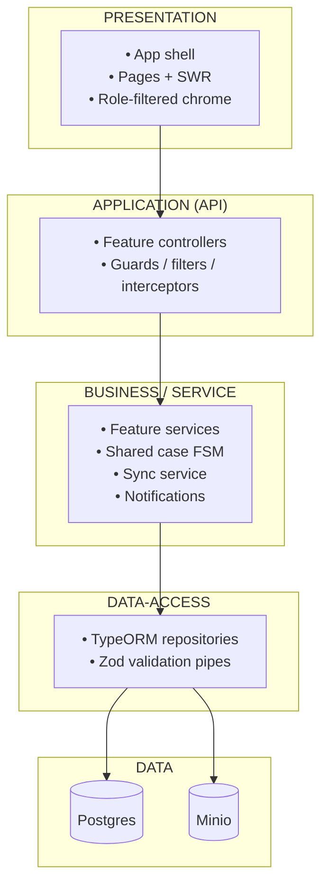
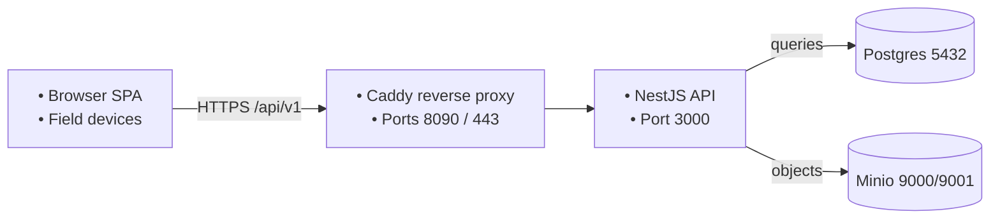
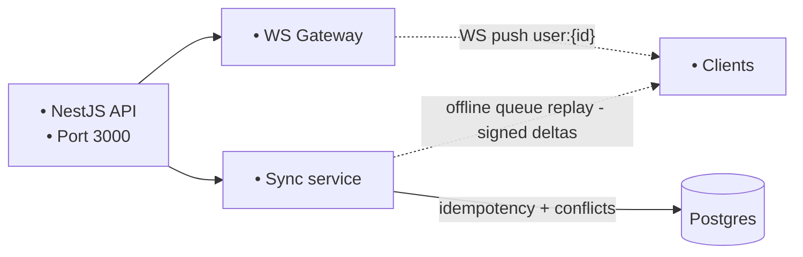

# System Architecture

This document describes the KAPWA (MSWDO Norzagaray Social Welfare System) runtime architecture from two complementary viewpoints: the **layered architecture** (the internal organization of the software into horizontal layers) and the **client–server architecture** (the physical and logical separation between client and server components). Both views share the same cross-cutting concerns: security, observability, and offline sync.

## 1. Purpose

Documents the KAPWA architecture from two viewpoints: (1) the layered architecture — presentation, application (API), business/service, data-access, and data layers with the cross-cutting concerns that span them — and (2) the client–server architecture — the browser/field clients, the NestJS API server, and the Postgres/Minio data servers, connected by HTTP/HTTPS and WebSocket. All functional requirements (FR-01..FR-17) are mapped onto both views.

## 2. Functional Specification

| ID | Requirement |
|----|-------------|
| FR-01 | The client speaks to the API only through the `/api/v1` versioned prefix (`api` global prefix + URI versioning `defaultVersion: '1'`) and authenticates every request with a `Bearer` token in the `Authorization` header (main.ts, lib/api.ts). |
| FR-02 | The api layer single-flights the 401 refresh flow — concurrent 401s share one in-flight `/auth/refresh` promise — and dispatches the `kapwa:auth:logout` CustomEvent when refresh fails or the network errors (lib/api.ts). |
| FR-03 | SWR provides server-state caching (fetcher = `api.get`, `dedupingInterval` 2000 ms), revalidation on window focus and network reconnect, per-page `keepPreviousData`, and integrates with the offline queue for queued mutations (routes.tsx SWRConfig, pages). |
| FR-04 | The API enforces throttling, the CSRF guard, helmet headers, and cookie parsing in the bootstrap (main.ts: `helmet()`, `cookieParser()`, CORS with credentials, global filters). |
| FR-05 | Role guards (`RolesGuard` with `@Roles`) plus the ABAC guard fallback (abac.guard.ts / abac.service.ts) enforce module access on every protected controller. |
| FR-06 | The shared case FSM (case-fsm.ts) is the single source of truth for case transitions — used by the cases module and re-validated by the sync service's `handleFsmTransition` pre-check (sync.service.ts imports `isValidTransition`). |
| FR-07 | The sync service accepts device deltas with an Ed25519 signature and idempotency checks, rejects unknown underscore-prefixed meta fields (`assertNoUnknownMetaFields`), whitelists payload columns, and resolves conflicts server-wins for financial tables (`ConflictResolver.FINANCIAL_TABLES`). |
| FR-08 | The notifications gateway pushes realtime messages over WebSocket (namespace `/notifications`, per-user `user:{id}` room); the notifications module provides a REST fallback for clients without a socket. |
| FR-09 | Minio stores documents (server-side uploads; presigned GET URLs only, bucket init on boot); the export module generates PDF (PDFKit), XLSX, and CSV artifacts. |
| FR-10 | Health endpoints `/health`, `/health/live`, `/health/ready` reflect Postgres connectivity (`SELECT 1`) and return 503 when the DB is unreachable (app.controller.ts). |
| FR-11 | JSON structured logging is enabled globally via `app.useLogger` (level, ISO timestamp, message, meta) in main.ts. |
| FR-12 | Graceful shutdown hooks are enabled via `app.enableShutdownHooks()`; the sync service implements `OnApplicationShutdown` to log the signal and rely on transactional queue entries for retry-safe shutdown. |
| FR-13 | The PII masking interceptor (pii.interceptor.ts) nulls out PII fields (surname, firstName, middleName, address, phone, dob, philsysNumber) on responses when the beneficiary's consent is revoked, with an admin bypass. |
| FR-14 | The global `AllExceptionsFilter` (common/filters/http-exception.filter.ts) normalizes all errors into `{ statusCode, message, timestamp, path }`, mapping throttler exceptions to 429 and WebSocket exceptions to 400. |
| FR-15 | Rate limiting is enforced app-wide by `ThrottlerGuard` registered as a global guard (`ThrottlerModule` 60 requests per 60,000 ms). |
| FR-16 | Postgres audit: the `pgaudit` extension is enabled during migration bootstrap (migrate.ts) and the `audit_log` table records IRF dispositions; the audit module exposes hash-chain verification and log queries (`/audit/verify-all`, `/audit/logs`). |
| FR-17 | Sync idempotency: duplicate deltas are answered from a 24 h idempotency window (`IDEMPOTENCY_TTL_MS = 86_400_000`) backed by an in-memory cache plus the `idempotency_keys` table, with stale-entry eviction. |

## 3. Architecture Diagrams (Mermaid)

**Printing:** every diagram below is rendered to its own US-Letter-size PDF by `docs/diagrams/print-diagrams.mjs` (output in `docs/diagrams/print/`, one file per diagram) — run `PUPPETEER_EXECUTABLE_PATH=/usr/bin/google-chrome-stable node docs/diagrams/print-diagrams.mjs` after editing.

### 3.1 Layered Architecture

The system is organized into five horizontal layers; each layer depends only on the layer below it, and the cross-cutting concerns wrap every layer.

### 3.2 Client–Server Architecture

Logical and physical separation: clients talk to the API server over HTTP/HTTPS; the API server talks to the data servers; a WebSocket channel carries realtime push. The view is split into two compact diagrams: the request path and the async channels.

#### 3.2a Request path

#### 3.2b Async channels

## 4. Diagram Narrative

**Layered view (3.1).** The presentation layer holds the React SPA: the app shell (routing, auth context, theme), feature pages that consume data through SWR hooks (FR-03), and the role-filtered chrome (Topbar, Sidebar, BottomNav). The application layer is the NestJS API: controllers receive HTTP requests and pass them through the global pipeline of guards (ThrottlerGuard FR-15, CsrfGuard FR-04, RolesGuard + AbacGuard FR-05), the AllExceptionsFilter (FR-14), and the PiiMaskingInterceptor (FR-13). The business/service layer implements the rules — feature services, the shared case FSM (FR-06), the sync service (FR-07, FR-17), and notifications (FR-08). The data-access layer is TypeORM repositories plus Zod validation pipes; the data layer is Postgres and Minio (FR-09, FR-10). Strictly layered: presentation → application → service → data-access → data. The layered view shows the pure layer structure; the cross-cutting concerns (auth FR-01/02, guards FR-04/05/15, PII masking FR-13, JSON logging FR-11, normalized errors FR-14, graceful shutdown FR-12) are enforced at the API boundaries and are specified in Section 2 rather than drawn as diagram edges.

**Client–server view (3.2).** Two diagrams. (3.2a) **Request path**: clients — the browser SPA and offline-capable field devices — reach the server only through Caddy, which proxies `/api/v1` to the NestJS API (FR-01); the API queries Postgres (relational state, idempotency keys, audit_log — FR-16, FR-17) and stores objects in Minio (FR-09). (3.2b) **Async channels**: the WebSocket gateway pushes realtime notifications into per-user `user:{id}` rooms (FR-08), and the sync service receives offline queue replays as signed deltas, deduplicates them via the 24 h idempotency window, and resolves conflicts against Postgres (FR-07, FR-17).

**Mapping.** Every edge in both diagrams carries the FR id that governs it; the functional table in Section 2 is the contract the diagrams render. The two views are complementary: the layered view answers "how is the software organized inside?", the client–server view answers "which components talk to which, over what protocol?".

## 5. Cross-References

| Item | Location |
|------|----------|
| app.module.ts — ThrottlerModule (60 req/min), TypeOrmModule (`migrationsRun: false`), 26 feature modules, global guard/filter/interceptor registration | `kapwa-server/src/app.module.ts` |
| main.ts — `enableShutdownHooks`, JSON logger (`app.useLogger`), global prefix `api` + URI versioning v1, helmet, cookieParser, CORS, AllExceptionsFilter, Swagger at `/api/docs` | `kapwa-server/src/main.ts` |
| lib/api.ts — `API_BASE` (`/api/v1`), Bearer header, single-flight refresh, `kapwa:auth:logout` dispatch | `kapwa-client/src/lib/api.ts` |
| SWR configuration — `SWRConfig` with fetcher `api.get`, `revalidateOnFocus`/`revalidateOnReconnect`, `dedupingInterval`; `keepPreviousData` used per page | `kapwa-client/src/routes.tsx` (pages: e.g. `SearchResultsPage.tsx`) |
| sync.service.ts — Ed25519 signature, idempotency TTL 86,400,000 ms, `assertNoUnknownMetaFields`, `applyChange`, server-wins conflict resolution | `kapwa-server/src/sync/sync.service.ts` |
| Conflict resolution policy (financial tables server-wins, notes append) | `kapwa-server/src/sync/conflict-resolver.ts` |
| case-fsm.ts — `CASE_FSM`, `isValidTransition`, `canTransition`; shared by cases + sync | `kapwa-server/src/cases/case-fsm.ts` |
| notifications.gateway.ts — namespace `/notifications`, `user:{id}` room, JWT at connect | `kapwa-server/src/notifications/notifications.gateway.ts` |
| Minio module — server-side uploads; presigned GET URLs only, bucket init on boot | `kapwa-server/src/minio/minio.service.ts` |
| pii-masking interceptor — PII fields nulled when consent revoked, admin bypass | `kapwa-server/src/beneficiaries/pii.interceptor.ts` |
| all-exceptions filter — 429 for throttler, 400 for WS, normalized `{statusCode, message, timestamp, path}` | `kapwa-server/src/common/filters/http-exception.filter.ts` |
| Role + ABAC guards — `@Roles` enforcement with ABAC fallback | `kapwa-server/src/auth/guards/roles.guard.ts`, `kapwa-server/src/auth/guards/abac.guard.ts` |
| Health endpoints — `/health`, `/health/live`, `/health/ready` (DB `SELECT 1`) | `kapwa-server/src/app.controller.ts` |
| Offline queue — localStorage queue, version vectors, conflict states | `kapwa-client/src/lib/offline-queue.ts` |
| Export module — PDF (PDFKit), XLSX, CSV; certificates, monthly funds, audit logs | `kapwa-server/src/export/export.service.ts`, `kapwa-server/src/export/export.controller.ts` |
| Audit — hash-chain verification, audit logs, `pgaudit` extension + `audit_log` table | `kapwa-server/src/audit/audit.controller.ts`, `kapwa-server/src/database/migrate.ts`, `kapwa-server/src/database/migrations/20260622000005-IRFDispositionEncryption.ts` |