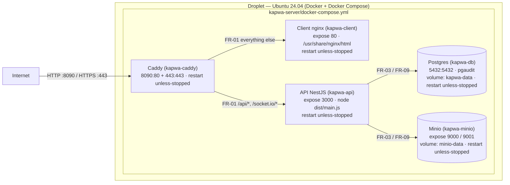
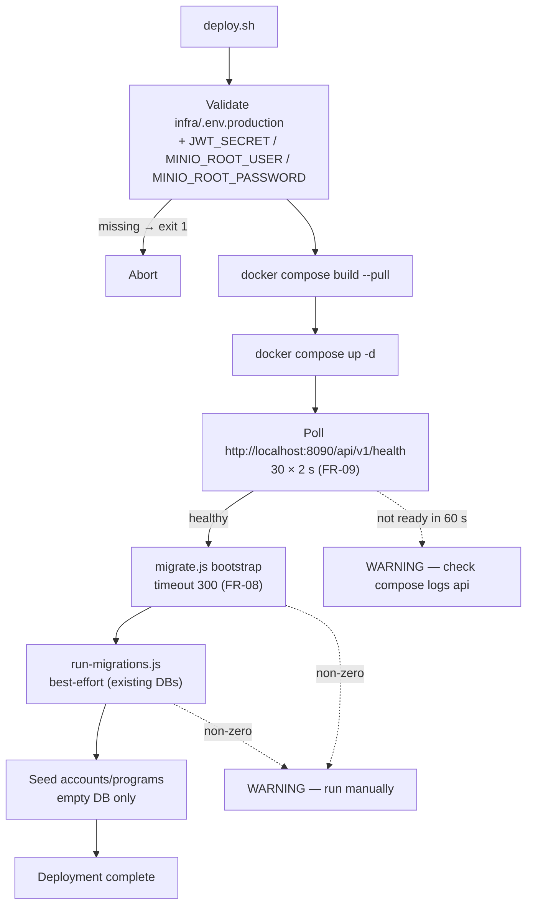

# Deployment Diagram

This document describes how KAPWA (MSWDO Norzagaray Social Welfare System) is deployed on a DigitalOcean Droplet: the five-container Docker Compose topology, published ports, persistent volumes, healthcheck-gated startup order, and the request path from the public Internet through Caddy to the client and API tiers.

## 1. Purpose

Documents the production droplet topology — five containers (db, api, minio, client, caddy) defined in `kapwa-server/docker-compose.yml` — covering published/exposed ports, persistent volumes, healthcheck-gated startup ordering, and the request path from the Internet through the Caddy reverse proxy to the nginx-served SPA and the NestJS API.

## 2. Functional Specification

| ID | Requirement |
|----|-------------|
| FR-01 | Caddy publishes port `8090` (HTTP, mapped to container `:80`) and `443` (HTTPS); it routes `/api/*` and `/socket.io/*` to the API container (`api:3000`) and everything else to the client container (`client:80`), with `/health` answered directly by Caddy (infra/Caddyfile). |
| FR-02 | The client serves the built SPA as static files from nginx on container port `80` (exposed internally only); the `dist/` bundle is produced by the `node:20-alpine` build stage and copied into `/usr/share/nginx/html` of the `nginx:stable-alpine` production stage (kapwa-client/Dockerfile). |
| FR-03 | The API exposes port `3000` internally only (`expose`, no host port mapping — direct host access is commented out); it starts only after `db` and `minio` report healthy via `depends_on: condition: service_healthy` (docker-compose.yml). |
| FR-04 | Postgres persists its data directory `/var/lib/postgresql/data` in the `kapwa-data` volume and starts with `shared_preload_libraries=pgaudit` and `pgaudit.log=all` (Dockerfile.db + compose `command`); the port mapping `5432:5432` makes it reachable on the host for backup tooling. |
| FR-05 | Minio persists objects in the `minio-data` volume (`/data`) and serves the S3 API on `9000` and the console on `9001`, both exposed internally only (`server /data --console-address ":9001"`). |
| FR-06 | The named volumes `kapwa-data`, `minio-data`, and `caddy-data` survive container recreation and `docker compose down` (volumes section of docker-compose.yml). |
| FR-07 | All five services set `restart: unless-stopped`, so containers restart automatically after crashes or droplet reboots. |
| FR-08 | Deployment is reproducible via `deploy.sh`: validate `infra/.env.production` (file existence plus `JWT_SECRET`/`MINIO_ROOT_USER`/`MINIO_ROOT_PASSWORD`), `docker compose build --pull`, `up -d`, poll `http://localhost:8090/api/v1/health` (30 × 2 s), run `migrate.js` bootstrap with a 300 s timeout, then run `run-migrations.js` best-effort for existing-DB upgrades (both non-zero exits warn but do not abort), and seed accounts/programs only when the users table is empty. |
| FR-09 | Healthchecks gate startup order: db (`pg_isready`), minio (`/minio/health/live`), api (HTTP GET `/api/v1/` on 3000, start_period 30 s), client (`wget` on 80), caddy (`wget /health` on 80, start_period 30 s); api depends on db+minio healthy, caddy depends on api healthy + client started. |
| FR-10 | Database backups run via `infra/backup/backup.sh` (pg_dump custom-format + gzip against the db service), upload to the Minio `backups` bucket, and apply rotation (7 daily, 4 weekly, 3 monthly); scheduled by `infra/backup/cron`. |
| FR-11 | The db and api containers set `TZ: Asia/Manila` so container timezone matches the agency's local time for logs and audit timestamps. |
| FR-12 | The db, api, minio, and caddy services load secrets from the shared `env_file: ../infra/.env.production` (caddy also mounts it read-only at `/etc/caddy/.env`). |
| FR-13 | Healthchecks use bounded probing: db `interval 10 s / timeout 5 s / retries 5`; api `interval 15 s / timeout 10 s / retries 5 / start_period 30 s`; minio `interval 15 s / timeout 10 s / retries 5 / start_period 30 s`; client `interval 15 s / timeout 5 s / retries 3`; caddy `interval 15 s / timeout 10 s / retries 5 / start_period 30 s` (docker-compose.yml). |

## 3. Deployment Diagram (Mermaid)

## 4. Diagram Narrative

**Request path.** A browser request arrives at the droplet's public IP on `:8090` (HTTP development/health probing) or `:443` (HTTPS production, per the commented production stanza in infra/Caddyfile). Caddy applies rate limiting (600 events/minute per remote host) and security headers, then branches: `/api/*` and `/socket.io/*` are reverse-proxied to `api:3000` (FR-01) with `X-Forwarded-*` headers; `/health` is answered directly; everything else falls through to `client:80`, where nginx serves the static SPA bundle built by the multi-stage Dockerfile (FR-02). The API — reachable only inside the compose network — talks to Postgres on `db:5432` (audited via pgaudit, FR-04) and Minio on `minio:9000` for document storage (FR-05). Postgres is additionally published on the host `5432` so `infra/backup/backup.sh` can `pg_dump` it (FR-10).

**Startup order.** Compose starts `db` and `minio` first; the API's `depends_on: condition: service_healthy` (FR-03) holds it until both pass their healthchecks; Caddy's `depends_on` holds it until the API is healthy and the client has started (FR-09). All services restart `unless-stopped` (FR-07) and named volumes persist state across recreation (FR-06).

**Deploy sequence.** `deploy.sh` (FR-08) validates the production env file and required secrets, builds with `--pull`, starts the stack, polls API health through Caddy on `:8090`, then applies the schema via `migrate.js` (300 s timeout, canonical fresh bootstrap — also run at API startup) followed by `run-migrations.js` as a best-effort no-op for fresh deployments that only applies pending upgrades on existing databases; seeds run only against an empty users table. Both migration steps warn rather than abort, keeping the deploy idempotent.

**Mapping.** The main diagram's edges and annotations carry the FR ids from Section 2; the second diagram renders the FR-08 deploy sequence.

## 5. Cross-References

| Item | Location |
|------|----------|
| Compose topology — 5 services (db, api, minio, client, caddy), container names `kapwa-*`, ports `8090:80`/`443:443`/`5432:5432`, exposes 3000/9000/9001/80, volumes `kapwa-data`/`minio-data`/`caddy-data`, `restart: unless-stopped`, `TZ: Asia/Manila`, `env_file: ../infra/.env.production`, healthchecks + `depends_on: condition: service_healthy`, db command with `shared_preload_libraries=pgaudit` | `kapwa-server/docker-compose.yml` |
| API image — `node:20-alpine` multi-stage, production stage runs `node dist/main.js`, `EXPOSE 3000`, non-root `appuser` | `kapwa-server/Dockerfile` |
| Client image — `node:20-alpine` build → `nginx:stable-alpine` production, `dist/` copied to `/usr/share/nginx/html`, `EXPOSE 80` | `kapwa-client/Dockerfile` |
| Caddy reverse proxy — `:80` with `rate_limit`, security headers, `/api/*` + `/socket.io/*` → `api:3000`, `/health` → 200, fallback → `client:80`; production TLS stanza commented | `infra/Caddyfile` |
| Deployment script — env validation, `build --pull`, `up -d`, health poll, `migrate.js` bootstrap (timeout 300), `run-migrations.js` best-effort, conditional seeding | `deploy.sh` |
| Backup — `pg_dump` custom format + gzip against the db service, Minio `backups` bucket upload, rotation (7 daily / 4 weekly / 3 monthly) | `infra/backup/backup.sh`, `infra/backup/cron` |