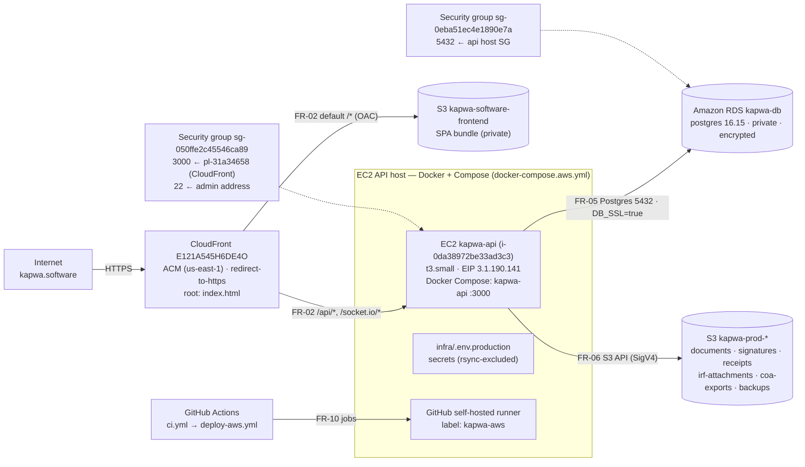
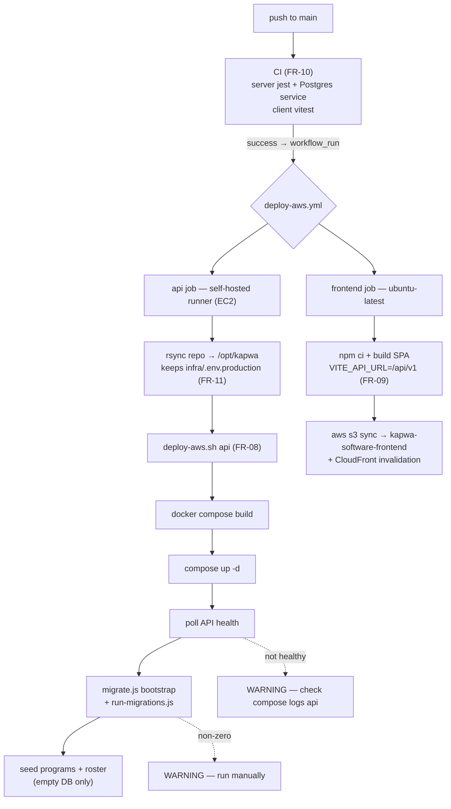

# Deployment Diagram

This document describes how KAPWA (MSWDO Norzagaray Social Welfare System) is deployed on AWS in `ap-southeast-1`: the CloudFront distribution that fronts both the S3-hosted SPA and the EC2 API container, the single-container Docker Compose topology on the API host, the private Amazon RDS Postgres instance, the S3 object-storage buckets, and the GitHub Actions pipeline (self-hosted runner on the API host + GitHub-hosted SPA job) that ships it.

## 1. Purpose

Documents the production AWS topology — CloudFront (`kapwa.software`), the S3 frontend bucket, one `kapwa-api` container on EC2 (`docker-compose.aws.yml`, no db/minio/caddy containers), Amazon RDS Postgres, and the `kapwa-prod-*` S3 buckets — covering origins and behaviours, security-group ingress, the deploy pipeline (`deploy-aws.sh` via GitHub Actions), migrations/seeding, and backups. The legacy single-host Docker model (`deploy.sh`, `docker-compose.yml`, Caddy + five containers) is superseded and kept only for local/PC development.

## 2. Functional Specification

| ID | Requirement |
|----|-------------|
| FR-01 | Amazon CloudFront distribution `E121A545H6DE4O` serves the public hostnames `kapwa.software` and `www.kapwa.software` with an ACM certificate issued in `us-east-1`, `redirect-to-https`, and `index.html` as the default root object. |
| FR-02 | CloudFront routes by path: the default behaviour (`/*`) targets the `s3-frontend` origin (`kapwa-software-frontend.s3.ap-southeast-1.amazonaws.com`) through an origin access control (`E2ASDNA4VABPR7`) on the private bucket; `/api/*` and `/socket.io/*` target the `ec2-api` origin (custom origin `origin.kapwa.software`, HTTP port `3000`, `http-only`, TLSv1.2, 30 s read timeout). |
| FR-03 | The API runs as a single Docker Compose service `kapwa-api` on EC2 (`kapwa-server/docker-compose.aws.yml`): `ports: 3000:3000`, `restart: unless-stopped`, healthcheck `GET http://localhost:3000/api/v1/health` (15 s interval, 30 s start period). The stack has **no** db, minio, client, or caddy services — CloudFront is the only entry point. |
| FR-04 | The API host is EC2 instance `kapwa-api` (`i-0da38972be33ad3c3`, `t3.small`, x86_64) with Elastic IP `3.1.190.141`; IMDSv2 is required. Its security group allows `22` only from the administrator's address and `3000` only from the CloudFront managed prefix list `pl-31a34658` — the API is never exposed to `0.0.0.0/0`. |
| FR-05 | Postgres is Amazon RDS `kapwa-db` (`kapwa-db.cjkg040y6akq.ap-southeast-1.rds.amazonaws.com:5432`), engine `postgres 16.15`, `db.t3.micro`, 20 GB gp3, storage-encrypted, single-AZ, **not publicly accessible**; its security group `sg-0eba51ec4e1890e7a` allows `5432` only from the API host's security group. The API connects with `DB_SSL=true`. |
| FR-06 | Documents live in Amazon S3, reached through the MinIO-compatible client (`MINIO_ENDPOINT=s3.ap-southeast-1.amazonaws.com`, `MINIO_PORT=443`, `MINIO_USE_SSL=true`, `MINIO_REGION=ap-southeast-1`, `MINIO_BUCKET_PREFIX=kapwa-prod`): `kapwa-prod-documents`, `kapwa-prod-worker-signatures`, `kapwa-prod-client-receipts`, `kapwa-prod-irf-attachments`, `kapwa-prod-coa-exports`, `kapwa-prod-backups`. The API host has **no IAM instance profile**, so it authenticates with the dedicated IAM user `kapwa-app-s3` (`kapwa-s3-access` policy) whose access key/secret live in `infra/.env.production` as `MINIO_ROOT_USER` / `MINIO_ROOT_PASSWORD`. |
| FR-07 | Backups: `infra/backup/backup.sh` performs a `pg_dump` (custom format, gzip) against RDS and uploads it to `kapwa-prod-backups`; RDS automated backups add a 1-day point-in-time window. |
| FR-08 | `deploy-aws.sh api` (run on the host) validates `infra/.env.production` (JWT, MinIO/S3, `IRF_ENCRYPTION_KEY`), builds the API image, runs `docker compose -f kapwa-server/docker-compose.aws.yml up -d`, then applies the schema with `migrate.js` (canonical fresh bootstrap, also run at API startup) and `run-migrations.js` (pending upgrades on existing DBs). Reference data is seeded on every deploy (programs + required documents) and accounts only when the users table is empty (production roster). |
| FR-09 | `deploy-aws.sh frontend` installs client dependencies, builds the SPA with `VITE_API_URL=/api/v1`, syncs it to `kapwa-software-frontend` with long-lived cache headers for hashed assets, and invalidates the CloudFront distribution. It runs with scoped credentials (`AWS_DEPLOY_ACCESS_KEY_ID` / `AWS_DEPLOY_SECRET_ACCESS_KEY`, restricted to the bucket + invalidation) because it executes on a GitHub-hosted runner. |
| FR-10 | CI/CD: `.github/workflows/ci.yml` runs the server suite against a Postgres service and the client suite; on success `.github/workflows/deploy-aws.yml` runs as a `workflow_run` with two jobs — `api` on the **self-hosted runner labelled `kapwa-aws` installed on the EC2 host** (no inbound SSH from GitHub; the runner talks outbound only), and `frontend` on `ubuntu-latest`. |
| FR-11 | The `api` job `rsync`s the repository to `/opt/kapwa` (excluding `.git/`, `node_modules/`, `dist/`, `coverage/`, and **`infra/.env.production`**, which holds the real secrets and is never overwritten) before invoking `deploy-aws.sh api`. |
| FR-12 | All resources live in `ap-southeast-1`, except the ACM certificate and CloudFront (global), which are in `us-east-1` as AWS requires. |

## 3. Deployment Diagram (Mermaid)

**Printing:** every diagram below is rendered to its own US-Letter-size PDF by `docs/diagrams/print-diagrams.mjs` (output in `docs/diagrams/print/`, one file per diagram) — run `PUPPETEER_EXECUTABLE_PATH=/usr/bin/google-chrome-stable node docs/diagrams/print-diagrams.mjs` after editing.

### 3.1 AWS production topology

```mermaid
flowchart LR
  subgraph Host["EC2 API host — Docker + Compose (docker-compose.aws.yml)"]
    API["EC2 kapwa-api (i-0da38972be33ad3c3)<br/>t3.small · EIP 3.1.190.141<br/>Docker Compose: kapwa-api :3000"]
    Env["infra/.env.production<br/>secrets (rsync-excluded)"]
    Runner["GitHub self-hosted runner<br/>label: kapwa-aws"]
  end

  Internet["Internet<br/>kapwa.software"] -->|"HTTPS"| CF["CloudFront E121A545H6DE4O<br/>ACM (us-east-1) · redirect-to-https<br/>root: index.html"]

  %% FR-02
  CF -->|"FR-02 default /* (OAC)"| SPA[("S3 kapwa-software-frontend<br/>SPA bundle (private)")]
  CF -->|"FR-02 /api/*, /socket.io/*"| API

  %% FR-05 / FR-06
  API -->|"FR-05 Postgres 5432 · DB_SSL=true"| RDS[("Amazon RDS kapwa-db<br/>postgres 16.15 · private · encrypted")]
  API -->|"FR-06 S3 API (SigV4)"| S3[("S3 kapwa-prod-*<br/>documents · signatures · receipts<br/>irf-attachments · coa-exports · backups")]

  %% FR-10
  GitHub["GitHub Actions<br/>ci.yml → deploy-aws.yml"] -->|"FR-10 jobs"| Runner

  %% FR-04: 3000 open only to the CloudFront prefix list; 22 from the admin address
  SGW["Security group sg-050ffe2c45546ca89<br/>3000 ← pl-31a34658 (CloudFront)<br/>22 ← admin address"] -.-> API
  %% FR-05: RDS SG allows 5432 only from the API host SG
  SGR["Security group sg-0eba51ec4e1890e7a<br/>5432 ← api host SG"] -.-> RDS
```

### 3.2 Deploy pipeline

```mermaid
flowchart TD
  Push["push to main"] --> CI["CI (FR-10)<br/>server jest + Postgres service<br/>client vitest"]
  CI -->|"success → workflow_run"| Dispatch{"deploy-aws.yml"}

  Dispatch --> ApiJob["api job — self-hosted runner (EC2)"]
  ApiJob --> Sync["rsync repo → /opt/kapwa<br/>keeps infra/.env.production (FR-11)"]
  Sync --> DeployApi["deploy-aws.sh api (FR-08)"]
  DeployApi --> Build["docker compose build"]
  Build --> Up["compose up -d"]
  Up --> HealthPoll["poll API health"]
  HealthPoll --> Migrate["migrate.js bootstrap<br/>+ run-migrations.js"]
  Migrate --> Seed["seed programs + roster<br/>(empty DB only)"]

  Dispatch --> FeJob["frontend job — ubuntu-latest"]
  FeJob --> BuildSpa["npm ci + build SPA<br/>VITE_API_URL=/api/v1 (FR-09)"]
  BuildSpa --> S3Sync["aws s3 sync → kapwa-software-frontend<br/>+ CloudFront invalidation"]

  HealthPoll -.->|"not healthy"| Warn["WARNING — check compose logs api"]
  Migrate -.->|"non-zero"| Warn2["WARNING — run manually"]
```

## 4. Diagram Narrative

**Request path.** A browser request for `kapwa.software` terminates at CloudFront (FR-01), which serves the SPA bundle from the private S3 frontend bucket through an origin access control and proxies `/api/*` and `/socket.io/*` to the EC2 origin `origin.kapwa.software:3000` over HTTP inside AWS (FR-02). The API container — the only service on the host (FR-03) — opens a TLS connection to RDS Postgres (`DB_SSL=true`, FR-05) and signs SigV4 requests to the `kapwa-prod-*` S3 buckets for documents (FR-06). Nothing but CloudFront can reach port 3000, and RDS accepts connections only from the API host's security group, so neither the API nor the database is publicly reachable (FR-04, FR-05).

**Deploy pipeline.** A push to `main` runs CI; when it succeeds, `deploy-aws.yml` starts two jobs (FR-10). The `api` job executes on the self-hosted runner installed on the EC2 host itself: it `rsync`s the repository into `/opt/kapwa` while preserving the host's secret file (FR-11) and then runs `deploy-aws.sh api`, which validates the environment, rebuilds the image, restarts the stack, and applies migrations plus reference seeds (FR-08). Because the runner dials out to GitHub, no inbound SSH is ever opened for deployments. The `frontend` job runs on a GitHub-hosted runner, builds the SPA with `VITE_API_URL=/api/v1`, syncs it to the frontend bucket and invalidates CloudFront (FR-09). Both jobs are idempotent: re-running them converges the deployment, and migration/seed failures warn rather than abort the API job except on a fresh-database bootstrap failure, where the API exits so the platform can retry cleanly.

**State and recovery.** Relational state lives in RDS (single-AZ, storage-encrypted, 1-day automated backups, FR-05); documents live in S3 (versioning/durability of the service, FR-06); `infra/backup/backup.sh` adds logical dumps into `kapwa-prod-backups` (FR-07). The API host is stateless — the container can be recreated from the image at any time — so the only irreplaceable state is RDS and S3, both managed services.

**Mapping.** The main diagram's edges and annotations carry the FR ids from Section 2; the second diagram renders the FR-08/FR-09/FR-10 pipeline. The runtime layering behind these boxes is documented in `08-system-architecture.md`.

## 5. Cross-References

| Item | Location |
|------|----------|
| AWS compose topology — single `kapwa-api` service, `ports: 3000:3000`, healthcheck `/api/v1/health`, `env_file: ../infra/.env.production`, no db/minio/client/caddy services | `kapwa-server/docker-compose.aws.yml` |
| AWS deploy script — modes `all\|api\|frontend`; `api` builds + `compose up` + migrate + seeds; `frontend` builds the SPA + S3 sync + CloudFront invalidation; defaults (`AWS_HOST=ubuntu@3.1.190.141`, `/opt/kapwa`, `kapwa-software-frontend`, distribution `E121A545H6DE4O`, region `ap-southeast-1`) | `deploy-aws.sh` |
| CI workflow — server jest against a Postgres service, client vitest + coverage | `.github/workflows/ci.yml` |
| Deploy workflow — `workflow_run` on CI success; `api` job on the self-hosted `kapwa-aws` runner (rsync to `/opt/kapwa`, `deploy-aws.sh api`); `frontend` job on `ubuntu-latest` (S3 + invalidation via scoped secrets); `workflow_dispatch` for manual runs | `.github/workflows/deploy-aws.yml` |
| Provisioning runbook — VPC/SGs, RDS instance, S3 buckets, IAM/OIDC, CloudFront + OAC, runner installation, secrets, DNS | `docs/DEPLOYMENT-AWS.md` |
| Object storage in code — MinIO-compatible client signing against S3 in production (`MINIO_ENDPOINT`, `MINIO_REGION`, `MINIO_BUCKET_PREFIX=kapwa-prod`) | `kapwa-server/src/minio/minio.service.ts` |
| API image — `node:20-alpine` multi-stage, production stage runs `node dist/main.js`, `EXPOSE 3000`, non-root `appuser` | `kapwa-server/Dockerfile` |
| Migration bootstrap at startup — `migrate()` runs before Nest boots (fresh-boot schema + marks migrations applied), then `run-migrations.js` applies pending upgrades | `kapwa-server/src/main.ts`, `kapwa-server/src/database/migrate.ts` |
| Backup — `pg_dump` custom format + gzip, upload to the backups bucket, rotation (7 daily / 4 weekly / 3 monthly) | `infra/backup/backup.sh`, `infra/backup/cron` |
| Legacy single-host model (superseded) — Caddy + five containers (db, api, minio, client, caddy) on one Docker host, `8090:80`/`443:443` | `docker-compose.yml`, `infra/Caddyfile`, `deploy.sh`, `docs/DEPLOYMENT.md` |
