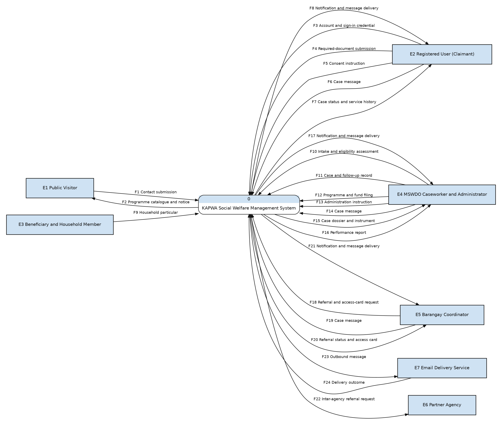

# 10 — Data Flow Diagram, Level 0 (Context Diagram)

**Project:** KAPWA — MSWDO Norzagaray Social Welfare System
**Notation:** Gane & Sarson
**Purpose:** Show the system as a single black box and every exchange it has with the outside world.

---

## 1. What this diagram shows

Level 0 answers one question only: **what enters the system, and what leaves it.** The
entire KAPWA system is drawn as a single process. Nothing inside the boundary is
visible — that is what Level 1 is for.

Every arrow crossing the boundary is a real, implemented exchange. There is no
speculative flow for a feature that is disabled, removed, or never built.

---

## 2. Notation

| Symbol | Name | How it is drawn |
| --- | --- | --- |
| Entity | External entity | Filled rectangle (light blue `#cfe2f3`, thin black border) with the entity name inside |
| Data flow | Data flow | Directed arrow, named with a noun phrase |
| Process | Process | Rounded rectangle split by a band: the process number in the shaded band, the verb-phrase name in the body |
| Data store | Data store | Rectangle divided by a vertical rule: the `D`-number in the shaded left cell, the store name in the right cell |

Every element is drawn by the Graphviz `dot` renderer from the `dot` code blocks below, so
the printed PDF and the rendered image carry identical symbols. Entities and stores are
distinguished by shape as well as fill — a store is a divided rectangle, an entity is a
plain one — never by border weight alone.

Processes are named with a **verb phrase** (`Manage Case Lifecycle…`), not a noun
phrase. A Gane–Sarson process describes an action the system performs.

---

## 3. External entities

| ID | Entity | Basis in the system |
| --- | --- | --- |
| E1 | Public Visitor | Unauthenticated reader of the programme catalogue; may submit a contact message |
| E2 | Registered User (Claimant) | Holds an account; signs in, submits documents, consents, exchanges case messages |
| E3 | Beneficiary and Household Member | Subject of the household record; supplies particulars during intake |
| E4 | MSWDO Caseworker and Administrator | The only staff role family that operates the system day to day |
| E5 | Barangay Coordinator | Refers a household, requests access cards, follows its own referrals |
| E6 | Partner Agency | Receives an endorsed inter-agency referral |
| E7 | Email Delivery Service | External SMTP relay used for verification and notification mail |

### Entities deliberately not drawn

| Candidate | Why it is absent |
| --- | --- |
| Oversight Officials (Mayor, Auditor) | The `mayor` and `auditor` roles were sunset. Audit, export and reporting are administrator-only. The Mayor's name survives only as a printed signatory on a petty cash voucher, which is not a system interaction. |
| Partner Agency Staff | The `agency_staff` role no longer exists. Partner agencies are records the administrator maintains; they do not sign in and cannot respond inside the system. E6 is therefore receive-only. |
| Analytics Consumer | The analytics feature is flagged off by default and is explicitly marked not ready. A disabled flag is not a function. |
| Payment Gateway | 4Ps payouts are scheduled and recorded internally. No payment processor is integrated. |
| SMS / Push Provider | Notifications are in-app and over the realtime channel only. No external messaging provider is called. |

---

## 4. Diagram

---

## 5. Flows

Labels on the diagram are abbreviated for legibility. This table carries the full
name of every flow, and those full names are the ones used at Level 1.

| ID | Flow | Direction | Notes |
| --- | --- | --- | --- |
| F1 Contact submission | Contact submission | E1 → 0 | Public enquiry or contact message from an unauthenticated visitor |
| F2 Programme catalogue and notice | Programme catalogue and notice | 0 → E1 | Published programme catalogue and public announcements |
| F3 Account and sign-in credential | Account and sign-in credential | E2 → 0 | Account creation, sign-in, one-time code, device trust |
| F4 Required-document submission | Required-document submission | E2 → 0 | Evidence uploaded against a case requirement |
| F5 Consent instruction | Consent instruction | E2 → 0 | Grant or revoke consent for data sharing |
| F6 Case message | Case message | E2 → 0 | Message on a case thread |
| F7 Case status and service history | Case status and service history | 0 → E2 | What the user is entitled to see |
| F8 Notification and message delivery | Notification and message delivery | 0 → E2 | In-app and realtime delivery |
| F9 Household particular | Household particular | E3 → 0 | Personal and household details captured at intake |
| F10 Intake and eligibility assessment | Intake and eligibility assessment | E4 → 0 | Intake record and eligibility decision |
| F11 Case and follow-up record | Case and follow-up record | E4 → 0 | Case step, assistance, intervention, follow-up visit, event |
| F12 Programme and fund filing | Programme and fund filing | E4 → 0 | Programme setup, compliance filing, payout schedule |
| F13 Administration instruction | Administration instruction | E4 → 0 | Role assignment, device revocation, notice publication, tenant reset |
| F14 Case message | Case message | E4 → 0 | Message on a case thread |
| F15 Case dossier and instrument | Case dossier and instrument | 0 → E4 | Case detail plus printable certificates and vouchers |
| F16 Performance report | Performance report | 0 → E4 | Case, schedule and fund reporting output |
| F17 Notification and message delivery | Notification and message delivery | 0 → E4 | In-app and realtime delivery |
| F18 Referral and access-card request | Referral and access-card request | E5 → 0 | Barangay referral and access-card request |
| F19 Case message | Case message | E5 → 0 | Message on a case thread |
| F20 Referral status and access card | Referral status and access card | 0 → E5 | Outcome of the referral, the access card, case reporting |
| F21 Notification and message delivery | Notification and message delivery | 0 → E5 | In-app and realtime delivery |
| F22 Inter-agency referral request | Inter-agency referral request | 0 → E6 | Endorsed referral handed to a partner agency |
| F23 Outbound message | Outbound message | 0 → E7 | Verification, notification and document mail |
| F24 Delivery outcome | Delivery outcome | E7 → 0 | Bounce and delivery receipt |

---

## 6. Rules this diagram obeys

| Rule | Status |
| --- | --- |
| The system is a single process at Level 0 | Yes |
| Every external entity has at least one flow | Yes — all seven |
| No external entity talks to another external entity | Yes |
| No external entity reaches a data store directly | Yes — no stores appear at this level |
| Processes do not connect to each other at the same level | Yes — only one process exists |
| Every flow is a noun phrase, not a verb phrase | Yes |
| Every flow is balanced in Level 1 | Yes — see the balancing table in `11-dfd-level-1.md` §8 |

---

## 7. One receive-only entity

**E6 Partner Agency has an outbound flow and no inbound flow.** This is deliberate and
is a factual property of the system, not an omission. The `agency_staff` role was
removed, so a partner agency cannot sign in, cannot see the referral, and cannot
respond. The system hands the referral out; the response happens outside the system.

A reader may reasonably ask whether E6 belongs on the diagram at all. It does, because
a referral genuinely leaves the boundary. A flow crossing out of the system is part of
the context even when nothing comes back.

---

## 8. Source of truth

Every entity and flow above was read from the running code, not from earlier
documentation:

- Route guards and role decorators on each controller, to establish which actor can
  actually reach a capability.
- The `UserRole` enumeration, which holds exactly four roles: `admin`,
  `social_worker`, `coordinator`, `claimant`. The `mayor`, `auditor` and `agency_staff`
  roles were sunset by migration and appear nowhere in the server.
- The mail transport, which leaves the host, making E7 a genuine external entity.converted 1 block(s) in 10-dfd-level-0.md
