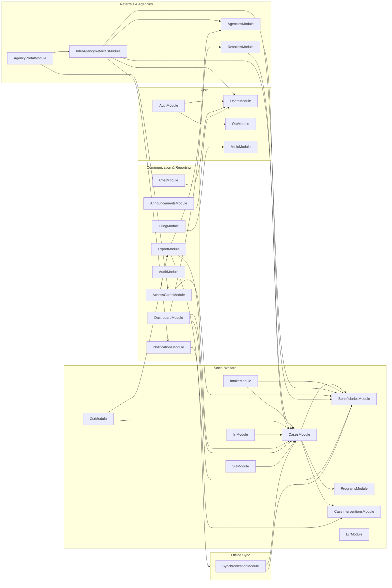

# Program Specification

Functional specification of every server program (module) in the KAPWA system, plus the client shell. Each module section follows one template: purpose, functional requirements, inputs, processing rules, outputs, endpoints, client surfaces, and dependencies.

## 1. Purpose

Documents the program-level specification of the KAPWA MSWDO social welfare system — the 26 server feature modules and the React client shell — so that each program's inputs, processing rules, outputs, and interfaces are fully specified and traceable to the functional requirements of the system.

## 2. Program Specifications

### P-01: Authentication (AuthModule)

- **Purpose:** Registers and authenticates users (MSWDO staff, coordinators, claimants, agency staff, mayor, auditor), issues JWTs, and manages MFA, email verification, and password recovery.
- **Functional Requirements:**

| ID | Requirement |
|----|-------------|
| FR-AUTH-01 | A user SHALL log in with email + password; on success the API SHALL return an access token and the user profile. |
| FR-AUTH-02 | When MFA is enabled for the account, login SHALL return an MFA challenge with a short-lived temporary token; the user SHALL verify with an OTP. |
| FR-AUTH-03 | The refresh flow SHALL rotate tokens; a revoked/invalid refresh token SHALL force re-login. |
| FR-AUTH-04 | Registration SHALL create a claimant account and require email verification before first login. |
| FR-AUTH-05 | Forgot/reset password SHALL be email-based with expiry; reset SHALL invalidate prior tokens (token version bump). |

- **Inputs:** LoginDto (email, password), RegisterDto (name, email, phone, password), MfaVerifyDto (code), refresh token, forgot/reset DTOs.
- **Processing:** bcrypt password hashing; JWT access + refresh issuance; MFA challenge (temp token 5 min); email verification token; refresh token rotation with `token_version` check/bump; single-flight 401 refresh on the client.
- **Outputs:** accessToken, user profile, MFA challenge object, verification emails.
- **Endpoints:** `POST /auth/login`, `POST /auth/register`, `POST /auth/refresh`, `POST /auth/logout`, `POST /auth/verify-email`, `POST /auth/forgot-password`, `POST /auth/reset-password`, `POST /auth/mfa/setup`, `POST /auth/mfa/verify`, `POST /auth/mfa/enable`, `POST /auth/mfa/disable`, `GET /auth/me` (19 routes).
- **Client surfaces:** LoginPage, RegisterPage, ForgotPasswordPage, ResetPasswordPage, VerifyEmailPage, MfaSetupPage, SettingsPage (MFA).
- **Dependencies:** UsersModule (UserRepository), OtpModule, EmailModule, JwtModule.

### P-02: Synchronization (SyncModule)

- **Purpose:** Enables offline field work: devices push change deltas and pull server state with signature verification, idempotency, and conflict resolution.
- **Functional Requirements:**

| ID | Requirement |
|----|-------------|
| FR-SYNC-01 | A device SHALL push signed deltas; the server SHALL reject requests with an invalid Ed25519 signature. |
| FR-SYNC-02 | The server SHALL reject payloads containing unknown underscore-prefixed meta fields (only `_fsmTransition` and `_clientUpdatedAt` allowed). |
| FR-SYNC-03 | Replayed requests with the same idempotency key SHALL return the cached result (TTL 86,400,000 ms). |
| FR-SYNC-04 | Conflicts on financial tables (interventions, disbursements, financial_assistance, case_interventions, access_card_services) SHALL resolve server-wins. |
| FR-SYNC-05 | Applied FSM transitions SHALL be re-validated against the shared case FSM. |

- **Inputs:** SyncPushDto (deviceId, changes, versionVectors, idempotencyKey, signature), pull query params.
- **Processing:** pre-flight meta-field rejection → Ed25519 signature verify → idempotency lookup → apply changes (transactional, SERIALIZABLE where needed) → conflict resolution (server-wins for financial tables, notes appended) → FSM re-validation → version vector update.
- **Outputs:** applied changes, resolved conflicts, fresh version vectors, queued/pending statuses.
- **Endpoints:** `POST /sync/push`, `POST /sync/pull`, `GET /sync/status`, `POST /sync/ack` (4 routes).
- **Client surfaces:** `lib/offline-queue.ts`, `hooks/useConnectivity.ts`, `hooks/useSyncStatus.ts`, Topbar offline/pending badges.
- **Dependencies:** SyncQueueEntity, VersionVectorEntity, IdempotencyKeys, CasesModule (case-fsm).

### P-03: Case Management (CasesModule)

- **Purpose:** Manages the social welfare case lifecycle from enrollment through assessment, review, active service, transition, and closure.
- **Functional Requirements:**

| ID | Requirement |
|----|-------------|
| FR-CASE-01 | A case SHALL be created referencing one beneficiary with status `enrolled`. |
| FR-CASE-02 | Transitions SHALL follow the shared FSM (`CASE_FSM`); invalid transitions SHALL return 400. |
| FR-CASE-03 | Role guards SHALL enforce transitions via `CASE_FSM_ROLES`; disburse (`ACTIVE`→`TRANSITIONING`) is admin-only; admin SHALL override any role check. |
| FR-CASE-04 | Precondition guards SHALL apply per status (assessment complete, FRVA/SWDI, intervention count, sustainability plan, signature/outcome). |
| FR-CASE-05 | Every transition SHALL append a `case_history` record with from/to status and transition type. |

- **Inputs:** CreateCaseDto, UpdateCaseDto, transition requests (status, userRole, notes).
- **Processing:** FSM validation (`isValidTransition`) → role check (`canTransition`) → precondition guards → status update → case_history append → worker notification.
- **Outputs:** case records, case history, notifications, control numbers.
- **Endpoints:** CRUD on `/cases` + `PATCH /cases/:id/status` (21 routes incl. tracker).
- **Client surfaces:** CasesPage, CaseViewPage (FSM timeline + confirm dialogs), CaseTrackerPage, DashboardPage (case metrics).
- **Dependencies:** BeneficiariesModule, ProgramsModule, case-fsm.ts, CaseHistoryEntity.

### P-04: Programs (ProgramsModule)

- **Purpose:** Maintains the social service program catalog (categories, fund sources, approval workflows, form templates).
- **Functional Requirements:**

| ID | Requirement |
|----|-------------|
| FR-PROG-01 | Admin SHALL create/update programs with name, category, waiting period, required documents, fund sources, approval workflow, and form template. |
| FR-PROG-02 | Program form templates SHALL be versioned via `form_version_history` (ON DELETE CASCADE on program). |

- **Inputs:** CreateProgramDto / UpdateProgramDto.
- **Processing:** CRUD with validation; version capture on template change.
- **Outputs:** program records, form version history.
- **Endpoints:** CRUD on `/programs` (5 routes).
- **Client surfaces:** ProgramsPage, ProgramDetailPage, CreateProgramPage.
- **Dependencies:** FormVersionHistoryEntity.

### P-05: Beneficiaries (BeneficiariesModule)

- **Purpose:** Manages person records, beneficiary registrations, households, household memberships, beneficiary claimants, and consent.
- **Functional Requirements:**

| ID | Requirement |
|----|-------------|
| FR-BEN-01 | Persons SHALL be the unified identity table; beneficiaries SHALL wrap a person record. |
| FR-BEN-02 | A beneficiary SHALL belong to at most one household via `household_memberships` (partial unique index on person_id+household_id). |
| FR-BEN-03 | Claimants SHALL link to beneficiaries via `beneficiary_claimants` with a relationship type. |
| FR-BEN-04 | A claimant SHALL retrieve their own access card and service history via `GET /beneficiaries/me/access-card`. |
| FR-BEN-05 | Consent events SHALL be append-only in `consent_ledger`. |

- **Inputs:** person/beneficiary DTOs, household links, claimant links, consent updates.
- **Processing:** person find-or-create (dedup by philhealth number or name+DOB+barangay), beneficiary creation, household membership linking, consent ledger writes.
- **Outputs:** person/beneficiary records, household memberships, access card data.
- **Endpoints:** CRUD on `/beneficiaries`, `/beneficiaries/me/access-card`, `/beneficiaries/me/services`, `/beneficiaries/me/consent` (10 routes).
- **Client surfaces:** BeneficiariesPage, BeneficiaryViewPage, ClaimantDashboardPage, ClaimantAccessCardPage.
- **Dependencies:** Persons, Households, HouseholdMemberships, BeneficiaryClaimants, ConsentLedger entities.

### P-06: Notifications (NotificationsModule)

- **Purpose:** Delivers in-app notifications with realtime WebSocket push and REST fallback.
- **Functional Requirements:**

| ID | Requirement |
|----|-------------|
| FR-NOTIF-01 | Notifications SHALL be created with recipient, title, message, category, and channel; in-app delivery via WebSocket `user:{id}` rooms. |
| FR-NOTIF-02 | Users SHALL list, mark read, mark-all-read, and delete their notifications. |
| FR-NOTIF-03 | Notification preferences SHALL allow per-user opt-in by channel and category. |
| FR-NOTIF-04 | Access SHALL be role-gated: admin, social_worker, coordinator, claimant, auditor, agency_staff. |

- **Inputs:** CreateNotificationDto (title, message, category, recipientId), preference DTOs.
- **Processing:** persist notification → emit `notification:new` via gateway → mark read operations.
- **Outputs:** notification records, unread counts, realtime pushes.
- **Endpoints:** `/notifications` my/unread/read/read-all/preferences (12 routes).
- **Client surfaces:** NotificationsPage, NotificationsDropdown (Topbar), Toaster.
- **Dependencies:** NotificationsGateway, NotificationPreference entity.

### P-07: Incident Report Forms (IrfModule)

- **Purpose:** Manages IRF/blotter records with encrypted narration and disposition workflow.
- **Functional Requirements:**

| ID | Requirement |
|----|-------------|
| FR-IRF-01 | Staff SHALL create IRF cases with blotter entry numbers (yearly sequence) and encrypted narration. |
| FR-IRF-02 | IRF detail SHALL be viewable by admin, social_worker, and auditor. |

- **Inputs:** IRF DTOs (person data, narration, disposition, signatures).
- **Processing:** blotter sequence allocation, encryption of narration, case linkage.
- **Outputs:** IRF records, blotter numbers, encrypted narration blobs.
- **Endpoints:** CRUD + detail on `/irf` (15 routes).
- **Client surfaces:** IrfPage, CreateIrfPage, IrfDetailPage.
- **Dependencies:** irf-blotter-seq, Encryption service.

### P-08: Dashboard (DashboardModule)

- **Purpose:** Aggregates operational metrics for staff and the mayor's executive view.
- **Functional Requirements:**

| ID | Requirement |
|----|-------------|
| FR-DASH-01 | Staff dashboards SHALL show case counts, pending items, and recent activity. |
| FR-DASH-02 | The mayor endpoint SHALL be restricted to the mayor role and include fund/operational summaries. |

- **Inputs:** none (role-derived).
- **Processing:** aggregate counts by status/barangay/agency.
- **Outputs:** metrics JSON.
- **Endpoints:** `/dashboard/*` (7 routes incl. mayor report).
- **Client surfaces:** DashboardPage, MayorReportsPage, CoordinatorDashboardPage, AgencyDashboardPage.
- **Dependencies:** Cases, Beneficiaries, Referrals modules.

### P-09: Chat (ChatModule)

- **Purpose:** In-app messaging between admin, social workers, coordinators, and claimants.
- **Functional Requirements:**

| ID | Requirement |
|----|-------------|
| FR-CHAT-01 | Users in the chat roles (admin, social_worker, coordinator, claimant) SHALL send and receive messages. |
| FR-CHAT-02 | Conversations SHALL be scoped per conversation id with read tracking. |

- **Inputs:** message DTOs (content, conversationId, recipientId).
- **Processing:** persist message, mark read, realtime emit.
- **Outputs:** chat messages, conversation lists.
- **Endpoints:** `/chat/*` (6 routes).
- **Client surfaces:** MessagesPage, MessagesPopover (Topbar).
- **Dependencies:** Chat entity, gateway.

### P-10: Case Study Reports (CsrModule)

- **Purpose:** Produces case study reports (CSR) with narrative sections and PDF output.
- **Functional Requirements:**

| ID | Requirement |
|----|-------------|
| FR-CSR-01 | Staff SHALL create CSR reports with structured sections (family background, assessment, recommendation, intervention plan). |
| FR-CSR-02 | CSR SHALL export to PDF (admin, social_worker, coordinator). |

- **Inputs:** CSR DTOs (caseId, sections, signatures).
- **Processing:** create/update, finalize, PDF generation.
- **Outputs:** CSR records, PDFs.
- **Endpoints:** CRUD + pdf on `/csr` (6 routes).
- **Client surfaces:** CSR section of CaseViewPage / BeneficiaryViewPage.
- **Dependencies:** Cases, Export.

### P-11: Audit (AuditModule)

- **Purpose:** Records and exposes audit log entries for the auditor role.
- **Functional Requirements:**

| ID | Requirement |
|----|-------------|
| FR-AUDIT-01 | Audit log entries SHALL be recorded for sensitive operations (admin, mayor, auditor, social_worker, coordinator). |
| FR-AUDIT-02 | Audit log access SHALL be admin/auditor only. |

- **Inputs:** audit event data.
- **Processing:** append-only audit_log writes, query with filters.
- **Outputs:** audit log entries.
- **Endpoints:** `/audit/logs` (4 routes).
- **Client surfaces:** AuditPage, AuditorPage.
- **Dependencies:** audit_log entity.

### P-12: Export (ExportModule)

- **Purpose:** Generates compliance and documentary outputs: certificates (PDF), monthly fund utilization (XLSX), and CSV/Excel exports.
- **Functional Requirements:**

| ID | Requirement |
|----|-------------|
| FR-EXP-01 | The system SHALL generate certificates of indigency/eligibility/referral as PDF (`POST /export/certificate`; admin, social_worker, coordinator). |
| FR-EXP-02 | The system SHALL generate a monthly fund utilization workbook (`GET /export/monthly-funds?month=YYYY-MM`; admin, mayor, auditor), aggregating case interventions on transitioning cases. |
| FR-EXP-03 | Exports SHALL set Content-Disposition with a proper filename; the client SHALL download and parse it. |

- **Inputs:** certificate type + data; month string (validated `^\d{4}-(0[1-9]|1[0-2])$`).
- **Processing:** pdfkit certificate generation; exceljs workbook with program × fund source aggregation; SQL join cases.status='transitioning'.
- **Outputs:** PDF buffers, XLSX buffers, CSV streams.
- **Endpoints:** `POST /export/certificate`, `GET /export/monthly-funds`, plus audit-logs/service-summary/compliance exports (5 routes).
- **Client surfaces:** MayorReportsPage, DashboardPage (fund download), BeneficiaryViewPage, CaseViewPage (certificates), AuditPage.
- **Dependencies:** pdfkit, exceljs, csv-stringify.

### P-13: Filing (FilingModule)

- **Purpose:** Document vault storage and retrieval for case/beneficiary files.
- **Functional Requirements:**

| ID | Requirement |
|----|-------------|
| FR-FIL-01 | Files SHALL be uploaded and stored in the document vault, linked to a case and/or beneficiary. |
| FR-FIL-02 | Files SHALL be downloadable by authorized roles. |

- **Inputs:** multipart uploads, file metadata.
- **Processing:** store file (Minio), persist document_vault record.
- **Outputs:** file URLs, vault records.
- **Endpoints:** `/filing/*` (6 routes).
- **Client surfaces:** PhysicalFilesPage (implemented, unrouted), CaseViewPage file section.
- **Dependencies:** MinioModule, document_vault entity.

### P-14: Users (UsersModule)

- **Purpose:** Admin management of user accounts and roles.
- **Functional Requirements:**

| ID | Requirement |
|----|-------------|
| FR-USER-01 | Admin SHALL create, update, activate/deactivate, and assign roles to users. |
| FR-USER-02 | Agency staff SHALL be linked to their agency via `agency_id`. |

- **Inputs:** user admin DTOs (email, role, agency, active).
- **Processing:** CRUD with role/agency validation.
- **Outputs:** user records.
- **Endpoints:** `/users/*` (5 routes).
- **Client surfaces:** AdminPage (UsersPanel).
- **Dependencies:** User entity, Agencies.

### P-15: Access Cards (AccessCardsModule)

- **Purpose:** Assigns and manages beneficiary access cards and their service logs.
- **Functional Requirements:**

| ID | Requirement |
|----|-------------|
| FR-AC-01 | Staff SHALL assign access cards to beneficiaries; card codes SHALL be unique and yearly-sequenced. |
| FR-AC-02 | Service logs SHALL be recorded per card with date, service, and cost. |
| FR-AC-03 | The card summary SHALL be retrievable by code (Quick Scan) and the card print view SHALL render for download. |

- **Inputs:** card assignment DTOs, service log DTOs, card code.
- **Processing:** sequence allocation, service log persistence, summary aggregation (incl. other-agency services when consent active).
- **Outputs:** card records, service logs, summaries, print views.
- **Endpoints:** `/access-cards/*` (7 routes incl. assign, services, summary, print).
- **Client surfaces:** AccessCardViewPage, AccessCardPrintView, CoordinatorAccessCardsPage, QuickScanCard (CoordinatorDashboard), AgencyCardActivitiesPage.
- **Dependencies:** access_card_seq, access_card_services, Beneficiaries.

### P-16: Case Interventions (CaseInterventionsModule)

- **Purpose:** Records interventions/services delivered per case.
- **Functional Requirements:**

| ID | Requirement |
|----|-------------|
| FR-CI-01 | Interventions SHALL attach to a case and optionally a program, with service name, delivery date, amount, mode, and fund source. |

- **Inputs:** intervention DTOs.
- **Processing:** CRUD; aggregation for fund utilization reports.
- **Outputs:** intervention records.
- **Endpoints:** `/case-interventions/*` (4 routes).
- **Client surfaces:** CaseViewPage intervention section.
- **Dependencies:** case_interventions entity, Programs.

### P-17: Civil Registry Lookup (LcrModule)

- **Purpose:** Looks up civil registry records for identity verification.
- **Functional Requirements:**

| ID | Requirement |
|----|-------------|
| FR-LCR-01 | Staff SHALL query civil registry records by person identifiers. |

- **Inputs:** search params.
- **Processing:** lookup, limited fields returned.
- **Outputs:** civil registry matches.
- **Endpoints:** `/lcr/*` (2 routes).
- **Client surfaces:** BeneficiaryViewPage lookup, IntakePage.
- **Dependencies:** external/registry data source.

### P-18: Service Level Agreements (SlaModule)

- **Purpose:** Tracks service-level targets for case handling.
- **Functional Requirements:**

| ID | Requirement |
|----|-------------|
| FR-SLA-01 | SLA thresholds SHALL be defined and overdue cases surfaced. |

- **Inputs:** SLA config, case data.
- **Processing:** compute overdue status.
- **Outputs:** SLA status summaries.
- **Endpoints:** `/sla/*` (1 route).
- **Client surfaces:** DashboardPage SLA widget.
- **Dependencies:** Cases.

### P-19: OTP (OtpModule)

- **Purpose:** Generates and verifies one-time passwords for MFA and phone verification.
- **Functional Requirements:**

| ID | Requirement |
|----|-------------|
| FR-OTP-01 | OTP codes SHALL be generated with expiry and verified once. |

- **Inputs:** phone/email, code.
- **Processing:** generate, store with expiry, verify, consume.
- **Outputs:** sent codes (via SMS/email), verification results.
- **Endpoints:** `/otp/*` (2 routes).
- **Client surfaces:** MfaSetupPage, login MFA step.
- **Dependencies:** otp_codes entity, Email/SMS.

### P-20: Minio (MinioModule)

- **Purpose:** Object storage for documents, uploads, and backups.
- **Functional Requirements:**

| ID | Requirement |
|----|-------------|
| FR-MINIO-01 | The API SHALL upload files to Minio (server-side multipart) and issue presigned GET URLs. |
| FR-MINIO-02 | Buckets SHALL be initialized on boot (documents, backups). |

- **Inputs:** file buffers, bucket names.
- **Processing:** bucket init, put object, presign GET.
- **Outputs:** object keys, presigned URLs.
- **Endpoints:** `POST /minio/upload`, `GET /minio/presign` (2 routes).
- **Client surfaces:** FilingModule pages.
- **Dependencies:** Minio client.

### P-21: Intake (IntakeModule)

- **Purpose:** The field intake workflow: beneficiary registration with family members, match-check against existing records, and batch family intake.
- **Functional Requirements:**

| ID | Requirement |
|----|-------------|
| FR-INTAKE-01 | Intake SHALL create persons/beneficiaries, link household members, and create a case with status `enrolled`. |
| FR-INTAKE-02 | Match-check SHALL score the intake against existing beneficiaries (0.6×beneficiary + 0.4×family, threshold 0.6, limit 10) and route to confirm or new record. |
| FR-INTAKE-03 | Batch family intake SHALL link additional members to the primary's existing household (dedup scoped by barangay/address) and return the existing case id. |
| FR-INTAKE-04 | The client SHALL autosave intake drafts (user-scoped key) and purge them on logout. |

- **Inputs:** IntakeDto (beneficiary, claimant, family members, consent), batch-family DTO (primary + members + caseId).
- **Processing:** person find-or-create → beneficiary → household + memberships → case `enrolled` → consent ledger → (batch) member dedup + membership skip; transactions SERIALIZABLE; errors surfaced generically.
- **Outputs:** caseId, control number, beneficiary records.
- **Endpoints:** `POST /intake`, `POST /intake/batch-family`, `POST /intake/match-check`, `POST /intake/confirm/:householdId` (4 routes).
- **Client surfaces:** IntakePage, IntakeReviewPage.
- **Dependencies:** Beneficiaries, Cases, Households.

### P-22: Referrals (ReferralsModule)

- **Purpose:** Barangay coordinator referrals into the MSWDO workflow.
- **Functional Requirements:**

| ID | Requirement |
|----|-------------|
| FR-REF-01 | Coordinators SHALL file referrals (status `pending`); admin/social_worker SHALL accept (`accepted`) or decline (`declined`). |
| FR-REF-02 | Referrals SHALL carry person data and optionally link to a created case. |

- **Inputs:** referral DTOs (person fields, reason).
- **Processing:** create, accept/decline transitions, optional case linkage.
- **Outputs:** referral records.
- **Endpoints:** `/referrals/*` (5 routes).
- **Client surfaces:** CoordinatorReferralFormPage, CoordinatorReferralListPage, ReferralReviewPage, ReferralsPage.
- **Dependencies:** Cases, Beneficiaries.

### P-23: Announcements (AnnouncementsModule)

- **Purpose:** Public and internal announcements with rich text and publish workflow.
- **Functional Requirements:**

| ID | Requirement |
|----|-------------|
| FR-ANN-01 | Public announcements SHALL be listable/detail-able without auth (published only). |
| FR-ANN-02 | Admin SHALL create/update/delete/pin announcements (draft or published); body HTML SHALL be sanitized server-side. |

- **Inputs:** announcement DTOs (title, bodyHtml, status, pinned).
- **Processing:** slug generation, sanitize-html, publish/pin toggles, excerpt auto-generation.
- **Outputs:** announcement records, public JSON.
- **Endpoints:** `/announcements/public` (unguarded), `/announcements/manage/*` (admin) (4 routes).
- **Client surfaces:** LandingPage, AnnouncementPage, AnnouncementsPage (manage).
- **Dependencies:** announcements entity.

### P-24: Agencies (AgenciesModule)

- **Purpose:** Maintains partner agencies (RHU, WCPD, PESO, DILG, DSWD, DepEd, MSWDO).
- **Functional Requirements:**

| ID | Requirement |
|----|-------------|
| FR-AGY-01 | Admin SHALL create/update/deactivate agencies with code, name, type, and contact info. |

- **Inputs:** agency DTOs.
- **Processing:** CRUD.
- **Outputs:** agency records.
- **Endpoints:** `/agencies/*` (5 routes).
- **Client surfaces:** AdminPage (agencies panel), AgencyProfilePage.
- **Dependencies:** agencies entity.

### P-25: Inter-Agency Referrals (InterAgencyReferralsModule)

- **Purpose:** Cross-agency beneficiary referrals with status workflow and notifications.
- **Functional Requirements:**

| ID | Requirement |
|----|-------------|
| FR-IAR-01 | Authorized staff SHALL create referrals between agencies (from/to, person, case, legal basis). |
| FR-IAR-02 | The receiving agency staff SHALL be notified on creation; the creator SHALL be notified on receive/action/close/decline. |
| FR-IAR-03 | Transitions SHALL be role-guarded (assertReceiver 403, assertTransition 409); notifications SHALL be failure-isolated. |

- **Inputs:** referral DTOs (toAgencyId, personId, caseId, reason, legalBasisCode).
- **Processing:** agency resolution (MSWDO fallback), person resolution, create → notifyAgency loop; receive/action/close/decline → notifyCreator (try/catch); status CHECK-constrained.
- **Outputs:** referral records, notifications.
- **Endpoints:** `/inter-agency-referrals/*` (10 routes: create, inbox, mine, receive, action, close, decline, summary).
- **Client surfaces:** AgencyReferralsPage, AgencyDashboardPage, AgencyCardActivitiesPage, InterAgencyReferralsPage (staff).
- **Dependencies:** Agencies, Beneficiaries, Cases, Notifications, Users (agency staff lookup).

### P-26: Agency Portal (AgencyPortalModule)

- **Purpose:** The agency-facing shell: dashboard, referral handling, and card activity views for agency staff.
- **Functional Requirements:**

| ID | Requirement |
|----|-------------|
| FR-AP-01 | Agency staff SHALL see their agency dashboard with scoped referral totals and recent activity. |
| FR-AP-02 | Access SHALL be restricted to agency_staff + admin. |

- **Inputs:** none (agency derived from user.agencyId).
- **Processing:** agency-scoped aggregation of referrals and card activities.
- **Outputs:** dashboard JSON, referral lists, card activities.
- **Endpoints:** `/agency-portal/*` (dashboard, referrals, card-activities).
- **Client surfaces:** AgencyDashboardPage, AgencyReferralsPage, AgencyCardActivitiesPage, AgencyProfilePage.
- **Dependencies:** Agencies, InterAgencyReferrals, AccessCards.

### P-27: Client Shell (React)

- **Purpose:** The application shell: routing, auth context, API layer, SWR server-state, role-filtered navigation, offline/sync awareness, and theming.
- **Functional Requirements:**

| ID | Requirement |
|----|-------------|
| FR-SHELL-01 | The shell SHALL redirect users to role-appropriate landing pages after login (`ROLE_REDIRECT_MAP`). |
| FR-SHELL-02 | The API layer SHALL attach the bearer token, single-flight 401 refresh, and dispatch `kapwa:auth:logout` on refresh failure. |
| FR-SHELL-03 | SWR SHALL cache server state, revalidate on focus/reconnect, and keep previous data during refetch. |
| FR-SHELL-04 | Navigation SHALL be role-filtered (Sidebar via NAV_GROUPS, BottomNav role-derived, Topbar widgets gated by NOTIFICATION_ROLES/CHAT_ROLES). |
| FR-SHELL-05 | The shell SHALL surface connectivity status (offline badge, pending-sync count, persistent offline warning). |
| FR-SHELL-06 | The theme SHALL default to system preference with light/dark/system toggle. |

- **Inputs:** auth state, route changes, SWR keys, connectivity events.
- **Processing:** route gating (Private/Public), role redirects, token attach/refresh, SWR dedup + revalidation, offline queue integration, theme resolution.
- **Outputs:** rendered pages, navigation, badges, toasts.
- **Client surfaces:** routes.tsx (52 routes), App.tsx, Topbar/Sidebar/BottomNav, lib/api.ts, lib/auth-context.tsx, lib/offline-queue.ts, hooks/useConnectivity.ts + useSyncStatus.ts, lib/theme-context.tsx.
- **Dependencies:** all 49 page components + shared components.

## 3. Module Dependency Overview (Mermaid)

## 4. Diagram Narrative

The dependency graph shows three hub modules — **CasesModule**, **BeneficiariesModule**, and **NotificationsModule** — that most other modules depend on. Cases and Beneficiaries are the welfare core: Intake, Referrals, Inter-Agency Referrals, CSR, IRF, Case Interventions, Dashboard, SLA, and Sync all build on them. Notifications is the communication hub: Inter-Agency Referrals and Sync push events through it, and the gateway delivers them in realtime.

**Leaf modules** (no outgoing edges) are LcrModule (registry lookup), SlaModule (threshold computation), OtpModule (standalone code generation), and MinioModule (object storage) — they serve other modules without depending on them. **AgenciesModule** and **AccessCardsModule** are secondary hubs for the agency-facing side: the Agency Portal depends on Inter-Agency Referrals and Access Cards.

The **SynchronizationModule** has a two-way relationship with the welfare core: it reads case state (FSM re-validation) and writes beneficiary/case changes from offline devices, while the client shell's offline queue feeds it. This makes Sync the fourth structural hub at the edges of the graph.

The **client shell** is not drawn as a node but conceptually wraps everything: it consumes all 26 modules' endpoints through the API layer, and its role-filtered navigation (Topbar/Sidebar/BottomNav) determines which page groups each of the seven roles can reach.

## 5. Cross-References

| Item | Location |
|------|----------|
| Module wiring | `kapwa-server/src/app.module.ts` |
| Per-module controllers/services | `kapwa-server/src/<module>/*.controller.ts`, `*.service.ts` |
| Shared case FSM | `kapwa-server/src/cases/case-fsm.ts` |
| Client shell | `kapwa-client/src/routes.tsx`, `App.tsx`, `lib/api.ts`, `lib/auth-context.tsx`, `lib/offline-queue.ts`, `lib/theme-context.tsx` |
| Role-filtered navigation | `kapwa-client/src/components/Topbar.tsx`, `Sidebar.tsx`, `BottomNav.tsx`, `lib/role-access.ts` |
| Sync/connectivity hooks | `kapwa-client/src/hooks/useConnectivity.ts`, `useSyncStatus.ts` |
| Data model | `DB-SCHEMA.md`, `docs/diagrams/06-erd.md`, `docs/diagrams/07-data-dictionary.md` |
| Endpoints inventory | `docs/diagrams/02-use-case-diagram.md`, `docs/diagrams/05-output-and-user-interface.md` |