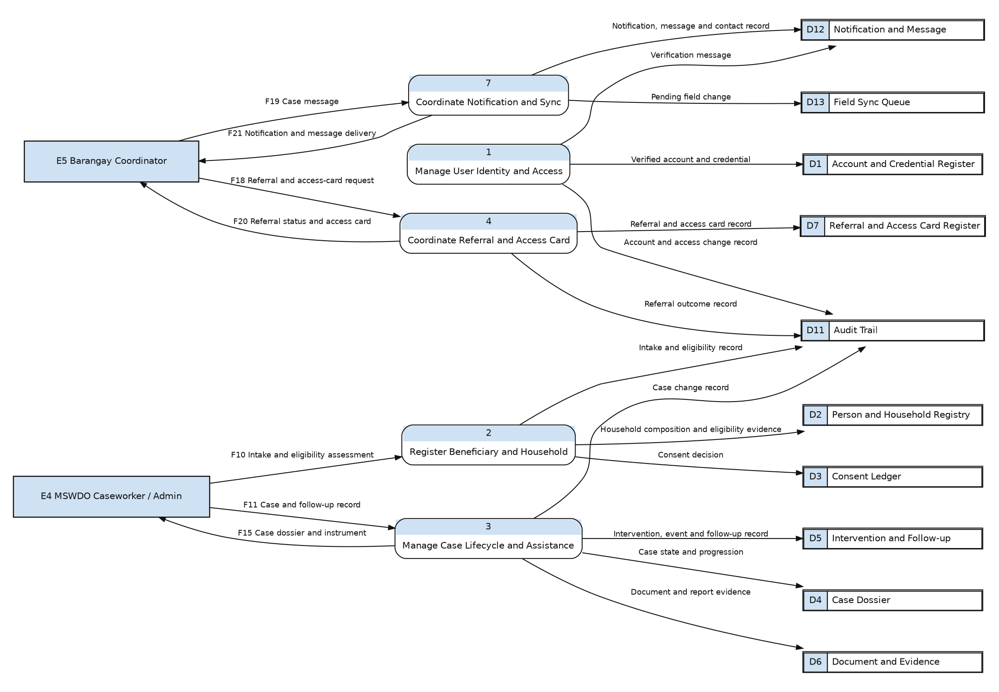

# 11 — Data Flow Diagram, Level 1

**Project:** KAPWA — MSWDO Social Welfare Management System
**Notation:** Gane & Sarson
**Purpose:** Decompose the single Level 0 process into the capabilities the system actually performs.

---

## 1. What changed from the previous version

This is a rework, not a redraw. The earlier draft carried three factual errors and one
notation error, all corrected here.

**Dead functionality removed.**

| Previously drawn | Reality in the code |
| --- | --- |
| Oversight Officials (Mayor, Auditor) | Both roles were sunset. Audit and export are administrator-only. |
| Partner Agency Staff as a signing-in actor | The `agency_staff` role no longer exists. |
| Analytics | Flagged off by default and marked not ready. |
| Physical file locations | The physical filing capability was deleted; verification moved onto case requirements. |
| Case tracker | The tracker module was deleted. Case events and follow-up visits now carry that work. |

**Capabilities that were missing.** Case events and reminders, team coordination,
crisis mode, local civil registry matching, incident and case study reports, and
programme fund compliance all exist and were absent from the old diagram.

**Notation corrected.** Process names are now verb phrases, which is what Gane and
Sarson require. The earlier draft used noun phrases — "Beneficiary and Household
Registration" — which describes a subject, not an action.

**Presentation corrected.** The single Level 1 diagram was one 48-flow drawing that
printed on A2 and was unreadable at that size. It is now sectioned into five
role-scoped views (§6), each of which prints on Letter or A3 with every label at
5 pt or larger. Nothing was dropped: the five views together carry all seven
processes, all thirteen data stores and all twenty-four Level 0 flows (§9).

---

## 2. Notation

Identical to Level 0: entities are filled rectangles, processes are rounded
rectangles whose shaded band carries the process number, data stores are divided
rectangles with the `D`-number in the shaded left cell, and data flows are named
arrows. Process names are verb phrases.

Decomposition is by **capability**, not by technical layer. The system is physically
a layered NestJS application; a DFD that mirrored the layers would describe the build
rather than the business, so the layering is deliberately abstracted away.

**Role views.** Section 6 presents one view per role. A role view is a projection of
the single Level 1: it contains the processes that role drives and the flows in which
that role is a party, together with each process's own reads and writes, so every
diagram shown is internally consistent and DFD-legal on its own terms. The views are
not a re-decomposition — a flow may appear in more than one view, and §9 remains the
authority on completeness.

---

## 3. Processes

| ID | Process (verb phrase) | What it does |
| --- | --- | --- |
| 1 | Manage User Identity and Access | Account lifecycle, sign-in, one-time codes, device trust, role assignment, tenant reset |
| 2 | Register Beneficiary and Household | Household intake, person and beneficiary records, household composition, consent, civil registry matching |
| 3 | Manage Case Lifecycle and Assistance Delivery | Case creation, step progression, eligibility, assistance, interventions, required-document evidence, hearings, home visits, reminders, incident and case study reports, crisis mode |
| 4 | Coordinate Referral and Access Card | Barangay referrals, inter-agency endorsement, access card issuance |
| 5 | Administer Programme and Fund Compliance | Programme catalogue, required documents, fund sources, compliance filing, payout scheduling, public notices |
| 6 | Produce Report and Audit Evidence | Case, schedule and fund reporting; export; audit trail |
| 7 | Coordinate Notification and Field Synchronisation | Notifications and preferences, case messaging, contact messages, team coordination, field sync queue, outbound mail |

---

## 4. Data stores

| ID | Data store | Held for a reason |
| --- | --- | --- |
| D1 | Account and Credential Register | Accounts, one-time codes, device trust records |
| D2 | Person and Household Registry | Persons, addresses, beneficiaries, household composition, membership, civil registry keys |
| D3 | Consent Ledger | Consent grants and revocations per person and purpose |
| D4 | Case Dossier | Cases, case history, requirements, step locks, assistance, enrolments, crisis state |
| D5 | Intervention and Follow-up Register | Interventions, follow-up visits, case events, event reminders |
| D6 | Document and Evidence Register | Uploaded documents, verification state, incident reports, case study reports |
| D7 | Referral and Access Card Register | Barangay referrals, inter-agency referrals, access cards and their services |
| D8 | Programme and Fund Ledger | Programmes, fund sources, required documents, compliance filings, payout schedule |
| D9 | Notice and Partner Directory | Announcements, agencies, agency contacts |
| D10 | Report and Indicator Register | Generated reports, exports, aggregate indicators, team activity |
| D11 | Audit Trail | Who changed what, and when |
| D12 | Notification and Message Register | Notifications, delivery state, message threads, contact messages |
| D13 | Field Synchronisation Queue | Pending changes from offline field capture |

---

## 5. Role access matrix

The `UserRole` enumeration holds exactly four roles: `admin`, `social_worker`,
`coordinator`, `claimant`. The matrix below is derived from the `@Roles` decorators
on the controllers, not from the UI, and it is what governs which processes appear
in each role view in §6.

| Process | Public | Claimant | Coordinator | Social worker | Admin |
| --- | --- | --- | --- | --- | --- |
| 1 Manage User Identity and Access | sign-in only | sign-in, one-time code, device trust | sign-in | sign-in | + account and role administration |
| 2 Register Beneficiary and Household | — | own record, consent | intake, beneficiary records | intake, beneficiary records | + civil registry matching |
| 3 Manage Case Lifecycle and Assistance | — | document upload, own status | cases, events, interventions | full case work | full case work |
| 4 Coordinate Referral and Access Card | — | own access card | referrals, access cards | referrals, inter-agency endorsement | full |
| 5 Administer Programme and Fund | public catalogue and notices | 4Ps self-service | partner directory, 4Ps | programmes, notices | full, including fund compliance |
| 6 Produce Report and Audit Evidence | — | — | dashboard, export | reports, analytics, dashboard | full, including audit and SLA |
| 7 Coordinate Notification and Field Sync | contact form | messages, notifications | messages, notifications, team, sync | messages, notifications, team, sync, contact messages | full |

Two entries deserve a note. **The coordinator cannot reach inter-agency referrals** —
those are `admin` and `social_worker` only — which is why §6.3 shows Process 4 without
the endorsement flow to the partner agency. **The administrator is the only role that
reaches Process 6's audit and SLA capabilities**; the social worker reaches its
reporting and analytics capabilities but not its assurance ones.

---

## 6. Role-based views

Each view below is one role's projection of Level 1. The page each prints on is given
under its heading; the print helper picks the smallest page that keeps labels at
5 pt or larger.

### 6.1 Public visitor — unauthenticated (US Letter)

*The two flows reachable without signing in: the published programme catalogue and
notices, and the contact form.*

```dot
digraph DFD {
  rankdir=LR;
  graph [dpi=400, bgcolor="white", fontname="Helvetica", ranksep=0.55, nodesep=0.45, margin=0.15];
  node  [fontname="Helvetica", fontsize=10, fontcolor="#111111"];
  edge  [fontname="Helvetica", fontsize=8.5, fontcolor="#111111", color="#111111", penwidth=1.0, arrowsize=0.7];

  E1 [shape=box, style=filled, fillcolor="#cfe2f3", color="#111111", penwidth=1.2, width=2.15, height=0.62, fixedsize=false, label=<E1 Public Visitor>];
  P5 [shape=none, margin=0, label=<<TABLE BORDER="1" STYLE="ROUNDED" CELLBORDER="0" CELLSPACING="0" CELLPADDING="0" COLOR="#111111">
    <TR><TD BGCOLOR="#cfe2f3" CELLPADDING="3" WIDTH="150">5</TD></TR>
    <TR><TD CELLPADDING="7">Administer Programme and Fund</TD></TR>
  </TABLE>>];
  P7 [shape=none, margin=0, label=<<TABLE BORDER="1" STYLE="ROUNDED" CELLBORDER="0" CELLSPACING="0" CELLPADDING="0" COLOR="#111111">
    <TR><TD BGCOLOR="#cfe2f3" CELLPADDING="3" WIDTH="150">7</TD></TR>
    <TR><TD CELLPADDING="7">Coordinate Notification and Sync</TD></TR>
  </TABLE>>];
  D11 [shape=none, margin=0, label=<<TABLE BORDER="1" CELLBORDER="1" CELLSPACING="0" CELLPADDING="4" COLOR="#111111">
    <TR><TD WIDTH="26" BGCOLOR="#cfe2f3">D11</TD><TD WIDTH="170" BGCOLOR="#ffffff" ALIGN="LEFT">Audit Trail</TD></TR>
  </TABLE>>];
  D12 [shape=none, margin=0, label=<<TABLE BORDER="1" CELLBORDER="1" CELLSPACING="0" CELLPADDING="4" COLOR="#111111">
    <TR><TD WIDTH="26" BGCOLOR="#cfe2f3">D12</TD><TD WIDTH="170" BGCOLOR="#ffffff" ALIGN="LEFT">Notification and Message</TD></TR>
  </TABLE>>];
  D13 [shape=none, margin=0, label=<<TABLE BORDER="1" CELLBORDER="1" CELLSPACING="0" CELLPADDING="4" COLOR="#111111">
    <TR><TD WIDTH="26" BGCOLOR="#cfe2f3">D13</TD><TD WIDTH="170" BGCOLOR="#ffffff" ALIGN="LEFT">Field Sync Queue</TD></TR>
  </TABLE>>];
  D8 [shape=none, margin=0, label=<<TABLE BORDER="1" CELLBORDER="1" CELLSPACING="0" CELLPADDING="4" COLOR="#111111">
    <TR><TD WIDTH="26" BGCOLOR="#cfe2f3">D8</TD><TD WIDTH="170" BGCOLOR="#ffffff" ALIGN="LEFT">Programme and Fund Ledger</TD></TR>
  </TABLE>>];
  D9 [shape=none, margin=0, label=<<TABLE BORDER="1" CELLBORDER="1" CELLSPACING="0" CELLPADDING="4" COLOR="#111111">
    <TR><TD WIDTH="26" BGCOLOR="#cfe2f3">D9</TD><TD WIDTH="170" BGCOLOR="#ffffff" ALIGN="LEFT">Notice and Partner Directory</TD></TR>
  </TABLE>>];

  P5 -> E1 [label=<F2 Programme catalogue and notice>];
  E1 -> P7 [label=<F1 Contact submission>];
  P5 -> D8 [label=<Programme, fund and payout schedule>];
  P5 -> D9 [label=<Notice publication and partner record>];
  P5 -> D11 [label=<Programme change record>];
  P7 -> D12 [label=<Notification, message and contact record>];
  P7 -> D13 [label=<Pending field change>];
}
```

### 6.2 Claimant — registered user and beneficiary (A3 landscape)

*Sign-in and device trust, consent, household particulars, required-document upload,
own case status, own access card, and messaging. The claimant drives Processes 2 and 3
only at their own record; the rest of those processes belongs to staff.*

```dot
digraph DFD {
  rankdir=LR;
  graph [dpi=400, bgcolor="white", fontname="Helvetica", ranksep=0.55, nodesep=0.45, margin=0.15];
  node  [fontname="Helvetica", fontsize=10, fontcolor="#111111"];
  edge  [fontname="Helvetica", fontsize=8.5, fontcolor="#111111", color="#111111", penwidth=1.0, arrowsize=0.7];

  E2 [shape=box, style=filled, fillcolor="#cfe2f3", color="#111111", penwidth=1.2, width=2.23, height=0.62, fixedsize=false, label=<E2 Registered User>];
  E3 [shape=box, style=filled, fillcolor="#cfe2f3", color="#111111", penwidth=1.2, width=2.91, height=0.62, fixedsize=false, label=<E3 Beneficiary / Household>];
  P1 [shape=none, margin=0, label=<<TABLE BORDER="1" STYLE="ROUNDED" CELLBORDER="0" CELLSPACING="0" CELLPADDING="0" COLOR="#111111">
    <TR><TD BGCOLOR="#cfe2f3" CELLPADDING="3" WIDTH="150">1</TD></TR>
    <TR><TD CELLPADDING="7">Manage User Identity and Access</TD></TR>
  </TABLE>>];
  P2 [shape=none, margin=0, label=<<TABLE BORDER="1" STYLE="ROUNDED" CELLBORDER="0" CELLSPACING="0" CELLPADDING="0" COLOR="#111111">
    <TR><TD BGCOLOR="#cfe2f3" CELLPADDING="3" WIDTH="150">2</TD></TR>
    <TR><TD CELLPADDING="7">Register Beneficiary and Household</TD></TR>
  </TABLE>>];
  P3 [shape=none, margin=0, label=<<TABLE BORDER="1" STYLE="ROUNDED" CELLBORDER="0" CELLSPACING="0" CELLPADDING="0" COLOR="#111111">
    <TR><TD BGCOLOR="#cfe2f3" CELLPADDING="3" WIDTH="150">3</TD></TR>
    <TR><TD CELLPADDING="7">Manage Case Lifecycle and Assistance</TD></TR>
  </TABLE>>];
  P4 [shape=none, margin=0, label=<<TABLE BORDER="1" STYLE="ROUNDED" CELLBORDER="0" CELLSPACING="0" CELLPADDING="0" COLOR="#111111">
    <TR><TD BGCOLOR="#cfe2f3" CELLPADDING="3" WIDTH="150">4</TD></TR>
    <TR><TD CELLPADDING="7">Coordinate Referral and Access Card</TD></TR>
  </TABLE>>];
  P7 [shape=none, margin=0, label=<<TABLE BORDER="1" STYLE="ROUNDED" CELLBORDER="0" CELLSPACING="0" CELLPADDING="0" COLOR="#111111">
    <TR><TD BGCOLOR="#cfe2f3" CELLPADDING="3" WIDTH="150">7</TD></TR>
    <TR><TD CELLPADDING="7">Coordinate Notification and Sync</TD></TR>
  </TABLE>>];
  D1 [shape=none, margin=0, label=<<TABLE BORDER="1" CELLBORDER="1" CELLSPACING="0" CELLPADDING="4" COLOR="#111111">
    <TR><TD WIDTH="26" BGCOLOR="#cfe2f3">D1</TD><TD WIDTH="170" BGCOLOR="#ffffff" ALIGN="LEFT">Account and Credential Register</TD></TR>
  </TABLE>>];
  D11 [shape=none, margin=0, label=<<TABLE BORDER="1" CELLBORDER="1" CELLSPACING="0" CELLPADDING="4" COLOR="#111111">
    <TR><TD WIDTH="26" BGCOLOR="#cfe2f3">D11</TD><TD WIDTH="170" BGCOLOR="#ffffff" ALIGN="LEFT">Audit Trail</TD></TR>
  </TABLE>>];
  D12 [shape=none, margin=0, label=<<TABLE BORDER="1" CELLBORDER="1" CELLSPACING="0" CELLPADDING="4" COLOR="#111111">
    <TR><TD WIDTH="26" BGCOLOR="#cfe2f3">D12</TD><TD WIDTH="170" BGCOLOR="#ffffff" ALIGN="LEFT">Notification and Message</TD></TR>
  </TABLE>>];
  D13 [shape=none, margin=0, label=<<TABLE BORDER="1" CELLBORDER="1" CELLSPACING="0" CELLPADDING="4" COLOR="#111111">
    <TR><TD WIDTH="26" BGCOLOR="#cfe2f3">D13</TD><TD WIDTH="170" BGCOLOR="#ffffff" ALIGN="LEFT">Field Sync Queue</TD></TR>
  </TABLE>>];
  D2 [shape=none, margin=0, label=<<TABLE BORDER="1" CELLBORDER="1" CELLSPACING="0" CELLPADDING="4" COLOR="#111111">
    <TR><TD WIDTH="26" BGCOLOR="#cfe2f3">D2</TD><TD WIDTH="170" BGCOLOR="#ffffff" ALIGN="LEFT">Person and Household Registry</TD></TR>
  </TABLE>>];
  D3 [shape=none, margin=0, label=<<TABLE BORDER="1" CELLBORDER="1" CELLSPACING="0" CELLPADDING="4" COLOR="#111111">
    <TR><TD WIDTH="26" BGCOLOR="#cfe2f3">D3</TD><TD WIDTH="170" BGCOLOR="#ffffff" ALIGN="LEFT">Consent Ledger</TD></TR>
  </TABLE>>];
  D4 [shape=none, margin=0, label=<<TABLE BORDER="1" CELLBORDER="1" CELLSPACING="0" CELLPADDING="4" COLOR="#111111">
    <TR><TD WIDTH="26" BGCOLOR="#cfe2f3">D4</TD><TD WIDTH="170" BGCOLOR="#ffffff" ALIGN="LEFT">Case Dossier</TD></TR>
  </TABLE>>];
  D5 [shape=none, margin=0, label=<<TABLE BORDER="1" CELLBORDER="1" CELLSPACING="0" CELLPADDING="4" COLOR="#111111">
    <TR><TD WIDTH="26" BGCOLOR="#cfe2f3">D5</TD><TD WIDTH="170" BGCOLOR="#ffffff" ALIGN="LEFT">Intervention and Follow-up</TD></TR>
  </TABLE>>];
  D6 [shape=none, margin=0, label=<<TABLE BORDER="1" CELLBORDER="1" CELLSPACING="0" CELLPADDING="4" COLOR="#111111">
    <TR><TD WIDTH="26" BGCOLOR="#cfe2f3">D6</TD><TD WIDTH="170" BGCOLOR="#ffffff" ALIGN="LEFT">Document and Evidence</TD></TR>
  </TABLE>>];
  D7 [shape=none, margin=0, label=<<TABLE BORDER="1" CELLBORDER="1" CELLSPACING="0" CELLPADDING="4" COLOR="#111111">
    <TR><TD WIDTH="26" BGCOLOR="#cfe2f3">D7</TD><TD WIDTH="170" BGCOLOR="#ffffff" ALIGN="LEFT">Referral and Access Card Register</TD></TR>
  </TABLE>>];

  E2 -> P1 [label=<F3 Account and sign-in credential>];
  E2 -> P2 [label=<F5 Consent instruction>];
  E3 -> P2 [label=<F9 Household particular>];
  E2 -> P3 [label=<F4 Required-document submission>];
  P3 -> E2 [label=<F7 Case status and service history>];
  P4 -> E2 [label=<F20 Referral status and access card>];
  P7 -> E2 [label=<F8 Notification and message delivery>];
  E2 -> P7 [label=<F6 Case message>];
  P1 -> D1 [label=<Verified account and credential>];
  P1 -> D11 [label=<Account and access change record>];
  P1 -> D12 [label=<Verification message>];
  P2 -> D2 [label=<Household composition and eligibility evidence>];
  P2 -> D3 [label=<Consent decision>];
  P2 -> D11 [label=<Intake and eligibility record>];
  P3 -> D4 [label=<Case state and progression>];
  P3 -> D5 [label=<Intervention, event and follow-up record>];
  P3 -> D6 [label=<Document and report evidence>];
  P3 -> D11 [label=<Case change record>];
  P4 -> D7 [label=<Referral and access card record>];
  P4 -> D11 [label=<Referral outcome record>];
  P7 -> D12 [label=<Notification, message and contact record>];
  P7 -> D13 [label=<Pending field change>];
}
```

### 6.3 Barangay coordinator (US Letter)

*Barangay referral and access-card requests, intake, case follow-up records, and
messaging. Process 4 appears without the inter-agency endorsement flow, which this
role cannot reach.*

### 6.4 MSWDO caseworker — social worker (A3 landscape)

*The case work proper: intake and eligibility, case and follow-up records, dossier and
printable instruments, programme and fund filing, inter-agency endorsement, reports,
and messaging. This is the broadest role view, because the social worker is the only
non-administrator who reaches Processes 2, 5 and 6.*

```dot
digraph DFD {
  rankdir=LR;
  graph [dpi=400, bgcolor="white", fontname="Helvetica", ranksep=0.55, nodesep=0.45, margin=0.15];
  node  [fontname="Helvetica", fontsize=10, fontcolor="#111111"];
  edge  [fontname="Helvetica", fontsize=8.5, fontcolor="#111111", color="#111111", penwidth=1.0, arrowsize=0.7];

  E4 [shape=box, style=filled, fillcolor="#cfe2f3", color="#111111", penwidth=1.2, width=3.00, height=0.62, fixedsize=false, label=<E4 MSWDO Caseworker / Admin>];
  E2 [shape=box, style=filled, fillcolor="#cfe2f3", color="#111111", penwidth=1.2, width=2.23, height=0.62, fixedsize=false, label=<E2 Registered User>];
  E6 [shape=box, style=filled, fillcolor="#cfe2f3", color="#111111", penwidth=1.2, width=2.15, height=0.62, fixedsize=false, label=<E6 Partner Agency>];
  P1 [shape=none, margin=0, label=<<TABLE BORDER="1" STYLE="ROUNDED" CELLBORDER="0" CELLSPACING="0" CELLPADDING="0" COLOR="#111111">
    <TR><TD BGCOLOR="#cfe2f3" CELLPADDING="3" WIDTH="150">1</TD></TR>
    <TR><TD CELLPADDING="7">Manage User Identity and Access</TD></TR>
  </TABLE>>];
  P2 [shape=none, margin=0, label=<<TABLE BORDER="1" STYLE="ROUNDED" CELLBORDER="0" CELLSPACING="0" CELLPADDING="0" COLOR="#111111">
    <TR><TD BGCOLOR="#cfe2f3" CELLPADDING="3" WIDTH="150">2</TD></TR>
    <TR><TD CELLPADDING="7">Register Beneficiary and Household</TD></TR>
  </TABLE>>];
  P3 [shape=none, margin=0, label=<<TABLE BORDER="1" STYLE="ROUNDED" CELLBORDER="0" CELLSPACING="0" CELLPADDING="0" COLOR="#111111">
    <TR><TD BGCOLOR="#cfe2f3" CELLPADDING="3" WIDTH="150">3</TD></TR>
    <TR><TD CELLPADDING="7">Manage Case Lifecycle and Assistance</TD></TR>
  </TABLE>>];
  P4 [shape=none, margin=0, label=<<TABLE BORDER="1" STYLE="ROUNDED" CELLBORDER="0" CELLSPACING="0" CELLPADDING="0" COLOR="#111111">
    <TR><TD BGCOLOR="#cfe2f3" CELLPADDING="3" WIDTH="150">4</TD></TR>
    <TR><TD CELLPADDING="7">Coordinate Referral and Access Card</TD></TR>
  </TABLE>>];
  P5 [shape=none, margin=0, label=<<TABLE BORDER="1" STYLE="ROUNDED" CELLBORDER="0" CELLSPACING="0" CELLPADDING="0" COLOR="#111111">
    <TR><TD BGCOLOR="#cfe2f3" CELLPADDING="3" WIDTH="150">5</TD></TR>
    <TR><TD CELLPADDING="7">Administer Programme and Fund</TD></TR>
  </TABLE>>];
  P6 [shape=none, margin=0, label=<<TABLE BORDER="1" STYLE="ROUNDED" CELLBORDER="0" CELLSPACING="0" CELLPADDING="0" COLOR="#111111">
    <TR><TD BGCOLOR="#cfe2f3" CELLPADDING="3" WIDTH="150">6</TD></TR>
    <TR><TD CELLPADDING="7">Produce Report and Audit Evidence</TD></TR>
  </TABLE>>];
  P7 [shape=none, margin=0, label=<<TABLE BORDER="1" STYLE="ROUNDED" CELLBORDER="0" CELLSPACING="0" CELLPADDING="0" COLOR="#111111">
    <TR><TD BGCOLOR="#cfe2f3" CELLPADDING="3" WIDTH="150">7</TD></TR>
    <TR><TD CELLPADDING="7">Coordinate Notification and Sync</TD></TR>
  </TABLE>>];
  D1 [shape=none, margin=0, label=<<TABLE BORDER="1" CELLBORDER="1" CELLSPACING="0" CELLPADDING="4" COLOR="#111111">
    <TR><TD WIDTH="26" BGCOLOR="#cfe2f3">D1</TD><TD WIDTH="170" BGCOLOR="#ffffff" ALIGN="LEFT">Account and Credential Register</TD></TR>
  </TABLE>>];
  D10 [shape=none, margin=0, label=<<TABLE BORDER="1" CELLBORDER="1" CELLSPACING="0" CELLPADDING="4" COLOR="#111111">
    <TR><TD WIDTH="26" BGCOLOR="#cfe2f3">D10</TD><TD WIDTH="170" BGCOLOR="#ffffff" ALIGN="LEFT">Report and Indicator</TD></TR>
  </TABLE>>];
  D11 [shape=none, margin=0, label=<<TABLE BORDER="1" CELLBORDER="1" CELLSPACING="0" CELLPADDING="4" COLOR="#111111">
    <TR><TD WIDTH="26" BGCOLOR="#cfe2f3">D11</TD><TD WIDTH="170" BGCOLOR="#ffffff" ALIGN="LEFT">Audit Trail</TD></TR>
  </TABLE>>];
  D12 [shape=none, margin=0, label=<<TABLE BORDER="1" CELLBORDER="1" CELLSPACING="0" CELLPADDING="4" COLOR="#111111">
    <TR><TD WIDTH="26" BGCOLOR="#cfe2f3">D12</TD><TD WIDTH="170" BGCOLOR="#ffffff" ALIGN="LEFT">Notification and Message</TD></TR>
  </TABLE>>];
  D13 [shape=none, margin=0, label=<<TABLE BORDER="1" CELLBORDER="1" CELLSPACING="0" CELLPADDING="4" COLOR="#111111">
    <TR><TD WIDTH="26" BGCOLOR="#cfe2f3">D13</TD><TD WIDTH="170" BGCOLOR="#ffffff" ALIGN="LEFT">Field Sync Queue</TD></TR>
  </TABLE>>];
  D2 [shape=none, margin=0, label=<<TABLE BORDER="1" CELLBORDER="1" CELLSPACING="0" CELLPADDING="4" COLOR="#111111">
    <TR><TD WIDTH="26" BGCOLOR="#cfe2f3">D2</TD><TD WIDTH="170" BGCOLOR="#ffffff" ALIGN="LEFT">Person and Household Registry</TD></TR>
  </TABLE>>];
  D3 [shape=none, margin=0, label=<<TABLE BORDER="1" CELLBORDER="1" CELLSPACING="0" CELLPADDING="4" COLOR="#111111">
    <TR><TD WIDTH="26" BGCOLOR="#cfe2f3">D3</TD><TD WIDTH="170" BGCOLOR="#ffffff" ALIGN="LEFT">Consent Ledger</TD></TR>
  </TABLE>>];
  D4 [shape=none, margin=0, label=<<TABLE BORDER="1" CELLBORDER="1" CELLSPACING="0" CELLPADDING="4" COLOR="#111111">
    <TR><TD WIDTH="26" BGCOLOR="#cfe2f3">D4</TD><TD WIDTH="170" BGCOLOR="#ffffff" ALIGN="LEFT">Case Dossier</TD></TR>
  </TABLE>>];
  D5 [shape=none, margin=0, label=<<TABLE BORDER="1" CELLBORDER="1" CELLSPACING="0" CELLPADDING="4" COLOR="#111111">
    <TR><TD WIDTH="26" BGCOLOR="#cfe2f3">D5</TD><TD WIDTH="170" BGCOLOR="#ffffff" ALIGN="LEFT">Intervention and Follow-up</TD></TR>
  </TABLE>>];
  D6 [shape=none, margin=0, label=<<TABLE BORDER="1" CELLBORDER="1" CELLSPACING="0" CELLPADDING="4" COLOR="#111111">
    <TR><TD WIDTH="26" BGCOLOR="#cfe2f3">D6</TD><TD WIDTH="170" BGCOLOR="#ffffff" ALIGN="LEFT">Document and Evidence</TD></TR>
  </TABLE>>];
  D7 [shape=none, margin=0, label=<<TABLE BORDER="1" CELLBORDER="1" CELLSPACING="0" CELLPADDING="4" COLOR="#111111">
    <TR><TD WIDTH="26" BGCOLOR="#cfe2f3">D7</TD><TD WIDTH="170" BGCOLOR="#ffffff" ALIGN="LEFT">Referral and Access Card Register</TD></TR>
  </TABLE>>];
  D8 [shape=none, margin=0, label=<<TABLE BORDER="1" CELLBORDER="1" CELLSPACING="0" CELLPADDING="4" COLOR="#111111">
    <TR><TD WIDTH="26" BGCOLOR="#cfe2f3">D8</TD><TD WIDTH="170" BGCOLOR="#ffffff" ALIGN="LEFT">Programme and Fund Ledger</TD></TR>
  </TABLE>>];
  D9 [shape=none, margin=0, label=<<TABLE BORDER="1" CELLBORDER="1" CELLSPACING="0" CELLPADDING="4" COLOR="#111111">
    <TR><TD WIDTH="26" BGCOLOR="#cfe2f3">D9</TD><TD WIDTH="170" BGCOLOR="#ffffff" ALIGN="LEFT">Notice and Partner Directory</TD></TR>
  </TABLE>>];

  E4 -> P2 [label=<F10 Intake and eligibility assessment>];
  E4 -> P3 [label=<F11 Case and follow-up record>];
  P3 -> E4 [label=<F15 Case dossier and instrument>];
  E4 -> P7 [label=<F14 Case message>];
  P7 -> E4 [label=<F17 Notification and message delivery>];
  E4 -> P5 [label=<F12 Programme and fund filing>];
  P4 -> E6 [label=<F22 Inter-agency referral request>];
  P6 -> E4 [label=<F16 Performance report>];
  P1 -> D1 [label=<Verified account and credential>];
  P1 -> D11 [label=<Account and access change record>];
  P1 -> D12 [label=<Verification message>];
  P2 -> D2 [label=<Household composition and eligibility evidence>];
  P2 -> D3 [label=<Consent decision>];
  P2 -> D11 [label=<Intake and eligibility record>];
  P3 -> D4 [label=<Case state and progression>];
  P3 -> D5 [label=<Intervention, event and follow-up record>];
  P3 -> D6 [label=<Document and report evidence>];
  P3 -> D11 [label=<Case change record>];
  P4 -> D7 [label=<Referral and access card record>];
  P4 -> D11 [label=<Referral outcome record>];
  P5 -> D8 [label=<Programme, fund and payout schedule>];
  P5 -> D9 [label=<Notice publication and partner record>];
  P5 -> D11 [label=<Programme change record>];
  D4 -> P6 [label=<Case, fund and compliance figures>];
  D7 -> P6 [label=<Referral and fund utilisation figures>];
  D8 -> P6 [label=<Compliance and payout figures>];
  P6 -> D10 [label=<Generated report and export>];
  P6 -> D11 [label=<Reporting and export record>];
  P7 -> D12 [label=<Notification, message and contact record>];
  P7 -> D13 [label=<Pending field change>];
}
```

### 6.5 Administrator (A3 landscape)

*Identity and access administration, programme and fund filing, reporting, and the
outbound mail channel. The administrator also reaches the case processes shown in
§6.4 — those flows are not repeated here.*

```dot
digraph DFD {
  rankdir=LR;
  graph [dpi=400, bgcolor="white", fontname="Helvetica", ranksep=0.55, nodesep=0.45, margin=0.15];
  node  [fontname="Helvetica", fontsize=10, fontcolor="#111111"];
  edge  [fontname="Helvetica", fontsize=8.5, fontcolor="#111111", color="#111111", penwidth=1.0, arrowsize=0.7];

  E4 [shape=box, style=filled, fillcolor="#cfe2f3", color="#111111", penwidth=1.2, width=3.00, height=0.62, fixedsize=false, label=<E4 MSWDO Caseworker / Admin>];
  E1 [shape=box, style=filled, fillcolor="#cfe2f3", color="#111111", penwidth=1.2, width=2.15, height=0.62, fixedsize=false, label=<E1 Public Visitor>];
  E7 [shape=box, style=filled, fillcolor="#cfe2f3", color="#111111", penwidth=1.2, width=2.83, height=0.62, fixedsize=false, label=<E7 Email Delivery Service>];
  P1 [shape=none, margin=0, label=<<TABLE BORDER="1" STYLE="ROUNDED" CELLBORDER="0" CELLSPACING="0" CELLPADDING="0" COLOR="#111111">
    <TR><TD BGCOLOR="#cfe2f3" CELLPADDING="3" WIDTH="150">1</TD></TR>
    <TR><TD CELLPADDING="7">Manage User Identity and Access</TD></TR>
  </TABLE>>];
  P5 [shape=none, margin=0, label=<<TABLE BORDER="1" STYLE="ROUNDED" CELLBORDER="0" CELLSPACING="0" CELLPADDING="0" COLOR="#111111">
    <TR><TD BGCOLOR="#cfe2f3" CELLPADDING="3" WIDTH="150">5</TD></TR>
    <TR><TD CELLPADDING="7">Administer Programme and Fund</TD></TR>
  </TABLE>>];
  P6 [shape=none, margin=0, label=<<TABLE BORDER="1" STYLE="ROUNDED" CELLBORDER="0" CELLSPACING="0" CELLPADDING="0" COLOR="#111111">
    <TR><TD BGCOLOR="#cfe2f3" CELLPADDING="3" WIDTH="150">6</TD></TR>
    <TR><TD CELLPADDING="7">Produce Report and Audit Evidence</TD></TR>
  </TABLE>>];
  P7 [shape=none, margin=0, label=<<TABLE BORDER="1" STYLE="ROUNDED" CELLBORDER="0" CELLSPACING="0" CELLPADDING="0" COLOR="#111111">
    <TR><TD BGCOLOR="#cfe2f3" CELLPADDING="3" WIDTH="150">7</TD></TR>
    <TR><TD CELLPADDING="7">Coordinate Notification and Sync</TD></TR>
  </TABLE>>];
  D1 [shape=none, margin=0, label=<<TABLE BORDER="1" CELLBORDER="1" CELLSPACING="0" CELLPADDING="4" COLOR="#111111">
    <TR><TD WIDTH="26" BGCOLOR="#cfe2f3">D1</TD><TD WIDTH="170" BGCOLOR="#ffffff" ALIGN="LEFT">Account and Credential Register</TD></TR>
  </TABLE>>];
  D10 [shape=none, margin=0, label=<<TABLE BORDER="1" CELLBORDER="1" CELLSPACING="0" CELLPADDING="4" COLOR="#111111">
    <TR><TD WIDTH="26" BGCOLOR="#cfe2f3">D10</TD><TD WIDTH="170" BGCOLOR="#ffffff" ALIGN="LEFT">Report and Indicator</TD></TR>
  </TABLE>>];
  D11 [shape=none, margin=0, label=<<TABLE BORDER="1" CELLBORDER="1" CELLSPACING="0" CELLPADDING="4" COLOR="#111111">
    <TR><TD WIDTH="26" BGCOLOR="#cfe2f3">D11</TD><TD WIDTH="170" BGCOLOR="#ffffff" ALIGN="LEFT">Audit Trail</TD></TR>
  </TABLE>>];
  D12 [shape=none, margin=0, label=<<TABLE BORDER="1" CELLBORDER="1" CELLSPACING="0" CELLPADDING="4" COLOR="#111111">
    <TR><TD WIDTH="26" BGCOLOR="#cfe2f3">D12</TD><TD WIDTH="170" BGCOLOR="#ffffff" ALIGN="LEFT">Notification and Message</TD></TR>
  </TABLE>>];
  D13 [shape=none, margin=0, label=<<TABLE BORDER="1" CELLBORDER="1" CELLSPACING="0" CELLPADDING="4" COLOR="#111111">
    <TR><TD WIDTH="26" BGCOLOR="#cfe2f3">D13</TD><TD WIDTH="170" BGCOLOR="#ffffff" ALIGN="LEFT">Field Sync Queue</TD></TR>
  </TABLE>>];
  D4 [shape=none, margin=0, label=<<TABLE BORDER="1" CELLBORDER="1" CELLSPACING="0" CELLPADDING="4" COLOR="#111111">
    <TR><TD WIDTH="26" BGCOLOR="#cfe2f3">D4</TD><TD WIDTH="170" BGCOLOR="#ffffff" ALIGN="LEFT">Case Dossier</TD></TR>
  </TABLE>>];
  D7 [shape=none, margin=0, label=<<TABLE BORDER="1" CELLBORDER="1" CELLSPACING="0" CELLPADDING="4" COLOR="#111111">
    <TR><TD WIDTH="26" BGCOLOR="#cfe2f3">D7</TD><TD WIDTH="170" BGCOLOR="#ffffff" ALIGN="LEFT">Referral and Access Card Register</TD></TR>
  </TABLE>>];
  D8 [shape=none, margin=0, label=<<TABLE BORDER="1" CELLBORDER="1" CELLSPACING="0" CELLPADDING="4" COLOR="#111111">
    <TR><TD WIDTH="26" BGCOLOR="#cfe2f3">D8</TD><TD WIDTH="170" BGCOLOR="#ffffff" ALIGN="LEFT">Programme and Fund Ledger</TD></TR>
  </TABLE>>];
  D9 [shape=none, margin=0, label=<<TABLE BORDER="1" CELLBORDER="1" CELLSPACING="0" CELLPADDING="4" COLOR="#111111">
    <TR><TD WIDTH="26" BGCOLOR="#cfe2f3">D9</TD><TD WIDTH="170" BGCOLOR="#ffffff" ALIGN="LEFT">Notice and Partner Directory</TD></TR>
  </TABLE>>];

  E4 -> P1 [label=<F13 Administration instruction>];
  E4 -> P5 [label=<F12 Programme and fund filing>];
  P5 -> E1 [label=<F2 Programme catalogue and notice>];
  P6 -> E4 [label=<F16 Performance report>];
  P7 -> E7 [label=<F23 Outbound message>];
  E7 -> P7 [label=<F24 Delivery outcome>];
  P7 -> E4 [label=<F17 Notification and message delivery>];
  P1 -> D1 [label=<Verified account and credential>];
  P1 -> D11 [label=<Account and access change record>];
  P1 -> D12 [label=<Verification message>];
  P5 -> D8 [label=<Programme, fund and payout schedule>];
  P5 -> D9 [label=<Notice publication and partner record>];
  P5 -> D11 [label=<Programme change record>];
  D4 -> P6 [label=<Case, fund and compliance figures>];
  D7 -> P6 [label=<Referral and fund utilisation figures>];
  D8 -> P6 [label=<Compliance and payout figures>];
  P6 -> D10 [label=<Generated report and export>];
  P6 -> D11 [label=<Reporting and export record>];
  P7 -> D12 [label=<Notification, message and contact record>];
  P7 -> D13 [label=<Pending field change>];
}
```

---

## 7. Reading the diagrams

Three points are worth stating because they look like violations and are not.

**Process 6 takes no external input.** Reporting is derived entirely from the case,
referral and programme stores, so every one of its inputs is a store read. A process
with only store inputs is legal: the trigger is a staff member opening a report, and
that request is a read, not a boundary exchange.

**Processes 2 and 3 both emit F15.** The Level 0 flow "Case dossier, eligibility
evidence and generated instrument" carries two distinct things — the household
record comes from Process 2, the case dossier and printable instrument from Process 3.
Level 0 could not show that split; Level 1 does. Balancing holds because both
origins sit inside the one Process 0.

**Process 7 reaches E7, and Process 1 does not.** Verification mail originates in
Process 1 but is handed to the notification process as a stored message, so the
external call has exactly one owner. Drawing a second line to E7 would be a duplicate
of the same real exchange.

---

## 8. Capability folding

Two recently added capability groups are folded into existing processes rather than
given their own, to keep the diagrams at a readable granularity.

| Capability | Folded into | Why |
| --- | --- | --- |
| Case events, hearings, home visits, reminders | 3 Manage Case Lifecycle | These are the case's own history; a separate process would need to exchange data with Process 3 constantly |
| Team invites, schedule, office events, status, achievements | 7 Coordinate Notification | Team coordination is cross-cutting communication and reporting, not a distinct data transformation |
| Crisis mode | 3 Manage Case Lifecycle | It is a state on the case |
| Civil registry matching | 2 Register Beneficiary and Household | It enriches the person record and nothing else |
| Incident and case study reports | 3 Manage Case Lifecycle | They are case documentation |

---

## 9. Balancing

Every Level 0 flow is accounted for, and every Level 1 flow traces to Level 0.
The right-hand column records which role view in §6 carries each flow.

| Level 0 flow | Emitted by | Received by | Shown in |
| --- | --- | --- | --- |
| F1 Contact submission | — | 7 | 6.1 |
| F2 Programme catalogue and notice | 5 | — | 6.1, 6.5 |
| F3 Account and sign-in credential | — | 1 | 6.2 |
| F4 Required-document submission | — | 3 | 6.2 |
| F5 Consent instruction | — | 2 | 6.2 |
| F6 Case message | — | 7 | 6.2 |
| F7 Case status and service history | 3 | — | 6.2 |
| F8 Notification and message delivery | 7 | — | 6.2 |
| F9 Household particular | — | 2 | 6.2 |
| F10 Intake and eligibility assessment | — | 2, 3 | 6.3, 6.4 |
| F11 Case and follow-up record | — | 3 | 6.3, 6.4 |
| F12 Programme and fund filing | — | 5 | 6.4, 6.5 |
| F13 Administration instruction | — | 1 | 6.5 |
| F14 Case message | — | 7 | 6.4 |
| F15 Case dossier and instrument | 2, 3 | — | 6.3, 6.4 |
| F16 Performance report | 6 | — | 6.4, 6.5 |
| F17 Notification and message delivery | 7 | — | 6.4, 6.5 |
| F18 Referral and access-card request | — | 4 | 6.3 |
| F19 Case message | — | 7 | 6.3 |
| F20 Referral status and access card | 4 | — | 6.2, 6.3 |
| F21 Notification and message delivery | 7 | — | 6.3 |
| F22 Inter-agency referral request | 4 | — | 6.4 |
| F23 Outbound message | 7 | — | 6.5 |
| F24 Delivery outcome | — | 7 | 6.5 |

All 24 Level 0 flows appear. Three appear twice on the receiving or emitting side
(F10, F15, and the three notification-delivery flows), which is the expected result of
one Level 0 flow being produced by more than one sub-process.

---

## 10. Rules this diagram obeys

| Rule | Status |
| --- | --- |
| Processes do not connect to each other at the same level | Yes |
| External entities never reach a data store directly | Yes |
| Data stores never connect to each other | Yes — all movement goes through a process |
| External entities never connect to each other | Yes |
| Every process is named with a verb phrase | Yes — all seven |
| Every process has at least one input and one output | Yes |
| Every data store has at least one writing process | Yes |
| Every flow is a noun phrase | Yes |
| Flow names are identical across both levels | Yes |

---

## 11. Source of truth

Every process and store above was derived from the code, not from earlier
documentation:

- Controller route guards and role decorators, to establish which actor can reach
  which capability. The role access matrix in §5 is a direct reading of the `@Roles`
  decorators: 105 route handlers grant `admin` and `social_worker`, 43 add
  `coordinator`, 33 are `admin`-only, 16 cover all four roles, and 7 are
  `claimant`-only.
- The `UserRole` enumeration, which holds exactly four roles: `admin`,
  `social_worker`, `coordinator`, `claimant`.
- Entity and migration definitions, to establish what is actually persisted.
- Git history, to establish what was deleted. The tracker, physical filing,
  intervention type, and agency portal modules are gone, and the `mayor`, `auditor`
  and `agency_staff` roles were sunset.

---

## 12. Appendix — complete Level 1 (reference)

Kept only as a reference for the balancing argument in §9. It is the union of the five
role views and prints on **A2**; if your printer cannot handle A2, omit this page —
nothing in it is absent from §6.

```dot
digraph DFD {
  rankdir=TB;
  graph [dpi=400, bgcolor="white", fontname="Helvetica", ranksep=0.55, nodesep=0.45, margin=0.15];
  node  [fontname="Helvetica", fontsize=10, fontcolor="#111111"];
  edge  [fontname="Helvetica", fontsize=8.5, fontcolor="#111111", color="#111111", penwidth=1.0, arrowsize=0.7];

  E1 [shape=box, style=filled, fillcolor="#cfe2f3", color="#111111", penwidth=1.2, width=2.15, height=0.62, fixedsize=false, label=<E1 Public Visitor>];
  E2 [shape=box, style=filled, fillcolor="#cfe2f3", color="#111111", penwidth=1.2, width=2.23, height=0.62, fixedsize=false, label=<E2 Registered User>];
  E3 [shape=box, style=filled, fillcolor="#cfe2f3", color="#111111", penwidth=1.2, width=2.91, height=0.62, fixedsize=false, label=<E3 Beneficiary / Household>];
  E4 [shape=box, style=filled, fillcolor="#cfe2f3", color="#111111", penwidth=1.2, width=3.00, height=0.62, fixedsize=false, label=<E4 MSWDO Caseworker / Admin>];
  E5 [shape=box, style=filled, fillcolor="#cfe2f3", color="#111111", penwidth=1.2, width=2.66, height=0.62, fixedsize=false, label=<E5 Barangay Coordinator>];
  E6 [shape=box, style=filled, fillcolor="#cfe2f3", color="#111111", penwidth=1.2, width=2.15, height=0.62, fixedsize=false, label=<E6 Partner Agency>];
  E7 [shape=box, style=filled, fillcolor="#cfe2f3", color="#111111", penwidth=1.2, width=2.83, height=0.62, fixedsize=false, label=<E7 Email Delivery Service>];
  P1 [shape=none, margin=0, label=<<TABLE BORDER="1" STYLE="ROUNDED" CELLBORDER="0" CELLSPACING="0" CELLPADDING="0" COLOR="#111111">
    <TR><TD BGCOLOR="#cfe2f3" CELLPADDING="3" WIDTH="150">1</TD></TR>
    <TR><TD CELLPADDING="7">Manage User Identity and Access</TD></TR>
  </TABLE>>];
  P2 [shape=none, margin=0, label=<<TABLE BORDER="1" STYLE="ROUNDED" CELLBORDER="0" CELLSPACING="0" CELLPADDING="0" COLOR="#111111">
    <TR><TD BGCOLOR="#cfe2f3" CELLPADDING="3" WIDTH="150">2</TD></TR>
    <TR><TD CELLPADDING="7">Register Beneficiary and Household</TD></TR>
  </TABLE>>];
  P3 [shape=none, margin=0, label=<<TABLE BORDER="1" STYLE="ROUNDED" CELLBORDER="0" CELLSPACING="0" CELLPADDING="0" COLOR="#111111">
    <TR><TD BGCOLOR="#cfe2f3" CELLPADDING="3" WIDTH="150">3</TD></TR>
    <TR><TD CELLPADDING="7">Manage Case Lifecycle and Assistance</TD></TR>
  </TABLE>>];
  P4 [shape=none, margin=0, label=<<TABLE BORDER="1" STYLE="ROUNDED" CELLBORDER="0" CELLSPACING="0" CELLPADDING="0" COLOR="#111111">
    <TR><TD BGCOLOR="#cfe2f3" CELLPADDING="3" WIDTH="150">4</TD></TR>
    <TR><TD CELLPADDING="7">Coordinate Referral and Access Card</TD></TR>
  </TABLE>>];
  P5 [shape=none, margin=0, label=<<TABLE BORDER="1" STYLE="ROUNDED" CELLBORDER="0" CELLSPACING="0" CELLPADDING="0" COLOR="#111111">
    <TR><TD BGCOLOR="#cfe2f3" CELLPADDING="3" WIDTH="150">5</TD></TR>
    <TR><TD CELLPADDING="7">Administer Programme and Fund</TD></TR>
  </TABLE>>];
  P6 [shape=none, margin=0, label=<<TABLE BORDER="1" STYLE="ROUNDED" CELLBORDER="0" CELLSPACING="0" CELLPADDING="0" COLOR="#111111">
    <TR><TD BGCOLOR="#cfe2f3" CELLPADDING="3" WIDTH="150">6</TD></TR>
    <TR><TD CELLPADDING="7">Produce Report and Audit Evidence</TD></TR>
  </TABLE>>];
  P7 [shape=none, margin=0, label=<<TABLE BORDER="1" STYLE="ROUNDED" CELLBORDER="0" CELLSPACING="0" CELLPADDING="0" COLOR="#111111">
    <TR><TD BGCOLOR="#cfe2f3" CELLPADDING="3" WIDTH="150">7</TD></TR>
    <TR><TD CELLPADDING="7">Coordinate Notification and Sync</TD></TR>
  </TABLE>>];
  D1 [shape=none, margin=0, label=<<TABLE BORDER="1" CELLBORDER="1" CELLSPACING="0" CELLPADDING="4" COLOR="#111111">
    <TR><TD WIDTH="26" BGCOLOR="#cfe2f3">D1</TD><TD WIDTH="170" BGCOLOR="#ffffff" ALIGN="LEFT">Account and Credential Register</TD></TR>
  </TABLE>>];
  D2 [shape=none, margin=0, label=<<TABLE BORDER="1" CELLBORDER="1" CELLSPACING="0" CELLPADDING="4" COLOR="#111111">
    <TR><TD WIDTH="26" BGCOLOR="#cfe2f3">D2</TD><TD WIDTH="170" BGCOLOR="#ffffff" ALIGN="LEFT">Person and Household Registry</TD></TR>
  </TABLE>>];
  D3 [shape=none, margin=0, label=<<TABLE BORDER="1" CELLBORDER="1" CELLSPACING="0" CELLPADDING="4" COLOR="#111111">
    <TR><TD WIDTH="26" BGCOLOR="#cfe2f3">D3</TD><TD WIDTH="170" BGCOLOR="#ffffff" ALIGN="LEFT">Consent Ledger</TD></TR>
  </TABLE>>];
  D4 [shape=none, margin=0, label=<<TABLE BORDER="1" CELLBORDER="1" CELLSPACING="0" CELLPADDING="4" COLOR="#111111">
    <TR><TD WIDTH="26" BGCOLOR="#cfe2f3">D4</TD><TD WIDTH="170" BGCOLOR="#ffffff" ALIGN="LEFT">Case Dossier</TD></TR>
  </TABLE>>];
  D5 [shape=none, margin=0, label=<<TABLE BORDER="1" CELLBORDER="1" CELLSPACING="0" CELLPADDING="4" COLOR="#111111">
    <TR><TD WIDTH="26" BGCOLOR="#cfe2f3">D5</TD><TD WIDTH="170" BGCOLOR="#ffffff" ALIGN="LEFT">Intervention and Follow-up</TD></TR>
  </TABLE>>];
  D6 [shape=none, margin=0, label=<<TABLE BORDER="1" CELLBORDER="1" CELLSPACING="0" CELLPADDING="4" COLOR="#111111">
    <TR><TD WIDTH="26" BGCOLOR="#cfe2f3">D6</TD><TD WIDTH="170" BGCOLOR="#ffffff" ALIGN="LEFT">Document and Evidence</TD></TR>
  </TABLE>>];
  D7 [shape=none, margin=0, label=<<TABLE BORDER="1" CELLBORDER="1" CELLSPACING="0" CELLPADDING="4" COLOR="#111111">
    <TR><TD WIDTH="26" BGCOLOR="#cfe2f3">D7</TD><TD WIDTH="170" BGCOLOR="#ffffff" ALIGN="LEFT">Referral and Access Card Register</TD></TR>
  </TABLE>>];
  D8 [shape=none, margin=0, label=<<TABLE BORDER="1" CELLBORDER="1" CELLSPACING="0" CELLPADDING="4" COLOR="#111111">
    <TR><TD WIDTH="26" BGCOLOR="#cfe2f3">D8</TD><TD WIDTH="170" BGCOLOR="#ffffff" ALIGN="LEFT">Programme and Fund Ledger</TD></TR>
  </TABLE>>];
  D9 [shape=none, margin=0, label=<<TABLE BORDER="1" CELLBORDER="1" CELLSPACING="0" CELLPADDING="4" COLOR="#111111">
    <TR><TD WIDTH="26" BGCOLOR="#cfe2f3">D9</TD><TD WIDTH="170" BGCOLOR="#ffffff" ALIGN="LEFT">Notice and Partner Directory</TD></TR>
  </TABLE>>];
  D10 [shape=none, margin=0, label=<<TABLE BORDER="1" CELLBORDER="1" CELLSPACING="0" CELLPADDING="4" COLOR="#111111">
    <TR><TD WIDTH="26" BGCOLOR="#cfe2f3">D10</TD><TD WIDTH="170" BGCOLOR="#ffffff" ALIGN="LEFT">Report and Indicator</TD></TR>
  </TABLE>>];
  D11 [shape=none, margin=0, label=<<TABLE BORDER="1" CELLBORDER="1" CELLSPACING="0" CELLPADDING="4" COLOR="#111111">
    <TR><TD WIDTH="26" BGCOLOR="#cfe2f3">D11</TD><TD WIDTH="170" BGCOLOR="#ffffff" ALIGN="LEFT">Audit Trail</TD></TR>
  </TABLE>>];
  D12 [shape=none, margin=0, label=<<TABLE BORDER="1" CELLBORDER="1" CELLSPACING="0" CELLPADDING="4" COLOR="#111111">
    <TR><TD WIDTH="26" BGCOLOR="#cfe2f3">D12</TD><TD WIDTH="170" BGCOLOR="#ffffff" ALIGN="LEFT">Notification and Message</TD></TR>
  </TABLE>>];
  D13 [shape=none, margin=0, label=<<TABLE BORDER="1" CELLBORDER="1" CELLSPACING="0" CELLPADDING="4" COLOR="#111111">
    <TR><TD WIDTH="26" BGCOLOR="#cfe2f3">D13</TD><TD WIDTH="170" BGCOLOR="#ffffff" ALIGN="LEFT">Field Sync Queue</TD></TR>
  </TABLE>>];

  E2 -> P1 [label=<F3 Account and sign-in credential>];
  E4 -> P1 [label=<F13 Administration instruction>];
  P1 -> D1 [label=<Verified account and credential>];
  P1 -> D11 [label=<Account and access change record>];
  P1 -> D12 [label=<Verification message>];
  E3 -> P2 [label=<F9 Household particular>];
  E2 -> P2 [label=<F5 Consent instruction>];
  E4 -> P2 [label=<F10 Intake and eligibility assessment>];
  P2 -> D2 [label=<Household composition and eligibility evidence>];
  P2 -> D3 [label=<Consent decision>];
  P2 -> D11 [label=<Intake and eligibility record>];
  P2 -> E4 [label=<F15 Household record and eligibility evidence>];
  E4 -> P3 [label=<F10 Intake and eligibility assessment>];
  E4 -> P3 [label=<F11 Case and follow-up record>];
  E2 -> P3 [label=<F4 Required-document submission>];
  P3 -> D4 [label=<Case state and progression>];
  P3 -> D5 [label=<Intervention, event and follow-up record>];
  P3 -> D6 [label=<Document and report evidence>];
  P3 -> D11 [label=<Case change record>];
  P3 -> E2 [label=<F7 Case status and service history>];
  P3 -> E4 [label=<F15 Case dossier and instrument>];
  E5 -> P4 [label=<F18 Referral and access-card request>];
  P4 -> D7 [label=<Referral and access card record>];
  P4 -> D11 [label=<Referral outcome record>];
  P4 -> E5 [label=<F20 Referral status and access card>];
  P4 -> E6 [label=<F22 Inter-agency referral request>];
  E4 -> P5 [label=<F12 Programme and fund filing>];
  P5 -> D8 [label=<Programme, fund and payout schedule>];
  P5 -> D9 [label=<Notice publication and partner record>];
  P5 -> D11 [label=<Programme change record>];
  P5 -> E1 [label=<F2 Programme catalogue and notice>];
  D4 -> P6 [label=<Case, fund and compliance figures>];
  D7 -> P6 [label=<Referral and fund utilisation figures>];
  D8 -> P6 [label=<Compliance and payout figures>];
  P6 -> D10 [label=<Generated report and export>];
  P6 -> D11 [label=<Reporting and export record>];
  P6 -> E4 [label=<F16 Performance report>];
  E1 -> P7 [label=<F1 Contact submission>];
  E2 -> P7 [label=<F6 Case message>];
  E4 -> P7 [label=<F14 Case message>];
  E5 -> P7 [label=<F19 Case message>];
  E7 -> P7 [label=<F24 Delivery outcome>];
  P7 -> D12 [label=<Notification, message and contact record>];
  P7 -> D13 [label=<Pending field change>];
  P7 -> E2 [label=<F8 Notification and message delivery>];
  P7 -> E4 [label=<F17 Notification and message delivery>];
  P7 -> E5 [label=<F21 Notification and message delivery>];
  P7 -> E7 [label=<F23 Outbound message>];
}
```

converted 6 block(s) in 11-dfd-level-1.md
