# 11 — Data Flow Diagram, Level 1

**Project:** KAPWA — MSWDO Social Welfare Management System
**Notation:** Gane & Sarson
**Purpose:** Decompose the single Level 0 process into the capabilities the system actually performs.

---

## 1. What changed from the previous version

This is a rework, not a redraw. The earlier draft carried three factual errors and one
notation error, all corrected here.

**Dead functionality removed.**

| Previously drawn | Reality in the code |
| --- | --- |
| Oversight Officials (Mayor, Auditor) | Both roles were sunset. Audit and export are administrator-only. |
| Partner Agency Staff as a signing-in actor | The `agency_staff` role no longer exists. |
| Analytics | Flagged off by default and marked not ready. |
| Physical file locations | The physical filing capability was deleted; verification moved onto case requirements. |
| Case tracker | The tracker module was deleted. Case events and follow-up visits now carry that work. |

**Capabilities that were missing.** Case events and reminders, team coordination,
crisis mode, local civil registry matching, incident and case study reports, and
programme fund compliance all exist and were absent from the old diagram.

**Notation corrected.** Process names are now verb phrases, which is what Gane and
Sarson require. The earlier draft used noun phrases — "Beneficiary and Household
Registration" — which describes a subject, not an action.

---

## 2. Notation

Identical to Level 0. Processes are rounded rectangles named with a verb phrase.
Entities are thin rectangles. Data stores are heavy rectangles standing in for
Gane and Sarson's open-ended rectangle.

Decomposition is by **capability**, not by technical layer. The system is physically
a layered NestJS application; a DFD that mirrored the layers would describe the build
rather than the business, so the layering is deliberately abstracted away.

---

## 3. Processes

| ID | Process (verb phrase) | What it does |
| --- | --- | --- |
| 1 | Manage User Identity and Access | Account lifecycle, sign-in, one-time codes, device trust, role assignment, tenant reset |
| 2 | Register Beneficiary and Household | Household intake, person and beneficiary records, household composition, consent, civil registry matching |
| 3 | Manage Case Lifecycle and Assistance Delivery | Case creation, step progression, eligibility, assistance, interventions, required-document evidence, hearings, home visits, reminders, incident and case study reports, crisis mode |
| 4 | Coordinate Referral and Access Card | Barangay referrals, inter-agency endorsement, access card issuance |
| 5 | Administer Programme and Fund Compliance | Programme catalogue, required documents, fund sources, compliance filing, payout scheduling, public notices |
| 6 | Produce Report and Audit Evidence | Case, schedule and fund reporting; export; audit trail |
| 7 | Coordinate Notification and Field Synchronisation | Notifications and preferences, case messaging, contact messages, team coordination, field sync queue, outbound mail |

---

## 4. Data stores

| ID | Data store | Held for a reason |
| --- | --- | --- |
| D1 | Account and Credential Register | Accounts, one-time codes, device trust records |
| D2 | Person and Household Registry | Persons, addresses, beneficiaries, household composition, membership, civil registry keys |
| D3 | Consent Ledger | Consent grants and revocations per person and purpose |
| D4 | Case Dossier | Cases, case history, requirements, step locks, assistance, enrolments, crisis state |
| D5 | Intervention and Follow-up Register | Interventions, follow-up visits, case events, event reminders |
| D6 | Document and Evidence Register | Uploaded documents, verification state, incident reports, case study reports |
| D7 | Referral and Access Card Register | Barangay referrals, inter-agency referrals, access cards and their services |
| D8 | Programme and Fund Ledger | Programmes, fund sources, required documents, compliance filings, payout schedule |
| D9 | Notice and Partner Directory | Announcements, agencies, agency contacts |
| D10 | Report and Indicator Register | Generated reports, exports, aggregate indicators, team activity |
| D11 | Audit Trail | Who changed what, and when |
| D12 | Notification and Message Register | Notifications, delivery state, message threads, contact messages |
| D13 | Field Synchronisation Queue | Pending changes from offline field capture |

---

## 5. Diagram

```mermaid
flowchart TB
    classDef entity fill:#ffffff,stroke:#333333,stroke-width:1px,color:#111111
    classDef process fill:#eef4fb,stroke:#1f4e79,stroke-width:2px,color:#111111
    classDef store fill:#f5f5f5,stroke:#333333,stroke-width:5px,color:#111111

    E1["E1 Public Visitor"]
    E2["E2 Registered User"]
    E3["E3 Beneficiary / Household"]
    E4["E4 MSWDO Caseworker / Admin"]
    E5["E5 Barangay Coordinator"]
    E6["E6 Partner Agency"]
    E7["E7 Email Delivery Service"]

    P1("1 Manage User Identity and Access")
    P2("2 Register Beneficiary and Household")
    P3("3 Manage Case Lifecycle and Assistance")
    P4("4 Coordinate Referral and Access Card")
    P5("5 Administer Programme and Fund")
    P6("6 Produce Report and Audit Evidence")
    P7("7 Coordinate Notification and Sync")

    D1["D1 Account and Credential Register"]
    D2["D2 Person and Household Registry"]
    D3["D3 Consent Ledger"]
    D4["D4 Case Dossier"]
    D5["D5 Intervention and Follow-up"]
    D6["D6 Document and Evidence"]
    D7["D7 Referral and Access Card Register"]
    D8["D8 Programme and Fund Ledger"]
    D9["D9 Notice and Partner Directory"]
    D10["D10 Report and Indicator"]
    D11["D11 Audit Trail"]
    D12["D12 Notification and Message"]
    D13["D13 Field Sync Queue"]

    E2 -->|"F3 Account and sign-in credential"| P1
    E4 -->|"F13 Administration instruction"| P1
    P1 -->|"Verified account and credential"| D1
    P1 -->|"Account and access change record"| D11
    P1 -->|"Verification message"| D12

    E3 -->|"F9 Household particular"| P2
    E2 -->|"F5 Consent instruction"| P2
    E4 -->|"F10 Intake and eligibility assessment"| P2
    P2 -->|"Household composition and eligibility evidence"| D2
    P2 -->|"Consent decision"| D3
    P2 -->|"Intake and eligibility record"| D11
    P2 -->|"F15 Household record and eligibility evidence"| E4

    E4 -->|"F10 Intake and eligibility assessment"| P3
    E4 -->|"F11 Case and follow-up record"| P3
    E2 -->|"F4 Required-document submission"| P3
    P3 -->|"Case state and progression"| D4
    P3 -->|"Intervention, event and follow-up record"| D5
    P3 -->|"Document and report evidence"| D6
    P3 -->|"Case change record"| D11
    P3 -->|"F7 Case status and service history"| E2
    P3 -->|"F15 Case dossier and instrument"| E4

    E5 -->|"F18 Referral and access-card request"| P4
    P4 -->|"Referral and access card record"| D7
    P4 -->|"Referral outcome record"| D11
    P4 -->|"F20 Referral status and access card"| E5
    P4 -->|"F22 Inter-agency referral request"| E6

    E4 -->|"F12 Programme and fund filing"| P5
    P5 -->|"Programme, fund and payout schedule"| D8
    P5 -->|"Notice publication and partner record"| D9
    P5 -->|"Programme change record"| D11
    P5 -->|"F2 Programme catalogue and notice"| E1

    D4 -->|"Case, fund and compliance figures"| P6
    D7 -->|"Referral and fund utilisation figures"| P6
    D8 -->|"Compliance and payout figures"| P6
    P6 -->|"Generated report and export"| D10
    P6 -->|"Reporting and export record"| D11
    P6 -->|"F16 Performance report"| E4

    E1 -->|"F1 Contact submission"| P7
    E2 -->|"F6 Case message"| P7
    E4 -->|"F14 Case message"| P7
    E5 -->|"F19 Case message"| P7
    E7 -->|"F24 Delivery outcome"| P7
    P7 -->|"Notification, message and contact record"| D12
    P7 -->|"Pending field change"| D13
    P7 -->|"F8 Notification and message delivery"| E2
    P7 -->|"F17 Notification and message delivery"| E4
    P7 -->|"F21 Notification and message delivery"| E5
    P7 -->|"F23 Outbound message"| E7

    class E1,E2,E3,E4,E5,E6,E7 entity
    class P1,P2,P3,P4,P5,P6,P7 process
    class D1,D2,D3,D4,D5,D6,D7,D8,D9,D10,D11,D12,D13 store
```

---

## 6. Reading the diagram

Three points are worth stating because they look like violations and are not.

**Process 6 takes no external input.** Reporting is derived entirely from the case,
referral and programme stores, so every one of its inputs is a store read. A process
with only store inputs is legal: the trigger is a staff member opening a report, and
that request is a read, not a boundary exchange.

**Processes 1 and 3 both emit F15.** The Level 0 flow "Case dossier, eligibility
evidence and generated instrument" carries two distinct things — the household
record comes from Process 2, the case dossier and printable instrument from Process 3.
Level 0 could not show that split; Level 1 does. Balancing holds because both
origins sit inside the one Process 0.

**Process 7 reaches E7, and Process 1 does not.** Verification mail originates in
Process 1 but is handed to the notification process as a stored message, so the
external call has exactly one owner. Drawing a second line to E7 would be a duplicate
of the same real exchange.

---

## 7. Capability folding

Two recently added capability groups are folded into existing processes rather than
given their own, to keep the diagram at a readable granularity.

| Capability | Folded into | Why |
| --- | --- | --- |
| Case events, hearings, home visits, reminders | 3 Manage Case Lifecycle | These are the case's own history; a separate process would need to exchange data with Process 3 constantly |
| Team invites, schedule, office events, status, achievements | 7 Coordinate Notification | Team coordination is cross-cutting communication and reporting, not a distinct data transformation |
| Crisis mode | 3 Manage Case Lifecycle | It is a state on the case |
| Civil registry matching | 2 Register Beneficiary and Household | It enriches the person record and nothing else |
| Incident and case study reports | 3 Manage Case Lifecycle | They are case documentation |

---

## 8. Balancing

Every Level 0 flow is accounted for, and every Level 1 flow traces to Level 0.

| Level 0 flow | Emitted by | Received by |
| --- | --- | --- |
| F1 Contact submission | — | 7 |
| F2 Programme catalogue and notice | 5 | — |
| F3 Account and sign-in credential | — | 1 |
| F4 Required-document submission | — | 3 |
| F5 Consent instruction | — | 2 |
| F6 Case message | — | 7 |
| F7 Case status and service history | 3 | — |
| F8 Notification and message delivery | 7 | — |
| F9 Household particular | — | 2 |
| F10 Intake and eligibility assessment | — | 2, 3 |
| F11 Case and follow-up record | — | 3 |
| F12 Programme and fund filing | — | 5 |
| F13 Administration instruction | — | 1 |
| F14 Case message | — | 7 |
| F15 Case dossier and instrument | 2, 3 | — |
| F16 Performance report | 6 | — |
| F17 Notification and message delivery | 7 | — |
| F18 Referral and access-card request | — | 4 |
| F19 Case message | — | 7 |
| F20 Referral status and access card | 4 | — |
| F21 Notification and message delivery | 7 | — |
| F22 Inter-agency referral request | 4 | — |
| F23 Outbound message | 7 | — |
| F24 Delivery outcome | — | 7 |

All 24 Level 0 flows appear. Three appear twice on the receiving or emitting side
(F10, F15, and the three notification-delivery flows), which is the expected result of
one Level 0 flow being produced by more than one sub-process.

---

## 9. Rules this diagram obeys

| Rule | Status |
| --- | --- |
| Processes do not connect to each other at the same level | Yes |
| External entities never reach a data store directly | Yes |
| Data stores never connect to each other | Yes — all movement goes through a process |
| External entities never connect to each other | Yes |
| Every process is named with a verb phrase | Yes — all seven |
| Every process has at least one input and one output | Yes |
| Every data store has at least one writing process | Yes |
| Every flow is a noun phrase | Yes |
| Flow names are identical across both levels | Yes |

---

## 10. Source of truth

Every process and store above was derived from the code, not from earlier
documentation:

- Controller route guards and role decorators, to establish which actor can reach
  which capability.
- The `UserRole` enumeration, which holds exactly four roles: `admin`,
  `social_worker`, `coordinator`, `claimant`.
- Entity and migration definitions, to establish what is actually persisted.
- Git history, to establish what was deleted. The tracker, physical filing,
  intervention type, and agency portal modules are gone, and the `mayor`, `auditor`
  and `agency_staff` roles were sunset.