# 12 — Flowcharts of the Major Functions

**Project:** KAPWA — MSWDO Norzagaray Social Welfare System
**Notation:** ANSI/ISO flowchart symbols (ISO 5807:1985, reviewed 2019)
**Purpose:** Walk every major function of the system as a process flow, in the language of the office — not the language of the software.

---

## 1. What these diagrams show

Each chart follows one function from the moment it starts to the moment it ends:
who begins it, what is captured, where a decision splits the path, and what the
office produces at the end. Charts read **top to bottom** and left to right, as
the standard prescribes, and every decision label is an answer the office can
actually give (*Yes* / *No*, *Approved* / *Returned*).

The vocabulary is deliberately abstract. A chart says *"Register the household"*,
never *"insert a row"*; *"Tell the assigned worker"*, never *"emit an event"*.
Terms such as household, case, control number, assistance, endorsement and access
card are the office's own.

---

## 2. Notation

The symbol set is the ANSI/ISO one adopted in the 1960s and standardised as
**ISO 5807** in 1985 (reviewed 2019). These charts use the six symbols the
standard defines for process description:

| Symbol | Name | Meaning in these charts |
| --- | --- | --- |
| Rounded (stadium) | **Terminal** | The beginning or the end of the function |
| Rectangle | **Process** | A step the office performs |
| Rhombus | **Decision** | A question with two or more answers; each outgoing line is labelled |
| Parallelogram | **Data** | Particulars captured, shown, or handed over |
| Cylinder | **Stored data** | A settled record the office keeps and later reads |
| Note | **Annotation** | A remark that qualifies a symbol; it does not affect the flow |
| Arrow | **Flowline** | The order of the steps; labels on arrows that leave a decision are answers |

Every chart is authored as Graphviz `dot` (one `digraph` per function) and exported
to an editable `.drawio` file by `docs/diagrams/print-diagrams.mjs`; the exporter
maps each `dot` shape onto its draw.io counterpart, so the drawn symbols are the
standard ones rather than an approximation.

---

## 3. Function index

| # | Function | Starts with | Ends with | Chart |
| --- | --- | --- | --- | --- |
| F1 | Claimant account creation | A resident asking for an account | A verified account | §4.1 |
| F2 | Sign-in and role landing | A person presenting credentials | The workspace for their role | §4.2 |
| F3 | Household intake and case opening | A family arriving for help | A case with a control number and a card | §4.3 |
| F4 | Assessment and complete requirements | An open case awaiting study | A sealed assessment | §4.4 |
| F5 | Case review and activation | An assessment ready for decision | An active case | §4.5 |
| F6 | Programme enrolment and compliance | An active case needing a programme | A recorded payout | §4.6 |
| F7 | Assistance decision and delivery | An assessed need | Assistance handed over and receipted | §4.7 |
| F8 | Inter-agency referral | A need only a partner can meet | A recorded outcome | §4.8 |
| F9 | Incident report handling | A report of harm or neglect | A closed, dispositioned report | §4.9 |
| F10 | Access card issuance and use | A household served by the office | A card in use, or replaced | §4.10 |
| F11 | Disbursement and instruments | An approval on record | Funds released and acknowledged | §4.11 |
| F12 | Case closure and aftercare | A case whose goals are met | A closed case under aftercare | §4.12 |
| F13 | Schedule, reminders and home visits | An appointment to set | A visit recorded | §4.13 |
| F14 | Claimant self-service and consent | A claimant signing in | Records protected per their choice | §4.14 |
| F15 | Reporting and audit | A period to report on | A filed, auditable report | §4.15 |
| F16 | Field capture and later submission | Notes taken away from the office | Settled records back in the office | §4.16 |
| F17 | Publishing a notice | Something the public should know | A notice on display, or retired | §4.17 |
| F18 | Public inquiry and reply | A visitor writing to the office | An answered inquiry | §4.18 |
| F19 | Messaging about a case | Someone involved in a case wants to write | An exchange kept with the case | §4.19 |
| F20 | Programme catalogue upkeep | A review of what the office offers | A catalogue the staff can work from | §4.20 |
| F21 | Staff account administration | A new member of staff | An account with the right reach | §4.21 |
| F22 | Recovering a forgotten password | A person who cannot sign in | A new secret phrase in use | §4.22 |
| F23 | Personal details and preferences | A person changing their own account | The account reflecting their choice | §4.23 |
| F24 | Barangay coordinator files a referral | A barangay officer knows a family in need | A settled referral | §4.24 |
| F25 | Daily case monitoring | A working day begins | Cases accounted for | §4.25 |
| F26 | Household upkeep after intake | A household's circumstances change | A current household record | §4.26 |

---

## 4. Charts

### 4.1 F1 — Claimant account creation

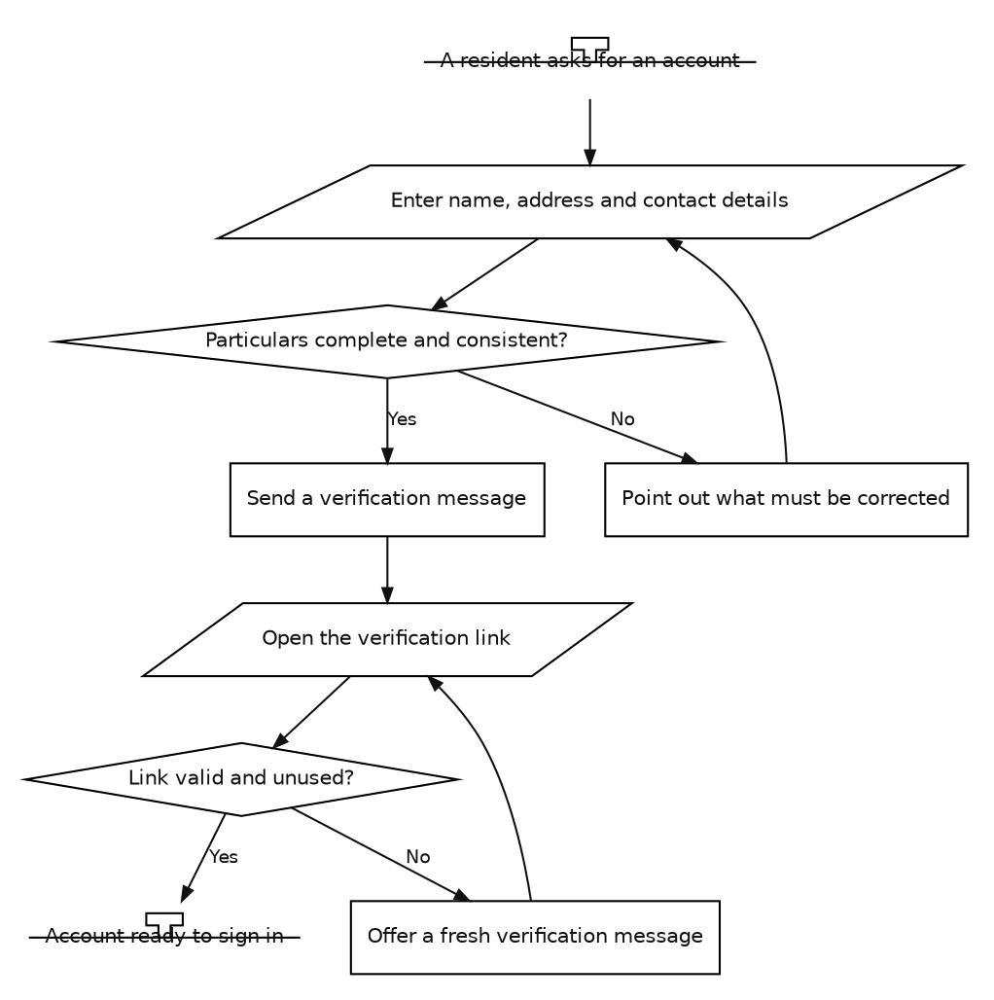
```dot
digraph F1_account_creation {
  rankdir=TB;
  graph [dpi=400, bgcolor="white", fontname="Helvetica", ranksep=0.45, nodesep=0.35, margin=0.12];
  node  [fontname="Helvetica", fontsize=10, fontcolor="#111111"];
  edge  [fontname="Helvetica", fontsize=9, fontcolor="#111111", color="#111111", penwidth=1.0, arrowsize=0.7];

  start  [shape=terminator, label="A resident asks for an account"];
  enter  [shape=parallelogram, label="Enter name, address and contact details"];
  valid  [shape=diamond, label="Particulars complete and consistent?"];
  fix    [shape=box, label="Point out what must be corrected"];
  send   [shape=box, label="Send a verification message"];
  verify [shape=parallelogram, label="Open the verification link"];
  ok     [shape=diamond, label="Link valid and unused?"];
  again  [shape=box, label="Offer a fresh verification message"];
  ready  [shape=terminator, label="Account ready to sign in"];

  start -> enter -> valid;
  valid -> fix [label="No"];
  fix -> enter;
  valid -> send [label="Yes"];
  send -> verify -> ok;
  ok -> ready [label="Yes"];
  ok -> again [label="No"];
  again -> verify;
}
```

### 4.2 F2 — Sign-in and role landing

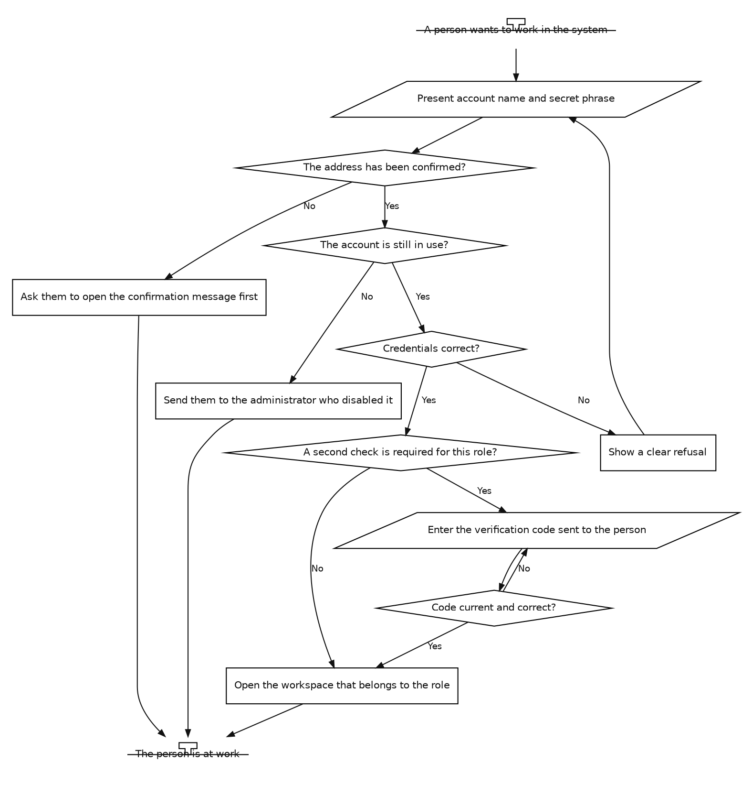
```dot
digraph F2_sign_in {
  rankdir=TB;
  graph [dpi=400, bgcolor="white", fontname="Helvetica", ranksep=0.45, nodesep=0.35, margin=0.12];
  node  [fontname="Helvetica", fontsize=10, fontcolor="#111111"];
  edge  [fontname="Helvetica", fontsize=9, fontcolor="#111111", color="#111111", penwidth=1.0, arrowsize=0.7];

  start [shape=terminator, label="A person wants to work in the system"];
  creds [shape=parallelogram, label="Present account name and secret phrase"];
  verified [shape=diamond, label="The address has been confirmed?"];
  confirm [shape=box, label="Ask them to open the confirmation message first"];
  enabled [shape=diamond, label="The account is still in use?"];
  hold  [shape=box, label="Send them to the administrator who disabled it"];
  match [shape=diamond, label="Credentials correct?"];
  refuse[shape=box, label="Show a clear refusal"];
  extra [shape=diamond, label="A second check is required for this role?"];
  code  [shape=parallelogram, label="Enter the verification code sent to the person"];
  good  [shape=diamond, label="Code current and correct?"];
  open  [shape=box, label="Open the workspace that belongs to the role"];
  done  [shape=terminator, label="The person is at work"];

  start -> creds -> verified;
  verified -> confirm [label="No"];
  confirm -> done;
  verified -> enabled [label="Yes"];
  enabled -> hold [label="No"];
  hold -> done;
  enabled -> match [label="Yes"];
  match -> refuse [label="No"];
  refuse -> creds;
  match -> extra [label="Yes"];
  extra -> open [label="No"];
  extra -> code [label="Yes"];
  code -> good;
  good -> open [label="Yes"];
  good -> code [label="No"];
  open -> done;
}
```

### 4.3 F3 — Household intake and case opening

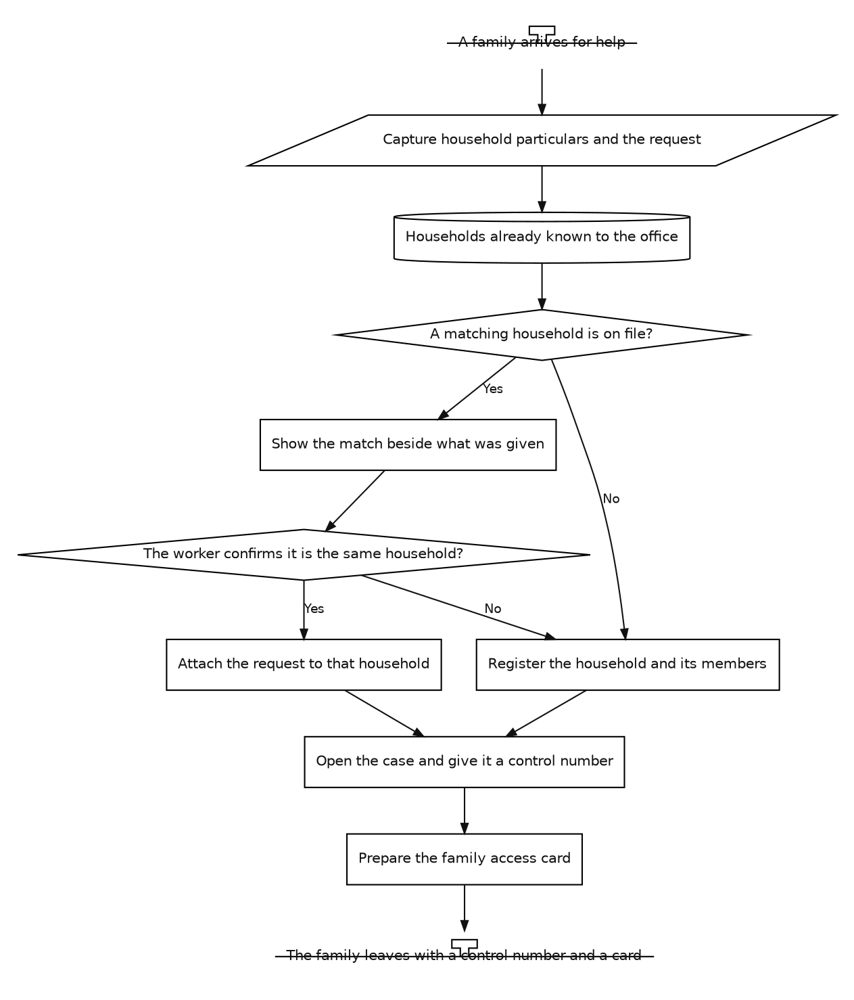
```dot
digraph F3_intake {
  rankdir=TB;
  graph [dpi=400, bgcolor="white", fontname="Helvetica", ranksep=0.45, nodesep=0.35, margin=0.12];
  node  [fontname="Helvetica", fontsize=10, fontcolor="#111111"];
  edge  [fontname="Helvetica", fontsize=9, fontcolor="#111111", color="#111111", penwidth=1.0, arrowsize=0.7];

  start [shape=terminator, label="A family arrives for help"];
  take  [shape=parallelogram, label="Capture household particulars and the request"];
  look  [shape=cylinder, label="Households already known to the office"];
  found [shape=diamond, label="A matching household is on file?"];
  see   [shape=box, label="Show the match beside what was given"];
  same  [shape=diamond, label="The worker confirms it is the same household?"];
  join  [shape=box, label="Attach the request to that household"];
  fresh [shape=box, label="Register the household and its members"];
  caseO [shape=box, label="Open the case and give it a control number"];
  card  [shape=box, label="Prepare the family access card"];
  done  [shape=terminator, label="The family leaves with a control number and a card"];

  start -> take -> look -> found;
  found -> see [label="Yes"];
  see -> same;
  same -> join [label="Yes"];
  same -> fresh [label="No"];
  found -> fresh [label="No"];
  join -> caseO;
  fresh -> caseO;
  caseO -> card -> done;
}
```

### 4.4 F4 — Assessment and complete requirements

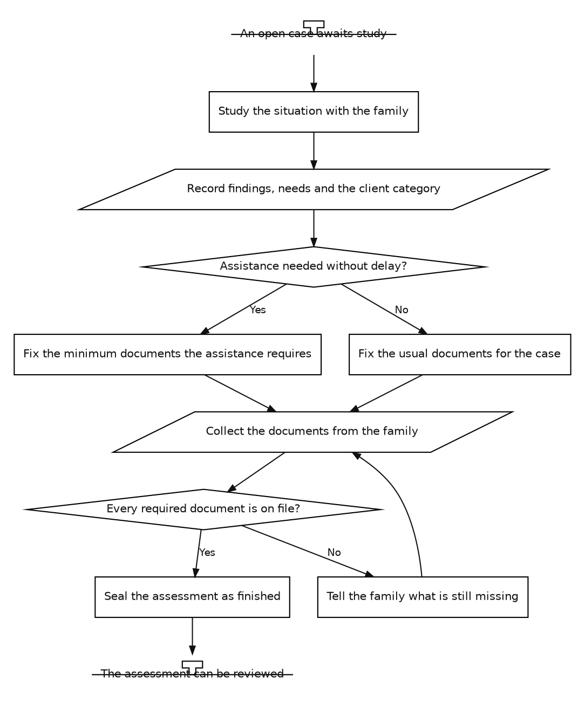
```dot
digraph F4_assessment {
  rankdir=TB;
  graph [dpi=400, bgcolor="white", fontname="Helvetica", ranksep=0.45, nodesep=0.35, margin=0.12];
  node  [fontname="Helvetica", fontsize=10, fontcolor="#111111"];
  edge  [fontname="Helvetica", fontsize=9, fontcolor="#111111", color="#111111", penwidth=1.0, arrowsize=0.7];

  start [shape=terminator, label="An open case awaits study"];
  study [shape=box, label="Study the situation with the family"];
  write [shape=parallelogram, label="Record findings, needs and the client category"];
  crisis[shape=diamond, label="Assistance needed without delay?"];
  list  [shape=box, label="Fix the minimum documents the assistance requires"];
  plain [shape=box, label="Fix the usual documents for the case"];
  gather[shape=parallelogram, label="Collect the documents from the family"];
  full  [shape=diamond, label="Every required document is on file?"];
  ask   [shape=box, label="Tell the family what is still missing"];
  seal  [shape=box, label="Seal the assessment as finished"];
  done  [shape=terminator, label="The assessment can be reviewed"];

  start -> study -> write -> crisis;
  crisis -> list [label="Yes"];
  crisis -> plain [label="No"];
  list -> gather;
  plain -> gather;
  gather -> full;
  full -> ask [label="No"];
  ask -> gather;
  full -> seal [label="Yes"];
  seal -> done;
}
```

### 4.5 F5 — Case review and activation

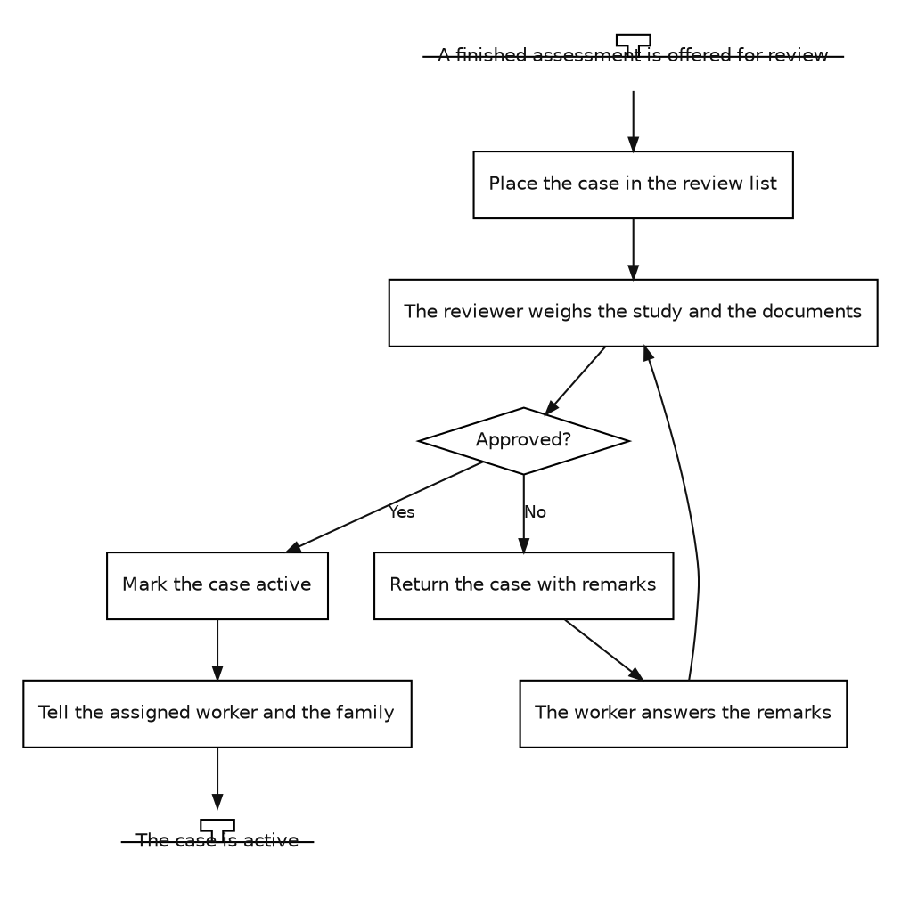
```dot
digraph F5_review {
  rankdir=TB;
  graph [dpi=400, bgcolor="white", fontname="Helvetica", ranksep=0.45, nodesep=0.35, margin=0.12];
  node  [fontname="Helvetica", fontsize=10, fontcolor="#111111"];
  edge  [fontname="Helvetica", fontsize=9, fontcolor="#111111", color="#111111", penwidth=1.0, arrowsize=0.7];

  start [shape=terminator, label="A finished assessment is offered for review"];
  hold  [shape=box, label="Place the case in the review list"];
  read  [shape=box, label="The reviewer weighs the study and the documents"];
  decide[shape=diamond, label="Approved?"];
  back  [shape=box, label="Return the case with remarks"];
  redo  [shape=box, label="The worker answers the remarks"];
  active[shape=box, label="Mark the case active"];
  tell  [shape=box, label="Tell the assigned worker and the family"];
  done  [shape=terminator, label="The case is active"];

  start -> hold -> read -> decide;
  decide -> back [label="No"];
  back -> redo -> read;
  decide -> active [label="Yes"];
  active -> tell -> done;
}
```

### 4.6 F6 — Programme enrolment and compliance

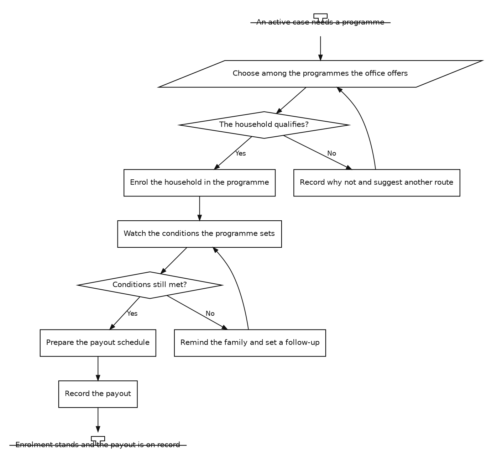
```dot
digraph F6_enrolment {
  rankdir=TB;
  graph [dpi=400, bgcolor="white", fontname="Helvetica", ranksep=0.45, nodesep=0.35, margin=0.12];
  node  [fontname="Helvetica", fontsize=10, fontcolor="#111111"];
  edge  [fontname="Helvetica", fontsize=9, fontcolor="#111111", color="#111111", penwidth=1.0, arrowsize=0.7];

  start [shape=terminator, label="An active case needs a programme"];
  pick  [shape=parallelogram, label="Choose among the programmes the office offers"];
  fit   [shape=diamond, label="The household qualifies?"];
  note  [shape=box, label="Record why not and suggest another route"];
  enrol [shape=box, label="Enrol the household in the programme"];
  watch [shape=box, label="Watch the conditions the programme sets"];
  keep  [shape=diamond, label="Conditions still met?"];
  warn  [shape=box, label="Remind the family and set a follow-up"];
  sched [shape=box, label="Prepare the payout schedule"];
  pay   [shape=box, label="Record the payout"];
  done  [shape=terminator, label="Enrolment stands and the payout is on record"];

  start -> pick -> fit;
  fit -> note [label="No"];
  note -> pick;
  fit -> enrol [label="Yes"];
  enrol -> watch -> keep;
  keep -> warn [label="No"];
  warn -> watch;
  keep -> sched [label="Yes"];
  sched -> pay -> done;
}
```

### 4.7 F7 — Assistance decision and delivery

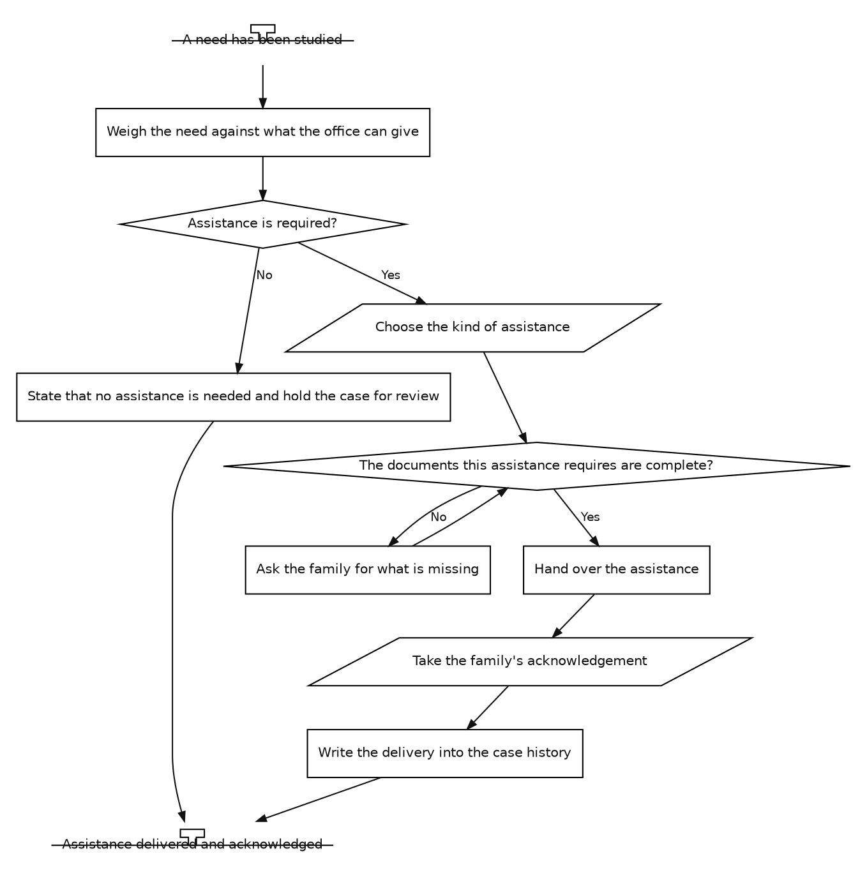
```dot
digraph F7_assistance {
  rankdir=TB;
  graph [dpi=400, bgcolor="white", fontname="Helvetica", ranksep=0.45, nodesep=0.35, margin=0.12];
  node  [fontname="Helvetica", fontsize=10, fontcolor="#111111"];
  edge  [fontname="Helvetica", fontsize=9, fontcolor="#111111", color="#111111", penwidth=1.0, arrowsize=0.7];

  start [shape=terminator, label="A need has been studied"];
  weigh [shape=box, label="Weigh the need against what the office can give"];
  need  [shape=diamond, label="Assistance is required?"];
  none  [shape=box, label="State that no assistance is needed and hold the case for review"];
  kind  [shape=parallelogram, label="Choose the kind of assistance"];
  docs  [shape=diamond, label="The documents this assistance requires are complete?"];
  chase [shape=box, label="Ask the family for what is missing"];
  give  [shape=box, label="Hand over the assistance"];
  slip  [shape=parallelogram, label="Take the family's acknowledgement"];
  log   [shape=box, label="Write the delivery into the case history"];
  done  [shape=terminator, label="Assistance delivered and acknowledged"];

  start -> weigh -> need;
  need -> none [label="No"];
  none -> done;
  need -> kind [label="Yes"];
  kind -> docs;
  docs -> chase [label="No"];
  chase -> docs;
  docs -> give [label="Yes"];
  give -> slip -> log -> done;
}
```

### 4.8 F8 — Inter-agency referral

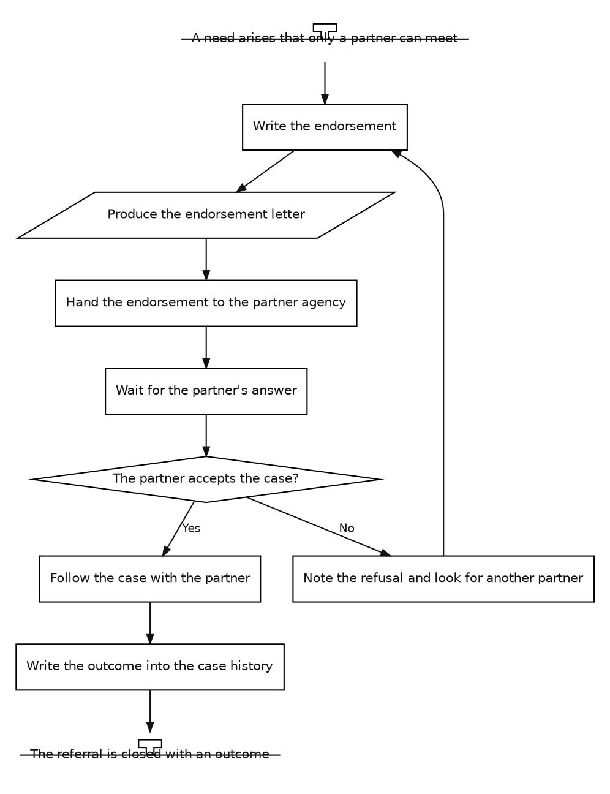
```dot
digraph F8_referral {
  rankdir=TB;
  graph [dpi=400, bgcolor="white", fontname="Helvetica", ranksep=0.45, nodesep=0.35, margin=0.12];
  node  [fontname="Helvetica", fontsize=10, fontcolor="#111111"];
  edge  [fontname="Helvetica", fontsize=9, fontcolor="#111111", color="#111111", penwidth=1.0, arrowsize=0.7];

  start [shape=terminator, label="A need arises that only a partner can meet"];
  draft [shape=box, label="Write the endorsement"];
  paper [shape=parallelogram, label="Produce the endorsement letter"];
  send  [shape=box, label="Hand the endorsement to the partner agency"];
  wait  [shape=box, label="Wait for the partner's answer"];
  taken [shape=diamond, label="The partner accepts the case?"];
  other [shape=box, label="Note the refusal and look for another partner"];
  track [shape=box, label="Follow the case with the partner"];
  close [shape=box, label="Write the outcome into the case history"];
  done  [shape=terminator, label="The referral is closed with an outcome"];

  start -> draft -> paper -> send -> wait -> taken;
  taken -> other [label="No"];
  other -> draft;
  taken -> track [label="Yes"];
  track -> close -> done;
}
```

### 4.9 F9 — Incident report handling

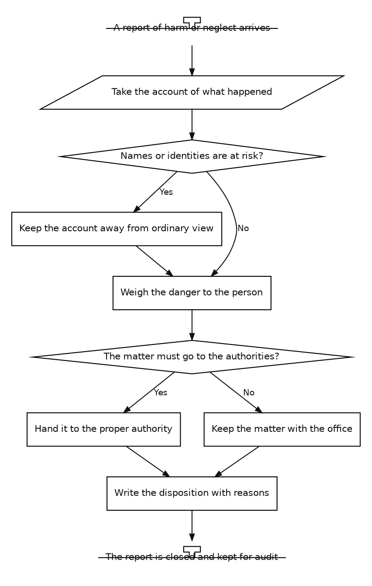
```dot
digraph F9_incident {
  rankdir=TB;
  graph [dpi=400, bgcolor="white", fontname="Helvetica", ranksep=0.45, nodesep=0.35, margin=0.12];
  node  [fontname="Helvetica", fontsize=10, fontcolor="#111111"];
  edge  [fontname="Helvetica", fontsize=9, fontcolor="#111111", color="#111111", penwidth=1.0, arrowsize=0.7];

  start [shape=terminator, label="A report of harm or neglect arrives"];
  file  [shape=parallelogram, label="Take the account of what happened"];
  soft  [shape=diamond, label="Names or identities are at risk?"];
  guard [shape=box, label="Keep the account away from ordinary view"];
  weigh [shape=box, label="Weigh the danger to the person"];
  police[shape=diamond, label="The matter must go to the authorities?"];
  pass  [shape=box, label="Hand it to the proper authority"];
  own   [shape=box, label="Keep the matter with the office"];
  decide[shape=box, label="Write the disposition with reasons"];
  done  [shape=terminator, label="The report is closed and kept for audit"];

  start -> file -> soft;
  soft -> guard [label="Yes"];
  soft -> weigh [label="No"];
  guard -> weigh;
  weigh -> police;
  police -> pass [label="Yes"];
  police -> own [label="No"];
  pass -> decide;
  own -> decide;
  decide -> done;
}
```

### 4.10 F10 — Access card issuance and use

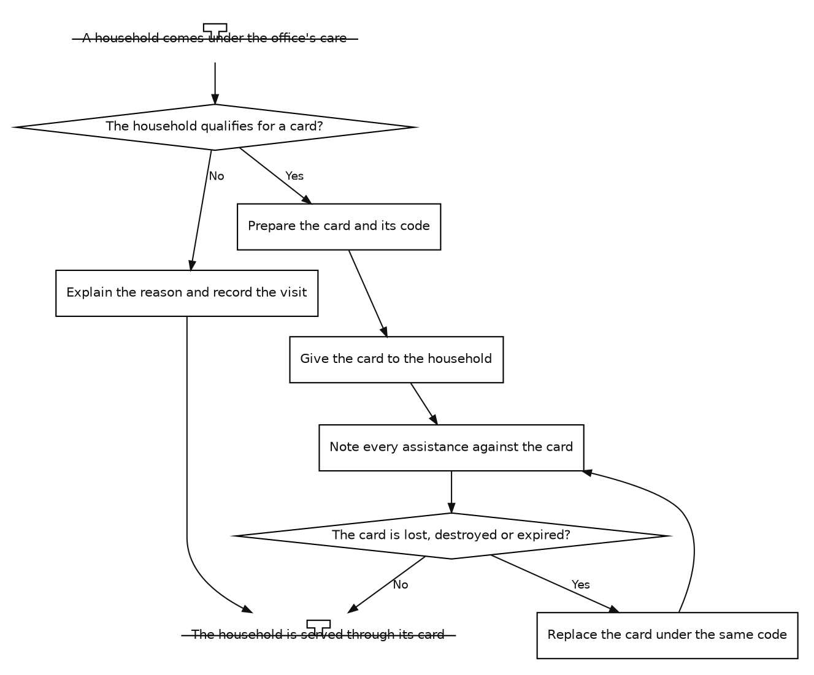
```dot
digraph F10_access_card {
  rankdir=TB;
  graph [dpi=400, bgcolor="white", fontname="Helvetica", ranksep=0.45, nodesep=0.35, margin=0.12];
  node  [fontname="Helvetica", fontsize=10, fontcolor="#111111"];
  edge  [fontname="Helvetica", fontsize=9, fontcolor="#111111", color="#111111", penwidth=1.0, arrowsize=0.7];

  start [shape=terminator, label="A household comes under the office's care"];
  fit   [shape=diamond, label="The household qualifies for a card?"];
  no    [shape=box, label="Explain the reason and record the visit"];
  make  [shape=box, label="Prepare the card and its code"];
  hand  [shape=box, label="Give the card to the household"];
  serve [shape=box, label="Note every assistance against the card"];
  gone  [shape=diamond, label="The card is lost, destroyed or expired?"];
  again [shape=box, label="Replace the card under the same code"];
  done  [shape=terminator, label="The household is served through its card"];

  start -> fit;
  fit -> no [label="No"];
  no -> done;
  fit -> make [label="Yes"];
  make -> hand -> serve -> gone;
  gone -> again [label="Yes"];
  again -> serve;
  gone -> done [label="No"];
}
```

### 4.11 F11 — Disbursement and instruments

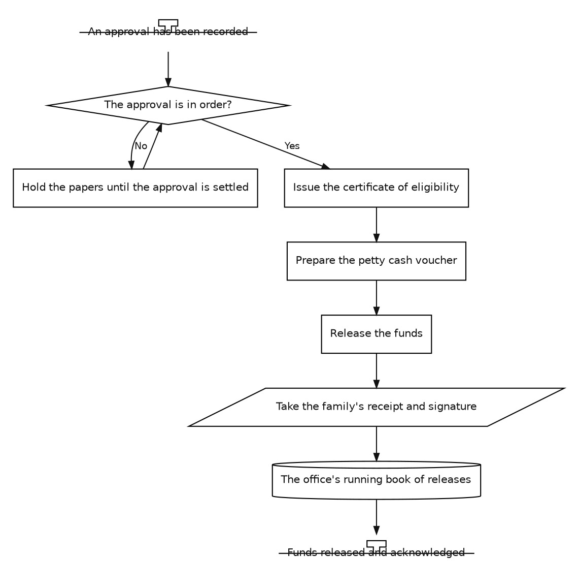
```dot
digraph F11_disbursement {
  rankdir=TB;
  graph [dpi=400, bgcolor="white", fontname="Helvetica", ranksep=0.45, nodesep=0.35, margin=0.12];
  node  [fontname="Helvetica", fontsize=10, fontcolor="#111111"];
  edge  [fontname="Helvetica", fontsize=9, fontcolor="#111111", color="#111111", penwidth=1.0, arrowsize=0.7];

  start [shape=terminator, label="An approval has been recorded"];
  check [shape=diamond, label="The approval is in order?"];
  wait  [shape=box, label="Hold the papers until the approval is settled"];
  coe   [shape=box, label="Issue the certificate of eligibility"];
  pcv   [shape=box, label="Prepare the petty cash voucher"];
  fund  [shape=box, label="Release the funds"];
  slip  [shape=parallelogram, label="Take the family's receipt and signature"];
  book  [shape=cylinder, label="The office's running book of releases"];
  done  [shape=terminator, label="Funds released and acknowledged"];

  start -> check;
  check -> wait [label="No"];
  wait -> check;
  check -> coe [label="Yes"];
  coe -> pcv -> fund -> slip -> book -> done;
}
```

### 4.12 F12 — Case closure and aftercare

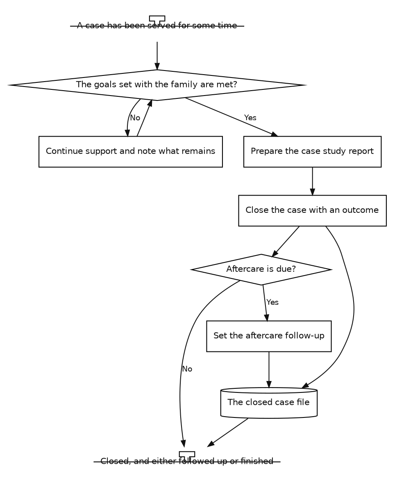
```dot
digraph F12_closure {
  rankdir=TB;
  graph [dpi=400, bgcolor="white", fontname="Helvetica", ranksep=0.45, nodesep=0.35, margin=0.12];
  node  [fontname="Helvetica", fontsize=10, fontcolor="#111111"];
  edge  [fontname="Helvetica", fontsize=9, fontcolor="#111111", color="#111111", penwidth=1.0, arrowsize=0.7];

  start [shape=terminator, label="A case has been served for some time"];
  goals [shape=diamond, label="The goals set with the family are met?"];
  more  [shape=box, label="Continue support and note what remains"];
  study [shape=box, label="Prepare the case study report"];
  shut  [shape=box, label="Close the case with an outcome"];
  after [shape=diamond, label="Aftercare is due?"];
  plan  [shape=box, label="Set the aftercare follow-up"];
  settle[shape=cylinder, label="The closed case file"];
  done  [shape=terminator, label="Closed, and either followed up or finished"];

  start -> goals;
  goals -> more [label="No"];
  more -> goals;
  goals -> study [label="Yes"];
  study -> shut -> settle;
  shut -> after;
  after -> plan [label="Yes"];
  plan -> settle;
  after -> done [label="No"];
  settle -> done;
}
```

### 4.13 F13 — Schedule, reminders and home visits

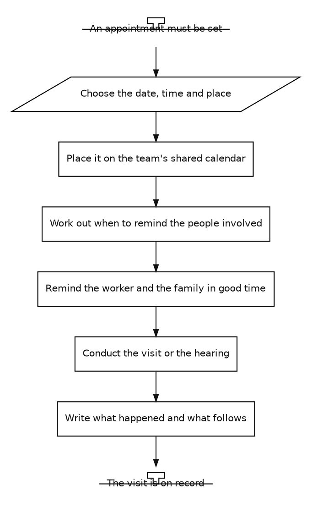
```dot
digraph F13_schedule {
  rankdir=TB;
  graph [dpi=400, bgcolor="white", fontname="Helvetica", ranksep=0.45, nodesep=0.35, margin=0.12];
  node  [fontname="Helvetica", fontsize=10, fontcolor="#111111"];
  edge  [fontname="Helvetica", fontsize=9, fontcolor="#111111", color="#111111", penwidth=1.0, arrowsize=0.7];

  start [shape=terminator, label="An appointment must be set"];
  book  [shape=parallelogram, label="Choose the date, time and place"];
  cal   [shape=box, label="Place it on the team's shared calendar"];
  when  [shape=box, label="Work out when to remind the people involved"];
  tell  [shape=box, label="Remind the worker and the family in good time"];
  visit [shape=box, label="Conduct the visit or the hearing"];
  note  [shape=box, label="Write what happened and what follows"];
  done  [shape=terminator, label="The visit is on record"];

  start -> book -> cal -> when -> tell -> visit -> note -> done;
}
```

### 4.14 F14 — Claimant self-service and consent

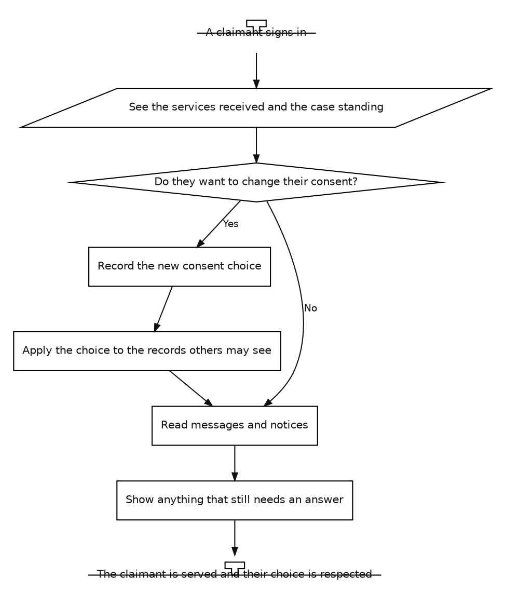
```dot
digraph F14_self_service {
  rankdir=TB;
  graph [dpi=400, bgcolor="white", fontname="Helvetica", ranksep=0.45, nodesep=0.35, margin=0.12];
  node  [fontname="Helvetica", fontsize=10, fontcolor="#111111"];
  edge  [fontname="Helvetica", fontsize=9, fontcolor="#111111", color="#111111", penwidth=1.0, arrowsize=0.7];

  start [shape=terminator, label="A claimant signs in"];
  view  [shape=parallelogram, label="See the services received and the case standing"];
  pick  [shape=diamond, label="Do they want to change their consent?"];
  grant [shape=box, label="Record the new consent choice"];
  step  [shape=box, label="Apply the choice to the records others may see"];
  read  [shape=box, label="Read messages and notices"];
  note  [shape=box, label="Show anything that still needs an answer"];
  done  [shape=terminator, label="The claimant is served and their choice is respected"];

  start -> view -> pick;
  pick -> grant [label="Yes"];
  grant -> step -> read;
  pick -> read [label="No"];
  read -> note -> done;
}
```

### 4.15 F15 — Reporting and audit

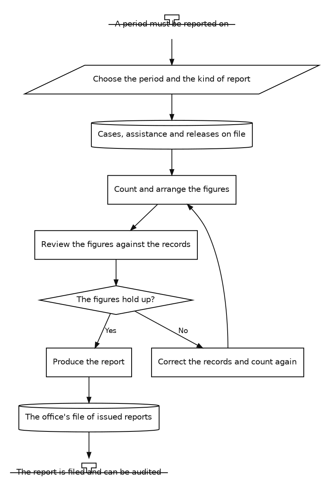
```dot
digraph F15_reporting {
  rankdir=TB;
  graph [dpi=400, bgcolor="white", fontname="Helvetica", ranksep=0.45, nodesep=0.35, margin=0.12];
  node  [fontname="Helvetica", fontsize=10, fontcolor="#111111"];
  edge  [fontname="Helvetica", fontsize=9, fontcolor="#111111", color="#111111", penwidth=1.0, arrowsize=0.7];

  start [shape=terminator, label="A period must be reported on"];
  pick  [shape=parallelogram, label="Choose the period and the kind of report"];
  pull  [shape=cylinder, label="Cases, assistance and releases on file"];
  tally [shape=box, label="Count and arrange the figures"];
  look  [shape=box, label="Review the figures against the records"];
  right [shape=diamond, label="The figures hold up?"];
  mend  [shape=box, label="Correct the records and count again"];
  make  [shape=box, label="Produce the report"];
  fill  [shape=cylinder, label="The office's file of issued reports"];
  done  [shape=terminator, label="The report is filed and can be audited"];

  start -> pick -> pull -> tally -> look -> right;
  right -> mend [label="No"];
  mend -> tally;
  right -> make [label="Yes"];
  make -> fill -> done;
}
```

### 4.16 F16 — Field capture and later submission

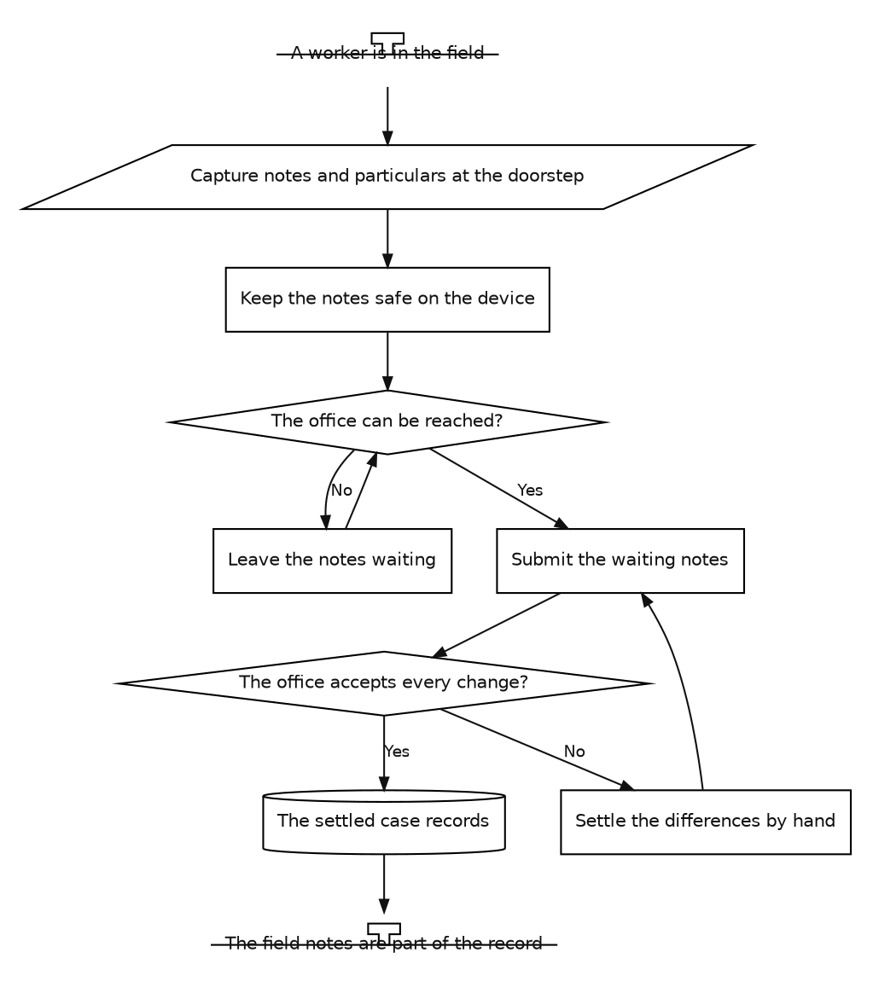
```dot
digraph F16_field_capture {
  rankdir=TB;
  graph [dpi=400, bgcolor="white", fontname="Helvetica", ranksep=0.45, nodesep=0.35, margin=0.12];
  node  [fontname="Helvetica", fontsize=10, fontcolor="#111111"];
  edge  [fontname="Helvetica", fontsize=9, fontcolor="#111111", color="#111111", penwidth=1.0, arrowsize=0.7];

  start [shape=terminator, label="A worker is in the field"];
  take  [shape=parallelogram, label="Capture notes and particulars at the doorstep"];
  save  [shape=box, label="Keep the notes safe on the device"];
  link  [shape=diamond, label="The office can be reached?"];
  queue [shape=box, label="Leave the notes waiting"];
  send  [shape=box, label="Submit the waiting notes"];
  fair  [shape=diamond, label="The office accepts every change?"];
  sort  [shape=box, label="Settle the differences by hand"];
  book  [shape=cylinder, label="The settled case records"];
  done  [shape=terminator, label="The field notes are part of the record"];

  start -> take -> save -> link;
  link -> queue [label="No"];
  queue -> link;
  link -> send [label="Yes"];
  send -> fair;
  fair -> sort [label="No"];
  sort -> send;
  fair -> book [label="Yes"];
  book -> done;
}
```

### 4.17 F17 — Publishing a notice

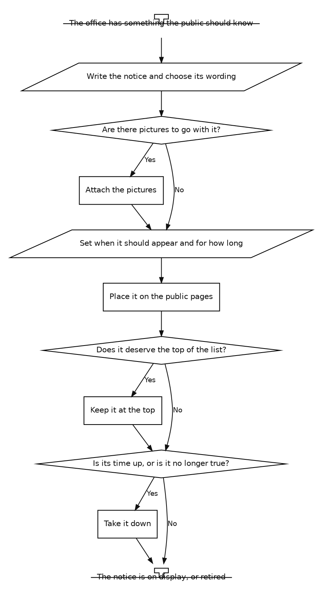
```dot
digraph F17_notice {
  rankdir=TB;
  graph [dpi=400, bgcolor="white", fontname="Helvetica", ranksep=0.45, nodesep=0.35, margin=0.12];
  node  [fontname="Helvetica", fontsize=10, fontcolor="#111111"];
  edge  [fontname="Helvetica", fontsize=9, fontcolor="#111111", color="#111111", penwidth=1.0, arrowsize=0.7];

  start [shape=terminator, label="The office has something the public should know"];
  draft [shape=parallelogram, label="Write the notice and choose its wording"];
  pics  [shape=diamond, label="Are there pictures to go with it?"];
  attach[shape=box, label="Attach the pictures"];
  when  [shape=parallelogram, label="Set when it should appear and for how long"];
  show  [shape=box, label="Place it on the public pages"];
  top   [shape=diamond, label="Does it deserve the top of the list?"];
  pin   [shape=box, label="Keep it at the top"];
  expire[shape=diamond, label="Is its time up, or is it no longer true?"];
  down  [shape=box, label="Take it down"];
  done  [shape=terminator, label="The notice is on display, or retired"];

  start -> draft -> pics;
  pics -> attach [label="Yes"];
  attach -> when;
  pics -> when [label="No"];
  when -> show -> top;
  top -> pin [label="Yes"];
  pin -> expire;
  top -> expire [label="No"];
  expire -> down [label="Yes"];
  down -> done;
  expire -> done [label="No"];
}
```

### 4.18 F18 — Public inquiry and reply

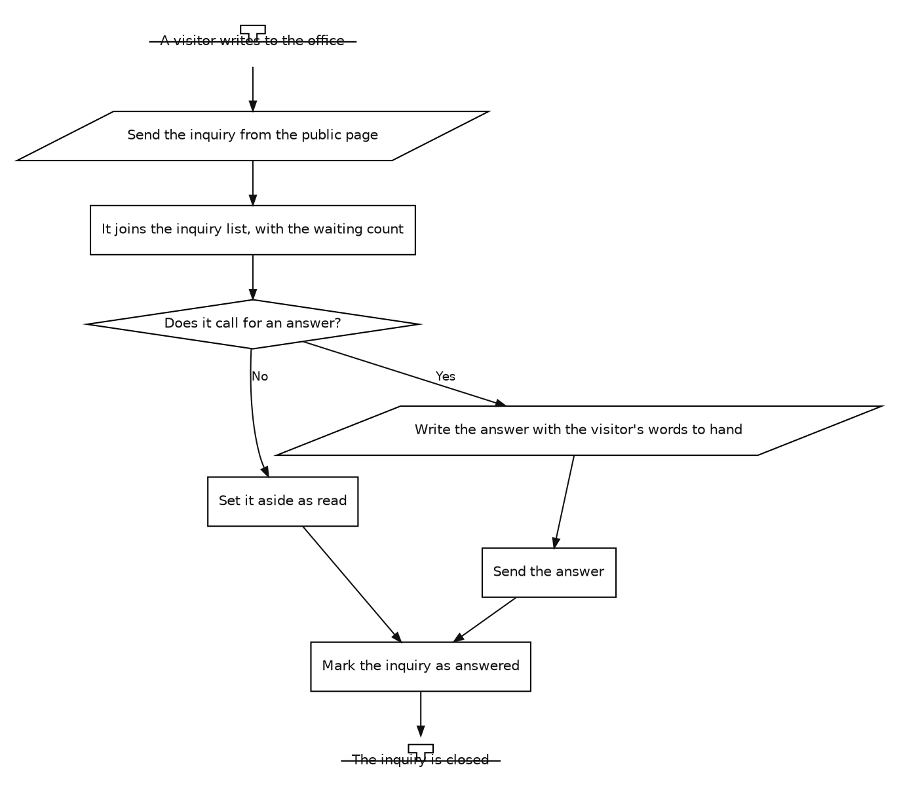
```dot
digraph F18_inquiry {
  rankdir=TB;
  graph [dpi=400, bgcolor="white", fontname="Helvetica", ranksep=0.45, nodesep=0.35, margin=0.12];
  node  [fontname="Helvetica", fontsize=10, fontcolor="#111111"];
  edge  [fontname="Helvetica", fontsize=9, fontcolor="#111111", color="#111111", penwidth=1.0, arrowsize=0.7];

  start [shape=terminator, label="A visitor writes to the office"];
  send  [shape=parallelogram, label="Send the inquiry from the public page"];
  list  [shape=box, label="It joins the inquiry list, with the waiting count"];
  need  [shape=diamond, label="Does it call for an answer?"];
  aside [shape=box, label="Set it aside as read"];
  write [shape=parallelogram, label="Write the answer with the visitor's words to hand"];
  reply [shape=box, label="Send the answer"];
  mark  [shape=box, label="Mark the inquiry as answered"];
  done  [shape=terminator, label="The inquiry is closed"];

  start -> send -> list -> need;
  need -> aside [label="No"];
  aside -> mark;
  need -> write [label="Yes"];
  write -> reply -> mark;
  mark -> done;
}
```

### 4.19 F19 — Messaging about a case

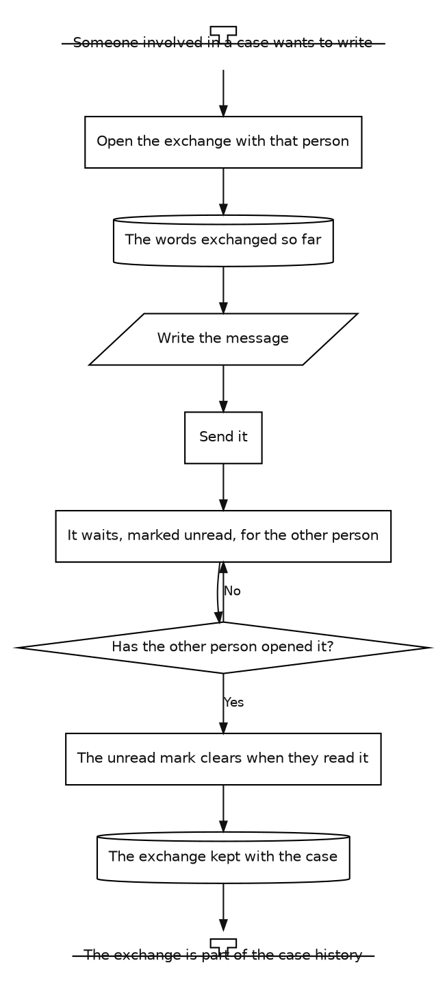
```dot
digraph F19_messaging {
  rankdir=TB;
  graph [dpi=400, bgcolor="white", fontname="Helvetica", ranksep=0.45, nodesep=0.35, margin=0.12];
  node  [fontname="Helvetica", fontsize=10, fontcolor="#111111"];
  edge  [fontname="Helvetica", fontsize=9, fontcolor="#111111", color="#111111", penwidth=1.0, arrowsize=0.7];

  start [shape=terminator, label="Someone involved in a case wants to write"];
  open  [shape=box, label="Open the exchange with that person"];
  keep  [shape=cylinder, label="The words exchanged so far"];
  write [shape=parallelogram, label="Write the message"];
  post  [shape=box, label="Send it"];
  waits [shape=box, label="It waits, marked unread, for the other person"];
  seen  [shape=diamond, label="Has the other person opened it?"];
  clear [shape=box, label="The unread mark clears when they read it"];
  filed [shape=cylinder, label="The exchange kept with the case"];
  done  [shape=terminator, label="The exchange is part of the case history"];

  start -> open -> keep -> write -> post -> waits -> seen;
  seen -> clear [label="Yes"];
  clear -> filed;
  seen -> waits [label="No"];
  filed -> done;
}
```

### 4.20 F20 — Programme catalogue upkeep

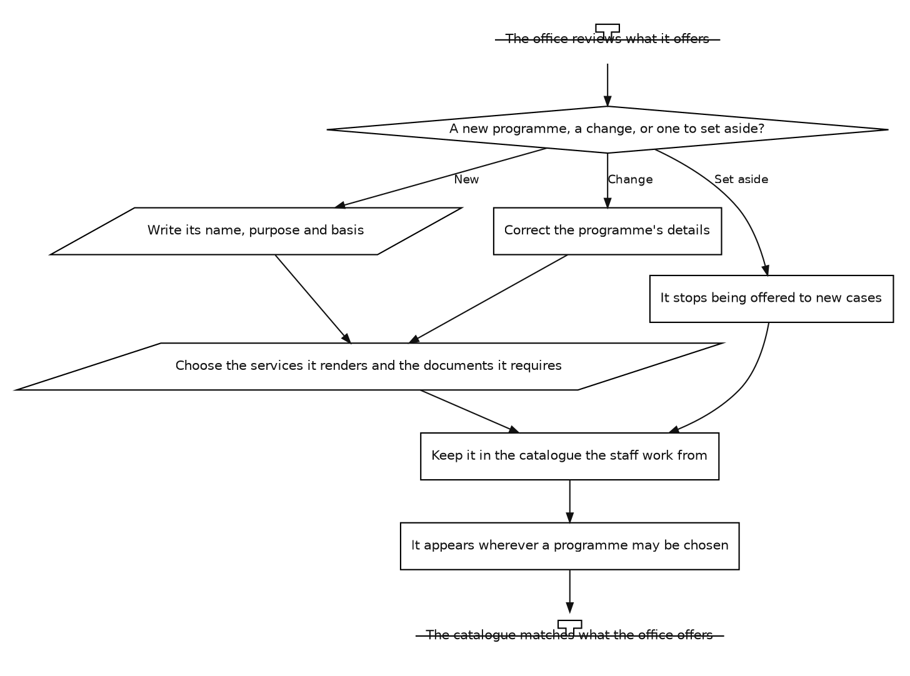
```dot
digraph F20_catalogue {
  rankdir=TB;
  graph [dpi=400, bgcolor="white", fontname="Helvetica", ranksep=0.45, nodesep=0.35, margin=0.12];
  node  [fontname="Helvetica", fontsize=10, fontcolor="#111111"];
  edge  [fontname="Helvetica", fontsize=9, fontcolor="#111111", color="#111111", penwidth=1.0, arrowsize=0.7];

  start [shape=terminator, label="The office reviews what it offers"];
  what  [shape=diamond, label="A new programme, a change, or one to set aside?"];
  add   [shape=parallelogram, label="Write its name, purpose and basis"];
  amend [shape=box, label="Correct the programme's details"];
  scope [shape=parallelogram, label="Choose the services it renders and the documents it requires"];
  keep  [shape=box, label="Keep it in the catalogue the staff work from"];
  shown [shape=box, label="It appears wherever a programme may be chosen"];
  pull  [shape=box, label="It stops being offered to new cases"];
  done  [shape=terminator, label="The catalogue matches what the office offers"];

  start -> what;
  what -> add [label="New"];
  what -> amend [label="Change"];
  what -> pull [label="Set aside"];
  add -> scope;
  amend -> scope;
  scope -> keep -> shown -> done;
  pull -> keep;
}
```

### 4.21 F21 — Staff account administration

```dot
digraph F21_staff {
  rankdir=TB;
  graph [dpi=400, bgcolor="white", fontname="Helvetica", ranksep=0.45, nodesep=0.35, margin=0.12];
  node  [fontname="Helvetica", fontsize=10, fontcolor="#111111"];
  edge  [fontname="Helvetica", fontsize=9, fontcolor="#111111", color="#111111", penwidth=1.0, arrowsize=0.7];

  start [shape=terminator, label="A new member of staff joins the office"];
  take  [shape=parallelogram, label="Take their name, contact details and the role they will hold"];
  reach [shape=diamond, label="Do they serve one barangay or the whole municipality?"];
  post  [shape=box, label="Note the barangay they answer for"];
  wide  [shape=box, label="Note that they may work anywhere in the municipality"];
  make  [shape=box, label="Prepare the account and its first secret phrase"];
  hand  [shape=box, label="Hand over the sign-in details"];
  work  [shape=box, label="They work within what their role and coverage allow"];
  leave [shape=diamond, label="Do they leave the office?"];
  off   [shape=box, label="Switch the account off, keeping its history"];
  back  [shape=diamond, label="Do they come back?"];
  on    [shape=box, label="Switch it on again for the same person"];
  done  [shape=terminator, label="The account reflects who is actually in the office"];

  start -> take -> reach;
  reach -> post [label="One barangay"];
  reach -> wide [label="The municipality"];
  post -> make;
  wide -> make;
  make -> hand -> work -> leave;
  leave -> off [label="Yes"];
  leave -> done [label="No"];
  off -> back;
  back -> on [label="Yes"];
  on -> done;
  back -> done [label="No"];
}
```

### 4.22 F22 — Recovering a forgotten password

```dot
digraph F22_forgotten {
  rankdir=TB;
  graph [dpi=400, bgcolor="white", fontname="Helvetica", ranksep=0.45, nodesep=0.35, margin=0.12];
  node  [fontname="Helvetica", fontsize=10, fontcolor="#111111"];
  edge  [fontname="Helvetica", fontsize=9, fontcolor="#111111", color="#111111", penwidth=1.0, arrowsize=0.7];

  start [shape=terminator, label="A person cannot remember their secret phrase"];
  tell  [shape=parallelogram, label="Give the account name they sign in with"];
  send  [shape=box, label="Send a message with a way to choose a new one"];
  fresh [shape=diamond, label="Is the message used while it is current?"];
  again [shape=box, label="Ask for a fresh message when the old one has lapsed"];
  pick  [shape=parallelogram, label="Choose a new secret phrase"];
  rule  [shape=diamond, label="Does it meet what the office requires?"];
  say   [shape=box, label="Say what is missing and let them try again"];
  keep  [shape=box, label="Keep the new phrase"];
  done  [shape=terminator, label="They can sign in again"];

  start -> tell -> send -> fresh;
  fresh -> again [label="No"];
  again -> send;
  fresh -> pick [label="Yes"];
  pick -> rule;
  rule -> say [label="No"];
  say -> pick;
  rule -> keep [label="Yes"];
  keep -> done;
}
```

### 4.23 F23 — Personal details and preferences

```dot
digraph F23_mydetails {
  rankdir=TB;
  graph [dpi=400, bgcolor="white", fontname="Helvetica", ranksep=0.45, nodesep=0.35, margin=0.12];
  node  [fontname="Helvetica", fontsize=10, fontcolor="#111111"];
  edge  [fontname="Helvetica", fontsize=9, fontcolor="#111111", color="#111111", penwidth=1.0, arrowsize=0.7];

  start [shape=terminator, label="A person wants to change something of their own"];
  what  [shape=diamond, label="What do they want to change?"];
  phrase[shape=parallelogram, label="Give the secret phrase in use and the new one"];
  reach [shape=parallelogram, label="Give the new address or telephone number"];
  check [shape=diamond, label="Is the phrase in use correct?"];
  no    [shape=box, label="Refuse the change and say why"];
  move  [shape=diamond, label="Does the new address have to be confirmed?"];
  conf  [shape=box, label="Send a message to the new address to confirm it"];
  second[shape=box, label="Set up or remove the second check"];
  notice[shape=parallelogram, label="Choose which notices arrive, and how"];
  save  [shape=box, label="Keep the change"];
  done  [shape=terminator, label="The account shows what they chose"];

  start -> what;
  what -> phrase [label="The secret phrase"];
  what -> reach [label="Contact details"];
  what -> second [label="The second check"];
  what -> notice [label="Notices"];
  phrase -> check;
  check -> no [label="No"];
  no -> done;
  check -> save [label="Yes"];
  reach -> move;
  move -> conf [label="Yes"];
  conf -> save;
  move -> save [label="No"];
  second -> check;
  notice -> save;
  save -> done;
}
```

### 4.24 F24 — Barangay coordinator files a referral

```dot
digraph F24_coordinator_referral {
  rankdir=TB;
  graph [dpi=400, bgcolor="white", fontname="Helvetica", ranksep=0.45, nodesep=0.35, margin=0.12];
  node  [fontname="Helvetica", fontsize=10, fontcolor="#111111"];
  edge  [fontname="Helvetica", fontsize=9, fontcolor="#111111", color="#111111", penwidth=1.0, arrowsize=0.7];

  start [shape=terminator, label="A barangay officer knows a family in need"];
  take  [shape=parallelogram, label="Take the family's particulars and what they need"];
  file  [shape=box, label="File the referral to the office"];
  wait  [shape=box, label="It waits in the office's referral list"];
  weigh [shape=box, label="The office weighs it against the help it has"];
  take2 [shape=diamond, label="Does the office take the family in?"];
  why   [shape=parallelogram, label="Write why not, and what the family may try instead"];
  open  [shape=box, label="The family is taken in and a case begins"];
  seen  [shape=box, label="The officer sees how their referral ended"];
  done  [shape=terminator, label="The referral is settled either way"];

  start -> take -> file -> wait -> weigh -> take2;
  take2 -> why [label="No"];
  why -> seen;
  take2 -> open [label="Yes"];
  open -> seen;
  seen -> done;
}
```

### 4.25 F25 — Daily case monitoring

```dot
digraph F25_monitoring {
  rankdir=TB;
  graph [dpi=400, bgcolor="white", fontname="Helvetica", ranksep=0.45, nodesep=0.35, margin=0.12];
  node  [fontname="Helvetica", fontsize=10, fontcolor="#111111"];
  edge  [fontname="Helvetica", fontsize=9, fontcolor="#111111", color="#111111", penwidth=1.0, arrowsize=0.7];

  start [shape=terminator, label="A working day begins at the office"];
  open  [shape=box, label="Open the day's list of cases"];
  late  [shape=diamond, label="Is anything past the time it was promised?"];
  nudge [shape=box, label="Remind the worker who holds that case"];
  watch [shape=box, label="Keep the case in view until it moves"];
  count [shape=parallelogram, label="Count the work of the day or the period"];
  fit   [shape=diamond, label="Does the count agree with the records?"];
  look  [shape=box, label="Go back over the records behind the count"];
  done  [shape=terminator, label="The office knows where its cases stand"];

  start -> open -> late;
  late -> nudge [label="Yes"];
  nudge -> watch;
  late -> watch [label="No"];
  watch -> count -> fit;
  fit -> look [label="No"];
  look -> count;
  fit -> done [label="Yes"];
}
```

### 4.26 F26 — Household upkeep after intake

```dot
digraph F26_household_upkeep {
  rankdir=TB;
  graph [dpi=400, bgcolor="white", fontname="Helvetica", ranksep=0.45, nodesep=0.35, margin=0.12];
  node  [fontname="Helvetica", fontsize=10, fontcolor="#111111"];
  edge  [fontname="Helvetica", fontsize=9, fontcolor="#111111", color="#111111", penwidth=1.0, arrowsize=0.7];

  start [shape=terminator, label="A household's circumstances change"];
  what  [shape=diamond, label="What changed?"];
  add   [shape=parallelogram, label="Take the particulars of the member joining"];
  join  [shape=box, label="Add them to the household"];
  fix   [shape=parallelogram, label="Correct what the record says about a member"];
  out   [shape=box, label="Note that a member is no longer with the household"];
  stand [shape=diamond, label="Does the household's standing change?"];
  mark  [shape=parallelogram, label="Note the new standing, its income or its listing"];
  card  [shape=diamond, label="Does the family access card need changing?"];
  print [shape=box, label="Print the card again for the household"];
  book  [shape=cylinder, label="The household register"];
  done  [shape=terminator, label="The household record is current"];

  start -> what;
  what -> add [label="Someone joins"];
  what -> fix [label="A detail is wrong"];
  what -> out [label="Someone leaves"];
  add -> join -> stand;
  fix -> stand;
  out -> stand;
  stand -> mark [label="Yes"];
  mark -> card;
  stand -> card [label="No"];
  card -> print [label="Yes"];
  print -> book;
  card -> book [label="No"];
  book -> done;
}
```

---

## 5. Reading the charts

**Decisions are labelled.** Every line leaving a rhombus carries the answer it
stands for, so a reader can follow one path without guessing. Where a question
has more than two answers, the chart is split rather than drawn as a single
crowded gateway.

**Loops are honest.** The charts show returns that really happen — a family
bringing documents later, a reviewer sending a case back, a worker revising a
figure — instead of pretending each step is performed once.

**Stored data marks what stays behind.** Cylinders mark the settled records the
office reads and writes: the household register, the running book of releases,
the file of reports. They are read at the start of a step and written at the end,
which is why some charts touch the same cylinder twice.

**Annotations qualify without diverting.** Where a step carries a rule the office
must remember (a documentary minimum, a protection duty), the remark sits beside
the symbol instead of becoming another step.

---

## 6. Cross-References

| Item | Location |
| --- | --- |
| Exporter — `dot` charts become editable `.drawio` files (shape mapping for standard flowchart symbols) | `docs/diagrams/dot-to-drawio.mjs` |
| Renderer — `node docs/diagrams/print-diagrams.mjs 12-flowchart --drawio` writes one file per chart to `docs/diagrams/drawio/` | `docs/diagrams/print-diagrams.mjs` |
| Data-flow views of the same system at whole-system (Level 0) and decomposed (Level 1) detail | `docs/diagrams/10-dfd-level-0.md`, `docs/diagrams/11-dfd-level-1.md` |
| Case lifecycle and step definitions the charts follow | `docs/diagrams/09-deployment-diagram.md`, `docs/superpowers/specs/` |
| Role matrix for who performs each step | `docs/ROLE-MATRIX.md` |
